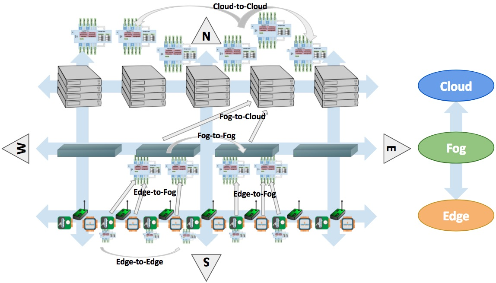

.. Getting Started describes how to build and install FogLAMP

.. |br| raw:: html

    

.. Images

.. Links
.. _here: #id1
.. _this section: #appendix-building-foglamp-on-centos

.. Links in new tabs
.. |FogLAMP Repo| raw:: html

   <a href="https://github.com/foglamp/FogLAMP" target="_blank">https://github.com/foglamp/FogLAMP</a>

.. |GCC Bug| raw:: html

   <a href="https://gcc.gnu.org/bugzilla/show_bug.cgi?id=66425" target="_blank">here</a>

.. |snappy| raw:: html

   <a href="https://snapcraft.io" target="_blank">Snappy</a>

.. =============================================

***************
Getting Started
***************

Let's get started! In this chapter we will see where to find and how to build, install and run FogLAMP for the first time.

FogLAMP Platforms
=================

Due to the use of standard libraries, FogLAMP can run on a large number of platforms and operating environments, but its primary target is Linux distributions. |br| Our testing environment includes Ubuntu LTS 16.04, Ubuntu Core 16 and Raspbian, but we have installed and tested FogLAMP on other Linux distributions. In addition to the native support, FogLAMP can also run on Virtual Machines, Docker and LXC containers.

General Requirements
--------------------

This version of FogLAMP requires the following software to be installed in the same environment:

- **Avahi 0.6.32+**
- **Python 3.5+**
- **PostgreSQL 9.5+**
- **Bluez 5.37+**

Bluez is the official Bluetooth stack and we have added plugins that are set on by default and use *gatttool* and other components of *bluez*. In the future we will make this package optional, but for the moment you should install it even if you do not intend to use any Bluetooth device. |br| If you intend to download and build FogLAMP from source (as explained in this page), you also need *git*. Other requirements largely depend on the plugins that run in FogLAMP, but Python and PostgreSQL are essential for the Core and Storage microservices and tasks.

You may also want to install some utilities to make your life easier when you use or test FogLAMP:

- **curl**: it is used to interact with the REST API
- **jq**: the JSON processor, it helps in formatting the output of the REST API calls

Building FogLAMP
================

In this section we will describe how to build FogLAMP on Ubuntu 16.04.3 LTS (Server or Desktop).  Other Linux distributions, Debian or Red-Hat based, or even other versions of Ubuntu may differ. If you are not familiar with Linux and you do not want to build FogLAMP from the source code, you can download a snap package from |snappy|.

Build Pre-Requisites
--------------------

FogLAMP is currently based on C/C++ and Python code. The packages needed to build and run FogLAMP are:

- autoconf 
- automake 
- avahi-daemon
- bluez
- build-essential 
- cmake
- g++
- git
- libtool 
- libbost-dev
- libbost-system-dev
- libbost-thread-dev
- libpq-dev
- uuid-dev
- make
- postgresql
- python-dbus
- python3-pip
- python-dev

.. code-block:: console

  $ sudo apt-get update
  Get:1 http://security.ubuntu.com/ubuntu xenial-security InRelease [102 kB]
  ...
  All packages are up-to-date.
  $
  $ sudo apt-get install avahi-daemon git cmake g++ make build-essential autoconf automake
  Reading package lists... Done
  Building dependency tree
  ...
  $
  $ sudo apt-get install libtool libboost-dev libboost-system-dev libboost-thread-dev libpq-dev uuid-dev
  Reading package lists... Done
  Building dependency tree
  ...
  $
  $ sudo apt-get install python-dev python3-pip python-dbus
  Reading package lists... Done
  Building dependency tree
  ...
  $
  $ sudo apt-get install postgresql
  Reading package lists... Done
  Building dependency tree
  $
  ...
  $
  $ sudo apt-get install bluez
  Reading package lists... Done
  Building dependency tree
  $

Setting the PostgreSQL Database
^^^^^^^^^^^^^^^^^^^^^^^^^^^^^^^

In this version of FogLAMP the PostgreSQL database is the default storage engine, used by the Storage microservice. Make sure that PostgreSQL is installed and running correctly:

.. code-block:: console

  $ sudo systemctl status postgresql
  ● postgresql.service - PostgreSQL RDBMS
     Loaded: loaded (/lib/systemd/system/postgresql.service; enabled; vendor preset: enabled)
     Active: active (exited) since Fri 2017-12-08 15:56:07 GMT; 15min ago
   Main PID: 14572 (code=exited, status=0/SUCCESS)
     CGroup: /system.slice/postgresql.service

  Dec 08 15:56:07 ubuntu systemd[1]: Starting PostgreSQL RDBMS...
  Dec 08 15:56:07 ubuntu systemd[1]: Started PostgreSQL RDBMS.
  Dec 08 15:56:11 ubuntu systemd[1]: Started PostgreSQL RDBMS.
  $
  $ ps -ef | grep postgres
  postgres 14806     1  0 15:56 ?        00:00:00 /usr/lib/postgresql/9.5/bin/postgres -D /var/lib/postgresql/9.5/main -c config_file=/etc/postgresql/9.5/main/postgresql.conf
  postgres 14808 14806  0 15:56 ?        00:00:00 postgres: checkpointer process
  postgres 14809 14806  0 15:56 ?        00:00:00 postgres: writer process
  postgres 14810 14806  0 15:56 ?        00:00:00 postgres: wal writer process
  postgres 14811 14806  0 15:56 ?        00:00:00 postgres: autovacuum launcher process
  postgres 14812 14806  0 15:56 ?        00:00:00 postgres: stats collector process
  ubuntu   15198  1225  0 17:22 pts/0    00:00:00 grep --color=auto postgres
  $

PostgreSQL 9.5 is the version available for Ubuntu 16.04 when we have published this page. Other versions of PostgreSQL, such as 9.6 or 10.1, work just fine. |br| |br| When you install the Ubuntu package, PostreSQL is set for a *peer authentication*, i.e. the database user must match with the Linux user. Other packages may differ. You may quickly check the authentication mode set in the *pg_hba.conf* file. The file is in the same directory of the *postgresql.conf* file you may see as output from the *ps* command shown above, in our case */etc/postgresql/9.5/main*:

.. code-block:: console

  $ sudo grep '^local' /etc/postgresql/9.5/main/pg_hba.conf
  local   all             postgres                                peer
  local   all             all                                     peer
  $

The installation procedure also creates a Linux *postgres* user. In order to check if everything is set correctly, execute the *psql* utility as sudo user:

.. code-block:: console

  $ sudo -u postgres psql -l
                                    List of databases
     Name    |  Owner   | Encoding |   Collate   |    Ctype    |   Access privileges
  -----------+----------+----------+-------------+-------------+-----------------------
   postgres  | postgres | UTF8     | en_GB.UTF-8 | en_GB.UTF-8 |
   template0 | postgres | UTF8     | en_GB.UTF-8 | en_GB.UTF-8 | =c/postgres          +
             |          |          |             |             | postgres=CTc/postgres
   template1 | postgres | UTF8     | en_GB.UTF-8 | en_GB.UTF-8 | =c/postgres          +
             |          |          |             |             | postgres=CTc/postgres
  (3 rows)
  $

Encoding and collations may differ, depending on the choices made when you installed your operating system. |br| Before you proceed, you must create a PostgreSQL user that matches your Linux user. Supposing that your user is *<foglamp_user>*, type:

.. code-block:: console

  $ sudo -u postgres createuser -d <foglamp_user>
 
The *-d* argument is important because the user will need to create the FogLAMP database.

Finally, you should now be able to see the list of the available databases from your current user:

.. code-block:: console

  $ psql -l
                                    List of databases
     Name    |  Owner   | Encoding |   Collate   |    Ctype    |   Access privileges
  -----------+----------+----------+-------------+-------------+-----------------------
   postgres  | postgres | UTF8     | en_GB.UTF-8 | en_GB.UTF-8 |
   template0 | postgres | UTF8     | en_GB.UTF-8 | en_GB.UTF-8 | =c/postgres          +
             |          |          |             |             | postgres=CTc/postgres
   template1 | postgres | UTF8     | en_GB.UTF-8 | en_GB.UTF-8 | =c/postgres          +
             |          |          |             |             | postgres=CTc/postgres
  (3 rows)
  $

Obtaining the Source Code
-------------------------

FogLAMP is available on GitHub. The link to the repository is |FogLAMP Repo|. In order to clone the code in the repository, type:

.. code-block:: console

  $ git clone https://github.com/foglamp/FogLAMP.git
  Cloning into 'FogLAMP'...
  remote: Counting objects: 15639, done.
  remote: Compressing objects: 100% (88/88), done.
  remote: Total 15639 (delta 32), reused 58 (delta 14), pack-reused 15531
  Receiving objects: 100% (15639/15639), 9.71 MiB | 2.11 MiB/s, done.
  Resolving deltas: 100% (10486/10486), done.
  Checking connectivity... done.
  $

The code should be now in your home directory. The name of the repository directory is *FogLAMP*:

.. code-block:: console

  $ ls -l FogLAMP
  total 84
  drwxrwxr-x 5 ubuntu ubuntu  4096 Dec  8 18:00 C
  -rw-rw-r-- 1 ubuntu ubuntu   180 Dec  8 18:00 CMakeLists.txt
  drwxrwxr-x 3 ubuntu ubuntu  4096 Dec  8 18:00 data
  drwxrwxr-x 3 ubuntu ubuntu  4096 Dec  8 18:00 docs
  dtrwxrwxr-x 3 ubuntu ubuntu  4096 Dec  8 18:00 examples
  drwxrwxr-x 3 ubuntu ubuntu  4096 Dec  8 18:00 extras
  -rw-rw-r-- 1 ubuntu ubuntu  5869 Dec  8 18:00 Jenkinsfile
  -rw-rw-r-- 1 ubuntu ubuntu 11342 Dec  8 18:00 LICENSE
  -rw-rw-r-- 1 ubuntu ubuntu 10654 Dec  8 18:00 Makefile
  -rw-rw-r-- 1 ubuntu ubuntu  5842 Dec  8 18:00 pr_tester.sh
  drwxrwxr-x 4 ubuntu ubuntu  4096 Dec  8 18:00 python
  -rw-rw-r-- 1 ubuntu ubuntu  5916 Dec  8 18:00 README.rst
  drwxrwxr-x 8 ubuntu ubuntu  4096 Dec  8 18:00 scripts
  drwxrwxr-x 3 ubuntu ubuntu  4096 Dec  8 18:00 tests
  $

Selecting the Correct Version
-----------------------------

The git repository created on your local machine, creates several branches. More specifically:

- The **master** branch is the latest, stable version. You should use this branch if you are interested in using FogLAMP with the latest features and fixes.
- The **develop** branch is the current working branch used by our developers. The branch contains the lastest version and features, but it may be unstable and there may be issues in the code. You may consider to use this branch if you are curious to see one of the latest features we are working on, but you should not use this branch in production.
- The branches with versions **majorID.minorID**, such as *1.0* or *1.4*, contain the code of that specific version. You may use one of these branches if you need to check the code used in those versions.
- The branches with name **FOGL-XXXX**, where 'XXXX' is a sequence number, are working branches used by developers and contributors to add features, fix issues, modify and release code and documentation of FogLAMP. Those branches are free for you to see and learn from the work of the contributors.
 
Note that the default branch is *develop*.

Once you have cloned the FogLAMP project, in order to check the branches available, use the ``git branch`` command:

.. code-block:: console

  $ pwd
  /home/ubuntu
  $ cd FogLAMP
  $ git branch --all
  * develop
  remotes/origin/1.0
  ...
  remotes/origin/FOGL-822
  remotes/origin/FOGL-823
  remotes/origin/HEAD -> origin/develop
  ...
  remotes/origin/develop
  remotes/origin/master
  $

Assuming you want to use the latest, stable version, use the ``git checkout`` command to select the *master* branch:

.. code-block:: console

  $ git checkout master
  Branch master set up to track remote branch master from origin.
  Switched to a new branch 'master'
  $

You can always use the ``git status`` command to check the branch you have checked out.

Building FogLAMP
----------------

You are now ready to build your first FogLAMP project. If you want to install FogLAMP on CentOS, Fedora or Red Hat, we recommend you to read this section first and then look at `this section`_. |br| |br|
Move to the *FogLAMP* project directory, type the ``make`` comand and let the magic happen.

.. code-block:: console

  $ cd FogLAMP
  $ make
  mkdir -p cmake_build
  cd cmake_build ; cmake /home/ubuntu/FogLAMP/
  -- The C compiler identification is GNU 5.4.0
  -- The CXX compiler identification is GNU 5.4.0
  ...
  Successfully built aiocoap pexpect
  Installing collected packages: aiocoap, cbor2, six, pyparsing, packaging, async-timeout, multidict, yarl, chardet, aiohttp, typing, aiohttp-cors, cchardet, certifi, idna, urllib3, requests, ptyprocess, pexpect
  Successfully installed aiocoap aiohttp aiohttp-cors async-timeout cbor2 cchardet certifi chardet-2.3.0 idna multidict packaging pexpect ptyprocess pyparsing requests-2.9.1 six-1.10.0 typing urllib3-1.13.1 yarl
  $

Depending on the version of Ubuntu or other Linux distribution you are using, you may have found some issues. For example, there is a bug in the GCC compiler that raises a warning under specific circumstances. The output of the build will be something like: 

.. code-block:: console

  /home/ubuntu/FogLAMP/C/services/storage/storage.cpp:97:14: warning: ignoring return value of ‘int dup(int)’, declared with attribute warn_unused_result [-Wunused-result]
    (void)dup(0);     // stdout GCC bug 66425 produces warning
                ^
  /home/ubuntu/FogLAMP/C/services/storage/storage.cpp:98:14: warning: ignoring return value of ‘int dup(int)’, declared with attribute warn_unused_result [-Wunused-result]
    (void)dup(0);     // stderr GCC bug 66425 produces warning
                ^

The bug is documented |GCC Bug|. For our project, you should ignore it.

The other issue is related to the version of pip (more specifically pip3), the Python package manager. If you see this warning in the middle of the build output:

.. code-block:: console

  /usr/lib/python3.5/distutils/dist.py:261: UserWarning: Unknown distribution option: 'python_requires'
    warnings.warn(msg)

...and this output at the end of the build process:

.. code-block:: console

  You are using pip version 8.1.1, however version 9.0.1 is available.
  You should consider upgrading via the 'pip install --upgrade pip' command.

In this case, what you need to do is to upgrade the pip software for Python 3:

.. code-block:: console

  $ sudo pip3 install --upgrade pip
  Collecting pip
    Downloading pip-9.0.1-py2.py3-none-any.whl (1.3MB)
      100% |████████████████████████████████| 1.3MB 1.1MB/s
  Installing collected packages: pip
  Successfully installed pip-9.0.1
  $

At this point, run the ``make`` command again and the Python warning should disappear.

Testing FogLAMP from the Build Environment
------------------------------------------

If you are eager to test FogLAMP straight away, you can do so! All you need to do is to set the *FOGLAMP_ROOT* environment variable and you are good to go. Stay in the FogLAMP project directory, set the environment variable with the path to the FogLAMP directory and start foglamp with the ``foglamp start`` command:

.. code-block:: console

  $ pwd
  /home/ubuntu/FogLAMP
  $ export FOGLAMP_ROOT=/home/ubuntu/FogLAMP
  $ scripts/foglamp start
  FogLAMP started.
  $

You can check the status of FogLAMP with the ``foglamp status`` command. For few seconds you may see service starting, then it will show the status of the FogLAMP services and tasks:

.. code-block:: console

  $ scripts/foglamp status
  FogLAMP starting.
  $
  $ scripts/foglamp status
  FogLAMP v1.2 running.
  FogLAMP uptime:  175 seconds.
  FogLAMP Records: 0 read, 0 sent, 0 purged.
  FogLAMP does not require authentication.
  === FogLAMP services:
  foglamp.services.core
  foglamp.services.south --port=40417 --address=127.0.0.1 --name=HTTP_SOUTH
  foglamp.services.south --port=40417 --address=127.0.0.1 --name=COAP
  foglamp.services.south --port=40417 --address=127.0.0.1 --name=CC2650POLL
  === FogLAMP tasks:
  foglamp.tasks.north.sending_process --stream_id 3 --debug_level 1 --port=40417 --address=127.0.0.1 --name=sending HTTP
  foglamp.tasks.north.sending_process --stream_id 1 --debug_level 1 --port=40417 --address=127.0.0.1 --name=sending process
  foglamp.tasks.north.sending_process --stream_id 2 --debug_level 1 --port=40417 --address=127.0.0.1 --name=statistics to pi
  $

If you are curious to see a proper output from FogLAMP, you can query the Core microservice using the REST API:

.. code-block:: console

  $ curl -s http://localhost:8081/foglamp/ping ; echo
  {"dataPurged": 0, "dataRead": 10, "uptime": 308.42881059646606, "dataSent": 0, "authenticationOptional": true}
  $
  $ curl -s http://localhost:8081/foglamp/statistics ; echo
  [{"key": "BUFFERED", "description": "The number of readings currently in the FogLAMP buffer", "value": 0}, {"key": "DISCARDED", "description": "The number of readings discarded at the input side by FogLAMP, i.e. discarded before being  placed in the buffer. This may be due to some error in the readings themselves.", "value": 0}, {"key": "PURGED", "description": "The number of readings removed from the buffer by the purge process", "value": 0}, {"key": "READINGS", "description": "The number of readings received by FogLAMP since startup", "value": 0}, {"key": "SENT_1", "description": "The number of readings sent to the historian", "value": 0}, {"key": "SENT_2", "description": "The number of statistics data sent to the historian", "value": 0}, {"key": "SENT_3", "description": "The number of readings data sent to the HTTP translator", "value": 0}, {"key": "UNSENT", "description": "The number of readings filtered out in the send process", "value": 0}, {"key": "UNSNPURGED", "description": "The number of readings that were purged from the buffer before being sent", "value": 0}]
  $

Congratulations! You have installed and tested FogLAMP! If you want to go extra mile (and make the output of the REST API more readible, download the *jq* JSON processor and pipe the output of the *curl* command to it:

.. code-block:: console

  $ sudo apt install jq
  ...
  $
  $ curl -s http://localhost:8081/foglamp/statistics | jq
  [
    {
      "key": "BUFFERED",
      "description": "The number of readings currently in the FogLAMP buffer",
      "value": 0
    },
    {
      "key": "DISCARDED",
      "description": "The number of readings discarded at the input side by FogLAMP, i.e. discarded before being  placed in the buffer. This may be due to some error in the readings themselves.",
      "value": 0
    },
    {
      "key": "PURGED",
      "description": "The number of readings removed from the buffer by the purge process",
      "value": 0
    },
    {
      "key": "READINGS",
      "description": "The number of readings received by FogLAMP since startup",
      "value": 0
    },
    {
      "key": "SENT_1",
      "description": "The number of readings sent to the historian",
      "value": 0
    },
    {
      "key": "SENT_2",
      "description": "The number of statistics data sent to the historian",
      "value": 0
    },
    {
      "key": "SENT_3",
      "description": "The number of readings data sent to the HTTP translator",
      "value": 0
    },
    {
      "key": "UNSENT",
      "description": "The number of readings filtered out in the send process",
      "value": 0
    },
    {
      "key": "UNSNPURGED",
      "description": "The number of readings that were purged from the buffer before being sent",
      "value": 0
    }
  ]
  $

Now I Want to Stop FogLAMP!
---------------------------

Easy, you have learnt ``foglamp start`` and ``foglamp status``, simply type ``foglamp stop``:

.. code-block:: console

  $ scripts/foglamp stop
  FogLAMP stopped.
  $

|br| |br| 
As a next step, let's install FogLAMP!

Appendix: Building FogLAMP on CentOS
====================================

In this section we present how to prepare a CentOS machine to build and install FogLAMP. A similar approach can be adopted to build the platform on RedHat and Fedora distributions. Here we refer to CentOS version 17.4.1708, requirements for other versions or distributions might differ.

Pre-Requisites
--------------

Pre-requisites on CentOS are similar to the ones on other distributions, but the name of the packages may differ from Debian-based distros. Starting from a minimal installation, this is the list of packages you need to add:

- libtool
- bluez
- git
- cmake
- bost-devel
- libuuid-devel
- gmp-devel
- mpfr-devel
- libmpc-devel
- bzip2
- jq

This is the complete list of the commands to execute and the installed packages in CentoOS 17.4.1708. 

.. code-block:: console

  sudo yum install libtool
  sudo yum install bluez
  sudo yum install git
  sudo yum install cmake
  sudo yum install boost-devel
  sudo yum install libuuid-devel
  sudo yum install gmp-devel
  sudo yum install mpfr-devel
  sudo yum install libmpc-devel
  sudo yum install bzip2
  sudo yum install jq

Building and Installing C++ 5.4
-------------------------------

FogLAMP, requires C++ 5.4, CentOS 7 provides version 4.8. These are the commands to build and install the new GCC environnment:

.. code-block:: console

  sudo yum install gcc-c++
  curl https://ftp.gnu.org/gnu/gcc/gcc-5.4.0/gcc-5.4.0.tar.bz2 -O
  bzip2 -dk gcc-5.4.0.tar.bz
  tar xvf gcc-5.4.0.tar
  mkdir gcc-5.4.0-build
  cd gcc-5.4.0-build
  ../gcc-5.4.0/configure --enable-languages=c,c++ --disable-multilib
  make -j$(nproc)
  sudo make install

At the end of the procedure, the system will have two versions of GCC installed: 

- GCC 4.8, installed in /usr/bin and /usr/lib64
- GCC 5.4, installed in /usr/local/bin and /usr/local/lib64

In order to use the latest version for FogLAMP, add the following lines at the end of your ``$HOME/.bash_profile`` script:

.. code-block:: console

  export CC=/usr/local/bin/gcc
  export CXX=/usr/local/bin/g++
  export LD_LIBRARY_PATH=/usr/local/lib64

Installing PostgreSQL 9.6
-------------------------

CentOS provides PostgreSQL 9.2. FogLAMP has been tested with PostgreSQL 9.5, 9.6 and 10.X. The commands to install the new version of PostgreSQL are:

.. code-block:: console

  sudo yum install https://download.postgresql.org/pub/repos/yum/9.6/redhat/rhel-7-x86_64/pgdg-centos96-9.6-3.noarch.rpm
  sudo yum install postgresql96
  sudo yum install postgresql96-server
  sudo yum install postgresql96-devel
  sudo /usr/pgsql-9.6/bin/postgresql96-setup initdb
  sudo systemctl enable postgresql-9.6
  sudo systemctl start postgresql-9.6

At this point, Postgres has been configured to start at boot and it should be up and running. You can always check the status of the database server with ``systemctl status postgresql-9.6``:

.. code-block:: console

  $ sudo systemctl status postgresql-9.6
  [sudo] password for foglamp:
  ● postgresql-9.6.service - PostgreSQL 9.6 database server
     Loaded: loaded (/usr/lib/systemd/system/postgresql-9.6.service; enabled; vendor preset: disabled)
     Active: active (running) since Sat 2018-03-17 06:22:52 GMT; 8min ago
       Docs: https://www.postgresql.org/docs/9.6/static/
    Process: 1036 ExecStartPre=/usr/pgsql-9.6/bin/postgresql96-check-db-dir ${PGDATA} (code=exited, status=0/SUCCESS)
   Main PID: 1049 (postmaster)
     CGroup: /system.slice/postgresql-9.6.service
             ├─1049 /usr/pgsql-9.6/bin/postmaster -D /var/lib/pgsql/9.6/data/
             ├─1077 postgres: logger process
             ├─1087 postgres: checkpointer process
             ├─1088 postgres: writer process
             ├─1089 postgres: wal writer process
             ├─1090 postgres: autovacuum launcher process
             └─1091 postgres: stats collector process

  Mar 17 06:22:52 vbox-centos-test systemd[1]: Starting PostgreSQL 9.6 database server...
  Mar 17 06:22:52 vbox-centos-test postmaster[1049]: < 2018-03-17 06:22:52.910 GMT > LOG:  redirecting log output to logging collector process
  Mar 17 06:22:52 vbox-centos-test postmaster[1049]: < 2018-03-17 06:22:52.910 GMT > HINT:  Future log output will appear in directory "pg_log".
  Mar 17 06:22:52 vbox-centos-test systemd[1]: Started PostgreSQL 9.6 database server.
  $

Next, add the FogLAMP user to PostgreSQL with the command ``sudo -u postgres createuser -d <user>``, where *<user>* is your FogLAMP user.

Finally, add ``/usr/pgsql-9.6/bin`` to your PATH environment variable in ``$HOME/.bash_profile``. the new PATH setting in the file should look something like this:

.. code-block:: console

  PATH=$PATH:$HOME/.local/bin:$HOME/bin:/usr/pgsql-9.6/bin

Installing Python 3.5
---------------------

FogLAMP requires Python 3.5, CentOS provides Python 2.7. The commands to install the new version are:

.. code-block:: console

  sudo yum install yum-utils
  sudo yum groupinstall development
  sudo yum install https://centos7.iuscommunity.org/ius-release.rpm
  sudo yum install python35u
  sudo yum -y install python35u-pip
  sudo yum install python35u-devel

In order to use the new version, you need to create two symbolic links in the ``/usr/bin`` directory:

.. code-block:: console

  cd /usr/bin
  sudo ln -s python3.5 python3
  sudo ln -s pip3.5 pip3

Building FogLAMP
----------------

We are finally ready to install FogLAMP, but we need to apply some little changes to the code and the make files. These changes will be removed in the future, but for the moment they are necessary to complete the procedure.

First, clone the Github repository with the usual command: |br| ``git clone https://github.com/foglamp/FogLAMP.git`` |br| The project should have been added to your machine under the *FogLAMP* directory. 

We need to apply these changes to *C/plugins/storage/postgres/CMakeLists.txt*:

- Replace |br| ``include_directories(../../../thirdparty/rapidjson/include /usr/include/postgresql)`` |br| with: |br| ``include_directories(../../../thirdparty/rapidjson/include /usr/pgsql-9.6/include)`` |br| ``link_directories(/usr/pgsql-9.6/lib)`` |br|
- Replace the content of *python/foglamp/services/common/service_announcer.py* with this code:

.. code-block:: python

  # -*- coding: utf-8 -*-
  # FOGLAMP_BEGIN
  # See: http://foglamp.readthedocs.io/
  # FOGLAMP_END
  """Common FoglampMicroservice Class"""

  import foglamp.services.common.avahi as avahi
  from foglamp.common import logger

  _LOGGER = logger.setup(__name__)

  class ServiceAnnouncer:
      _service_name = None
      """ The name of the service to advertise """

      _group = None
      """ The Avahi group """

      def __init__(self, name, service, port, txt):

        self._service_name = name
        _LOGGER.error("Avahi not available, continuing without service discovery available")

      @property
      def get_service_name(self):
          return self._service_name

      def unregister(self):
          if self._group is not None:
              self._group.Reset()
              self._group = None

Finally, in *python/foglamp/services/common/avahi.py*, comment these lines:

.. code-block:: python

  # import dbus

  <<< In the function string_to_byte_array(s) commend: >>>
  #    for c in s:
  #        r.append(dbus.Byte(ord(c)))

You are now ready to execute the ``make`` command, as described `here`_.
 

Further Notes
-------------

Here are some extra notes for the CentOS users.

**Commented code** |br| The code commented in the previous paragraph is experimental and used for auto-discovery. It has been used for tests with South Microservices running on smart sensors, separated from the Core and Storage Microservices. This means that auto-discovery, i.e. the ability for a South Microservice to automatically identify the other services of FogLAMP distributed over the network, is currently not available on CentOS.

**foglamp start** |br| When FogLAMP starts on CentOS, it returns this message:

.. code-block:: console

  Starting FogLAMP v1.2.FogLAMP cannot start.
  Check /home/foglamp/FogLAMP/data/core.err for more information.

Check the *core.err* file, but if it is empty and *foglamp status* shows FogLAMP running, it means that the services are up and running.

.. code-block:: console

  $ foglamp start
  Starting FogLAMP v1.2.FogLAMP cannot start.
  Check /home/foglamp/FogLAMP/data/core.err for more information.
  $
  $ foglamp status
  FogLAMP v1.2 running.
  FogLAMP uptime:  6 seconds.
  FogLAMP Records: 0 read, 0 sent, 0 purged.
  FogLAMP does not require authentication.
  === FogLAMP services:
  foglamp.services.core
  foglamp.services.south --port=38994 --address=127.0.0.1 --name=COAP
  foglamp.services.south --port=38994 --address=127.0.0.1 --name=HTTP_SOUTH
  === FogLAMP tasks:
  $
  $ cat data/core.err
  $
  $ ps -ef | grep foglamp
  ...
  foglamp   6174     1  1 08:03 pts/0    00:00:00 python3 -m foglamp.services.core
  foglamp   6179     1  0 08:03 ?        00:00:00 /home/foglamp/FogLAMP/services/storage --address=0.0.0.0 --port=34037
  foglamp   6197  6174  0 08:03 pts/0    00:00:00 /bin/sh services/south --port=34037 --address=127.0.0.1 --name=COAP
  foglamp   6198  6197  0 08:03 pts/0    00:00:00 python3 -m foglamp.services.south --port=34037 --address=127.0.0.1 --name=COAP
  foglamp   6199  6174  0 08:03 pts/0    00:00:00 /bin/sh services/south --port=34037 --address=127.0.0.1 --name=HTTP_SOUTH
  foglamp   6200  6199  0 08:03 pts/0    00:00:00 python3 -m foglamp.services.south --port=34037 --address=127.0.0.1 --name=HTTP_SOUTH
  foglamp   6212  6174  0 08:04 pts/0    00:00:00 /bin/sh tasks/statistics --port=34037 --address=127.0.0.1 --name=stats collector
  foglamp   6213  6212  0 08:04 pts/0    00:00:00 python3 -m foglamp.tasks.statistics --port=34037 --address=127.0.0.1 --name=stats collector
  ...
  $

**foglamp stop** |br| In CentOS, the command stops all the microservices with the exception of Core (with a ``ps -ef`` command you can easily check the process still running). You should execute a *stop* and a *kill* command to complete the shutdown on CentOS:

.. code-block:: console

  $ foglamp status
  FogLAMP v1.2 running.
  FogLAMP uptime:  6 seconds.
  FogLAMP Records: 0 read, 0 sent, 0 purged.
  FogLAMP does not require authentication.
  === FogLAMP services:
  foglamp.services.core
  foglamp.services.south --port=38994 --address=127.0.0.1 --name=COAP
  foglamp.services.south --port=38994 --address=127.0.0.1 --name=HTTP_SOUTH
  === FogLAMP tasks:
  $ foglamp stop
  Stopping FogLAMP.............
  FogLAMP stopped.
  $
  $ ps -ef | grep foglamp
  ...
  foglamp   5782     1  5 07:56 pts/0    00:00:11 python3 -m foglamp.services.core
  ...
  $
  $ foglamp kill
  FogLAMP killed.
  $ ps -ef | grep foglamp
  ...
  $

