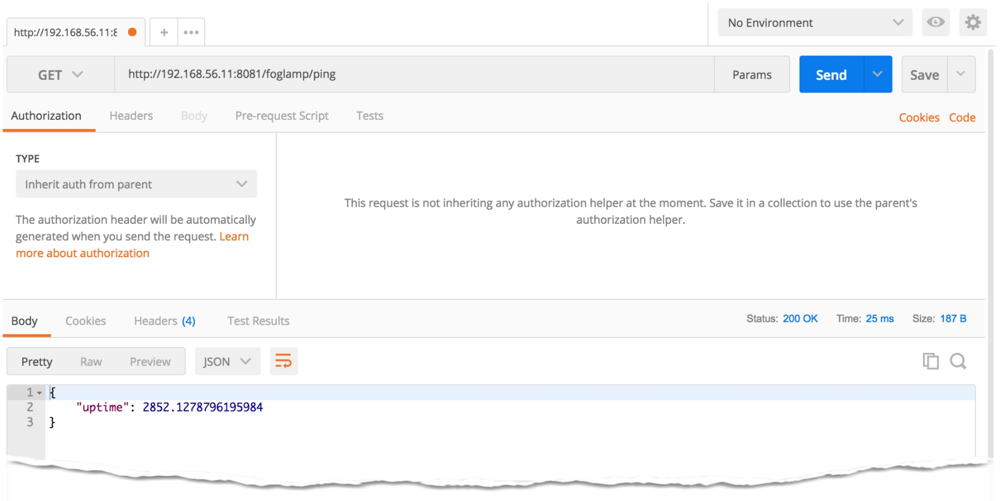

.. FogLAMP testing describes how to test FogLAMP

.. |br| raw:: html

    

.. Images

.. Links

.. Links in new tabs

.. |curl| raw:: html

   <a href="https://en.wikipedia.org/wiki/CURL" target="_blank">curl</a>

.. |postman| raw:: html

   <a href="https://www.getpostman.com/" target="_blank">Postman</a>

.. =============================================

***************
Testing FogLAMP
***************

After the installation, you are now ready to test FogLAMP. An end-to-end test involves three types of tests:

- The **South** side, i.e. testing the collection of information from South microservices and associated plugins
- The **North** side, i.e. testing the tasks that send data North to historians, databases, Enterprise and Cloud systems
- The **East/West** side, i.e. testing the interaction of external applications with FogLAMP via REST API.

This chapter describes how to tests FogLAMP in these three directions.

First Checks: FogLAMP Status
============================

Before we start, let's make sure that FogLAMP is up and running and that we have the tasks and services in place to execute the tests. |br| First, run the ``foglamp status`` command to check if FogLAMP has already started. The result of the command can be:

- ``FogLAMP not running.`` - it means that we must start FogLAMP with ``foglamp start``
- ``FogLAMP starting.`` - it means that we have started FogLAMP but the starting phase has not been completed yet. You should wait for a little while (from few seconds to about a minute) to see FogLAMP running.
- ``FogLAMP running.`` - (plus extra rows giving the uptime and other info. It means that FogLAMP is up and running, hence it is ready for use.

When you have a running FogLAMP, check the extra information provided by the ``foglamp status`` command:

.. code-block:: console

  $ foglamp status
  FogLAMP running.
  FogLAMP uptime:  282 seconds.
  === FogLAMP services:
  foglamp.services.core
  foglamp.services.south --port=44180 --address=127.0.0.1 --name=COAP
  === FogLAMP tasks:
  foglamp.tasks.north.sending_process --stream_id 1 --debug_level 1 --port=44180 --address=127.0.0.1 --name=sending process
  foglamp.tasks.north.sending_process --stream_id 2 --debug_level 1 --port=44180 --address=127.0.0.1 --name=statistics to pi
  $
 
Let's analyze the output of the command:

- ``FogLAMP running.`` - The FogLAMP Core microservice is running on this machine and it is responding to the status command as *running* because other basic microservices are also running. 
- ``FogLAMP uptime:  282 seconds.`` - This is a simple uptime in second provided by the Core microservice. It is equivalent to the ``ping`` method called via the REST API. The following lines provide a list of the modules running in this installation of FogLAMP. They are separated by dots and described in this way:
  - The prefix ``foglamp`` is always present and identifies the FogLAMP modules.
  - The following term describes the type of module: *services* for microservices, *tasks* for tasks etc.
  - The following term is the name of the module: *core*, *storage*, *north*, *south*, *app*, *alert*
  - The last term is the name of the plugin executed as part of the module.
  - Extra arguments may be available: they are the arguments passed to the module by the core when it is launched.
- ``=== FogLAMP services:`` - This block contains the list of microservices running in the FogLAMP plaftorm.
  - ``foglamp.services.core`` is the Core microservice itself
  - ``foglamp.services.south --port=44180 --address=127.0.0.1 --name=COAP`` - This South microservice is a listener of data pushed to FogLAMP via a CoAP protocol
- ``=== FogLAMP tasks:`` - This block contains the list of tasks running in the FogLAMP platform.
  - ``foglamp.tasks.north.sending_process ... --name=sending process`` is a North task that prepares and sends data collected by the South modules to the OSIsoft PI System in OMF (OSIsoft Message Format).
  - ``foglamp.tasks.north.sending_process ... --name=statistics to pi`` is a North task that prepares and sends the internal statistics to the OSIsoft PI System in OMF (OSIsoft Message Format).

Hello, Foggy World!
===================

The output of the ``foglamp status`` command gives you an idea of the modules runnning in your machine, but let's try to get more information from FogLAMP.

The FogLAMP REST API
--------------------

First of all, we need to familiarize with the FogLAMP REST API. The API provides a set of methods used to monitor and administer the status of FogLAMP. Users and developers can also use the API to interact with external applications.

This is a short list of the methods available to the administrators.  A more detailed list will be available soon:
- **ping** - provides the uptime of the FogLAMP Core microservice
- **statistics** - provides a set of statistics of the FogLAMP platform, such as data collected, sent, purged, rejected etc.

Useful Tools
~~~~~~~~~~~~

Systems Administrators and Developers may already have their favorite tools to interact with a REST API, and they can probably use the same tools with FogLAMP. If you are not familiar with any tool, we recommend one of these:

- If you are familiar with the Linux shell and command lines, |curl| is the simplest and most useful tool available. It comes with every Linux distribution (or you can easily add it if it is not available in the default installation.
- If you prefer to use a browser-like interface, we recommend |postman|. Postman is an application available on Linux, MacOS and Windows and allows you to save queries, results, and run a set of queries with a single click.

Hello World!
------------

Let's execute the *ping* method. First, you must identify the IP address where FogLAMP is running. If you have installed FogLAMP on your local machine, you can use *localhost*. Alternatively, check the IP address of the machine where FogLAMP is installed.

.. note:: This version of FogLAMP does not have any security setup by default, therefore you may be able to access the entry point for the REST API by any external aplication, but there may be security setting on your operating environment that prevent access to specific ports from external applications. If you receive an error using the ping method, and the ``foglamp status`` command says that everything is running, it is likely that you are experiencing a security issue.

The default port for the REST API is 8081. Using curl, try this command:

.. code-block:: console

  $ curl -s http://localhost:8081/foglamp/ping ; echo
  {"uptime": 2646.8824095726013}
  $
 
The ``echo`` at the end of the line is simply used to add an extra new line to the output. 
|br| |br|
If you are using Postman, select the *GET* method and type ``http://localhost:8081/foglamp/ping`` in the URI line. If you are accessing a remote machine, replace *localhost* with the correct IP address. The output should be something like:

|postman_ping|

This is the first message you may receive from FogLAMP!

Hello from the Southern Emisphere of the FogLAMP World
------------------------------------------------------

Let's now try something more exciting. The primary job of FogLAMP is to collect data from the Edge (we call it *South*), buffer it in our storage engine and then we send the data to Cloud historians and Enterprise Servers (we call them *North*). We also offer information to local or networked applications, something we call *East* or *West*.
|br| |br|
In order to insert data you may need a sensor or a device that generates data. If you want to try FogLAMP but you do not have any sensor at hand, do not worry, we have a tool that can generate data as if it is a sensor.

fogbench: a Brief Intro
~~~~~~~~~~~~~~~~~~~~~~~

FogLAMP comes with a little but pretty handy tool called **fogbench**. The tools is written in Python and it uses the same libraries of other modules of FogLAMP, therefore no extra libraries are needed. With *fogbench* you can do many things, like inserting data stored in files, running benchmarks to understand how FogLAMP performs in a given environment, or test an end-to-end installation.

Depending on your environment, you can call *fogbench* in one of those ways:

- In a development environment, use the script *scripts/extras/fogbench*, inside your project repository (remember to set the *FOGLAMP_ROOT* environment variable with the path to your project repository folder).
- In an environment deployed with ``sudo make install``, use the script *bin/fogbench*.
- In a snap installation, call the ``foglamp.fogbench`` script.

Regardless of the position or environment, the *fogbench* tool, responds to your call like this:

.. code-block:: console

  $ foglamp.fogbench
  >>> Make sure device service is running & CoAP server is listening on specified host and port
  usage: fogbench [-h] [-v] [-k {y,yes,n,no}] -t TEMPLATE [-o OUTPUT]
                  [-I ITERATIONS] [-O OCCURRENCES] [-H HOST] [-P PORT]
                  [-i INTERVAL] [-S {total}]
  fogbench: error: the following arguments are required: -t/--template
  $

...or more specifically, when you call invoke *fogbench* with the *--help* or *-h* argument:

.. code-block:: console

  $ foglamp.fogbench -h
  >>> Make sure device service is running & CoAP server is listening on specified host and port
  usage: fogbench [-h] [-v] [-k {y,yes,n,no}] -t TEMPLATE [-o OUTPUT]
                  [-I ITERATIONS] [-O OCCURRENCES] [-H HOST] [-P PORT]
                  [-i INTERVAL] [-S {total}]

  fogbench -- a Python script used to test FogLAMP (simulate payloads)

  optional arguments:
    -h, --help            show this help message and exit
    -v, --version         show program's version number and exit
    -k {y,yes,n,no}, --keep {y,yes,n,no}
                            Do not delete the running sample (default: no)
    -t TEMPLATE, --template TEMPLATE
                          Set the template file, json extension
    -o OUTPUT, --output OUTPUT
                          Set the statistics output file
    -I ITERATIONS, --iterations ITERATIONS
                          The number of iterations of the test (default: 1)
    -O OCCURRENCES, --occurrences OCCURRENCES
                          The number of occurrences of the template (default: 1)
    -H HOST, --host HOST  CoAP server host address (default: localhost)
    -P PORT, --port PORT  The FogLAMP port. (default: 5683)
    -i INTERVAL, --interval INTERVAL
                          The interval in seconds for each iteration (default:
                          0)
    -S {total}, --statistics {total}
                          The type of statistics to collect (default: total)

  The initial version of fogbench is meant to test the sensor/device interface
  of FogLAMP using CoAP
  $

In order to use *fogbench* you need a template file. The template is a set of JSON elements that are used to create a random set of values that simulate the data generated by one or more sensors. FogLAMP comes with a template file named *fogbench_sensor_coap.template.json*. The template is located here:

- In a development environment, look in *data/extras/fogbench* in the project repository folder.
- In an environment deployed using ``sudo make install``, look in *$FOGLAMP_DATA/extras/fogbench*.
- In a snap installation, look in */snap/foglamp/current/usr/local/foglamp/data/extras/fogbench* (the directory is readonly).

The template file looks like this:

.. code-block:: console

  $ cat /snap/foglamp/current/usr/local/foglamp/data/extras/fogbench/fogbench_sensor_coap.template.json
  [
    { "name"          : "TI sensorTag/luxometer",
      "sensor_values" : [ { "name": "lux", "type": "number", "min": 0, "max": 130000, "precision":3 } ] },
    { "name"          : "TI sensorTag/pressure",
      "sensor_values" : [ { "name": "pressure", "type": "number", "min": 800.0, "max": 1100.0, "precision":1 } ] },
    { "name"          : "TI sensorTag/humidity",
      "sensor_values" : [ { "name": "humidity",    "type": "number", "min": 0.0, "max": 100.0 },
                          { "name": "temperature", "type": "number", "min": 0.0, "max": 50.0  } ] },
    { "name"          : "TI sensorTag/temperature",
      "sensor_values" : [ { "name": "object", "type": "number", "min": 0.0, "max": 50.0 },
                          { "name": "ambient", "type": "number", "min": 0.0, "max": 50.0 } ] },
    { "name"          : "TI sensorTag/accelerometer",
      "sensor_values" : [ { "name": "x", "type": "number", "min": -2.0, "max": 2.0 },
                          { "name": "y", "type": "number", "min": -2.0, "max": 2.0 },
                          { "name": "z", "type": "number", "min": -2.0, "max": 2.0 } ] },
    { "name"          : "TI sensorTag/gyroscope",
      "sensor_values" : [ { "name": "x", "type": "number", "min": -255.0, "max": 255.0 },
                          { "name": "y", "type": "number", "min": -255.0, "max": 255.0 },
                          { "name": "z", "type": "number", "min": -255.0, "max": 255.0 } ] },
    { "name"          : "TI sensorTag/magnetometer",
      "sensor_values" : [ { "name": "x", "type": "number", "min": -255.0, "max": 255.0 },
                          { "name": "y", "type": "number", "min": -255.0, "max": 255.0 },
                          { "name": "z", "type": "number", "min": -255.0, "max": 255.0 } ] },
    { "name"          : "mouse",
      "sensor_values" : [ { "name": "button", "type": "enum", "list": [ "up", "down" ] } ] },
    { "name"          : "switch",
      "sensor_values" : [ { "name": "button", "type": "enum", "list": [ "up", "down" ] } ] },
    { "name"          : "wall clock",
      "sensor_values" : [ { "name": "tick", "type": "enum", "list": [ "tock" ] } ] }
  ] 
  $

In the array, each element simulates a message from a sensor, with a name, a set of data points that have their name, value type and range.

Data Coming from South
~~~~~~~~~~~~~~~~~~~~~~

Now you should have all the information necessary to test the CoAP South microservice. From the command line, type:

- ``$FOGLAMP_ROOT/scripts/extras/fogbench -t $FOGLAMP_ROOT/data/extras/fogbench/fogbench_sensor_coap.template.json``, if you are in a development environment, with the *FOGLAMP_ROOT* environment variable set with the path to your project repository folder
- ``$FOGLAMP_ROOT/bin/fogbench -t $FOGLAMP_DATA/extras/fogbench/fogbench_sensor_coap.template.json``, if you are in a deployed environment, with *FOGLAMP_ROOT* and *FOGLAMP_DATA* set correctly.
  - If you have installed FogLAMP in the default location (i.e. */usr/local/foglamp*), type ``cd /usr/local/foglamp;bin/fogbench -t data/extras/fogbench/fogbench_sensor_coap.template.json``.
- ``foglamp.fogbench -t /snap/foglamp/current/usr/local/foglamp/data/extras/fogbench/fogbench_sensor_coap.template.json``, if you have installed a snap version of FogLAMP.

The output of your command should be:

.. code-block:: console

  $ scripts/extras/fogbench -t data/extras/fogbench/fogbench_sensor_coap.template.json
  >>> Make sure device service is running & CoAP server is listening on specified host and port
  Total Statistics:

  Start Time: 2017-12-17 07:17:50.615433
  Ene Time:   2017-12-17 07:17:50.650620

  Total Messages Transferred: 10
  Total Bytes Transferred:    2880

  Total Iterations: 1
  Total Messages per Iteration: 10.0
  Total Bytes per Iteration:    2880.0

  Min messages/second: 284.19586779208225
  Max messages/second: 284.19586779208225
  Avg messages/second: 284.19586779208225

  Min Bytes/second: 81848.4099241197
  Max Bytes/second: 81848.4099241197
  Avg Bytes/second: 81848.4099241197
  $

Congratulations! You have just inserted data into FogLAMP from the CoAP South microservice. More specifically, the output informs you that the data inserted has been composed by 10 different messages for a total of 2,880 Bytes, for an average of 284 messages per second and 81,848 Bytes per second.

If you want to stress FogLAMP a bit, you may insert the same data sample several times, by using the *-I* or *--iterations* argument:

.. code-block:: console

  $ scripts/extras/fogbench -t data/extras/fogbench/fogbench_sensor_coap.template.json -I 100
  >>> Make sure device service is running & CoAP server is listening on specified host and port
  Total Statistics:

  Start Time: 2017-12-17 07:33:40.568130
  End Time:   2017-12-17 07:33:43.205626

  Total Messages Transferred: 1000
  Total Bytes Transferred:    288000

  Total Iterations: 100
  Total Messages per Iteration: 10.0
  Total Bytes per Iteration:    2880.0

  Min messages/second: 98.3032852957946
  Max messages/second: 625.860558267618
  Avg messages/second: 455.15247432732866

  Min Bytes/second: 28311.346165188843
  Max Bytes/second: 180247.840781074
  Avg Bytes/second: 131083.9126062706
  $

Here we have inserted the same set of data 100 times, therefore the total number of Bytes inserted is 288,000. The performance and insertion rates varies with each iteration and *fogbench* presents the minimum, maximum and average values.

