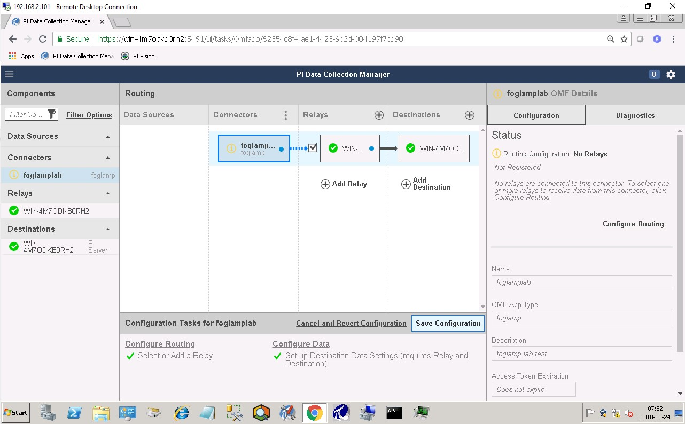
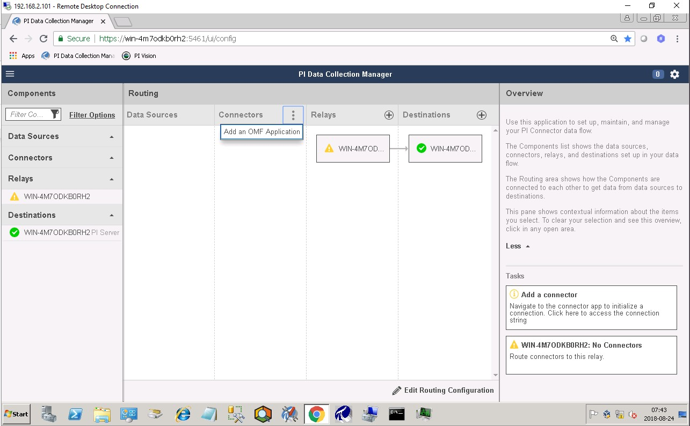
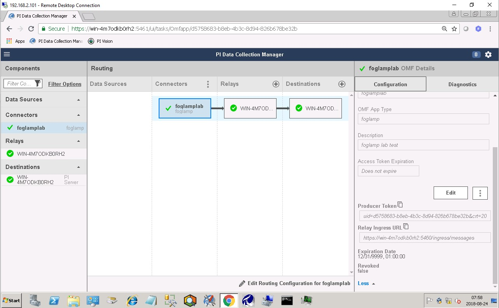
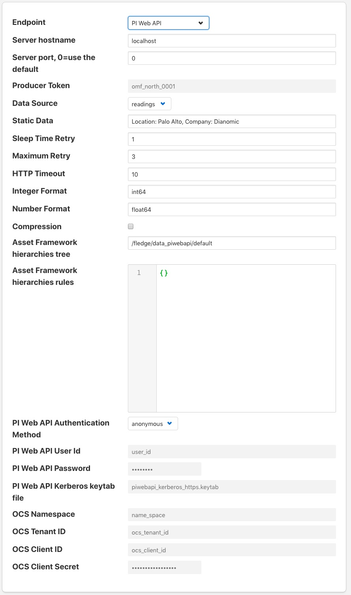
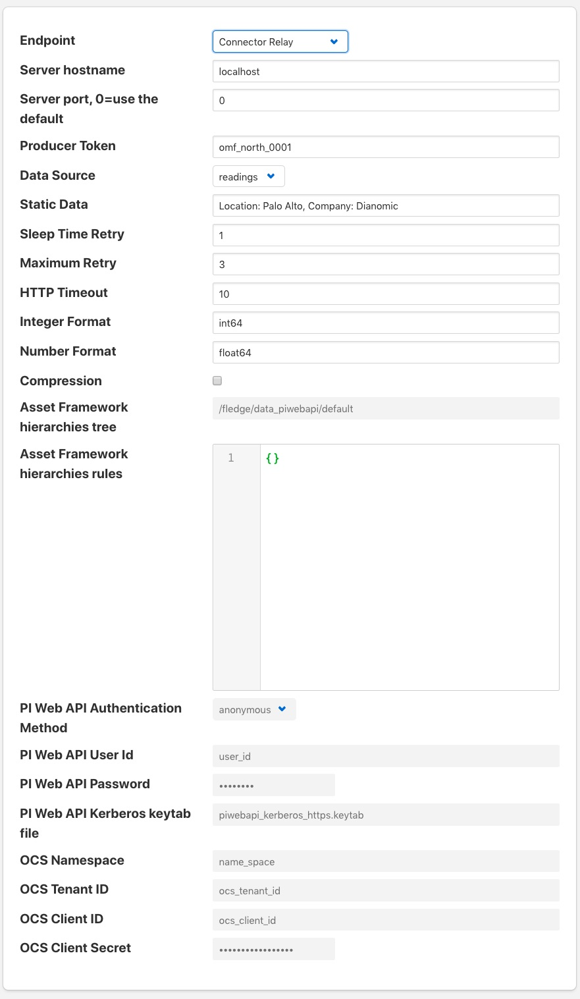
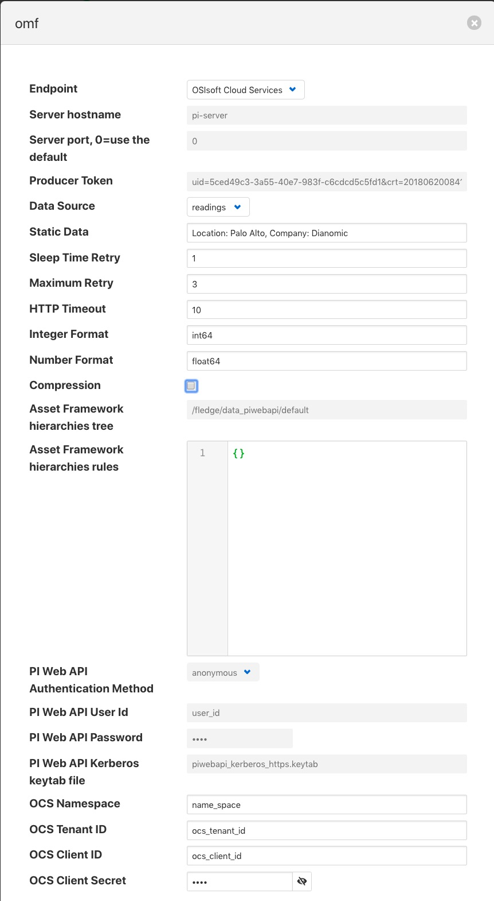

.. Images

.. Links
.. |OMFHint filter plugin| raw:: html

   <a href="../fledge-filter-omfhint/index.html">OMFHint filter plugin</a>

PI Web API OMF Endpoint
~~~~~~~~~~~~~~~~~~~~~~~

To use the PI Web API OMF endpoint first  ensure the OMF option was included in your PI Server when it was installed.  

Now go to the Fledge user interface, create a new North instance and select the “OMF” plugin on the first screen.
The second screen will request the following information:

+----------------------------+
| |omf_plugin_pi_web_config| |
+----------------------------+

Select PI Web API from the Endpoint options.

- Basic Information
   - **Endpoint:** Select what you wish to connect to, in this case PI Web API.
   - **Send full structure:** Used to control if AF structure messages are sent to the PI server. If this is turned off then the data will not be placed in the asset framework.
   - **Naming scheme:** Defines the naming scheme to be used when creating the PI points within the PI Server. See :ref:`Naming_Scheme`.
   - **Server hostname:** The hostname or address of the PI Server.
   - **Server port:** The port the PI Web API OMF endpoint is listening on. Leave as 0 if you are using the default port.
   - **Data Source:** Defines which data is sent to the PI Server. The readings or Fledge's internal statistics.
   - **Static Data:** Data to include in every reading sent to PI.  For example, you can use this to specify the location of the devices being monitored by the Fledge server.
- Asset Framework
   - **Asset Framework Hierarchies Tree:** The location in the Asset Framework into which the data will be inserted. All data will be inserted at this point in the Asset Framework unless a later rule overrides this.
   - **Asset Framework Hierarchies Rules:** A set of rules that allow specific readings to be placed elsewhere in the Asset Framework. These rules can be based on the name of the asset itself or some metadata associated with the asset. See `Asset Framework Hierarchy Rules`_
- PI Web API authentication
   - **PI Web API Authentication Method:** The authentication method to be used, anonymous equates to no authentication, basic authentication requires a user name and password and Kerberos allows integration with your single sign on environment.
   - **PI Web API User Id:**  The user name to authenticate with the PI Web API.
   - **PI Web API Password:** The password of the user we are using to authenticate.
   - **PI Web API Kerberos keytab file:** The Kerberos keytab file used to authenticate.
- Connection management (These should only be changed with guidance from support)
   - **Sleep Time Retry:** Number of seconds to wait before retrying the HTTP connection (Fledge doubles this time after each failed attempt).
   - **Maximum Retry:** Maximum number of times to retry connecting to the PI server.
   - **HTTP Timeout:** Number of seconds to wait before Fledge will time out an HTTP connection attempt.
- Other (Rarely changed)
   - **Integer Format:** Used to match Fledge data types to the data type configured in PI. This defaults to int64 but may be set to any OMF data type compatible with integer data, e.g. int32.
   - **Number Format:** Used to match Fledge data types to the data type configured in PI. The defaults is float64 but may be set to any OMF datatype that supports floating point values.
   - **Compression:** Compress the readings data before sending it to the PI System.

EDS OMF Endpoint
~~~~~~~~~~~~~~~~

To use the OSISoft Edge Data Store first install Edge Data Store on the same machine as your Fledge instance. It is a limitation of Edge Data Store that it must reside on the same host as any system that connects to it with OMF.

Now go to the Fledge user interface, create a new North instance and select the “OMF” plugin on the first screen.
The second screen will request the following information:

+-------------------------+
| |omf_plugin_eds_config| |
+-------------------------+

Select Edge Data Store from the Endpoint options.

- Basic Information
   - **Endpoint:** Select what you wish to connect to, in this case Edge Data Store.
   - **Naming scheme:** Defines the naming scheme to be used when creating the PI points within the PI Server. See :ref:`Naming_Scheme`.
   - **Server hostname:** The hostname or address of the PI Server. This must be the localhost for EDS.
   - **Server port:** The port the Edge Datastore is listening on. Leave as 0 if you are using the default port.
   - **Data Source:** Defines which data is sent to the PI Server. The readings or Fledge's internal statistics.
   - **Static Data:** Data to include in every reading sent to PI.  For example, you can use this to specify the location of the devices being monitored by the Fledge server.
- Connection management (These should only be changed with guidance from support)
   - **Sleep Time Retry:** Number of seconds to wait before retrying the HTTP connection (Fledge doubles this time after each failed attempt).
   - **Maximum Retry:** Maximum number of times to retry connecting to the PI server.
   - **HTTP Timeout:** Number of seconds to wait before Fledge will time out an HTTP connection attempt.
- Other (Rarely changed)
   - **Integer Format:** Used to match Fledge data types to the data type configured in PI. This defaults to int64 but may be set to any OMF data type compatible with integer data, e.g. int32.
   - **Number Format:** Used to match Fledge data types to the data type configured in PI. The defaults is float64 but may be set to any OMF datatype that supports floating point values.
   - **Compression:** Compress the readings data before sending it to the PI System.

OCS OMF Endpoint
~~~~~~~~~~~~~~~~

Go to the Fledge user interface, create a new North instance and select the “OMF” plugin on the first screen.
The second screen will request the following information:

+-------------------------+
| |omf_plugin_ocs_config| |
+-------------------------+

Select OSIsoft Cloud Services from the Endpoint options.

- Basic Information
   - **Endpoint:** Select what you wish to connect to, in this case OSIsoft Cloud Services.
   - **Naming scheme:** Defines the naming scheme to be used when creating the PI points within the PI Server. See :ref:`Naming_Scheme`.
   - **Data Source:** Defines which data is sent to the PI Server. The readings or Fledge's internal statistics.
   - **Static Data:** Data to include in every reading sent to PI.  For example, you can use this to specify the location of the devices being monitored by the Fledge server.
- Authentication
   - **OCS Namespace:** Your namespace within the OSISoft Cloud Services.
   - **OCS Tenant ID:** Your OSISoft Cloud Services tenant ID for your account.
   - **OCS Client ID:** Your OSISoft Cloud Services client ID for your account.
   - **OCS Client Secret:** Your OCS client secret.
- Connection management (These should only be changed with guidance from support)
   - **Sleep Time Retry:** Number of seconds to wait before retrying the HTTP connection (Fledge doubles this time after each failed attempt).
   - **Maximum Retry:** Maximum number of times to retry connecting to the PI server.
   - **HTTP Timeout:** Number of seconds to wait before Fledge will time out an HTTP connection attempt.
- Other (Rarely changed)
   - **Integer Format:** Used to match Fledge data types to the data type configured in PI. This defaults to int64 but may be set to any OMF data type compatible with integer data, e.g. int32.
   - **Number Format:** Used to match Fledge data types to the data type configured in PI. The defaults is float64 but may be set to any OMF datatype that supports floating point values.
   - **Compression:** Compress the readings data before sending it to the PI System.

PI Connector Relay
~~~~~~~~~~~~~~~~~~

The PI Connector Relay was the original mechanism by which OMF data
could be ingesting into a PI Server, this has since been replaced by
the PI Web API OMF endpoint. It is recommended that all new deployments
should use the PI Web API endpoint as the Connector Relay has now been
discontinued by OSIsoft. To use the Connector Relay, open and sign into
the PI Relay Data Connection Manager.

+-----------------+
| |PI_connectors| |
+-----------------+

To add a new connector for the Fledge system, click on the drop down menu to the right of "Connectors" and select "Add an OMF application".  Add and save the requested configuration information.

+--------------+
| |PI_connect| |
+--------------+

Connect the new application to the OMF Connector Relay by selecting the new Fledge application, clicking the check box for the OMF Connector Relay and then clicking "Save Configuration".

+------------+
| |PI_token| |
+------------+

Finally, select the new Fledge application. Click "More" at the bottom of the Configuration panel. Make note of the Producer Token and Relay Ingress URL.

Now go to the Fledge user interface, create a new North instance and select the “OMF” plugin on the first screen.
The second screen will request the following information:

+-------------------------------------+
| |omf_plugin_connector_relay_config| |
+-------------------------------------+

- Basic Information
   - **Endpoint:** Select what you wish to connect to, in this case the Connector Relay.
   - **Server hostname:** The hostname or address of the Connector Relay.
   - **Server port:** The port the Connector Relay is listening on. Leave as 0 if you are using the default port.
   - **Producer Token:** The Producer Token provided by PI
   - **Data Source:** Defines which data is sent to the PI Server. The readings or Fledge's internal statistics.
   - **Static Data:** Data to include in every reading sent to PI.  For example, you can use this to specify the location of the devices being monitored by the Fledge server.
- Connection management (These should only be changed with guidance from support)
   - **Sleep Time Retry:** Number of seconds to wait before retrying the HTTP connection (Fledge doubles this time after each failed attempt).
   - **Maximum Retry:** Maximum number of times to retry connecting to the PI server.
   - **HTTP Timeout:** Number of seconds to wait before Fledge will time out an HTTP connection attempt.
- Other (Rarely changed)
   - **Integer Format:** Used to match Fledge data types to the data type configured in PI. This defaults to int64 but may be set to any OMF data type compatible with integer data, e.g. int32.
   - **Number Format:** Used to match Fledge data types to the data type configured in PI. The defaults is float64 but may be set to any OMF datatype that supports floating point values.
   - **Compression:** Compress the readings data before sending it to the PI System.

.. _Naming_Scheme:

Naming Scheme
-------------

The naming of objects in the asset framework and of the attributes of
those objects has a number of constraints that need to be understood when
storing data into a PI Server using OMF. An important factor in this is
the stability of your data structures. If, in your environment you have
objects are liable to change, i.e. the types of attributes change or
the number of attributes change between readings, then you may wish to
take a different naming approach to if they do not.

This occurs because of a limitation of the OMF interface to the PI
server. Data is sent to OMF in a number of stages, one of these is the
definition of the types for the AF Objects. OMF let's a type be defined,
but once defined it can not be changed. A new type must be created rather
than changing the existing type. This means a new asset framework object
is created each time a type changes.

The OMF plugin names objects in the asset framework based upon the asset
name in the reading within Fledge. Asset names are typically added to
the readings in the south plugins, however they may be altered by filters
between the south ingest and the north egress points in the data
pipeline. Asset names can be overridden using the `OMF Hints` mechanism
described below.

The attribute names used within the objects in the PI System are based
on the names of the data points within each reading within Fledge. Again
`OMF Hints` can be used to override this mechanism.

The naming used within the objects in the Asset Framework is controlled
by the *Naming Scheme* option

  Concise
     No suffix or prefix is added to the asset name and property name when
     creating the objects in the AF framework and Attributes in the PI
     server. However if the structure of an asset changes a new AF Object
     will be created which will have the suffix -type*x* appended to it.

  Use Type Suffix
     The AF Object names will be created from the asset names by appending
     the suffix -type*x* to the asset name. If and when the structure
     of an asset changes a new object name will be created with an
     updated suffix.

  Use Attribute Hash
     Attribute names will be created using a numerical hash as a prefix.

  Backward Compatibility
     The naming reverts to the rules that were used by version 1.9.1 and
     earlier of Fledge, both type suffices and attribute hashes will be
     applied to the naming.

Asset Framework Hierarchy Rules
-------------------------------

The asset framework rules allow the location of specific assets within
the PI Asset Framework to be controlled. There are two basic type of hint;

  - Asset name placement, the name of the asset determines where in the
    Asset Framework the asset is placed

  - Meta data placement, metadata within the reading determines where
    the asset is placed in the Asset Framework

The rules are encoded within a JSON document, this document contains
two properties in the root of the document; one for name based rules
and the other for metadata based rules

.. code-block:: console

    {       
	    "names" :       
		    {       
			    "asset1" : "/Building1/EastWing/GroundFloor/Room4",
			    "asset2" : "Room14"
		    },
	    "metadata" :
		    {
			    "exist" :
				    {
					    "temperature"   : "temperatures",
					    "power"         : "/Electrical/Power"
				    },
			    "nonexist" :
				    {
					    "unit"          : "Uncalibrated"
				    }
			    "equal" :
				    {
					    "room"          :
						    {
							    "4" : "ElecticalLab",
							    "6" : "FluidLab"
						    }
				    }
			    "notequal" :
				    {
					    "building"      :
						    {
							    "plant" : "/Office/Environment"
						    }
				    }
		    }
    }

The name type rules are simply a set of asset name and AF location
pairs. The asset names must be complete names, there is no pattern
matching within the names.

The metadata rules are more complex, four different tests can be applied;

  - **exists**: This test looks for the existence of the named datapoint within the asset.

  - **nonexist**: This test looks for the lack of a named datapoint within the asset.

  - **equal**: This test looks for a named data point having a given value.

  - **notequal**: This test looks for a name data point having a value different from that specified.

The *exist* and *nonexist* tests take a set of name/value pairs that
are tested. The name is the datapoint name to examine and the value is
the asset framework location to use. For example

.. code-block:: console

   "exist" :
       {
            "temperature"   : "temperatures",
            "power"         : "/Electrical/Power"
       }  

If an asset has a data point called *temperature* in will be stored in
the AF hierarchy *temperatures*, if the asset had a data point called
*power* the asset will be placed in the AF hierarchy */Electrical/Power*.

The *equal* and *notequal* tests take a object as a child, the name of
the object is data point to examine, the child nodes a sets of values
and locations. For example

.. code-block:: console

   "equal" :
      {
         "room" :
            {
               "4" : "ElecticalLab",
               "6" : "FluidLab"
            }
      }

In this case if the asset has a data point called *room* with a value
of *4* then the asset will be placed in the AF location *ElectricalLab*,
if it has a value of *6* then it is placed in the AF location *FluidLab*.

If an asset matches multiple rules in the ruleset it will appear in
multiple locations in the hierarchy, the data is shared between each of
the locations.

If an OMF Hint exists within a particular reading this will take
precedence over generic rules.

The AF location may be a simple string or it may also include
substitutions from other data points within the reading. For example
of the reading has a data point called *room* that contains the room
in which the readings was taken, an AF location of */BuildingA/${room}*
would put the reading in the asset framework using the value of the room
data point. The reading

.. code-block:: console

  "reading" : {
       "temperature" : 23.4,
       "room"        : "B114"
       }

would be put in the AF at */BuildingA/B114* whereas a reading of the form

.. code-block:: console

  "reading" : {
       "temperature" : 24.6,
       "room"        : "2016"
       }

would be put at the location */BuildingA/2016*.

It is also possible to define defaults if the referenced data point
is missing. Therefore in our example above if we used the location
*/BuildingA/${room:unknown}* a reading without a *room* data point would
be place in */BuildingA/unknown*. If no default is given and the data
point is missing then the level in the hierarchy is ignore. E.g. if we
use our original location */BuildingA/${room}* and we have the reading

.. code-block:: console

  "reading" : {
       "temperature" : 22.8,
       }

this reading would be stored in */BuildingA*.

OMF Hints
---------

The OMF plugin also supports the concept of hints in the actual data
that determine how the data should be treated by the plugin. Hints are
encoded in a specially name data point within the asset, *OMFHint*. The
hints themselves are encoded as JSON within a string.

Number Format Hints
~~~~~~~~~~~~~~~~~~~

A number format hint tells the plugin what number format to insert data
into the PI Server as. The following will cause all numeric data within
the asset to be written using the format *float32*.

.. code-block:: console

   "OMFHint"  : { "number" : "float32" }

The value of the *number* hint may be any numeric format that is supported by the PI Server.

Integer  Format Hints
~~~~~~~~~~~~~~~~~~~~~

an integer format hint tells the plugin what integer format to insert
data into the PI Server as. The following will cause all integer data
within the asset to be written using the format *integer32*.

.. code-block:: console

   "OMFHint"  : { "number" : "integer32" }

The value of the *number* hint may be any numeric format that is supported by the PI Server.

Type Name Hints
~~~~~~~~~~~~~~~

A type name hint specifies that a particular name should be used when
defining the name of the type that will be created to store the object
in the Asset Framework. This will override the :ref:`Naming_Scheme` currently
configured.

.. code-block:: console

   "OMFHint"  : { "typeName" : "substation" }

Type Hint
~~~~~~~~~

A type hint is similar to a type name hint, but instead of defining
the name of a type to create it defines the name of an existing type
to use. The structure of the asset *must* match the structure of the
existing type with the PI Server, it is the responsibility of the person
that adds this hint to ensure this is the case.

.. code-block:: console

   "OMFHint"  : { "type" : "pump" }

Tag Name Hint
~~~~~~~~~~~~~

Specifies that a specific tag name should be used when storing data in the PI server.

.. code-block:: console

   "OMFHint"  : { "tagName" : "AC1246" }

Datapoint Specific Hint
~~~~~~~~~~~~~~~~~~~~~~~

Hints may also be targeted to specific data points within an asset by
using the datapoint hint. A *datapoint* hint takes a JSON object as
it's value, this object defines the name of the datapoint and the hint
to apply.

.. code-block:: console

   "OMFHint"  : { "datapoint" : { "name" : "voltage:, "number" : "float32" } }

The above hint applies to the datapoint *voltage* in the asset and
applies a *number format* hint to that datapoint.

Asset Framework Location Hint
~~~~~~~~~~~~~~~~~~~~~~~~~~~~~

An asset framework location hint can be added to a reading to control
the placement of that asset within the Asset Framework. An asset framework
hint would be as follow

.. code-block:: console

   "OMFHint"  : { "AFLocation" : "/UK/London/TowerHill/Floor4" }

Adding OMF Hints
~~~~~~~~~~~~~~~~

An OMF Hint is implemented as a string data point on a reading with
the data point name of *OMFHint*. It can be added at any point int he
processing of the data, however a specific plugin is available for adding
the hints, the |OMFHint filter plugin|.
