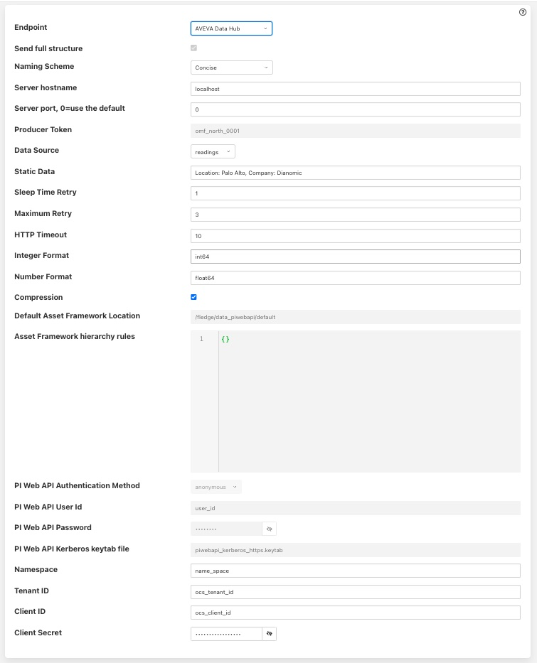

.. Images
.. |PI_connect| image:: images/PI_connect.jpg
.. |PI_connectors| image:: images/PI_connectors.jpg
.. |PI_token| image:: images/PI_token.jpg
.. |omf_plugin_pi_web_config| image:: images/omf-plugin-pi-web.jpg
.. |omf_plugin_connector_relay_config| image:: images/omf-plugin-connector-relay.jpg
.. |omf_plugin_eds_config| image:: images/omf-plugin-eds.jpg
.. |omf_plugin_ocs_config| image:: images/omf-plugin-ocs.jpg

.. Links
.. |OMFHint filter plugin| raw:: html

   <a href="../fledge-filter-omfhint/index.html">OMFHint filter plugin</a>

PI Web API OMF Endpoint
~~~~~~~~~~~~~~~~~~~~~~~

To use the PI Web API OMF endpoint first ensure the OMF option was included in your PI Server when it was installed.  

Now go to the Fledge user interface, create a new North instance and select the “OMF” plugin on the first screen.
The second screen will request the following information:

+----------------------------+
| |omf_plugin_pi_web_config| |
+----------------------------+

Select PI Web API from the Endpoint options.

- Basic Information
   - **Endpoint:** This is the type of OMF endpoint. In this case, choose PI Web API.
   - **Send full structure:** Used to control if Asset Framework structure messages are sent to the PI Server. If this is turned off then the data will not be placed in the Asset Framework.
   - **Naming scheme:** Defines the naming scheme to be used when creating the PI points in the PI Data Archive. See :ref:`Naming_Scheme`.
   - **Server hostname:** The hostname or address of the PI Web API server. This is normally the same address as the PI Server.
   - **Server port:** The port the PI Web API OMF endpoint is listening on. Leave as 0 if you are using the default port.
   - **Data Source:** Defines which data is sent to the PI Server. Choices are: readings or statistics (that is, Fledge's internal statistics).
   - **Static Data:** Data to include in every reading sent to PI. For example, you can use this to specify the location of the devices being monitored by the Fledge server.
- Asset Framework
   - **Default Asset Framework Location:** The location in the Asset Framework hierarchy into which the data will be inserted.
     All data will be inserted at this point in the Asset Framework hierarchy unless a later rule overrides this.
     Note this field does not include the name of the target Asset Framework Database;
     the target database is defined on the PI Web API server by the PI Web API Admin Utility.
   - **Asset Framework Hierarchies Rules:** A set of rules that allow specific readings to be placed elsewhere in the Asset Framework. These rules can be based on the name of the asset itself or some metadata associated with the asset. See `Asset Framework Hierarchy Rules`_.
- PI Web API authentication
   - **PI Web API Authentication Method:** The authentication method to be used: anonymous, basic or kerberos.
     Anonymous equates to no authentication, basic authentication requires a user name and password, and Kerberos allows integration with your single signon environment.
   - **PI Web API User Id:**  For Basic authentication, the user name to authenticate with the PI Web API.
   - **PI Web API Password:** For Basic authentication, the password of the user we are using to authenticate.
   - **PI Web API Kerberos keytab file:** The Kerberos keytab file used to authenticate.
- Connection management (These should only be changed with guidance from support)
   - **Sleep Time Retry:** Number of seconds to wait before retrying the HTTP connection (Fledge doubles this time after each failed attempt).
   - **Maximum Retry:** Maximum number of times to retry connecting to the PI Server.
   - **HTTP Timeout:** Number of seconds to wait before Fledge will time out an HTTP connection attempt.
- Other (Rarely changed)
   - **Integer Format:** Used to match Fledge data types to the data type configured in PI. This defaults to int64 but may be set to any OMF data type compatible with integer data, e.g. int32.
   - **Number Format:** Used to match Fledge data types to the data type configured in PI. The default is float64 but may be set to any OMF datatype that supports floating point values.
   - **Compression:** Compress the readings data before sending them to the PI Web API OMF endpoint.
     This setting is not related to data compression in the PI Data Archive.
   - **Complex Types:** Used to force the plugin to send OMF data types as complex types rather than the newer linked types. Linked types are the default way to send data and allows assets to have different sets of data points in different readings. See :ref:`Linked_Types`.

Edge Data Store OMF Endpoint
~~~~~~~~~~~~~~~~~~~~~~~~~~~~

To use the OSIsoft Edge Data Store first install Edge Data Store on the same machine as your Fledge instance. It is a limitation of Edge Data Store that it must reside on the same host as any system that connects to it with OMF.

Now go to the Fledge user interface, create a new North instance and select the “OMF” plugin on the first screen.
The second screen will request the following information:

+-------------------------+
| |omf_plugin_eds_config| |
+-------------------------+

Select Edge Data Store from the Endpoint options.

- Basic Information
   - **Endpoint:** This is the type of OMF endpoint. In this case, choose Edge Data Store.
   - **Naming scheme:** Defines the naming scheme to be used when creating the PI points within the PI Server. See :ref:`Naming_Scheme`.
   - **Server hostname:** Normally the hostname or address of the OMF endpoint. For Edge Data Store, this must be *localhost*.
   - **Server port:** The port the Edge Data Store is listening on. Leave as 0 if you are using the default port.
   - **Data Source:** Defines which data is sent to the Edge Data Store. Choices are: readings or statistics (that is, Fledge's internal statistics).
   - **Static Data:** Data to include in every reading sent to PI. For example, you can use this to specify the location of the devices being monitored by the Fledge server.
- Connection management (These should only be changed with guidance from support)
   - **Sleep Time Retry:** Number of seconds to wait before retrying the HTTP connection (Fledge doubles this time after each failed attempt).
   - **Maximum Retry:** Maximum number of times to retry connecting to the PI server.
   - **HTTP Timeout:** Number of seconds to wait before Fledge will time out an HTTP connection attempt.
- Other (Rarely changed)
   - **Integer Format:** Used to match Fledge data types to the data type configured in PI. This defaults to int64 but may be set to any OMF data type compatible with integer data, e.g. int32.
   - **Number Format:** Used to match Fledge data types to the data type configured in PI. The default is float64 but may be set to any OMF datatype that supports floating point values.
   - **Compression:** Compress the readings data before sending them to the Edge Data Store.

AVEVA Data Hub OMF Endpoint
~~~~~~~~~~~~~~~~~~~~~~~~~~~

Go to the Fledge user interface, create a new North instance and select the “OMF” plugin on the first screen.
The second screen will request the following information:

+-------------------------+
| |omf_plugin_adh_config| |
+-------------------------+

Select AVEVA Data Hubfrom the Endpoint options.

- Basic Information
   - **Endpoint:** This is the type of OMF endpoint. In this case, choose AVEVA Data Hub.
   - **Naming scheme:** Defines the naming scheme to be used when creating the PI points within the PI Server. See :ref:`Naming_Scheme`.
   - **Data Source:** Defines which data is sent to AVEVA Data Hub. Choices are: readings or statistics (that is, Fledge's internal statistics).
   - **Static Data:** Data to include in every reading sent to AVEVA Data Hub.  For example, you can use this to specify the location of the devices being monitored by the Fledge server.
- Authentication
   - **Namespace:** Your namespace within the AVEVA Data Hub.
   - **Tenant ID:** Your AVEVA Data Hub Tenant ID for your account.
   - **Client ID:** Your AVEVA Data Hub Client ID for your account.
   - **Client Secret:** Your AVEVA Data Hub Client Secret.
- Connection management (These should only be changed with guidance from support)
   - **Sleep Time Retry:** Number of seconds to wait before retrying the HTTP connection (Fledge doubles this time after each failed attempt).
   - **Maximum Retry:** Maximum number of times to retry connecting to the AVEVA Data Hub.
   - **HTTP Timeout:** Number of seconds to wait before Fledge will time out an HTTP connection attempt.
- Other (Rarely changed)
   - **Integer Format:** Used to match Fledge data types to the data type configured in AVEVA Data Hub. This defaults to int64 but may be set to any OMF data type compatible with integer data, e.g. int32.
   - **Number Format:** Used to match Fledge data types to the data type configured in AVEVA Data Hub. The default is float64 but may be set to any OMF datatype that supports floating point values.
   - **Compression:** Compress the readings data before sending them to AVEVA Data Hub.

OSIsoft Cloud Services OMF Endpoint
~~~~~~~~~~~~~~~~~~~~~~~~~~~~~~~~~~~

Go to the Fledge user interface, create a new North instance and select the “OMF” plugin on the first screen.
The second screen will request the following information:

+-------------------------+
| |omf_plugin_ocs_config| |
+-------------------------+

Select OSIsoft Cloud Services from the Endpoint options.

- Basic Information
   - **Endpoint:** This is the type of OMF endpoint. In this case, choose OSIsoft Cloud Services.
   - **Naming scheme:** Defines the naming scheme to be used when creating the PI points within the PI Server. See :ref:`Naming_Scheme`.
   - **Data Source:** Defines which data is sent to OSIsoft Cloud Services. Choices are: readings or statistics (that is, Fledge's internal statistics).
   - **Static Data:** Data to include in every reading sent to OSIsoft Cloud Services.  For example, you can use this to specify the location of the devices being monitored by the Fledge server.
- Authentication
   - **Namespace:** Your namespace within OSIsoft Cloud Services.
   - **Tenant ID:** Your OSIsoft Cloud Services Tenant ID for your account.
   - **Client ID:** Your OSIsoft Cloud Services Client ID for your account.
   - **Client Secret:** Your OSIsoft Cloud Services Client Secret.
- Connection management (These should only be changed with guidance from support)
   - **Sleep Time Retry:** Number of seconds to wait before retrying the HTTP connection (Fledge doubles this time after each failed attempt).
   - **Maximum Retry:** Maximum number of times to retry connecting to the PI server.
   - **HTTP Timeout:** Number of seconds to wait before Fledge will time out an HTTP connection attempt.
- Other (Rarely changed)
   - **Integer Format:** Used to match Fledge data types to the data type configured in PI. This defaults to int64 but may be set to any OMF data type compatible with integer data, e.g. int32.
   - **Number Format:** Used to match Fledge data types to the data type configured in PI. The default is float64 but may be set to any OMF datatype that supports floating point values.
   - **Compression:** Compress the readings data before sending them to OSIsoft Cloud Services.

PI Connector Relay
~~~~~~~~~~~~~~~~~~

**The PI Connector Relay has been discontinued by OSIsoft.**
All new deployments should use the PI Web API endpoint.
Existing installations will still be supported.
The PI Connector Relay was the original mechanism by which OMF data could be ingesting into a PI Server.
To use the PI Connector Relay, open and sign into the PI Relay Data Connection Manager.

+-----------------+
| |PI_connectors| |
+-----------------+

To add a new connector for the Fledge system, click on the drop down menu to the right of "Connectors" and select "Add an OMF application".  Add and save the requested configuration information.

+--------------+
| |PI_connect| |
+--------------+

Connect the new application to the PI Connector Relay by selecting the new Fledge application, clicking the check box for the PI Connector Relay and then clicking "Save Configuration".

+------------+
| |PI_token| |
+------------+

Finally, select the new Fledge application. Click "More" at the bottom of the Configuration panel. Make note of the Producer Token and Relay Ingress URL.

Now go to the Fledge user interface, create a new North instance and select the “OMF” plugin on the first screen.
The second screen will request the following information:

+-------------------------------------+
| |omf_plugin_connector_relay_config| |
+-------------------------------------+

- Basic Information
   - **Endpoint:** This is the type of OMF endpoint. In this case, choose Connector Relay.
   - **Server hostname:** The hostname or address of the PI Connector Relay.
   - **Server port:** The port the PI Connector Relay is listening on. Leave as 0 if you are using the default port.
   - **Producer Token:** The Producer Token provided by the PI Relay Data Connection Manager.
   - **Data Source:** Defines which data is sent to the PI Connector Relay. Choices are: readings or statistics (that is, Fledge's internal statistics).
   - **Static Data:** Data to include in every reading sent to PI.  For example, you can use this to specify the location of the devices being monitored by the Fledge server.
- Connection management (These should only be changed with guidance from support)
   - **Sleep Time Retry:** Number of seconds to wait before retrying the HTTP connection (Fledge doubles this time after each failed attempt).
   - **Maximum Retry:** Maximum number of times to retry connecting to the PI server.
   - **HTTP Timeout:** Number of seconds to wait before Fledge will time out an HTTP connection attempt.
- Other (Rarely changed)
   - **Integer Format:** Used to match Fledge data types to the data type configured in PI. This defaults to int64 but may be set to any OMF data type compatible with integer data, e.g. int32.
   - **Number Format:** Used to match Fledge data types to the data type configured in PI. The default is float64 but may be set to any OMF datatype that supports floating point values.
   - **Compression:** Compress the readings data before sending it to the PI System.

.. _Naming_Scheme:

Naming Scheme
-------------

The naming of objects in the Asset Framework and of the attributes of
those objects has a number of constraints that need to be understood when
storing data into a PI Server using OMF.
An important factor in this is the stability of your data structures.
If you have objects in your environment that are likely to change,
you may wish to take a different naming approach.
Examples of changes are a difference in the number of attributes between readings, and a change in the data types of attributes.

This occurs because of a limitation of the OMF interface to the PI Server.
Data is sent to OMF in a number of stages.
One of these is the definition of the Types used to create AF Element Templates.
OMF uses a Type to define an AF Element Template but once defined it cannot be changed.
If an updated Type definition is sent to OMF, it will be used to create a new AF Element Template rather than changing the existing one.
This means a new AF Element Template is created each time a Type changes.

The OMF plugin names objects in the Asset Framework based upon the asset
name in the reading within Fledge. Asset names are typically added to
the readings in the south plugins, however they may be altered by filters
between the south ingest and the north egress points in the data
pipeline. Asset names can be overridden using the `OMF Hints` mechanism
described below.

The attribute names used within the objects in the PI System are based
on the names of the datapoints within each Reading within Fledge. Again
`OMF Hints` can be used to override this mechanism.

The naming used within the objects in the Asset Framework is controlled
by the *Naming Scheme* option:

  Concise
     No suffix or prefix is added to the asset name and property name when
     creating objects in the Asset Framework and PI Points in the PI Data Archive.
     However, if the structure of an asset changes a new AF Element Template
     will be created which will have the suffix -type*x* appended to it.

  Use Type Suffix
     The AF Element names will be created from the asset names by appending
     the suffix -type*x* to the asset name. If the structure
     of an asset changes a new AF Element name will be created with an
     updated suffix.

  Use Attribute Hash
     AF Attribute names will be created using a numerical hash as a prefix.

  Backward Compatibility
     The naming reverts to the rules that were used by version 1.9.1 and
     earlier of Fledge: both type suffixes and attribute hashes will be
     applied to the name.

Asset Framework Hierarchy Rules
-------------------------------

The Asset Framework rules allow the location of specific assets within
the Asset Framework to be controlled. There are two basic types of hint:

  - Asset name placement: the name of the asset determines where in the
    Asset Framework the asset is placed,

  - Meta data placement: metadata within the reading determines where
    the asset is placed in the Asset Framework.

The rules are encoded within a JSON document.
This document contains two properties in the root of the document:
one for name-based rules and the other for metadata based rules.

.. code-block:: console

    {       
	    "names" :       
		    {       
			    "asset1" : "/Building1/EastWing/GroundFloor/Room4",
			    "asset2" : "Room14"
		    },
	    "metadata" :
		    {
			    "exist" :
				    {
					    "temperature"   : "temperatures",
					    "power"         : "/Electrical/Power"
				    },
			    "nonexist" :
				    {
					    "unit"          : "Uncalibrated"
				    }
			    "equal" :
				    {
					    "room"          :
						    {
							    "4" : "ElecticalLab",
							    "6" : "FluidLab"
						    }
				    }
			    "notequal" :
				    {
					    "building"      :
						    {
							    "plant" : "/Office/Environment"
						    }
				    }
		    }
    }

The name type rules are simply a set of asset name and Asset Framework location
pairs. The asset names must be complete names; there is no pattern
matching within the names.

The metadata rules are more complex. Four different tests can be applied:

  - **exists**: This test looks for the existence of the named datapoint within the asset.

  - **nonexist**: This test looks for the lack of a named datapoint within the asset.

  - **equal**: This test looks for a named datapoint having a given value.

  - **notequal**: This test looks for a name datapoint having a value different from that specified.

The *exist* and *nonexist* tests take a set of name/value pairs that
are tested. The name is the datapoint name to examine and the value is
the Asset Framework location to use. For example

.. code-block:: console

   "exist" :
       {
            "temperature"   : "temperatures",
            "power"         : "/Electrical/Power"
       }  

If an asset has a datapoint called *temperature* in will be stored in
the AF hierarchy *temperatures*, if the asset had a datapoint called
*power* the asset will be placed in the AF hierarchy */Electrical/Power*.

The *equal* and *notequal* tests take an object as a child, the name of
the object is datapoint to examine, the child nodes a sets of values
and locations. For example

.. code-block:: console

   "equal" :
      {
         "room" :
            {
               "4" : "ElectricalLab",
               "6" : "FluidLab"
            }
      }

In this case if the asset has a datapoint called *room* with a value
of *4* then the asset will be placed in the AF location *ElectricalLab*,
if it has a value of *6* then it is placed in the AF location *FluidLab*.

If an asset matches multiple rules in the ruleset it will appear in
multiple locations in the hierarchy, the data is shared between each of
the locations.

If an OMF Hint exists within a particular reading this will take
precedence over generic rules.

The AF location may be a simple string or it may also include
substitutions from other datapoints within the reading. For example
of the reading has a datapoint called *room* that contains the room
in which the readings was taken, an AF location of */BuildingA/${room}*
would put the reading in the Asset Framework using the value of the room
datapoint. The reading

.. code-block:: console

  "reading" : {
       "temperature" : 23.4,
       "room"        : "B114"
       }

would be put in the AF at */BuildingA/B114* whereas a reading of the form

.. code-block:: console

  "reading" : {
       "temperature" : 24.6,
       "room"        : "2016"
       }

would be put at the location */BuildingA/2016*.

It is also possible to define defaults if the referenced datapoint
is missing. In our example above if we used the location
*/BuildingA/${room:unknown}* a reading without a *room* datapoint would
be placed in */BuildingA/unknown*. If no default is given and the data
point is missing then the level in the hierarchy is ignore. E.g. if we
use our original location */BuildingA/${room}* and we have the reading

.. code-block:: console

  "reading" : {
       "temperature" : 22.8,
       }

this reading would be stored in */BuildingA*.

OMF Hints
---------

The OMF plugin also supports the concept of hints in the actual data
that determine how the data should be treated by the plugin. Hints are
encoded in a specially name datapoint within the asset, *OMFHint*. The
hints themselves are encoded as JSON within a string.

Number Format Hints
~~~~~~~~~~~~~~~~~~~

A number format hint tells the plugin what number format to use when inserting data
into the PI Server. The following will cause all numeric data within
the asset to be written using the format *float32*.

.. code-block:: console

   "OMFHint"  : { "number" : "float32" }

The value of the *number* hint may be any numeric format that is supported by the PI Server.

Integer Format Hints
~~~~~~~~~~~~~~~~~~~~

An integer format hint tells the plugin what integer format to use when inserting
data into the PI Server. The following will cause all integer data
within the asset to be written using the format *integer32*.

.. code-block:: console

   "OMFHint"  : { "number" : "integer32" }

The value of the *number* hint may be any numeric format that is supported by the PI Server.

Type Name Hints
~~~~~~~~~~~~~~~

A type name hint specifies that a particular name should be used when
defining the name of the type that will be created to store the object
in the Asset Framework. This will override the :ref:`Naming_Scheme` currently
configured.

.. code-block:: console

   "OMFHint"  : { "typeName" : "substation" }

Type Hint
~~~~~~~~~

A type hint is similar to a type name hint, but instead of defining
the name of a type to create it defines the name of an existing type
to use. The structure of the asset *must* match the structure of the
existing type with the PI Server, it is the responsibility of the person
that adds this hint to ensure this is the case.

.. code-block:: console

   "OMFHint"  : { "type" : "pump" }

.. note::

   This hint only has meaning when using the complex type legacy mode with this plugin.

Tag Name Hint
~~~~~~~~~~~~~

Specifies that a specific tag name should be used when storing data in the PI Server.

.. code-block:: console

   "OMFHint"  : { "tagName" : "AC1246" }

Legacy Type Hint
~~~~~~~~~~~~~~~~

Use legacy style complex types for this reading rather that the newer linked data types.

.. code-block:: console

   "OMFHint" : { "LegacyType" : "true" }

The allows the older mechanism to be forced for a single asset. See :ref:`Linked_Types`.

Source Hint
~~~~~~~~~~~

The default data source that is associated with tags in the PI Server is Fledge, however this can be overridden using the data source hint. This hint may be applied to the entire asset or to specific datapoints within the asset.

.. code-block:: console

   "OMFHint" : { "source" : "Fledge23" }

Datapoint Specific Hint
~~~~~~~~~~~~~~~~~~~~~~~

Hints may also be targeted to specific data points within an asset by
using the datapoint hint. A *datapoint* hint takes a JSON object as
its value; the object defines the name of the datapoint and the hint
to apply.

.. code-block:: console

   "OMFHint"  : { "datapoint" : { "name" : "voltage:, "number" : "float32" } }

The above hint applies to the datapoint *voltage* in the asset and
applies a *number format* hint to that datapoint.

Asset Framework Location Hint
~~~~~~~~~~~~~~~~~~~~~~~~~~~~~

An Asset Framework location hint can be added to a reading to control
the placement of the asset within the Asset Framework. An Asset Framework
hint would be as follows:

.. code-block:: console

   "OMFHint"  : { "AFLocation" : "/UK/London/TowerHill/Floor4" }
   
Note the following when defining an *AFLocation* hint:

- An asset in a Fledge Reading is used to create a `Container in the OSIsoft Asset Framework <https://docs.osisoft.com/bundle/omf-with-pi-web-api/page/container-messages.html>`_.
  A *Container* is an AF Element with one or more AF Attributes that are mapped to PI Points using the OSIsoft PI Point Data Reference.
  The name of the AF Element comes from the Fledge Reading asset name.
  The names of the AF Attributes come from the Fledge Reading datapoint names.
- If you edit the AF Location hint, the Container will be moved to the new location in the AF hierarchy.
- If you disable the OMF Hint filter, the Container will not move.
- If you wish to move a Container, you can do this with the PI System Explorer.
  Right-click on the AF Element that represents the Container.
  Choose Copy.
  Select the AF Element that will serve as the new parent of the Container.
  Right-click and choose *Paste*.
  You can then return to the original Container and delete it.
  *Note that PI System Explorer does not have the traditional Cut function for AF Elements*.
- If you move a Container, OMF North will not recreate it.
  If you then edit the AF Location hint, the Container will appear in the new location.

Unit Of Measure Hint
~~~~~~~~~~~~~~~~~~~~

A unit of measure, or uom hint is used to associate one of the units of
measurement defined within your PI Server with a particular data point
within an asset.

.. code-block:: console

   "OMFHint"  : { "datapoint" : { "name" : "height:, "uom" : "meter" } }

Minimum Hint
~~~~~~~~~~~~

A minimum hint is used to associate a minimum value in the PI Point created for a data point.

.. code-block:: console

   "OMFHint"  : { "datapoint" : { "name" : "height:, "minimum" : "0" } }

Maximum Hint
~~~~~~~~~~~~

A maximum hint is used to associate a maximum value in the PI Point created for a data point.

.. code-block:: console

   "OMFHint"  : { "datapoint" : { "name" : "height:, "maximum" : "100000" } }

Interpolation
~~~~~~~~~~~~~

The interpolation hint sets the interpolation value used within the PI Server, interpolation values supported are continuous, discrete, stepwisecontinuousleading, and stepwisecontinuousfollowing.

.. code-block:: console

   "OMFHint"  : { "datapoint" : { "name" : "height:, "interpolation" : "continuous" } }

Adding OMF Hints
~~~~~~~~~~~~~~~~

An OMF Hint is implemented as a string data point on a reading with
the data point name of *OMFHint*. It can be added at any point in the
processing of the data, however a specific plugin is available for adding
the hints, the |OMFHint filter plugin|.

.. _Linked_Types:

Linked Types
------------

Versions of this plugin prior to 2.1.0 created a complex type within OMF for each asset that included all of the data points within that asset. This suffered from a limitation in that readings had to contain values for all of the data points of an asset in order to be accepted by the OMF end point. Following the introduction of OMF version 1.2 it was possible to use the linking features of OMF to avoid the need to create complex types for an asset and instead create empty assets and link the data points to this shell asset. This allows readings to only contain a subset of datapoints and still be successfully sent to the PI Server, or other end points.

As of version 2.1.0 this linking approach is used for all new assets created, if assets exist within the PI Server from versions of the plugin prior to 2.1.0 then the older, complex types will be used. It is possible to force the plugin to use complex types for all assets, both old and new, using the configuration option. It is also to force a particular asset to use the complex type mechanism using an OMFHint.

