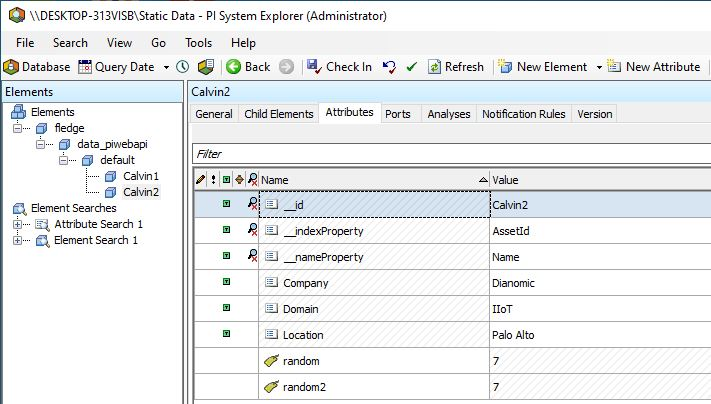

.. Images
.. |PI_connect| image:: images/PI_connect.jpg
.. |PI_connectors| image:: images/PI_connectors.jpg
.. |PI_token| image:: images/PI_token.jpg
.. |omf_plugin_pi_web_config| image:: images/omf-plugin-pi-web.jpg

.. |omf_plugin_eds_config| image:: images/omf-plugin-eds.jpg
.. |omf_plugin_ocs_config| image:: images/omf-plugin-ocs.jpg
.. |omf_plugin_adh_config| image:: images/omf-plugin-adh.jpg

.. |OMF_Auth| image:: images/OMF_Auth.jpg

.. Links
.. |OMFHint filter plugin| raw:: html

   <a href="../fledge-filter-omfhint/index.html">OMFHint filter plugin</a>

.. |OMF North Troubleshooting| raw:: html

   <a href="../../troubleshooting_pi-server_integration.html">Troubleshooting the PI Server integration</a>

OMF End Points
--------------

The OMF Plugin within Fledge supports a number of different OMF Endpoints for sending data out of Fledge.

PI Web API OMF Endpoint
~~~~~~~~~~~~~~~~~~~~~~~

To use the PI Web API OMF endpoint first ensure the OMF option was included in your PI Server when it was installed.  

Now go to the Fledge user interface, create a new North instance and select the “OMF” plugin on the first screen.
In the second screen select the PI Web API as the OMF endpoint.

AVEVA Data Hub
~~~~~~~~~~~~~~

The cloud service from AVEVA that allows you to store your data in the AVEVA cloud.

.. _Edge_Data_Store:

Edge Data Store OMF Endpoint
~~~~~~~~~~~~~~~~~~~~~~~~~~~~

To use the OSIsoft Edge Data Store first install Edge Data Store on the same machine as your Fledge instance. It is a limitation of Edge Data Store that it must reside on the same host as any system that connects to it with OMF.

.. _Connector_Relay:

PI Connector Relay
~~~~~~~~~~~~~~~~~~

**The PI Connector Relay has been discontinued by OSIsoft.**
All new deployments should use the PI Web API endpoint.
Existing installations will still be supported.
The PI Connector Relay was the original mechanism by which OMF data could be ingesting into a PI Server.
To use the PI Connector Relay, open and sign into the PI Relay Data Connection Manager.

+-----------------+
| |PI_connectors| |
+-----------------+

To add a new connector for the Fledge system, click on the drop down menu to the right of "Connectors" and select "Add an OMF application".  Add and save the requested configuration information.

+--------------+
| |PI_connect| |
+--------------+

Connect the new application to the PI Connector Relay by selecting the new Fledge application, clicking the check box for the PI Connector Relay and then clicking "Save Configuration".

+------------+
| |PI_token| |
+------------+

Finally, select the new Fledge application. Click "More" at the bottom of the Configuration panel. Make note of the Producer Token and Relay Ingress URL.

Now go to the Fledge user interface, create a new North instance and select the “OMF” plugin on the first screen. Continue with the configuration, choosing the connector relay as the end point to be connected.

OSIsoft Cloud Services
~~~~~~~~~~~~~~~~~~~~~~

The original cloud services from OSIsoft, this has now been superseded by AVEVA Data Hub, and should only be used to support existing workloads. All new installations should use AVEVA Data Hub.

Configuration
-------------

The configuration of the plugin is split into a number of tabs in order to reduce the size of each set of values to enter. Each tab contains a set of related items.

  - **Basic**: This tab contains the base set of configuration items that are most commonly changed.

  - **Asset Framework**: The configuration that impacts the location with the asset framework in which the data will be placed.

  - **Authentication**: The configuration required to authenticate with the OMF end point.

  - **Cloud**: Configuration specific to using the cloud end points for OCS and ADH.

  - **Connection**: This tab contains the configuration items that can be used to tune the connection to the OMF end point.

  - **Formats & Types**: The configuration relating to how types are used and formatted with the OMF data.

  - **Advanced Configuration**: Configuration of the service or task that is supporting the OMF plugin.

  - **Security Configuration**: The configuration options that impact the security of the service that is running OMF.

  - **Developer**: This tab is only visible if the developer features of Fledge have been enabled and will give access to the features aimed at a plugin or pipeline developer.

Basic
~~~~~

The *Basic* tab contains the most commonly modified items

+---------------+
| |OMF_Default| |
+---------------+

  - **Endpoint**: The type of OMF end point we are connecting with. The options available are

    +-----------------+
    | |OMF_Endpoints| | 
    +-----------------+

    - *PI Web API* - A connection to a PI Server that supports the OMF option of the PI Web API. This is the preferred mechanism for sending data to a PI Server.

    - *AVEVA Data Hub* - The AVEVA cloud service.

    - *Connector Relay* - The previous way to send data to a PI Server before PI Web API supported OMF. This should only be used for older PI Servers that do not have the support available within PI Web API.

    - *OSIsoft Cloud Services* - The original OSIsoft cloud service, this is currently being replaced with the AVEVA Data Hub.

    - *Edge Data Store* - The OSIsoft Edge Data Store 

  - **Create AF Structure**: Used to control if Asset Framework structure messages are sent to the PI Server. If this is turned off then the data will not be placed in the Asset Framework.
     
  - **Naming scheme**: Defines the naming scheme to be used when creating the PI points in the PI Data Archive. See :ref:`Naming_Scheme`.

  - **Server hostname**: The hostname or address of the OMF end point. This is only valid if the end point is a PI Server either with PI Web API or the Connector Relay. This is normally the same address as the PI Server.

  - **Server port**: The port the PI Web API OMF endpoint is listening on. Leave as 0 if you are using the default port.

  - **Data Source**: Defines which data is sent to the OMF end point. The options available are
    
    - *readings* - The data that has been ingested into Fledge via the South services.
     
    - *statistics* - Fledge's internal statistics.

  - **Static Data**: Data to include in every Container created by OMF.
    For example, you can use this to specify the location of the devices being monitored by the Fledge server.
    See the :ref:`Static Data` section.

  - **Data Stream Name Delimiter**: The plugin creates Container names by concatenating Asset and Datapoint names separated by this single-character delimiter.
    The default delimiter is a dot (".").

  - **Action Code for Data Messages**: Defines the action code in the HTTP header when sending OMF Data messages.

    All OMF messages must have an *action* code in the HTTP header which defines how the server should process the OMF message.
    For Data messages, the default action code is *update* which means that the server should update the data value if there is already a value at the passed timestamp.
    If there is no value at the passed timestamp, the data value is inserted into the server's data archive.
    If the passed data value is newer than the server's snapshot, the new value is processed by the server's compression algorithm.
    The action code of *update* is the default and should generally be left unchanged.

    The one exception is if the PI Buffer Subsystem is used to buffer data sent to the PI Data Archive.
    Because of an issue with the PI Buffer Subsystem, OMF data sent with an action code of *update* is converted to the PI Data Archive's internal *replace* storage code.
    The *replace* storage code causes the PI Data Archive's compression algorithm to be bypassed.
    When using the PI Buffer Subsystem, set the action code to *create* which will allow new data to be compressed normally.
    One disadvantage of the *create* action code is that multiple values with the same timestamp will all be stored. 

  - **Enable Tracing**: The Enable Tracing flag allows users to toggle the Tracing functionality on or off. If enabled, a detailed tracing of OMF messages will be written to `logs/debug-trace/omf.log` file in Fledge data directory.

Asset Framework
~~~~~~~~~~~~~~~

The OMF plugins has the ability to interact with the PI Asset Framework and put data into the desired locations within the asset framework. It allows a default location to be specified and also a set of rules to be defined that will override that default location.

+----------+
| |OMF_AF| |
+----------+

   - **Default Asset Framework Location**: The location in the Asset Framework hierarchy into which the data will be inserted.
     All data will be inserted at this point in the Asset Framework hierarchy unless a later rule overrides this.
     Note this field does not include the name of the target Asset Framework Database;
     the target database is defined on the PI Web API server by the PI Web API Admin Utility.

   - **Asset Framework Hierarchies Rules**: A set of rules that allow specific readings to be placed elsewhere in the Asset Framework. These rules can be based on the name of the asset itself or some metadata associated with the asset. See `Asset Framework Hierarchy Rules`_.

Authentication
~~~~~~~~~~~~~~

The *Authentication* tab allows the configuration of authentication between the OMF plugin and the OMF endpoint.

+------------+
| |OMF_Auth| |
+------------+

   - **Producer Token**: The Producer Token provided by the PI Relay Data Connection Manager. This is only required when using the older Connector Relay end point for sending data to a PI Server.

   - **PI Web API Authentication Method**: The authentication method to be used: 

     - *anonymous* - Anonymous equates to no authentication.
      
     - *basic* - basic authentication requires a user name and password
       
     - *kerberos* - Kerberos allows integration with your Single Sign-On environment.

   - **PI Web API User Id**:  For Basic authentication, the user name to authenticate with the PI Web API.

   - **PI Web API Password**: For Basic authentication, the password of the user we are using to authenticate.
   
   - **PI Web API Kerberos keytab file**: The Kerberos keytab file used to authenticate.

Cloud
~~~~~

The *Cloud* tab contains configuration items that are required if the chosen OMF end point is either AVEVA Data Hub or OSIsoft Cloud Services.

+-------------+
| |OMF_Cloud| |
+-------------+

  - **Cloud Service Region**: - The region in which your AVEVA Data Hub or OSIsoft Cloud Services service is located.

    +---------------+
    | |ADH_Regions| |
    +---------------+

  - **Namespace**: Your namespace within the AVEVA Data Hub or OSIsoft Cloud Service.

  - **Tenant ID**: Your AVEVA Data Hub or OSIsoft Cloud Services Tenant ID for your account.

  - **Client ID**: Your AVEVA Data Hub or OSIsoft Cloud Services Client ID for your account.

  - **Client Secret**: Your AVEVA Data Hub or OSIsoft Cloud Services Client Secret.

Connection
~~~~~~~~~~

The *Connection* tab allows a set of tuning parameters to be set for the connection from the OMF plugin to the OMF End point.

+------------------+
| |OMF_Connection| |
+------------------+

   - **Sleep Time Retry**: Number of seconds to wait before retrying the connection (Fledge doubles this time after each failed attempt).

   - **Maximum Retry**: Maximum number of times to retry connecting to the OMF Endpoint.

   - **HTTP Timeout**: Number of seconds to wait before Fledge will time out an HTTP connection attempt.

   - **Compression**: Compress the readings data before sending them to the OMF endpoint.

Formats & Types
~~~~~~~~~~~~~~~

The *Formats & Types* tab provides a means to specify the detail types that will be used and the way complex assets are mapped to OMF types to also be configured.
See the section :ref:`Numeric Data Types` for more information on configuring data types.

+--------------+
| |OMF_Format| |
+--------------+

   - **Integer Format**: Used to match Fledge data types to the data type configured in PI. This defaults to int64 but may be set to any OMF data type compatible with integer data, e.g. int32.

   - **Number Format**: Used to match Fledge data types to the data type configured in PI. The default is float64 but may be set to any OMF datatype that supports floating point values.

   - **Complex Types**: Versions of the OMF plugin prior to 2.1 support complex types in which each asset would have a corresponding OMF type created for it. With the introduction of OMF Version 1.2 support in version 2.1.0 of the plugin support has been added for linked types. These are more versatile and allow for asset structures to change dynamically. The linked types are now the default, however setting this option can force the older complex types to be used.  See :ref:`Linked_Types`. Versions of the PI Server from 2020 or before will always use the complex types. The plugin will normally automatically detect this, however if the detection does not correctly enforce this setting then this option should be enabled by the user.

.. _Naming_Scheme:

Naming Scheme
-------------

The naming of objects in the Asset Framework and of the attributes of
those objects has a number of constraints that need to be understood when
storing data into a PI Server using OMF.
An important factor in this is the stability of your data structures.
If you have objects in your environment that are likely to change,
you may wish to take a different naming approach.
Examples of changes are a difference in the number of attributes between readings, and a change in the data types of attributes.

This occurs because of a limitation of the OMF interface to the PI Server.
Data is sent to OMF in a number of stages.
One of these is the definition of the Types used to create AF Element Templates.
OMF uses a Type to define an AF Element Template but once defined it cannot be changed.
If an updated Type definition is sent to OMF, it will be used to create a new AF Element Template rather than changing the existing one.
This means a new AF Element Template is created each time a Type changes.

The OMF plugin names objects in the Asset Framework based upon the asset
name in the reading within Fledge. Asset names are typically added to
the readings in the south plugins, however they may be altered by filters
between the south ingest and the north egress points in the data
pipeline. Asset names can be overridden using the :ref:`OMF Hints` mechanism
described below.

The attribute names used within the objects in the PI System are based
on the names of the datapoints within each Reading within Fledge. Again
:ref:`OMF Hints` can be used to override this mechanism.

The naming used within the objects in the Asset Framework is controlled
by the *Naming Scheme* option:

  Concise
     No suffix or prefix is added to the asset name and property name when
     creating objects in the Asset Framework and PI Points in the PI Data Archive.
     However, if the structure of an asset changes a new AF Element Template
     will be created which will have the suffix -type*x* appended to it.

  Use Type Suffix
     The AF Element names will be created from the asset names by appending
     the suffix -type*x* to the asset name. If the structure
     of an asset changes a new AF Element name will be created with an
     updated suffix.

  Use Attribute Hash
     AF Attribute names will be created using a numerical hash as a prefix.

  Backward Compatibility
     The naming reverts to the rules that were used by version 1.9.1 and
     earlier of Fledge: both type suffixes and attribute hashes will be
     applied to the name.

Asset Framework Hierarchy Rules
-------------------------------

The Asset Framework rules allow the location of specific assets within
the Asset Framework to be controlled. There are two basic types of hint:

  - Asset name placement: the name of the asset determines where in the
    Asset Framework the asset is placed,

  - Meta data placement: metadata within the reading determines where
    the asset is placed in the Asset Framework.

The rules are encoded within a JSON document.
This document contains two properties in the root of the document:
one for name-based rules and the other for metadata based rules.

.. code-block:: console

    {       
	    "names" :       
		    {       
			    "asset1" : "/Building1/EastWing/GroundFloor/Room4",
			    "asset2" : "Room14"
		    },
	    "metadata" :
		    {
			    "exist" :
				    {
					    "temperature"   : "temperatures",
					    "power"         : "/Electrical/Power"
				    },
			    "nonexist" :
				    {
					    "unit"          : "Uncalibrated"
				    },
			    "equal" :
				    {
					    "room"          :
						    {
							    "4" : "ElecticalLab",
							    "6" : "FluidLab"
						    }
				    },
			    "notequal" :
				    {
					    "building"      :
						    {
							    "plant" : "/Office/Environment"
						    }
				    }
		    }
    }

The name type rules are simply a set of asset name and Asset Framework location
pairs. The asset names must be complete names; there is no pattern
matching within the names.

The metadata rules are more complex. Four different tests can be applied:

  - **exists**: This test looks for the existence of the named datapoint within the asset.

  - **nonexist**: This test looks for the lack of a named datapoint within the asset.

  - **equal**: This test looks for a named datapoint having a given value.

  - **notequal**: This test looks for a name datapoint having a value different from that specified.

The *exist* and *nonexist* tests take a set of name/value pairs that
are tested. The name is the datapoint name to examine and the value is
the Asset Framework location to use. For example

.. code-block:: console

   "exist" :
       {
            "temperature"   : "temperatures",
            "power"         : "/Electrical/Power"
       }  

If an asset has a datapoint called *temperature* in will be stored in
the AF hierarchy *temperatures*, if the asset had a datapoint called
*power* the asset will be placed in the AF hierarchy */Electrical/Power*.

The *equal* and *notequal* tests take an object as a child, the name of
the object is datapoint to examine, the child nodes a sets of values
and locations. For example

.. code-block:: console

   "equal" :
      {
         "room" :
            {
               "4" : "ElectricalLab",
               "6" : "FluidLab"
            }
      }

In this case if the asset has a datapoint called *room* with a value
of *4* then the asset will be placed in the AF location *ElectricalLab*,
if it has a value of *6* then it is placed in the AF location *FluidLab*.

If an asset matches multiple rules in the ruleset it will appear in
multiple locations in the hierarchy, the data is shared between each of
the locations.

If an OMF Hint exists within a particular reading this will take
precedence over generic rules.

The AF location may be a simple string or it may also include
substitutions from other datapoints within the reading. For example
of the reading has a datapoint called *room* that contains the room
in which the readings was taken, an AF location of */BuildingA/${room}*
would put the reading in the Asset Framework using the value of the room
datapoint. The reading

.. code-block:: console

  "reading" : {
       "temperature" : 23.4,
       "room"        : "B114"
       }

would be put in the AF at */BuildingA/B114* whereas a reading of the form

.. code-block:: console

  "reading" : {
       "temperature" : 24.6,
       "room"        : "2016"
       }

would be put at the location */BuildingA/2016*.

It is also possible to define defaults if the referenced datapoint
is missing. In our example above if we used the location
*/BuildingA/${room:unknown}* a reading without a *room* datapoint would
be placed in */BuildingA/unknown*. If no default is given and the data
point is missing then the level in the hierarchy is ignore. E.g. if we
use our original location */BuildingA/${room}* and we have the reading

.. code-block:: console

  "reading" : {
       "temperature" : 22.8
       }

this reading would be stored in */BuildingA*.

.. _OMF Hints:

OMF Hints
---------

The OMF plugin also supports the concept of hints in the actual data
that determine how the data should be treated by the plugin. Hints are
encoded in a specially named datapoint within a reading called *OMFHint*.
The hints themselves are encoded as JSON within a string.

An *OMFHint* can be added at any point in the processing of the data.
A specific plugin called the |OMFHint filter plugin| is available for adding hints.

Number Format Hint
~~~~~~~~~~~~~~~~~~

A number format hint tells the plugin what number format to use when inserting data
into the PI Server. The following will cause all numeric data within
the asset to be written using the format *float32*.
See the section :ref:`Numeric Data Types`.

.. code-block:: console

   "OMFHint"  : { "number" : "float32" }

The value of the *number* hint may be two of the numeric formats supported by the PI Server: float64 or float32.
This hint applies to all numeric datapoints in the asset.
For Linked Types, you can also use this hint to coerce numeric data to integer: *int64*, *int32*, *int16*, *uint64*, *uint32* or *uint16*.
To apply a Number Format hint to a specific datapoint only, see the section :ref:`Datapoint Specific Hints`.

Integer Format Hint
~~~~~~~~~~~~~~~~~~~

An integer format hint tells the plugin what integer format to use when inserting
data into the PI Server. The following will cause all integer data
within the asset to be written using the format *integer32*.
See the section :ref:`Numeric Data Types`.

.. code-block:: console

   "OMFHint"  : { "integer" : "integer32" }

The value of the *integer* hint may be any integer format that is supported by the PI Server: int64, int32, int16, uint64, uint32 or uint16.
This hint applies to all integer datapoints in the asset.
For Linked Types, you can also use this hint to coerce integer data to numeric: *float64* or *float32*.
To apply a Integer Format hint to a specific datapoint only, see the section :ref:`Datapoint Specific Hints`.

Type Name Hint
~~~~~~~~~~~~~~

A type name hint specifies that a particular name should be used when
defining the name of the type that will be created to store the object
in the Asset Framework. This will override the :ref:`Naming_Scheme` currently
configured.

.. code-block:: console

   "OMFHint"  : { "typeName" : "substation" }

Type Hint
~~~~~~~~~

A type hint is similar to a type name hint, but instead of defining
the name of a type to create it defines the name of an existing type
to use. The structure of the asset *must* match the structure of the
existing type with the PI Server, it is the responsibility of the person
that adds this hint to ensure this is the case.

.. code-block:: console

   "OMFHint"  : { "type" : "pump" }

.. note::

   This hint only has meaning when using the complex type legacy mode with this plugin.

Tag Name Hint for a Container
~~~~~~~~~~~~~~~~~~~~~~~~~~~~~

The default name of an OMF Container is the reading's asset name.
The *tagName* hint allows you to override this and specify the OMF Container name.
In the AF Database, the *tagName* hint becomes the name of the AF Element that owns the AF Attributes that map the reading's datapoints.
This hint does not influence the names of individual PI Points.
If you need to specify PI Point names, see :ref:`Datapoint Specific Hints`.

.. code-block:: console

   "OMFHint"  : { "tagName" : "Reactor42" }

.. note::

   If you configure a *tagName* hint to specify the name of the OMF Container, you must do so before you start your OMF North instance for the first time.
   After that, you must include the *tagName* hint for every reading without changing it.
   If you don't, the OMF North plugin will create a new OMF Container with the default name along with new PI Points.
   If this happens, there is a procedure for restoring your configuration in the |OMF North Troubleshooting| guide.

Source Hint
~~~~~~~~~~~

The default data source that is associated with tags in the PI Server is Fledge, however this can be overridden using the data source hint. This hint may be applied to the entire asset or to specific datapoints within the asset.

.. code-block:: console

   "OMFHint" : { "source" : "Fledge23" }

Asset Framework Location Hint
~~~~~~~~~~~~~~~~~~~~~~~~~~~~~

An Asset Framework location hint can be added to a reading to control
the placement of the asset within the Asset Framework.
This hint overrides the path in the *Default Asset Framework Location* for the reading.
An Asset Framework hint would be as follows:

.. code-block:: console

   "OMFHint"  : { "AFLocation" : "/UK/London/TowerHill/Floor4" }
   
Note the following when defining an *AFLocation* hint:

- An asset name in a Fledge Reading is used to create an AF Element in the OSIsoft Asset Framework.
  Time series data streams become AF Attributes of that AF Element.
  This means these AF Attributes are mapped to PI Points using the OSIsoft PI Point Data Reference.
- Deleting the original Reading AF Element is not recommended;
  if you delete a Reading AF Element, the OMF North plugin will not recreate it.
- If you wish to move a Reading AF Element, you can do this with the PI System Explorer.
  Right-click on the AF Element that represents the Reading AF Element.
  Choose Copy.
  Select the AF Element that will serve as the new parent of the Reading AF Element.
  Right-click and choose *Paste* or *Paste Reference*.
  *Note that PI System Explorer does not have the traditional Cut function for AF Elements*.
- For Linked Types
    - If you define an AF Location hint after the Reading AF Element has been created in the default location,
      a reference will be created in the location defined by the hint.
    - If an AF Location hint was in place when the Reading AF Element was created and you then disable the hint,
      a reference will be created in the *Default Asset Framework Location*.
    - If you edit the AF Location hint, the Reading AF Element not move.
      A reference to the Reading AF Element will be created in the new location.
- For Complex Types
    - If you disable the OMF Hint filter, the Reading AF Element will not move.
    - If you edit the AF Location hint, the Reading AF Element will move to the new location in the AF hierarchy.
    - No references are created.

.. _Datapoint Specific Hints:

Datapoint Specific Hints
~~~~~~~~~~~~~~~~~~~~~~~~

Hints may also be targeted to specific data points within an asset by
using the *datapoint* hint. A *datapoint* hint takes a JSON object as its value.
The object must have the *name* key to identify the datapoint to which to apply the hint.

.. code-block:: console

   "OMFHint"  : { "datapoint" : { "name" : "voltage", "number" : "float32" } }

The above hint applies to the datapoint *voltage* in the asset and
applies a *number format* hint to that datapoint.

If more than one datapoint within a reading is required to have OMF hints
attached to them, this may be done by using an array as a child of the
datapoint item.

.. code-block:: console

   "OMFHint"  : { "datapoint" : [
        { "name" : "voltage", "number" : "float32", "uom" : "volt" },
        { "name" : "current", "number" : "uint32", "uom" : "milliampere" }
        ]
   }

The example above attaches a number hint to both the voltage and current
datapoints and to the current datapoint. It assigns a unit of measure
of milliampere. The unit of measure for the voltage is set to be volts.

This is a list of hints that can be applied to a datapoint:

- Number
- Integer
- Unit of Measure
- Minimum
- Maximum
- Interpolation
- Tag Name

The following sub-sections outlines each datapoint hint.

Number Format Hint
##################

A number format hint tells the plugin what number format to use when inserting numeric data into the PI Server.
The following will cause all numeric data for the *flow* datapoint within the asset to be written using the format *float32*.
See the section :ref:`Numeric Data Types`.

.. code-block:: console

   "OMFHint"  : { "datapoint" : { "name" : "flow", "number" : "float32" } }

For Linked Types, you can also use this hint to coerce numeric data to integer: *int64*, *int32*, *int16*, *uint64*, *uint32* or *uint16*.

Integer Format Hint
###################

A integer format hint tells the plugin what number format to use when inserting integer data into the PI Server.
The following will cause all integer data for the *height* datapoint within the asset to be written using the format *integer32*.
See the section :ref:`Numeric Data Types`.

.. code-block:: console

   "OMFHint"  : { "datapoint" : { "name" : "height", "integer" : "integer32" } }

For Linked Types, you can also use this hint to coerce integer data to numeric: *float64* or *float32*.

Unit Of Measure Hint
####################

A unit of measure, or uom hint is used to associate one of the units of
measurement defined within your PI Server with a particular data point
within an asset.

.. code-block:: console

   "OMFHint"  : { "datapoint" : { "name" : "height", "uom" : "meter" } }

Minimum Hint
############

A minimum hint is used to associate a minimum value in the PI Point created for a data point.

.. code-block:: console

   "OMFHint"  : { "datapoint" : { "name" : "height", "minimum" : "0" } }

Maximum Hint
############

A maximum hint is used to associate a maximum value in the PI Point created for a data point.

.. code-block:: console

   "OMFHint"  : { "datapoint" : { "name" : "height", "maximum" : "100000" } }

Interpolation
#############

The interpolation hint sets the interpolation value used within the PI Server, interpolation values supported are continuous, discrete, stepwisecontinuousleading, and stepwisecontinuousfollowing.

.. code-block:: console

   "OMFHint"  : { "datapoint" : { "name" : "height", "interpolation" : "continuous" } }

Tag Name Hint for a Datapoint (Linked Types only)
#################################################

The default name of a datapoint's PI Point is the reading's asset name concatenated with the datapoint name, separated by a dot (".").
The datapoint *tagName* hint allows you to override this and specify the name of the PI Point.
For example:

.. code-block:: console

   "OMFHint"  : { "datapoint" : { "name" : "temperature", "tagName" : "T105.PV" } }

If you wish to set PI Point names for multiple datapoints in the same asset, use the datapoint hint array format:

.. code-block:: JSON

   "OMFHint": [
      {
         "name":"temperature",
         "tagName":"T105.PV"
      },
      {
         "name":"pressure",
         "tagName":"P105.PV"
      },
      {
         "name":"status",
         "tagName":"Stat105.bool"
      }
   ]

.. note::

   If you configure a *tagName* hint to specify a PI Point name, you must do so before you start your OMF North instance for the first time.
   After that, you must include the *tagName* hint for every reading without changing it.
   If you don't, the OMF North plugin will report errors and stop processing.
   If this happens, there is a procedure for restoring your configuration in the |OMF North Troubleshooting| guide.

.. _Numeric Data Types:

Numeric Data Types
------------------

Configuring Numeric Data Types
~~~~~~~~~~~~~~~~~~~~~~~~~~~~~~

It is possible to configure the exact data types used to send data to the PI Server using OMF.
To configure the data types for all integers and numbers (that is, floating point values), you can use the *Formats & Types* tab in the Fledge GUI.
To influence the data types for specific assets or datapoints, you can create an OMFHint of type *number* or *integer*.

You must create your data type configurations before starting your OMF North plugin instance.
After your plugin has run for the first time,
OMF messages sent by the plugin to the PI Server will cause AF Attributes and PI Points to be created using data types defined by your configuration.
The data types of the AF Attributes and PI Points will not change if you edit your OMF North plugin instance configuration.
For example, if you disable an *integer* OMFHint,
you will change the OMF messages sent to PI but the data in the messages will no longer match the AF Attributes and PI Points in your PI Server.

Detecting the Data Type Mismatch Problem
~~~~~~~~~~~~~~~~~~~~~~~~~~~~~~~~~~~~~~~~

Editing your data type choices in OMF North will cause the following messages to appear in the System Log:

.. code-block:: console

   ERROR: HTTP 409: The OMF endpoint reported a Conflict when sending Containers: 1 message
   ERROR: Message 0 HTTP 409: Error, A container with the supplied ID already exists, but does not match the supplied container.,
   WARNING: Containers attempted: Calvin1.random
   WARNING: HTTP Code 409: Processing cannot continue until data archive errors are corrected

The HTTP Code 409 (Conflict) means that OMF North has encountered a problem that cannot be resolved automatically.
OMF North will not attempt to send data again.
You must shut down the OMF North instance and address the problem.

Recovering from the Data Type Mismatch Problem
~~~~~~~~~~~~~~~~~~~~~~~~~~~~~~~~~~~~~~~~~~~~~~

There are two techniques for recovering from the data type mismatch problem:

Reset the PI Point
##################

As you experiment with configurations, you may discover that your original assumptions about your data types were not correct and need to be changed.
It is possible to repair your PI Server so that you do not need to discard your AF Database and start over.
This is the procedure:

- Shut down your OMF North instance.
- Using PI System Explorer, locate the problematic PI Points.
  Their names will be listed in the *Containers attempted* warning message.
  The PI Points are mapped to AF Attributes using the PI Point Data Reference.
  For each AF Attribute, you can see the name of the PI Point in the Settings pane.
  While editing the AF Attribute, change the *Value Type* to your intended data type and check in your change.
- Using PI System Management Tools (PI SMT), open the Point Builder tool (under Points) and locate the problematic PI Points.
- In the General tab in the Point Builder, locate the Extended Descriptor (*Exdesc*).
  It will contain a long character string with several OMF tokens such as *OmfPropertyIndexer*, *OmfContainerId* and *OmfTypeId*.
  Clear the *Excdesc* field completely.
  Set the *Point Source* to *L*.
  Save your changes.
- Start up your OMF North instance.

Clearing the Extended Descriptor will cause OMF to "adopt" the PI Point.
OMF will update the Extended Descriptor with new values of the OMF tokens.
Watch the System Log during startup to see if any problems occur.

Apply an OMFHint
################

You can create a OMFHint of type *number* or *integer* to coerce the datapoint values to the data type of the PI Points already created.
The |OMFHint filter plugin| can be used to add these hints to your OMF North configuration.
OMF North will allow you to coerce integers to numeric values, and numeric values to integers for Linked Type configurations.

.. note::

   Complex Type configurations do support coercion of data types.
   Data type mismatch issues are less likely, however, because all datapoint integer values are used to create *float64* PI Points.

Further Troubleshooting
~~~~~~~~~~~~~~~~~~~~~~~

If you are unable to locate your problematic PI Points using the PI System Explorer, or if there are simply too many of them, there are advanced techniques available to troubleshoot
and repair your system.
Contact Technical Support for assistance.

.. _Static Data:

Static Data
-----------

This feature allows you specify static string values that will be included in OMF Containers created by OMF North.
Containers appear in the target AF Database as AF Elements that own AF Attributes which are mapped to PI Points.
For example, this AF Element named *Calvin2* has two AF Attributes that map PI Points: *random* and *random2*.
The AF Element also has three static data values named *Company*, *Domain* and *Location*:

+------------------+
| |OMF_StaticData| |
+------------------+

Each Static Data item in the Fledge configuration consists of a key/value pair separated by a colon(":").
You can specify multiple Static Data items separated by commas (",").
Static Data keys and values are applied when a Container is created.
Static Data values are always strings.
OMF North cannot easily change the keys or add new keys after OMF North has started the first time.
You can, however, edit the values of the Static Data keys.

Static Data values are included in AF Element Templates which are then used by OMF to create Containers.
The design of the AF Templates depends on whether Linked Types or Complex Types are configured:

Linked Types
~~~~~~~~~~~~

OMF creates a single AF Element Template called *FledgeAsset*.
Besides the essential *__id*, *__indexProperty* and *__nameProperty* OMF attributes, the *FledgeAsset* template will have attributes defined by your Static Data configuration.
The first OMF North instance to start will create the *FledgeAsset* AF Element Template.
Any subsequent OMF North instance that starts will not change the *FledgeAsset* template.
The best practice is to decide early which Static Data keys should be added to all OMF North configurations.
Each OMF North instance can have its own values for these Static Data items which will be applied to any Container it creates.
Updated Static Data values in your configuration will be applied to both new and existing Containers.

Complex Types
~~~~~~~~~~~~~

OMF creates multiple AF Element Templates, one per asset.
These AF Element Templates own the Static Data items and have names that end in "...\ *assetname*\ _typename_sensor."
Each template is used to create a Container for one asset.
Because of this, the risk of overlapping definitions is lower.
Once Containers are created, editing the Static Data values in your configuration does not update any existing AF Elements.

.. note::

    When OMF North starts, you may see this warning in */var/log/syslog*::

        WARNING: FledgeAsset Type exists with a different definition

    This warning does not affect the normal flow of data.
    A detailed explanation of this warning and how to address it can be found in the |OMF North Troubleshooting| guide.

.. _Linked_Types:

Linked Types
------------

Versions of this plugin prior to 2.1.0 created a complex type within OMF for each asset that included all of the data points within that asset. This suffered from a limitation in that readings had to contain values for all of the data points of an asset in order to be accepted by the OMF end point. Following the introduction of OMF version 1.2 it was possible to use the linking features of OMF to avoid the need to create complex types for an asset and instead create empty assets and link the data points to this shell asset. This allows readings to only contain a subset of datapoints and still be successfully sent to the PI Server, or other end points.

As of version 2.1.0 this linking approach is used for all new assets created, if assets exist within the PI Server from versions of the plugin prior to 2.1.0 then the older, complex types will be used. It is possible to force the plugin to use complex types for all assets, both old and new, using the configuration option. It is also to force a particular asset to use the complex type mechanism using an OMFHint.

OMF Version Support
-------------------

To date, AVEVA has released three versions of the OSIsoft Message Format (OMF) specification: 1.0, 1.1 and 1.2.
The OMF Plugin supports all three OMF versions.
The plugin will determine the OMF version to use by reading product version information from the AVEVA data destination system.
These are the OMF versions the plugin will use to post data:

+-----------+----------+---------------------+
|OMF Version|PI Web API|Edge Data Store (EDS)|
+===========+==========+=====================+
|        1.2|- 2021    |- 2023               |
|           |- 2021 SP1|- 2023 Patch 1       |
|           |- 2021 SP2|- 2024               |
|           |- 2021 SP3|                     |
|           |- 2023    |                     |
|           |- 2023 SP1|                     |
+-----------+----------+---------------------+
|        1.1|          |                     |
+-----------+----------+---------------------+
|        1.0|- 2019    |- 2020               |
|           |- 2019 SP1|                     |
+-----------+----------+---------------------+

The AVEVA Data Hub (ADH) is cloud-deployed and is always at the latest version of OMF support which is 1.2.
This includes the legacy OSIsoft Cloud Services (OCS) endpoints.
