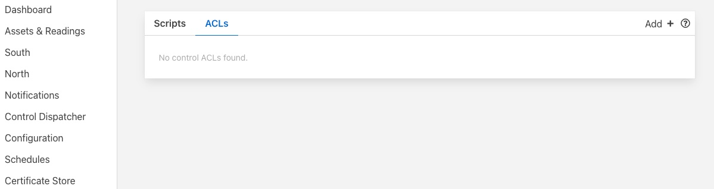
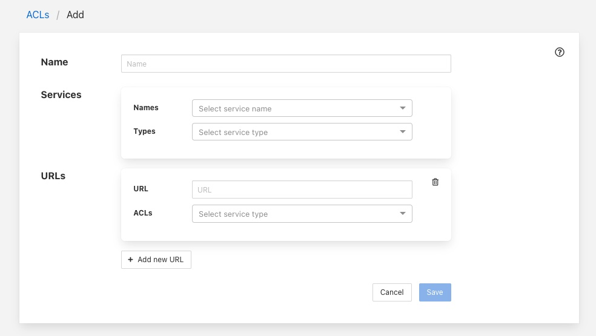
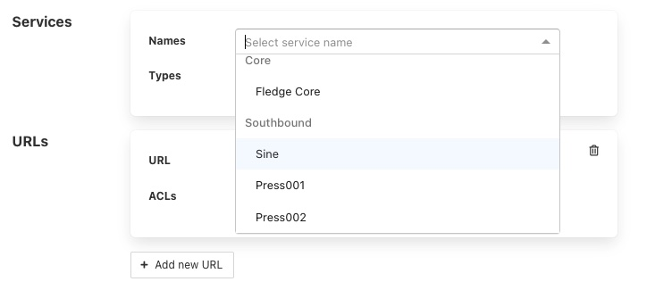
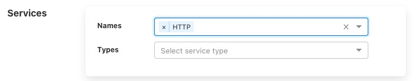
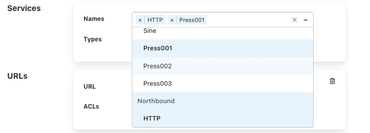
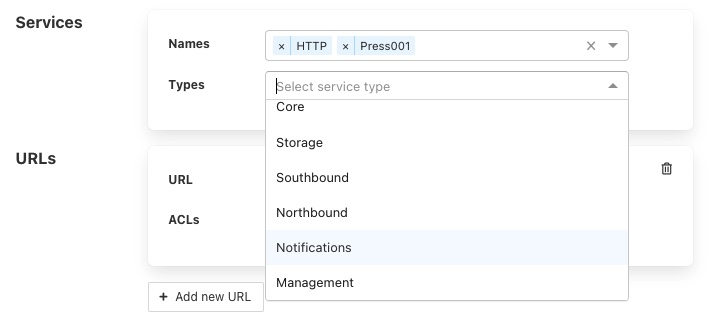
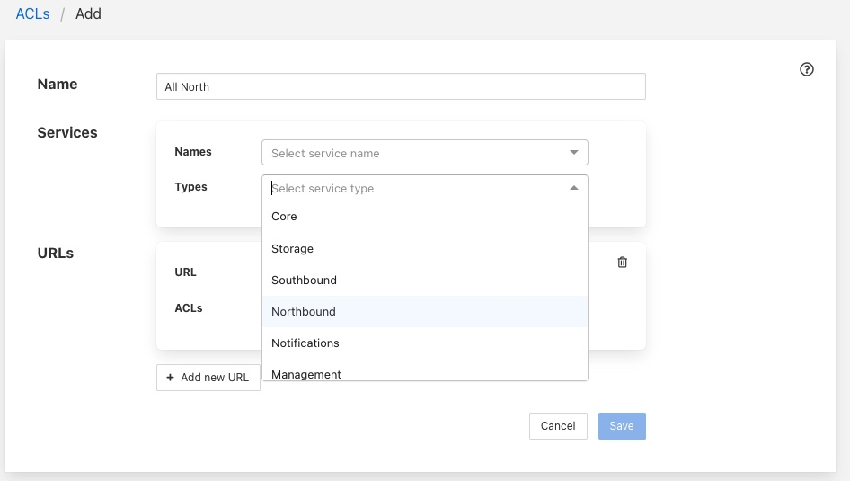
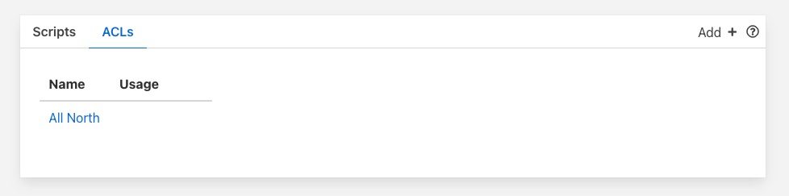
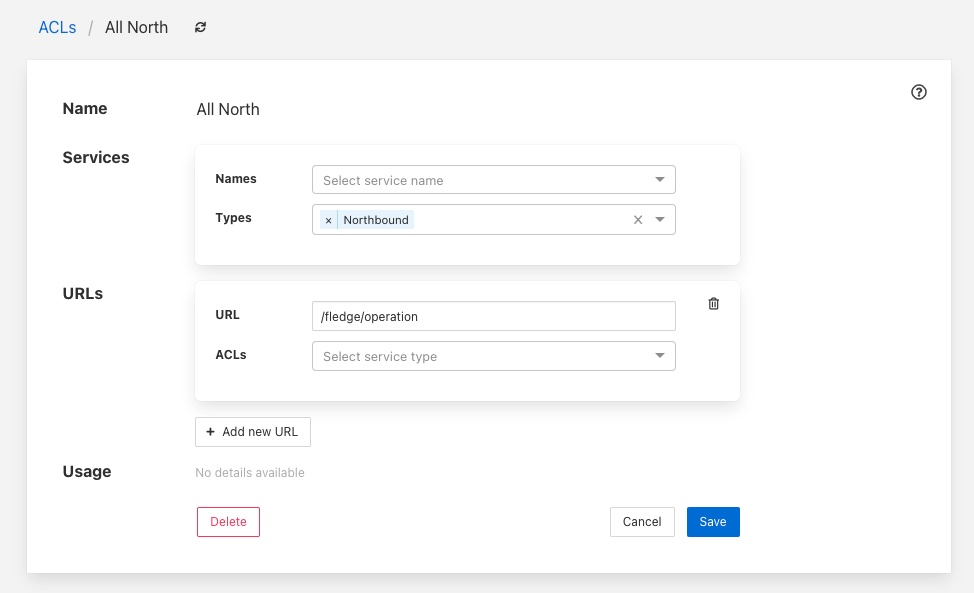

.. Images

Access Control Lists
--------------------

Control features within Fledge have the ability to add access control to every stage of the control process. Access control lists are used to limit which services have access to specific south services or scripts within the Fledge system.

Graphical Interface
~~~~~~~~~~~~~~~~~~~

A graphical interfaces is available to allow the creation and management of the access control lists used within the Fledge system. This is available within the *Control Dispatcher* menu item of the Fledge graphical interface.

+---------+
| |ACL_1| |
+---------+

Adding An ACL
#############

Click on the *Add* button in the top right corner of the ACL screen, the following screen will then be displayed.

+---------+
| |ACL_2| |
+---------+

You can enter a name for your access control list in the *Name* item on the screen. You should give each of your ACLs a unique name, this may be anything you like, but should ideally be descriptive or memorable as this is the name you will use when associating the ACL with services and scripts.

The *Services* section is use to define a set of services that this ACL is allowing access for. You may select services either by name or by service type. Multiple services may be granted access by a single ACL.

+---------+
| |ACL_3| |
+---------+

To add a named service to the ACL select the names drop down list and select the service name from those displayed. The display will change to show the service that you added to the ACL.

+---------+
| |ACL_4| |
+---------+

More names may be added to the ACL by selecting the drop down again.

+---------+
| |ACL_5| |
+---------+

If you wish to remove a named service from the list of services simply click on the small *x* to the left of the service name you wish to remove.

It is also possible to add a service type to an ACL. In this case all services of this type in the local Fledge instance will be given access via this ACL.

+---------+
| |ACL_6| |
+---------+

For example to create an ACL that allows all north services to have be granted access you would select *Northbound* in the *Services Types* drop down list.

+---------+
| |ACL_7| |
+---------+

The *URLs* section of the ACL is used to grant access to specific URLs accessing the system.

.. note::

  This is intended to allow control access via the REST API of the Fledge instance and is currently not implemented in Fledge. 

Once you are satisfied with the content of your access control list click on the *Save* button at the bottom of the page. You will be taken back to a display of the list of ACLs defined in your system.

+---------+
| |ACL_8| |
+---------+

Updating an ACL
###############

In the page that displays the set of ACLs in your system, click on the name of the ACL you wish to update, a page will then be displayed showing the current contents of the ACL.

+---------+
| |ACL_9| |
+---------+

To completely remove the ACL from the system click on the *Delete* button at the bottom of the page.

You may add and remove service names and types using the same procedure you used when adding the ACL.

Once you are happy with your updated ACL click on the *Save* button.
