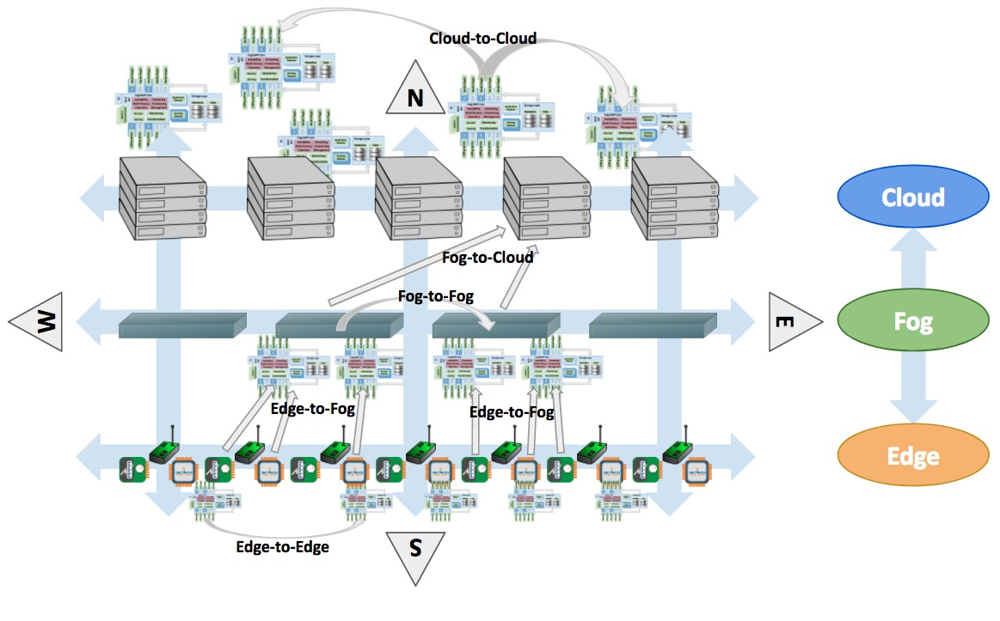

.. Fledge documentation master file, created by
   sphinx-quickstart on Fri Sep 22 02:34:49 2017.
   You can adapt this file completely to your liking, but it should at least
   contain the root `toctree` directive.

.. Images

.. Links

************
Introduction
************

What Is Fledge?
================

Fledge is an open source platform for the **Internet of Things** and an
essential component in **Fog Computing**.  It uses a modular
**microservices architecture** including sensor data collection, storage, processing and forwarding to historians, Enterprise systems and Cloud-based services. Fledge can run in highly available, stand alone, unattended environments that assume unreliable network connectivity.

By providing a modular and distributable framework under an open source Apache v2 license, Fledge is the best platform to manage the data infrastructure for IoT. The modules can be distributed in any layer - Edge, Fog and Cloud - and they act together to provide scalability, elasticity and resilience.

Fledge offers an "all-round" solution for data management, combining a bi-directional **Northbound/Southbound** data and metadata communication with a **Eastbound/Westbound** service and object distribution.

Fledge Positioning in an IoT and IIoT Infrastructure
-----------------------------------------------------

Fledge can be used in IoT and IIoT infrastructure at Edge and in the Fog.
It stretches bi-directionally South-North/North-South and it is distributed
East-West/West-East (see figure below).

|fledge_all_round|

.. note:: In this scenario we refer to “Cloud” as the layer above the Fog. “Fog” is where historians, gateways and middle servers coexist. In practice, the Cloud may also represent internal Enterprise systems, concentrated in regional or global corporate data centers, where larger historians, Big Data and analytical systems reside.

In practical terms, this means that:

- Intra-layer communication and data exchange:

  - At the **Edge**, microservices are installed on devices, sensors and actuators.
  - In the **Fog**, data is collected and aggregated in gateways and regional servers.
  - In the **Cloud**, data is distributed and analysed on multiple servers, such as Big Data Systems and Data Historians.

- Inter-layer communication and data exchange:

  - From **Edge to Fog**, data is retrieved from multiple sensors and devices and it is aggregated on resilient and highly available middle servers and gateways, either in traditional Data Historians and in the new edge of Machine Learning systems.
  - From **Fog to Edge**, configuration information, metadata and other valuable data is transferred to sensors and devices.
  - From **Fog to Cloud**, the data collected and optionally transformed is transferred to more powerful distributed Cloud and Enterprise systems.
  - From **Cloud to Fog**, results of complex analysis and other valuable information are sent to the designated gateways and middle servers that will interact with the Edge.

- Intra-layer service distribution:

  - A microservice architecture based on secure communication allows lightweight service distribution and information exchange among **Edge to Edge** devices.
  - Fledge provides high availability, scalability and data distribution among **Fog-to-Fog** systems. Due to its portability and modularity, Fledge can be installed on a large number of intermediate servers and gateways, as application instances, appliances, containers or virtualized environments.
  - **Cloud to Cloud Fledge server** capabilities provide scalability and elasticity in data storage, retrieval and analytics. The data collected at the Edge and Fog, also combined with external data, can be distributed to multiple systems within a Data Center and replicated to multiple Data Centers to guarantee local and faster access.

All these operations are **scheduled, automated** and **executed securely, unattended** and in a **transactional** fashion (i.e. the system can always revert to a previous state in case of failures or unexpected events).

Fledge Features
================

In a nutshell, these are main features of Fledge:

- Transactional, always on, server platform designed to work unattended and with zero maintenance.
- Microservice architecture with secured inter-communication:

  - Core System
  - Storage Layer
  - South side, sensors and device communication
  - North side, Cloud and Enterprise communication
  - Application Modules, internal application logic

- Pluggable modules for:

  - South side: multiple, data and metadata bi-directional communication
  - North side: multiple, data and metadata bi-directional communication
  - East/West side: IN/OUT Communicator with external applications
  - Plus:

    - Data and communication authentication
    - Data and status monitoring and alerting
    - Data transformation
    - Data storage and retrieval

- Small memory and processing footprint. Fledge can be installed and executed on inexpensive Edge devices; microservices can be distributed on sensors and actuator boards.
- Resilient and optionally highly available.
- Discoverable and cluster-based.
- Based on APIs (RESTful and non-RESTful) to communicate with sensors and other devices, to interact with user applications, to manage the platform and to be integrated with a Cloud or Data Center-based data infrastructure.
- Hardened with default secure communication that can be optionally relaxed.
