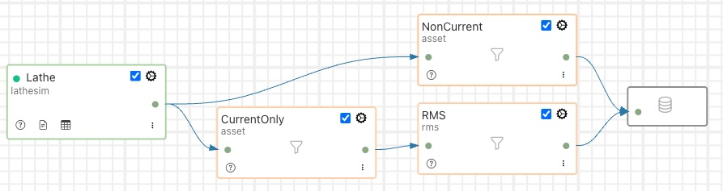

..

.. Images
.. |pipelines| image:: images/pipelines.png
.. |logview_1| image:: images/logview_1.png
.. |logview_2| image:: images/logview_2.png
.. |view_graph| image:: images/view_graph.jpg
.. |view_spreadsheet| image:: images/view_spreadsheet.jpg

.. Links
.. |python35| raw:: html

   <a href="plugins/fledge-filter-python35/index.html">fledge-filter-python35</a>

.. |assetFilter| raw:: html

   <a href="plugins/fledge-filter-asset/index.html">asset filter</a>

.. |OMFhints| raw:: html

   <a href="plugins/fledge-filter-omfhint/index.html">OMF Hints</a>

.. |OMF| raw:: html

   <a href="plugins/fledge-north-OMF/index.html">OMF</a>

Developing Data Pipelines
=========================

Fledge provides a system of data pipelines that allows data to flow from its point of ingest into the Fledge instance, the south plugin, to the storage layer in which it is buffered. The stages along this pipeline are Fledge processing filters, output of one filter becomes the input of the next. Fledge also supports pipelines on the egress as data flows from the storage layer to the north plugins and onward to the systems integrated upstream of the Fledge instance.

Operations in the south service are performed on the data from a single source, whilst operations in the north are performed on data going to a single destination. The filter pipeline in the north will have the data from sources flowing through the pipeline, this data will form a mixed stream that will contain all the data in date/time order.

+-------------+
| |pipelines| |
+-------------+

Best Practices
--------------

It is possible with Fledge to support multiple data pipelines within a single Fledge instance, however if you have a well established Fledge instance with critical pipelines running on that instance it is perhaps not always the best practice to then develop a new, experimental pipeline on that same Fledge instance.

Looking first at south plugins; one reason for this is that data that enters the Fledge instance via your new pipeline will be sent to the storage system and then onward to the north destinations mixed with the data from other pipelines on your system. If your new pipeline is incorrect or generating poor data you are then left in a situation whereby that data has been sent to your existing upstream systems. 

If it is unavoidable to use the same instance there are techniques that can be used to reduce the risk; namely to use an |assetFilter| to block data from your new south pipeline entering your existing north pipelines and then being sent to your upstream systems. To do this you merely insert a filter at the start of each of your existing north pipelines and set it to exclude the named assets that will be ingested by your new, experimental pipeline. This will allow the data from the existing south service to still flow to the upstream systems, but prevent your new data from streaming out to these systems.

There are still risks associated with this approach, namely that the new service may produce assets of a different name to those you expect or may produce more assets that you expect. Data is still also sent to the notification service from your new pipeline, which may impact that service, although it is less likely than sending incorrect or unwanted data north. There is also the limitation that your new data will be discarded from the buffer and can not then be sent to the existing north pipelines if you subsequently decide the data is good. Data with your new asset names, from your new pipeline, will only be sent once you remove the |assetFilter| from those pipelines in the north that send data to your upstream systems.

Developing new north pipelines is less risky, as the data that comes from the storage service and is destined for your new pipeline to upstream systems is effectively duplicated as it leaves the storage system. The main risk is that this new service will count as if the data has been sent up stream as far as the storage system is concerned and may make your data eligible for operation by the purge system sooner than would otherwise be the case. If you wish to prevent this you can update the purge configuration to insist the data is sent on all north channels before being considered sent for the purposes of the purge system. In most circumstances this is a precaution that can be ignored, however if you have configured your Fledge system for aggressive purging of data you may wish to consider this.

Incremental Development
~~~~~~~~~~~~~~~~~~~~~~~

The Fledge pipeline mechanism is designed for and lends itself to a modular development of the data processing requirement of your application. The pipeline is built from a collection of small, targeted filters that each perform a small, incremental process on the data. When building your pipelines, especially when using the filters that allow the application of scripts to the data, you should consider this approach and not build existing functionality that can be imported by applying an existing filter to the pipeline. Rather use that existing filter and add more steps to your pipeline, the Fledge environment is designed to provide minimal overhead when combining filters into a pipeline. Also the pipeline builder can make use of well used and tested filters, thus reducing the overheads to develop and test new functionality that is not needed.

This piecemeal approach can also be adopted in the process of building the pipeline, especially if you use the |assetFilter| to block data from progressing further through the Fledge system once it has been buffered in the storage layer. Simply add your south service, bring the service up and observe the data that is buffered from the service. You can now add another filter to the pipeline and observe how this alters the data that is being buffered. Since you have a block on the data flowing further within your system, this data will disappear as part of the normal purging process and will not end up in upstream systems to the north of Fledge.

If you are developing on a standalone Fledge instance, with no existing north services, and you still set your experimental data to disappear, this can be achieved by use of the purge process. Simply configure the purge process to frequently purge data and set the process to purge unsent data. This will mean that the data will remain in the buffer for you to examine for a short time before it is purged from that buffer. Simply adjust the purge interval to allow you enough time to view the data in the buffer. Provided all the experimental data has been purged before you make your system go live, you will not be troubled with your experimental data being sent upstream.

Remember of course to reconfigure the purge process to be more inline with the duration you wish to keep the data for and to turn off the purging of unsent data unless you are willing to loose data that can not be sent for a period of time greater than the purge interval.

Configuring a more aggressive purge system, with the purging of unsent data, is probably not something you would wish to do on an existing system with live data pipelines and should not be used as a technique for developing new pipelines on such a system.

An alternative approach for removing data from the system is to enable the *Developer Features* in the Fledge User Interface. This can be done by selecting the *Settings* page in the left hand menu and clicking the option on the bottom of that screen.

+----------------------+
| |developer_features| |
+----------------------+

Amongst the extra features introduced by selecting *Developer Features* will be the ability to manually purge data from the Fledge data store. This on-demand purging can be either applied to a single asset or to all assets within the data store. The manual purge operations are accessed via the *Assets & Readings* item in the Fledge menu. A number of new icons will appear when the *Developer Features* are turned on, one per asset and one that impacts all assets. 

+----------------+
| |manual_purge| |
+----------------+

These icons are resemble erasers and are located in each row of the assets and also in the top right corner next to the help icon. Clicking on the eraser icon in each of the rows will purge the data for just that asset, leaving other assets untouched. Clicking on the icon in the top right corner will purge all the assets currently in the data store.

In both cases a confirmation dialog will be displayed to ensure against accidental use. If you choose to proceed the selected data within the Fledge buffer, either all or a specific asset, will be erased. There is no way to undo this operation or to retrieve the data once it has been purged.

Another consequence that may occur when developing new pipelines is that assets are created during the development process which are not required in the finished pipeline. The asset however remains associated with the service and the asset name and count of number of ingested readings will be displayed in the *South Services* page on the user interface.

+----------------+
| |deprecated_1| |
+----------------+

It is possible to deprecate the relationship between the service and the asset name using the developer features of the user interface. To do this you must first enable *Developer Features* in the user interface settings page. Now when you view the *South Services* page you will see an eraser icon next to each asset listed for a service.

+----------------+
| |deprecated_2| |
+----------------+

If you click on this icon you will be prompted to deprecate the relationship between the asset and the service. If you select *Yes* the relationship will be severed and the asset will no longer appear next to the service.

Deprecating the relationship will not remove the statistics for the asset, it will merely remove the relationship with the service and hence it will not be displayed against the service.

If an asset relationship is deprecated for an asset that is still in use, it will automatically be reinstated the next time a reading is ingested for that asset. Since the statistics were not deleted when the relationship was deprecated the previous readings will still in included in the statistics when the relationship is restored.

These *Developer Features* are designed to be of use when developing pipelines within Fledge, the functionality is not something that should be used in normal operation and the developer features should be turned off when pipelines are not being developed.

Sacrificial North System
########################

Developing north pipelines in a piecemeal fashion can be more of an issue as you are unlikely to want to put poorly formatted data into your upstream systems. One approach to this is to have a sacrificial north system of some type that you can use to develop the pipeline and determine if you are performing the process you need to on that pipeline. This way it is unimportant if that system becomes polluted with data that is not in the form you require it. Ideally you would use a system of the same type to do your development and then switch to the production system when you are satisfied your pipeline is correct.

If this is not possible for some reason a second choice solution would be to use another Fledge instance as your test north system. Rather than configure the north plugin you ultimately wish to use you would install the north HTTP plugin and connect this to a second Fledge instance running an HTTP plugin. Your data would then be sent to your new Fledge instance where you can then examine the data to see what was sent by the first Fledge instance. You then build up your north pipeline on that first Fledge instance in the same way you did with your south pipeline. Once satisfied you will need to carefully recreate your north pipeline against the correct north plugin and the you may remove your experimental north pipeline and destroy your sacrificial Fledge instance that you used to buffer and view the data.

OMF Specific Considerations
~~~~~~~~~~~~~~~~~~~~~~~~~~~

Certain north plugins present specific problems to the incremental development approach as changing the format of data that is sent to them can cause them internal issues. The |OMF| plugin that is used to send data to the AVEVA PI Server is one such plugin.

The problem with the PI Server is that it is designed to store data in fixed formats, therefore having data that is not of a consistent type, i.e. made up of the set of attributes, can cause issues. In a PI server each new data type becomes a new tag, this is not a problem if you are happy to use tag naming that is flexible. However if you require that you used fixed name tags within the PI Server, using the |OMFhints| filter, this can be an issue for incremental development of your pipeline. Changing the properties of the tag will result in a new name being required for the tag.

The simplest approach is to do all the initial development without the fixed name and then do the name mapping as the final step in developing the pipeline. Although not ideal it gives a relatively simple approach to resolving the problem.

Should you subsequently need to reuse the tag names with different types it becomes necessary to clear the type definitions from the PI Server by removing the element templates, the elements themselves and the cache. The PI Web API will then need to be restarted and the Fledge north plugin removed and recreated.

Examining Data
~~~~~~~~~~~~~~

The easiest way to examine your data you have ingested via your new south pipeline is by use of the Fledge GUI to examine the data that currently resides within the buffer. You can view the data either via the graph feature of the Assets & Readings page, which will show the time series data.

+--------------+
| |view_graph| |
+--------------+

If you have data that is not timeseries by nature, such as string, you may use the tabular displayed to show you non timeseries data, images if there are any or the download of the data to a spreadsheet view. This later view will not contain any image data in the readings.

+--------------------+
| |view_spreadsheet| |
+--------------------+

.. _AccessingLogs:

Examining Logs
~~~~~~~~~~~~~~

It is important to view the logs for your service when building a pipeline, this is due to the Fledge goal that Fledge instances should run as unattended services and hence any errors or warnings generated are written to logs rather than to an interactive user session. The Fledge user interface does however provide a number of mechanisms for viewing the log data and filtering it to particular sources. You may view the log from the “System” item in the Log menu and then filter the source to your particular south or north service. 

+-------------+
| |logview_1| |
+-------------+

Alternatively if you display the north or south configuration page for your service you will find an icon in the bottom left of the screen that looks like a page of text with the corner folded over. Simply click on this icon and the log screen will be displayed and automatically filtered to view just the logs from the service whose configuration you were previously editing.

+-------------+
| |logview_2| |
+-------------+

Log are displayed with the most recent entry first, with older entries shown as you move down the page. You may move to the next page to view older log entries. It is also possible to view different log severity; fatal, error, warning, info and debug. By default a service will not write info and debug messages to the log, it is possible to turn these levels on via the advanced configuration options of the service. This will then cause the log entries to be written, but before you can view them you must set the appropriate level of severity filtering and the user interface will filter out information and debug message by default.

It is important to turn the logging level back down to warning and above messages once you have finished your debugging session and failure to do this will cause excessive log entries to be written to the system log file.

Also note that the logs are written to the logging subsystem of the underlying Linux version, either syslog or the messages mechanism depending upon your Linux distribution. This means that these log files will be automatically rotated by the operating system mechanisms. This means the system will not, under normal circumstances, fill the storage subsystem. Older log files will be kept for a short time, but will be removed automatically after a few days. This should be borne in mind if you have information in the log that you wish to keep. Also the user interface will only allow you to view data in the most recent log file.

It is also possible to configure the syslog mechanism to write log files to non-standard files or remote machines. The Fledge mechanisms for viewing the system logs does require that the standard names for log files are used.

Enabling and Disabling Filters
~~~~~~~~~~~~~~~~~~~~~~~~~~~~~~

It should be noted that each filter has an individual enable control, this has the advantage that is is easy to temporarily remove a filter from a pipeline during the development stage. However this does have the downside that it is easy to forget to enable a filter in the pipeline or accidentally add a filter in a disabled state.

Scripting Plugins
~~~~~~~~~~~~~~~~~

Where there is not an existing plugin that does what is required, either in a filter or in south plugins where the data payload of a protocol is highly variable, such as generic REST or MQTT plugins, Fledge offers the option of using a scripting language in order to extend the off the shelf plugin set.

This scripting is done via the Python scripting language, both Python 3 and Python 2 are supported by Fledge, however it is recommended that the Python 3 variant, |python35| be used by preference. The Python support allows external libraries to be used to extend the basic functionality of Python, however it should be noted currently that the Python libraries have to be manually installed on the Fledge host machine.

Scripting Guidelines
####################

The user has the full range of Python functionality available to them within the script code they provides to this filter, however caution should be exercised as it is possible to adversely impact the functionality and performance of the Fledge system by misusing Python features to the detriment of Fledge’s own features.

The general principles behind all Fledge filters apply to the scripts included in these filters;

  - Do not duplicate existing functionality provided by existing filters.

  - Keep the operations small and focused. It is better to have multiple filters each with a specific purpose than to create large, complex Python scripts.

  - Do not buffer large quantities of data, this will effect the footprint of the service and also slow the data pipeline.

Importing Python Packages
#########################

The user is free to import whatever packages they wish in a Python script, this includes the likes of the numpy packages and other that are limited to a single instance within a Python interpreter.

Do not import packages that you do not use or are not required. This adds an extra overhead to the filter and can impact the performance of Fledge. Only import packages you actually need.

Python does not provide a mechanism to remove a package that has previously been imported, therefore if you import a package in your script and then update your script to no longer import the package, the package will still be in memory from the previous import. This is because we reload updated scripts without closing down as restarting the Python interpreter. This is part of the sharing of the interpreter that is needed in order to allow packages such as numpy and scipy to be used. This can lead to misleading behavior as when the service gets restarted the package will not be loaded and the script may break because it makes use of the package still.

If you remove a package import form your script and you want to be completely satisfied that the script will still run without it, then you must restart the service in which you are using the plugin. This can be done by disabling and then re-enabling the service.

One of the *Developer Features* of the Fledge user interface allows the management of the installed Python Packages from within the user interface. This features is turned on via the *Developer features* toggle in the *Settings* page and will add a new menu item called *Developer*. Navigating to this page will give the the option of managing packages

+---------+
| |pip_1| |
+---------+

Clicking on *Manage packages* link will display the current set of Python packages that are installed on the machine.

+---------+
| |pip_2| |
+---------+

To add a new package click on the *Add +* link in the top right corner. This will display a screen that allows you to enter details of a Python package to install.

+---------+
| |pip_3| |
+---------+

Enter package name and an optional package version and then click on the *Install* button to install a new package via *pip3*.

Use of Global Variables
#######################

You may use global variables within your script and these globals will retain their value between invocations of the of processing function. You may use global variables as a method to keep information between executions and perform such operations as trend analysis based on data seen in previous calls to the filter function.

All Python code within a single service shares the same Python interpreter and hence they also share the same set of global variables. This means you must be careful as to how you name global variables and also if you need to have multiple instances of the same filter in a single pipeline you must be aware that the global variables will be shared between them. If your filter uses global variables it is normally not recommended to have multiple instances of them in the same pipeline.

It is tempting to use this sharing of global variables as a method to share information between filters, this is not recommended as should not be used. There are several reasons for this

  - It provides data coupling between filters, each filter should be independent of each other filter.

  - One of the filters sharing global variables may be disabled by the user with unexpected consequences.

  - Filter order may be changed, resulting in data that is expected by a later filter in the chain not being available.

  - Intervening filters may add or remove readings resulting in the data in the global variables not referring to the same reading, or set of readings that it was intended to reference.

If you wish one filter to pass data onto a later filter in the pipeline this is best done by adding data to the reading, as an extra data point. This data point can then be removed by the later filter. An example of this is the way Fledge adds |OMFhints| to readings that are processed and removed by the |OMF| north plugin.

For example let us assume we have calculated some value delta that we wish to pass to a later filter, we can add this as a data point to our reading which we will call *_hintDelta*.

.. code-block:: Python

  def myPython(readings):
    for elem in list(readings):
        reading = elem['readings']
        ...
        reading['_hintDelta'] = delta
        ...
    return readings

This is far better than using a global as it is attached to the reading to which it refers and will remain attached to that reading until it is removed. It also means that it is independent of the number of readings that are processed per call, and resilient to readings being added or removed from the stream.

The name chosen for this data point in the example above has no significance, however it is good practice to choose a name that is unlikely to occur in the data normally and portrays the usage or meaning of the data.

File IO Operations
##################

It is possible to make use of file operations within a Python filter function, however it is not recommended for production use for the following reasons;

  - Pipelines may be moved to other hosts where files may not be accessible.

  - Permissions may change dependent upon how Fledge systems are deployed in the various different scenarios.

  - Edge devices may also not have large, high performance storage available, resulting in performance issues for Fledge or failure due to lack of space.

  - Fledge is designed to be managed solely via the Fledge API and applications that use the API. There is no facility within that API to manage arbitrary files within the filesystem.

It is common to make use of files during development of a script to write information to in order to aid development and debugging, however this should be removed, along with associated imports of packages required to perform the file IO, when a filter is put into production.

Threads within Python
#####################

It is tempting to use threads within Python to perform background activity or to allow processing of data sets in parallel, however there is an issue with threading in Python, the Python Global Interpreter Lock or GIL. The GIL prevents two Python statements from being executed within the same interpreter by two threads simultaneously. Because we use a single interpreter for all Python code running in each service within Fledge, if a Python thread is created that performs CPU intensive work within it, we block all other Python code from running within that Fledge service.

We therefore avoid using Python threads within Fledge as a means to run CPU intensive tasks, only using Python threads to perform IO intensive tasks, using the asyncio mechanism of Python 3.5.3 or later. In older versions of Fledge we used multiple interpreters, one per filter, in order to workaround this issue, however that had the side effect that a number of popular Python packages, such as numpy, pandas and scipy, could not be used as they can not support multiple interpreters within the same address space. It was decided that the need to use these packages was greater than the need to support multiple interpreters and hence we have a single interpreter per service in order to allow the use of these packages.

Interaction with External Systems
#################################

Interaction with external systems, using network connections or any form of blocking communication should be avoided in a filter. Any blocking operation will cause data to be blocked in the pipeline and risks either large queues of data accumulating in the case of asynchronous south plugins or data begin missed in the case of polled plugins.

Scripting Errors
################

If an error occurs in the plugin or Python script, including script coding errors and Python exception, details will be logged to the error log and data will not flow through the pipeline to the next filter or into the storage service.

Warnings raised will also be logged to the error log but will not cause data to cease flowing through the pipeline.

See :ref:`AccessingLogs`: for details have how to access the system logs.

Debugging & Tracing Pipelines
-----------------------------

Fledge has a feature that allows the debugging of pipelines in south and north services. It provides a mechanism to view the data as it flows through the pipeline.

The debugger is designed to show the data as it traverses the pipeline within the service. Users may:

   - Show the data at each stage in the pipeline.

   - Configure the number of readings to store at each stage in the pipeline.

   - Pause the ingest into the pipeline.

   - Suspend the output of the pipeline.

   - Ingest a number of readings into the paused pipeline.

   - Replay the currently buffered readings for a pipeline.

   - Resume flow into and out of the pipeline.

The *replay* operation is useful when manipulating the configuration of the pipeline components. The user may change a filter configuration and replay the saved readings to see the impact of the configuration change. This may be repeated multiple times until the user is satisfied with the result of the filter configuration.

Command Line Interface
~~~~~~~~~~~~~~~~~~~~~~

A command line interface is provided to access the pipeline debugger. The interface can be started by running the *fledge* script that is used to start, stop and monitor Fledge or by calling the *scripts/debug/debug* script directly.

.. note::

   Due to the sensitive nature of pipeline debugging only user with edit permissions may use this interface. Additionally authentication must be enabled on the Fledge instance for this interface to work.

Starting the Debugger
#####################

The *debug* command should be given the name of a south or north service to debug.

.. code-block:: bash

   $ scripts/fledge -u admin debug Lathe
   Debug: Lathe$ 

Upon starting a new prompt will be displayed, if the service is a valid service to be debugged and is running. The user may now enter the various debug commands at this prompt. To complete the debugging session type *exit* or Control-D.

To see a list of available commands enter the command *commands*

.. code-block:: bash

   Debug: Lathe$ commands
   attach:              Attach the pipeline debugger
   buffer:              Return the contents of the buffers at every pipeline element
   detach:              Detach the debugger from the pipeline
   isolate:             Isolate the pipeline from the destination
   replay:              Replay the buffered data through the pipeline
   resumeIngest:        Resume the flow of data into the pipeline
   setBuffer:           Set the number of readings to hold in each buffer, passing an integer argument
   state:               Return the state of the debugger
   step:                Allow readings to flow into the pipeline. Passed an optional number of readings to ingest; default to 1 if omitted
   store:               Allow data to flow out of the pipeline into storage
   suspendIngest:       Suspend the ingestion of data into the pipeline
   Debug: Lathe$ 

Attach
######

The first command to issue is usually the *attach* command. It attaches the debugger session to the service and begins the process of collecting data at each node within the pipeline. Until the debugger is attached it is not possible to view the data in the pipeline.

.. code-block:: bash

   Debug: Lathe$ attach
   {
     "status": "ok"
   }
   Debug: Lathe$

The data returned from the *attach* command is the status of running that command encoded within a JSON document.

At this point the debugger is attached and collecting data at each node within the pipeline. By default only one reading is retained at each point in the pipeline; this is the last reading seen at that point in the pipeline.

Buffer
######

The buffer command will display the data at each node in the pipeline. In the example pipeline used here there are several nodes, including a branch in the pipeline.

+-----------------+
| |LathePipeline| |
+-----------------+

The output of the Lathe simulator south plugin is split into two branches of the pipeline. An asset filter is used at the start of each branch to control which assets are sent down that branch of the pipeline. In this case the *latheCurrent* readings are sent down one branch and all other readings are sent down the other branch.

Running the *buffer* command will display the data recorded on the input of each node in the pipeline.

.. code-block:: bash

   Debug: Lathe$ buffer
   {
     "data": [
       {
         "name": "Branch",
         "readings": [
           {
             "asset_code": "latheIR",
             "user_ts": "2025-03-31 16:23:10.008024+00:00",
             "ts": "2025-03-31 16:23:10.008024+00:00",
             "reading": {
               "gearbox": 27.93525,
               "motor": 29.6282,
               "headstock": 25.51,
               "tailstock": 20.52,
               "tool": 24.0905
             }
           }
         ]
       },
       [
         {
           "name": "CurrentOnly",
           "readings": [
             {
               "asset_code": "latheIR",
               "user_ts": "2025-03-31 16:23:10.008024+00:00",
               "ts": "2025-03-31 16:23:10.008024+00:00",
               "reading": {
                 "gearbox": 27.93525,
                 "motor": 29.6282,
                 "headstock": 25.51,
                 "tailstock": 20.52,
                 "tool": 24.0905
               }
             }
           ]
         },
         {
           "name": "RMS",
           "readings": [
             {
               "asset_code": "latheCurrent",
               "user_ts": "2025-03-31 16:23:10.008018+00:00",
               "ts": "2025-03-31 16:23:10.008018+00:00",
               "reading": {
                 "current": 767
               }
             }
           ]
         },
         {
           "name": "Writer",
           "readings": [
             {
               "asset_code": "latheCurrent RMS",
               "user_ts": "2025-03-31 16:23:02.803881+00:00",
               "ts": "2025-03-31 16:23:02.803881+00:00",
               "reading": {
                 "current": 773.9413414465,
                 "currentpeak": 47,
                 "currentcrest": 0.0607281166
               }
             }
           ]
         }
       ],
       {
         "name": "NonCurrent",
         "readings": [
           {
             "asset_code": "latheIR",
             "user_ts": "2025-03-31 16:23:10.008024+00:00",
             "ts": "2025-03-31 16:23:10.008024+00:00",
             "reading": {
               "gearbox": 27.93525,
               "motor": 29.6282,
               "headstock": 25.51,
               "tailstock": 20.52,
               "tool": 24.0905
             }
           }
         ]
       },
       {
         "name": "Writer",
         "readings": [
           {
             "asset_code": "latheIR",
             "user_ts": "2025-03-31 16:23:10.008024+00:00",
             "ts": "2025-03-31 16:23:10.008024+00:00",
             "reading": {
               "gearbox": 27.93525,
               "motor": 29.6282,
               "headstock": 25.51,
               "tailstock": 20.52,
               "tool": 24.0905
             }
           }
         ]
       }
     ]
   }
   Debug: Lathe$

Data is displayed as a JSON document. Each object in the data represents a node in the pipeline. Each pipeline is enclosed in a JSON array. The *name* property of the object is the name of the filter into which the data is about to be passed. There are two reserved names: *Branch* and *Writer*.

The *Branch* nodes represents the data that is about to be branched and sent down each of the separate branches of the pipeline. In the case of this example we see the data that comes from the south plugin and is immediately split to each branch.

The *Writer* node represents where the data is about to be written to the storage service, since this is a south service we are debugging. If we were debugging a north service, the *Writer* node represents data written to the north plugin.

All other names represent a filter name in the pipeline and the readings are the data that is passed into the filter.

The example above shows a single reading at each node within the pipeline, this is the default number of readings that are buffered. The readings shown are always the must recent readings to be seen at that point within the pipeline. It is possible to define how many readings are to be buffered at each point in the pipeline using the *setBuffer* command.

setBuffer
#########

The *setBuffer* command is used to set the number of readings to be buffered at each point in the pipeline. The same number must be buffered at all nodes in the pipeline. It is not possible to buffer different numbers of readings at each node in the pipeline.

The *setBuffer* command is passed a number which is the number of readings to buffer. If omitted then the number of buffered readings will be set to 1.

.. code-block:: bash

   Debug: Lathe$ setBuffer 4
   {
     "status": "ok"
   }
   Debug: Lathe$ 

The returned JSON document shows the status of running the *setBuffer* command.

.. note::

   It is possible to enter large numbers to the *setBuffer* command, however it is not recommended as this will considerably increase the memory footprint of the service that is attached to the debugger.

After running the *setBuffer* command the next call to the *buffer* command will return up to the number of readings requested in the *setBuffer* command. It may take some time for the requested number to be buffered as it requires new data to be sent through the pipeline to fill those buffers.

Multiple buffers are returned as an array in each of the nodes of the pipeline. Below is a sample for the first few nodes of our pipeline.

.. code-block:: bash

   Debug: Lathe$ setBuffer 3
   {
     "status": "ok"
   }
   Debug: Lathe$ buffer
   {
     "data": [
       {
         "name": "Branch",
         "readings": [
           {
             "asset_code": "latheCurrent",
             "user_ts": "2025-04-01 08:18:42.262970+00:00",
             "ts": "2025-04-01 08:18:42.262970+00:00",
             "reading": {
               "current": 750
             }
           },
           {
             "asset_code": "latheIR",
             "user_ts": "2025-04-01 08:18:42.262975+00:00",
             "ts": "2025-04-01 08:18:42.262975+00:00",
             "reading": {
               "gearbox": 27.9788,
               "motor": 29.9785,
               "headstock": 23.65,
               "tailstock": 20.1666666667,
               "tool": 18.73
             }
           },
           {
             "asset_code": "lathe",
             "user_ts": "2025-04-01 08:18:42.262955+00:00",
             "ts": "2025-04-01 08:18:42.262955+00:00",
             "reading": {
               "rpm": 349,
               "x": 0,
               "depth": 40,
               "state": "Spining Up"
             }
           }
         ]
       },
       [
         {
           "name": "CurrentOnly",
           "readings": [
             {
               "asset_code": "latheCurrent",
               "user_ts": "2025-04-01 08:18:42.262970+00:00",
               "ts": "2025-04-01 08:18:42.262970+00:00",
               "reading": {
                 "current": 750
               }
             },
             {
               "asset_code": "latheIR",
               "user_ts": "2025-04-01 08:18:42.262975+00:00",
               "ts": "2025-04-01 08:18:42.262975+00:00",
               "reading": {
                 "gearbox": 27.9788,
                 "motor": 29.9785,
                 "headstock": 23.65,
                 "tailstock": 20.1666666667,
                 "tool": 18.73
               }
             },
             {
               "asset_code": "lathe",
               "user_ts": "2025-04-01 08:18:42.262955+00:00",
               "ts": "2025-04-01 08:18:42.262955+00:00",
               "reading": {
                 "rpm": 349,
                 "x": 0,
                 "depth": 40,
                 "state": "Spining Up"
               }
             }
           ]
         },
     ...

The example has been truncated at the second node merely to save space in the documentation.

suspendIngest
#############

When the debugger is attached to a service it does not stop the service from ingesting and processing new data; it merely adds a way to view the latest data as it traverse the pipeline. In situation where the user wishes to troubleshoot the operation of the pipeline it may be desirable to suspend the service from ingesting new data. This allows the data to be examined, configuration to be modified and data resent through the pipeline to observe the impact of configuration changes. To stop new data ingesting into the pipeline use the *suspendIngest* command.

.. code-block:: bash

   Debug: Lathe$ suspendIngest
   {
     "status": "ok"
   }
   Debug: Lathe$

No new data will be read into the service, either by calling the poll entry point for a south service or fetching data from storage for a north service.

.. note::

   If the south plugin is an asynchronous plugin, any new data that the plugin tries to send into the pipeline will be discarded whilst the pipeline ingest is suspended.

If troubleshooting a pipeline it is also useful to stop the pipeline send data out to the storage layer, in the case of a south plugin, or upstream to the destination system if a north plugin. This can be down using the *isolate* command.

isolate
#######

Stops the pipeline emitting data into the storage layer, if a south service is attached to the debugger, or to the upstream system if the attached service is a north service.

.. code-block:: bash

   Debug: Lathe$ isolate
   {
     "status": "ok"
   }
   Debug: Lathe$ 

state
#####

It is always possible to see the state of the debugger and the pipeline it is attached to by using the *state* command.

.. code-block:: bash

   Debug: Lathe$ state
   {
     "debugger": "Attached",
     "ingress": "Suspended",
     "egress": "Isolated"
   }
   Debug: Lathe$

step
####

When a pipeline has its ingest suspended it can be useful to allow one or more new readings to be ingested to see the impact of any configuration changes on new data. This can be done using the *step* command. It can be passed an optional number of readings to ingest. If no number is passed then a single reading will be ingested.

.. code-block:: bash

   Debug: Lathe$ step
   {
     "status": "ok"
   }
   Debug: Lathe$ step 4
   {
     "status": "ok"
   }
   Debug: Lathe$

These new readings will then be ingested into the pipeline. The buffers will be updated with the new data and the results buffered at each node within the pipeline.

replay
######

The *replay* command is useful when the user has an isolated pipeline and they wish to see the impact of updating the configuration of one or more of the filters in the pipeline on the data that flows through the pipeline. Running the *replay* command will resend the data currently in the buffer at the first node in the pipeline through the pipeline again, updating the data in all other nodes in the pipeline.

.. code-block:: bash

   Debug: Lathe$ replay
   {
     "status": "ok"
   }
   Debug: Lathe$

.. note::

   The *replay* command should only be used if a pipeline has had ingest suspended. It is also probably sensible to isolate the pipeline to prevent readings with the same timestamp as readings already sent upstream to be sent again.

store
#####

The *store* command is used to resume the storage of data that comes from the pipeline, in a south service, or to send the data upstream in the case of a north service. It effectively reverses the effect of the *isolate* command.

resumeIngest
############

The *resumeIngest* command will restart the ingest of data into the pipeline, revoking the impact of running the *suspendIngest* command.

detach
######

The *detach* command should be run at the end of the debugging session to detach the debugger. Detaching the debugger will automatically resume the ingest and egress of the pipeline and return the pipeline to normal functioning.
