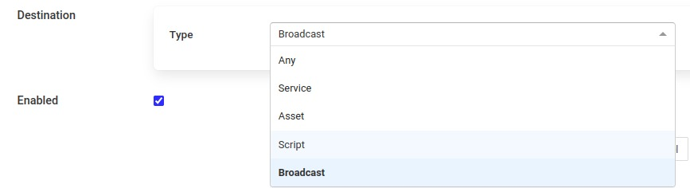

.. Images
.. |setpoint_1| image:: images/setpoint_1.jpg
.. |setpoint_2| image:: images/setpoint_2.jpg
.. |setpoint_3| image:: images/setpoint_3.jpg

.. |sine_out5| image:: images/sine_out5.jpg

.. |end_to_end| image:: images/EndToEnd.jpg

.. |north_map2| image:: images/north_map2.jpg
.. |north_map3| image:: images/north_map3.jpg
.. |north_map4| image:: images/north_map4.jpg
.. |opcua_server| image:: images/opcua_server.jpg

.. |pipeline_filter_add| image:: images/control/pipeline_filter_add.jpg

.. |control_api_7| image:: images/control/control_api_7.jpg

.. Links
.. |ExpressionFilter| raw:: html

   <a href="plugins/fledge-filter-expression/index.html">expression filter</a>

.. |DeltaFilter| raw:: html

   <a href="plugins/fledge-filter-delta/index.html">delta filter</a>

************************
Fledge Control Features
************************

Fledge supports facilities that allows control of devices via the south service and plugins. This control in known as *set point control* as it is not intended for real time critical control of devices but rather to modify the behavior of a device based on one of many different information flows. The latency involved in these control operations is highly dependent on the control path itself and also the scheduling limitations of the underlying operating system. Hence the caveat that the control functions are not real time or guaranteed to be actioned within a specified time window. This does not mean however that they can not be used for non-critical closed loop control, however we would not advise the use of this functionality in safety critical situations.

Control Functions
=================

The are two type of control function supported

  - Modify the value in a device via the south service and plugin.

  - Request the device to perform an action.

Set Point
---------

Setting the value within the device is known as a set point action in Fledge. This can be as simple as setting a speed variable within a controller for a fan or it may be more complete. Typically a south plugin would provide a set of values that can be manipulated, giving each a symbolic name that would be available for a set point command. The exact nature of these is defined by the south plugin.

Operation
---------

Operations, as the name implies provides a means for the south service to request a device to perform an operation, such as reset or re-calibrate. The names of these operations and any arguments that can be given are defined within the south plugin and are specific to that south plugin.

Control Paths
=============

Set point control may be invoked via a number of paths with Fledge

  - As the result of a notification within Fledge itself.

  - As a result of a request via the Fledge public REST API.

  - As a result of a control message flowing from a north side system into a north plugin and being routed onward to the south service.

The use of a notification in the Fledge instance itself provides the fastest response for an edge notification. All the processing for this is done on the edge by Fledge itself.

As with the data ingress and egress features of Fledge it is also possible to build filter pipelines in the control paths in order to alter the behavior and process the data in the control path. Pipelines in the control path as defined between the different end point of control operations and are defined such that the same pipeline can be utilized by multiple control paths. See :ref:`ControlPipelines`

Edge Based Control
------------------

Edge based control is the name we use for a class of control applications that take place solely within the Fledge instance at the edge. The data that is required for the control decision to be made is gathered in the Fledge instance, the logic to trigger the control action runs in the Fledge instance and the control action is taken within the Fledge instance. Typically this will involve one or more south plugins to gather the data required to make the control decision, possibly some filters to process that data, the notification engine to make the decision and one or more south services to deliver the control messages.

As an example of how edge based control might work lets consider the following case.

We have a machine tool that is being monitored by Fledge using the OPC/UA south plugin to read data from the machine tools controlling PLC. As part of that data we receive an asset which contains the temperature of the motor which is running the tool. We can assume this asset is called *MotorTemperature* and it contains a single data point called *temperature*. 

We also have a fan unit that is able to cool that motor which is controlled via a Modbus interface. The modbus contains one a coil that toggles the fan on and off and a register that controls the speed of the fan. We configure the *fledge-south-modbus* as a service called *MotorFan* with a control map that will map the coil and register to a pair of set points. 

.. code-block:: JSON

   {
       "values" : [
                      {
                          "name" : "run",
                          "coil" : 1
                      },
                      {
                          "name"     : "speed",
                          "register" : 1
                      }
                  ]
   }

+--------------+
| |setpoint_1| |
+--------------+

If the measured temperature of the motor going above 35 degrees centigrade we want to turn the fan on at 1200 RPM. We create a new notification to do this. The notification uses the *threshold* rule and triggers if the asset *MotorTemperature*, data point *temperature* is greater than 35.

+--------------+
| |setpoint_2| |
+--------------+

We select the *setpoint* delivery plugin from the list and configure it.

    +--------------+
    | |setpoint_3| |
    +--------------+

  - In *Service* we set the name of the service we are going to use to control the fan, in this case *MotorFan* 

  - In *Trigger Value* we set the control message we are going to send to the service. This will turn the fan on and set the speed to 1200RPM

  - In *Cleared Value* we set the control message we are going to send to turn off the fan when the value falls below 35 degrees.

The plugin is enabled and we go on to set the notification type to toggled, since we want to turn off the fan if the motor cools down, and set a retrigger time to prevent the fan switching on and off too quickly. The notification type and the retrigger time are important parameters for tuning the behavior of the control system and are discussed in more detail below.

If we required the fan to speed up at a higher temperature then this could be achieved with a second notification. In this case it would have a higher threshold value and would set the speed to a higher value in the trigger condition and set it back to 1200 in the cleared condition. Since the notification type is *toggled* the notification service will ensure that these are called in the correct order.

Data Substitution
~~~~~~~~~~~~~~~~~

There is another option that can be considered in our example above that would allow the fan speed to be dependent on the temperature, the use of data substitution in the *setpoint* notification delivery.

Data substitution allows the values of a data point in the asset that caused the notification rule to trigger to be substituted into the values passed in the set point operation. The data that is available in the substitution is the same data that is given to the notification rule that caused the alert to be triggered. This may be a single asset with all of its data points for simple rules or may be multiple assets for more complex rules. If the notification rule is given averaged data then it is these averages that will be available rather than the individual values.

Parameters are substituted using a simple macro mechanism, the name of an asset and data point with in the asset is inserted into the value surrounded by the *$* character. For example to substitute the value of the *temperature* data point of the *MotorTemperature* asset into the *speed* set point parameter we would define the following in the *Trigger Value*

.. code-block:: JSON

   {
       "values" : {
            "speed"  : "$MotorTemperature.temperature$"
   }

Note that we separate the asset name from the data point name using a period character.

This would have the effect of setting the fan speed to the temperature of the motor. Whilst allowing us to vary the speed based on temperature it would probably not be what we want as the fan speed is too low. We need a way to map a temperature to a higher speed.

A simple option is to use the macro mechanism to append a couple of 0s to the temperature, a temperature of 21 degrees would result in a fan speed of 2100 RPM.

.. code-block:: JSON

   {
       "values" : {
            "speed"  : "$MotorTemperature.temperature$00"
   }

This works, but is a little primitive and limiting. Another option is to add data to the asset that triggers the notification. In this case we could add an expression filter to create a new data point with a desired fan speed. If we were to add an expression filter and give it the expression *desiredSpeed = temperature > 20 ? temperature * 50 + 1200 : 0* then we would create a new data point in the asset called *desiredSpeed*. The value of *desiredSpeed* would be 0 if the temperature was 20 degrees or below, however for temperatures above it would be 1200 plus 50 times the temperature. 

This new desired speed can then be used to set the temperature in the *setpoint* notification plugin.

.. code-block:: JSON

   {
       "values" : {
            "speed"  : "$MotorTemperature.desiredSpeed$"
            }
   }

The user then has the choice of adding the desired speed item to the data stored in the north, or adding an asset filter in the north to remove this data point form the data that is sent onward to the north.

Tuning edge control systems
~~~~~~~~~~~~~~~~~~~~~~~~~~~

The set point control features of Fledge are not intended to replace real time control applications such as would be seen in PLCs that are typically implemented in ladder logic, however Fledge does allow for high performance control to be implemented within the edge device. The precise latency in control decisions is dependent on a large number of factors and there are various tuning parameters that can be used to reduce the latency in the control path.

In order to understand the latency inherent in the control path we should first start my examining that path to discover where latency can occur. To do this will will choose a simple case of a single south plugin that is gathering data required by a control decision within Fledge. The control decision will be taken in a notification rule and delivered via the *fledge-notify-setpoint* plugin to another south service.

A total of four services within Fledge will be involved in the control path

+---------------------+
| |edge_control_path| |
+---------------------+

  - the south service that is gathering the data required for the decision

  - the storage service that will dispatch the data to the notification service

  - the notification service that will run the decision rule and trigger the delivery of the control message

  - the south service that will send the control input to the device that is being controlled

Each of these services can add to that latency in the control path, however the way in which these are configured can significantly reduce that latency.

The south service that is gathering the data will typically being either be polling a device or obtaining data asynchronously from the device. This will be sent to the ingest thread of the south service where it will be buffered before sending the data to the storage service.

The advanced settings for the south service can be used to trigger how often that data is sent to the storage service. Since it is the storage service that is responsible for routing the data onward to the notification service this impacts the latency of the delivery of the control messages.

+------------------+
| |advanced_south| |
+------------------+

The above shows the default configuration of a south service. In this case data will not be sent to the south service until there are either 100 readings buffered in the south service, or the oldest reading in the south service buffer has been in the buffer for 5000 milliseconds. In this example we are reading 1 new readings every second, therefore will send data to the storage service every 5 seconds, when the oldest reading in the buffer has been there for 5000mS. When it sends data it will send all the data it has buffered, in this case 5 readings as one block. If the oldest reading is the one that triggers the notification we have therefore introduced a 5 second latency into the control path.

The control path latency can be reduced by reducing the *Maximum Reading Latency* of this south plugin. This will of course put greater load on the system as a whole and should be done with caution as it increases the message traffic between the south service and the storage service.

The storage service has little impact on the latency, it is designed such that it will forward data it receives for buffering to the notification service in parallel to buffering it. The storage service will only forward data the notification service has subscribed to receive and will forward that data in the blocks it arrives at the storage service in. If a block of 5 readings arrives at the the storage service then all 5 will be sent to the notification service as a single block.

The next service in the edge control path is the notification service, this is perhaps the most complex step in the journey. The behavior of the notification service is very dependent upon how each individual notification instance has been configured, factors that are important are the notification type, the retrigger interval and the evaluation data options.

The notification type is used to determine when notifications are delivered to the delivery channel, in the case of edge control this might be the *setpoint* plugin or the *operation* plugin. Fledge implements three options for the notification type

    - **One shot**: A one shot notification is sent once when the notification triggers but will not be resent again if the notification triggers on successive evaluations. Once the evaluation does not trigger, the notification is cleared and will be sent again the next time the notification rule triggers.  One shot notifications may be further tailored with a maximum repeat frequency, e.g. no more than once in any 15 minute period.

    - **Toggle**: A toggle notification is sent when the notification rule triggers and will not be resent again until the rule fails to trigger, in exactly the same way as a one shot trigger. However in this case when the notification rule first stops triggering a cleared notification is sent.  Again this may be modified by the addition of a maximum repeat frequency.

    - **Retriggered**: A retriggered notification will continue to be sent when a notification rule triggers. The rate at which the notification is sent can be controlled by a maximum repeat frequency, e.g. send a notification every 5 minutes until the condition fails to trigger.

It is very important to choose the right type of notification in order to ensure the data delivered in your set point control path is what you require. The other factor that comes into play is the *Retrigger Time*, this defines a dead period during which notifications will not be sent regardless of the notification type.

Setting a retrigger time that is too high will mean that data that you expect to be sent will not be sent. For example if you a new value you wish to be updated once every 5 seconds then you should use a retrigger type notification and set the retrigger time to less than 5 seconds.

It is very important to understand however that the retrigger time defines when notifications can be delivered, it does not related to the interval between readings. As an example, assume we have a retrigger time of 1 second and a reading that arrives every 2 seconds that causes a notification to be sent.

  - If the south service is left with the default buffering configuration it will send the readings in a block to the storage service every 5 seconds, each block containing 2 readings. 
    
  - These are sent to the notification service in a single block of two readings.

  - The notification will evaluate the rule against the first reading in the block.
   
 -  If the rule triggers the notification service will send the notification via the set point plugin.

 - The notification service will now evaluate the rule against the second readings.

 - If the rule triggers the notification service will note that it has been less than 1 second since it sent the last notification and it will not deliver another notification.

Therefore, in this case you appear to see only half of the data points you expect being delivered to you set point notification. In order to rectify this you must alter the tuning parameters of the south service to send data more frequently to the storage service.

The final hop in the edge control path is the call from the notification service to the south service and the delivery via the plugin in the south service. This is done using the south service interface and is run on a separate thread in the south service. The result would normally be expected to be very low latency, however it should be noted that plugins commonly protect against simultaneous ingress and egress, therefore if the south service being used to deliver the data to the end device is also reading data from that device, there may be a requirement for the current read to complete before the write operation an commence.

To illustrate how the buffering in the south service might impact the data sent to the set point control service we will use a simple example of sine wave data being created by a south plugin and have every reading sent to a modbus device and then read back from the modbus device. The input data as read at the south service gathering the data is a smooth sine wave, 

+-----------+
| |sine_in| |
+-----------+

The data observed that is written to the modbus device is not however a clean sine wave as readings have been missed due to the retrigger time eliminating data that arrived in the same buffer.

+-------------+
| |sine_out5| |
+-------------+

Some jitter caused by occasional differences in the readings that arrive in a single block can be seen in the data as well.

Changing the buffering on the south service to only buffer a single reading results in a much smooth sine wave as can be seen below as the data is seen to transition from one buffering policy to the next.

+-------------------+
| |sine_out_change| |
+-------------------+

At the left end of the graph the south service is buffering 5 readings before sending data onward, on the right end it is only buffering one reading.

End to End Control 
------------------

The end to end control path in Fledge is a path that allows control messages to enter the Fledge system from the north and flow through to the south. Both the north and south plugins involved in the path must support control operations, a dedicated service, the control dispatcher, is used to route the control messages from the source of the control input, the north service to the objects of the control operations, via the south service and plugins. Multiple south services may receive control inputs as a result of a single north control input.

+--------------+
| |end_to_end| |
+--------------+

It is the job of the north plugin to define how the control input is received, as this is specific to the protocol of device to the north of Fledge. The plugin then takes this input and maps it to a control message that can be routed by the dispatcher. The way this mappings is defined is specific to each of the north plugins that provide control input.

The control messages that the dispatcher is able to route are defined by the following set

  - Write one or more values to a specified south service

  - Write one or more values to the south service that ingests a specified asset

  - Write one or more values to all south services supporting control

  - Run an automation script within the dispatcher service

  - Execution an operation on a specified south service

  - Execute an operation on the south service that ingests a specified asset

  - Execute an operation on all the south services that support control

A example of how a north plugin might define this mapping is shown below

+--------------+
| |north_map1| |
+--------------+

In this case we have an OPCUA north plugin that offers a writable node called *test*, we have defined this as accepting integer values and also set a destination of *service* and a name of *fan0213*. When the OPCUA node test is written the plugin will send a control message to the dispatcher to ask it to perform a write operation on the named service.

Alternately the dispatcher can send the request based on the assets that the south service is ingesting. In the following example, again taken from the OPCUA north plugin, we send a value of *EngineSpeed* which is an integer within the OPCUA server that Fledge presents to the service that is ingesting the asset *pump0014*.

+--------------+
| |north_map2| |
+--------------+

If browsing the OPCUA server which Fledge is offering via the north service you will see a node with the browse name *EngineSpeed* which when written will cause the north plugin to send a message to the dispatcher service and ultimately cause the south service ingesting *pump0014* to have that value written to it;s *EngineSpeed* item. That south service need not be an OPCUA service, it could be any south service that supports control.

+----------------+
| |opcua_server| |
+----------------+

It is also possible to get the dispatcher to send the control request to all services that support control. In the case of the OPCUA north plugin this is specified by omitting the other types of destination.

+--------------+
| |north_map3| |
+--------------+

All south services that support control will be sent the request, these may be of many different types and are free to ignore the request if it can not be mapped locally to a resource to update. The semantics of how the request is treated is determined by the south plugin, each plugin receiving the request may take different actions.

The dispatcher can also be instructed to run a local automation script, these are discussed in more detail below, when a write occurs on the OPCUA node via this north plugin. In this case the control map is passed a script key and name to execute. The script will receive the value *EngineSpeed* as a parameter of the script.

+--------------+
| |north_map4| |
+--------------+

.. note::

  This is an example and does not mean that all or any plugins will use the exact syntax for mapping described above, the documentation for your particular plugin should be consulted to confirm the mapping implemented by the plugin.

API Control Invocation
======================

Fledge allows the administer of the system to extend to REST API of Fledge to encompass custom defined entry point for invoking control operations within the Fledge instance. These configured API Control entry points can be called with a PUT operations to a URL of the form

.. code-block:: console

  /fledge/control/request/{name}

Where *{name}* is a symbolic name that is defined by the user who configures the API request.

A payload can be passed as a JSON document that may be processed into the request that will be sent to the control dispatcher. This process is discussed below.

This effectively adds a new entry point to the Fledge public API, calling this entry point will call the control dispatcher to effectively route a control operation from the public API to one or more south services. The definition of the Control API Entry point allows restrictions to be placed on what calls can be made, by whom and with what data.

Defining API Control Entry Points
---------------------------------

A control entry point has the following attributes

  - The type of control, write or operation

  - The destination for the control. This is the ultimate destination, all control requests will be routed via the control dispatcher. The destination may be one of service, asset, script or broadcast.

  - The operation name if the type is operation.

  - A set of constant key/value pairs that are sent either as the items to be written or as parameters if the type of the entry point is operation. Constants are always passed to the dispatcher call with the values defined here.

  - A set of key/value pairs that define the variables that may be passed into the control entry point in the request. The value given here represents a default value to use if no corresponding key is given in the request made via the public API.

  - A set of usernames for the users that are allowed to make requests to this entry point. If this is empty then no users are permitted to call the API entry point unless anonymous access has been enabled. See below.

  - A flag, with the key anonymous, that states if the entry point is open to all users, including where users are not authenticated with the API. It may take the values “true” or “false”.

  - The anonymous flag is really intended for situations when no user is logged into the system, i.e. authentication is not mandatory. It also serves a double purpose to allow a control API call to be open to all users. It is **not** recommended that this flag is set to “true” in production environments.

  
To define a new control entry point a POST request is made to the URL

.. code-block:: console

  /fledge/control/manage

With a payload such as

.. code-block:: JSON

  {
        "name"           : "FocusCamera1",
        "description"    : "Perform a focus operation on camera 1",
        "type"           : "operation",
        "operation_name" : "focus",
        "destination"    : "service",
        "service"        : "camera1",
        "constants"      : {
                                "units"    : "cm"
                           },
        "variables"      : {
                                "distance" : "100"
                           },
        "allow"          : [ "john", "fred" ],
        "anonymous"      : false
  }

The above will define an API entry point that can be called with a PUT request to the URL

.. code-block:: console

  /fledge/control/request/FocusCamera1

The payload of the request is defined by the set of variables that was created when the entry point was defined. Only keys given as variable names in the definition can be included in the payload of this call. If any variable is omitted from the payload of this call, then the default value that was defined when the entry point was defined will be used as the value of the variable that is passed in the payload to the dispatcher call that will action the request.

The payload sent to the dispatcher will always contain all of the variables and constants defined in the API entry point. The values for the constants are always from the original definition, whereas the values of the variables can be given in the public API or if omitted the defaults defined when the entry point was defined will be used.

Graphical User Interface
------------------------

The GUI functionality is accessed via the *API Entry Points* sub-menu of the *Control* menu in the left-hand menu pane. Selecting this option will display a screen that appears as follows.

+-----------------+
| |control_api_1| |
+-----------------+

Adding A Control API Entry Point
~~~~~~~~~~~~~~~~~~~~~~~~~~~~~~~~

Clicking on the *Add +* item in the top right corner will allow a new entry point to be defined.

+-----------------+
| |control_api_2| |
+-----------------+

Following the above example we can add the name of the entry point and select the type of control request we wish to make from the drop down menu.

+-----------------+
| |control_api_3| |
+-----------------+

We then enter destination, in this case service, by selecting it from the drop down. We can also enter the service name.

+-----------------+
| |control_api_4| |
+-----------------+

We can add constant and variable parameters to the entry point via the *Parameters* pane of the add entry page

+-----------------+
| |control_api_5| |
+-----------------+

Clicking on the *+ Add new variable* or *+Add new constant* items will add a pair of entry fields to allow you to enter the name and value for the variable or constant.

+-----------------+
| |control_api_6| |
+-----------------+

You may delete a variable or constant by clicking on the *x* icon next to the entry.

The *Execution Access* pane allows control of who may execute the endpoint. Select the *Anonymous* toggle button will allow any user to execute the API. This is not recommended in a production environment.

+-----------------+
| |control_api_7| |
+-----------------+

The *Allow Users* drop down will provides a means to allow limited users to run the entry point and provides a list of defined users within the system to choose from.

Finally a textual description of the operation may be given in the *Description* field.

Clicking on *Save* will save an enable the new API entry point. The new entry point will be displayed on the resultant screen along with any others that have been defined previously.

+-----------------+
| |control_api_8| |
+-----------------+

Clicking on the three vertical dots will display a menu that allows the details of the entry point to be viewed and updated or to delete the new entry point.

+-----------------+
| |control_api_9| |
+-----------------+

It is also possible to execute the entry point from the GUI by clicking on the name of the entry point. You will be prompted to enter values for any variables that have been defined.

+------------------+
| |control_api_10| |
+------------------+

Control Dispatcher Service
==========================

The *control dispatcher* service is a service responsible for receiving control messages from other components of the Fledge system and taking the necessary actions against the south services in order to achieve the request result. This may be as simple as forwarding the write or operation request to one to more south services or it may require the execution of an automation script by the *dispatcher service*.

Forwarding Requests
-------------------

The *service dispatcher* supports three forwarding regimes which may be used to either forward write requests or operation requests, these are;

  - Forward to a single service using the name of the service. The caller of the dispatcher must provide the name of the service to which the request will be sent.

  - Forward to a single service that is responsible for ingesting a named asset into the Fledge system. The caller of the dispatcher must provide the name of an asset, the *service dispatcher* will then look this asset up in the asset tracker database to determine which service ingested the named asset. The request will then be forwarded to that service.

  - Forward the request to all south services that are currently running and that support control operations. Note that if a service is not running then the request will not be buffered for later sending.

Automation Scripts
------------------

The control dispatcher service supports a limited scripting designed to allow users to easily create sequences of operations that can be executed in response to a single control write operation. Scripts are created within Fledge and named externally to any control operations and may be executed by more than one control input. These scripts consist of a linear set of steps, each of which results in one of a number of actions, the actions supported are

  - Perform a write request. A new write operation is defined in the step and it may take the form of any of the three styles of forwarding supported by the dispatcher; write to a named service, write to as service providing an asset or write to all south services.

  - Perform an operation request on one or all south services. As with the write request above the three forwards of defining the target south service are defined.

  - Delay the execution of a script. Add a delay between execution of the script steps.

  - Update the Fledge configuration. Change the value of a configuration item within the system.

  - Execute another script. A mechanism for calling another named script, the named script is executed and then the calling script will continue.

The same data substitution rules described above can also be used within the steps of an automation script. This allows data that is sent to the write or operation request in the dispatcher to be substituted in the steps themselves, for example a request to run a script with the values *param1* set to *value1* and *param2* set to *value2* would result in a step that wrote the value *$param1$* to a south service actually writing the value *value1*, i..e the value of *param1*.

Each step may also have associated with it a condition, if specified that condition must evaluate to true for the step to be executed. If it evaluates to false then the step is not executed and execution moves to the next step in the script.

.. include:: control_scripts.rst

Step Conditions
~~~~~~~~~~~~~~~

The conditions that can be applied to a step allow for the checking of the values in the original request sent to the dispatcher. For example attaching a condition of the form 

.. code-block:: console

   speed != 0

to a step, would result in the step being executed if the value in the parameter called *speed* that was in the original request to the dispatcher, had a value other than 0.

Conditions may be defined using the equals and not equals operators or for numeric values also greater than and less than.

.. include:: acl.rst

Configuration
-------------

The *control dispatcher service* has a small number of configuration items that are available in the *Dispatcher* configuration category within the general Configuration menu item on the user interface.

Two subcategories exist, Server and Advanced.

Server Configuration
~~~~~~~~~~~~~~~~~~~~

The server section contains a single option which can be used to either turn on or off the forwarding of control messages to the various services within Fledge. Clicking this option off will turn off all control message routing within Fledge.

Advanced Configuration
~~~~~~~~~~~~~~~~~~~~~~

+---------------------+
| |dispatcher_config| |
+---------------------+

  - **Minimum Log Level**: Allows the minimum level at which logs will get written to the system log to be defined.

  - **Maximum number of dispatcher threads**: Dispatcher threads are used to execute automation scripts. Each script utilizes a single thread for the duration of the execution of the script. Therefore this setting determines how many scripts can be executed in parallel.

.. _ControlPipelines:

Control Pipelines
=================

A control pipeline is very similar to pipelines in Fledge's data path, i.e. the ingress pipelines of a south service or the egress pipelines in the north data path. A control pipeline comprises an order set of filters through which the data in the control path is pushed. Each individual filter in the pipeline can add, remove or modify the data as it flows through the filter, in this case the data however are the set point write and operations.

The flow of control requests is organised in such a way that the same filters that are used for data ingress in a south service or data egress in a north service can be used for control pipelines. This is done by mapping control data to asset names and datapoint names and value in the control path pipeline.

Mapping Rules
-------------

For a set point write the name of the asset will always be set to *reading*, the asset that is created will have a set of datapoints, one per each setpoint write operation that is to be executed. The name of the datapoint is the name of the set point to be written and the value of the datapoint is the value to to set.

For example, if a set point write wishes to set the *Pump Speed* set point to *80* and the *Pump Running* set point to *True* then the reading that would be created and passed to the filter would have the asset_code of *reading* and two data points, one called *Pump Speed* with a value of *80* and another called *Pump Running* with a value of *True*.

This reading can then be manipulated by a filter in the same way as in any other pipeline. For example the |ExpressionFilter| filter could be used to scale the pump speed. If the required was to multiply the pump speed by 10, then the expression defined would be *Pump Speed * 10* .

In the case of an operation the mapping is very similar, except that the asset_code in the reading becomes the operation name and the data points are the parameters of the operation.

For example, if an operation *Start Fan* required a parameter of *Fan Speed* then a reading with an asset_code of *Start Fan* with a single datapoint called *Fan Speed* would be created and passed through the filter pipeline.

Data Types
~~~~~~~~~~

The values of all set points and the parameters of all operations are passed in the control services and between services as string representations, however they are converted to appropriate types when passed through the filter pipeline. If a value can be represented as an integer it will be and likewise for floating point values.

.. note::

   Currently complex types such as Image, Data Buffer and Array data can not be represented in the control pipelines.

Pipeline Connections
--------------------

The control pipelines are not defined against a particular end point as they are with the data pipelines, they are defined separately and part of that definition includes the input and output end points to which the control pipeline may be attached. The input and output of a control pipeline may be defined as being able to connect to one of a set of endpoints.

.. list-table::
    :widths: 20 20 70
    :header-rows: 1

    * - Type
      - Endpoints
      - Description
    * - Any
      - Both
      - The pipeline can connection to any source or destination. This is only used in situations where an exact match for an endpoint can not be satisfied.
    * - API
      - Source
      - The source of the request is an API call to the public API of the Fledge instance.
    * - Asset
      - Destination
      - The data will be sent to the service that is responsible for ingesting the named asset.
    * - Broadcast
      - Destination
      - The requests will be sent to all south services that support control.
    * - Notification
      - Source
      - The request originated from the named notification.
    * - Schedule
      - Source
      - The request originated from a schedule.
    * - Script
      - Source
      - The request is either originating from a script or being sent to a script.
    * - Service
      - Both
      - The request is either coming from a named service or going to a named service.

Control pipelines are always executed in the control dispatcher service. When a request comes into the service it will look for a pipeline to pass that request through. This process will look at the source of the request and the destination of the request. If a pipeline that has source and destination endpoints that are an exact match for the source and destination of the control request then the control request will be processed through that pipeline.

If no exact match is found then the source of the request will be checked against the defined pipelines for a match with the specified source and a destination of *any*. If there is a pipeline that matches these criteria it will be used. If not then a check is made for a pipeline with a source of *any* and a destination that matches the destination of this request.

If all the above tests fail then a final test is made for a pipeline with a source of *any* and a destination of *any*. If no match occurs then the request is processed without passing through any filters.

If a request is processed by a script in the control dispatcher then this request may pass through multiple filters, one from the source to the script and then one for each script step that performs a set point write or operation. Each of these may be a different pipeline.

Pipeline Execution Models
~~~~~~~~~~~~~~~~~~~~~~~~~

When a pipeline is defined it may be set to use a *Shared* execution model or an *Exclusive* execution model. This is only important if any of the filters in the pipeline persist state that impacts future processing.

In a *Shared* execution model one pipeline instance will be created and any requests that use resolve to the pipeline will share the same instance of the pipeline. This saves creating multiple objects within the control dispatcher and is the preferred model to use.

However if the filters in the pipeline store previous data and use it to influence future decisions, such as the |DeltaFilter| this behavior is undesirable as requests from different sources or destined for different destinations may interfere with each other. In this case the *Exclusive* execution model should be used.

In an *Exclusive* execution model a new instance of the pipeline will be created for each distinct source and destination of the control request that utilises the pipeline. This ensures that the different instances of the pipeline can not interfere with each other.

Control Pipeline Management
---------------------------

The Fledge Graphical User Interface provides a mechanism to manage the control pipelines, this is found in the Control sub menu under the pipelines item.

+-----------------+
| |pipeline_menu| |
+-----------------+

The user is presented with a list of the pipelines that have been created to date and an option in the top right corner to add a new pipeline.

+-----------------+
| |pipeline_list| |
+-----------------+

The list displays the name of the pipeline, the source and destination of the pipeline, the filters in the pipeline, the execution model and the enabled/disabled state of the pipeline.

The user has a number of actions that may be taken from this screen.

  - Enable or disable the pipeline by clicking on the checkbox to the left of the pipeline name

  - Click on the name of the plugin to view and edit the pipeline.

  - Click on the three vertical dots to view the content menu.

    +-------------------------+
    | |pipeline_context_menu| |
    +-------------------------+

    Currently the only operation that is supported is delete.

  - Click on the Add option in the top right corner to define a new pipeline.

Adding A Control Pipeline
~~~~~~~~~~~~~~~~~~~~~~~~~

Clicking on the add option will display the screen to add a new control pipeline.

+----------------+
| |pipeline_add| |
+----------------+

  - **Name**: The name of the control pipeline. This should be a unique name that is used to identify the control pipeline.

  - **Execution**: The execution model to use to run this pipeline. In most cases the *Shared* execution model is sufficient.

  - **Source**: The control source that this pipeline should be considered to be used by.

    +-------------------+
    | |pipeline_source| |
    +-------------------+

  - **Filters**: The filters in the pipeline. Click on *Add new filter* to add a new filter to the pipeline.

    Clicking on the *Add filter* link will display a dialog in which the filter plugin can be chosen and named.

    +-----------------------+
    | |pipeline_filter_add| |
    +-----------------------+

    Clicking on next from this dialog will display the configuration for the chosen filter, in this case we have chosen the |ExpressionFilter|

    +--------------------------+
    | |pipeline_filter_config| |
    +--------------------------+

    The filter should then be configured in the same way as it would for data path pipelines.

    On clicking *Done* the dialog will disappear and the original screen shown with the new pipeline displayed. In the list of filters. More filters can be added by clicking on the *Add new filter* link. If multiple filters are in the pipeline that can be re-ordered by dragging them around to change the order.

  - **Destination**: The control destination that this pipeline will considered to be used with.

    +------------------------+
    | |pipeline_destination| |
    +------------------------+

  - **Enabled**: Enable the execution of the pipeline

Finally click on the *Save* button to save the new control pipeline.

