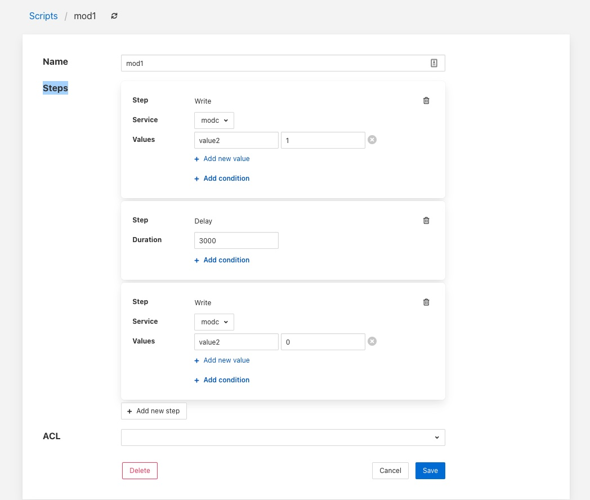

.. Images

.. |automation_10| image:: images/automation_10.jpg

Graphical Interface
~~~~~~~~~~~~~~~~~~~

The automation scripts are available via the *Control Service* menu item in the left hand menu panel. Selecting this will give you access to the user interface associated with the control functions of Fledge. Click on the *Scripts* tab to select the scripts, this will display a list of scripts currently defined within the system and also show an add button icon the top right corner.

+----------------+
| |automation_1| |
+----------------+

Viewing & Editing Existing Scripts
##################################

Simply click on the name of a script to view the script

+----------------+
| |automation_2| |
+----------------+

The steps within the script are each displayed within a panel for that step. The user is then able to edit the script provided they have permission on the script.

There are then a number of options that allow you to modify the script, note however it is not possible to change the type of a step in the script. The user must add a new step and remove the old step they wish to replace.

  - To add a new step to a script click on the *Add new step* button

    - The new step be created in a new panel and will prompt for the user to select the step type

      +----------------+
      | |automation_5| |
      +----------------+

    - The next step in to process will depend on the type of automation step chosen.

      - A *Configure* step will request the configuration category to update to be chosen. This is displayed in a drop down menu.

        +----------------+
        | |automation_6| |
        +----------------+

        The configuration categories are shown as a tree structure, allowing the user to navigate to the configuration category they wish to change.

        Once chosen the user is presented with the items in that configuration category from which to choose.

        +----------------+
        | |automation_7| |
        +----------------+

        Selecting an item will give you a text box with the current value of that item. Simply type the new value that should be assigned to that item when this step of the script runs into that text box.

      - A *Delay* step will request the duration of the delay. The *Duration* is merely typed into the text box and is expressed in milliseconds.

      - An *Operation* step will request you to enter the name of the operation to perform and then select the service to which the operation request should be sent

        +----------------+
        | |automation_8| |
        +----------------+

        Operations can be passed zero or more parameters, to add parameters to an operation click on the *Add parameter* option. A pair of text boxes will appear allowing you to enter the key and value for the parameter.

        +----------------+
        | |automation_9| |
        +----------------+

        To add another parameter simply press the *Add parameter* option again.

      - A *Script* step will request you to choose the name of the script to run from a list of all the currently defined scripts.

        +-----------------+
        | |automation_10| |
        +-----------------+

        Note that the script that you are currently editing is not included in this list of scripts. You can then choose if you want the execution of this script to block the execution of the current script or to run in parallel with the execution of the current script.

        +-----------------+
        | |automation_11| |
        +-----------------+

        Scripts may also have parameters added by choosing the *Add parameter* option.

      - A *Write* step will request you to choose the service to which you wish to send the write request. The list of available services is given in a drop down selection.

        +-----------------+
        | |automation_12| |
        +-----------------+

        Values are added to the write request by clicking on the *Add new value* option. This will present a pair of text boxes in which the key and value of the write request value can be typed.

        +-----------------+
        | |automation_13| |
        +-----------------+

        Multiple values can be sent in a single write request, to add another value simply click on the *Add new value* option again.

  - Any step type may have a condition added to it. If a step has a condition associated with it, then that condition must evaluate to true if the step is to be run executed. If it does not evaluate to true the step is skipped and the next step is executed. To add a condition to a step click on the *Add condition* option within the step's panel.

    +-----------------+
    | |automation_14| |
    +-----------------+

    A key and a value text box appears, type the key to test, this is usually a script parameter and the value to test. Script parameters are referenced using the *$* character to enclose the name of the script parameter.

    +-----------------+
    | |automation_15| |
    +-----------------+

    A selection list is provided that allows the test that you wish to perform to be chosen.

    +-----------------+
    | |automation_16| |
    +-----------------+

  - To remove a step from a script click on the bin icon on the right of the step panel

    +----------------+
    | |automation_4| |
    +----------------+

  - To reorder the steps in a script it is a simple case of clicking on one of the panels that contains a step and dragging and dropping the step into the new position within the script in which it should run.

    +----------------+
    | |automation_3| |
    +----------------+

  - A script may have an access control list associated to it. This controls how a script can be access, it allows the script to limit access to certain services, notifications or APIs. The creation of ACLs is covered elsewhere, to associate an ACL to a script simply select the name of the ACL from the ACL drop down at foot of the screen. If not ACL is assigned access to the script will not be limited.

Adding a Script
###############

The process for adding new scripts is similar to editing an existing script.

  - To add a new script click on the *Add* option in the top right corner.

  - Enter a name for the script in the text box that appears

    +-----------------+
    | |automation_17| |
    +-----------------+

  - Now start to add the steps to you script in the same way as above when editing an existing script.

  - Once you have added all your steps you may also add optional access control list

  - Finally click on *Save* to save your script
