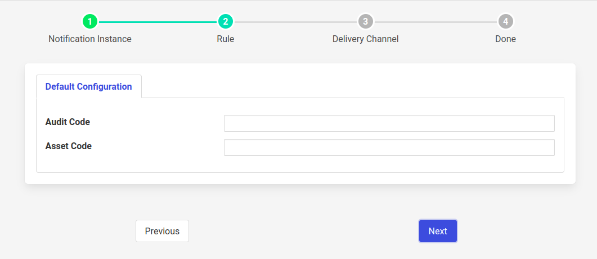

.. Images

DataAvailability Rule
=====================

This is a built in rule that triggers every time it receives data that matches an asset code or audit code those given in the configuration.

+---------------------+
| |data-availability| |
+---------------------+

  - **Audit Code**: Audit log code to monitor, Leave blank if not required or set to * for all codes. If we want to monitor several audit codes a comma separated list can be entered. E.g. SRVRG, SRVUN

  - **Asset Code**: Asset code to monitor. Leave blank if not required.
