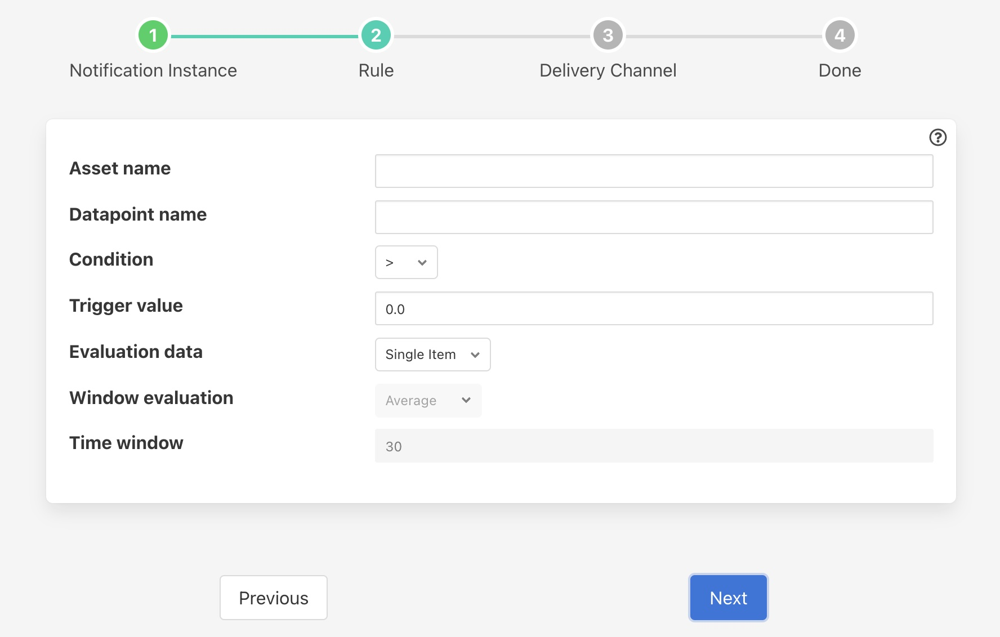
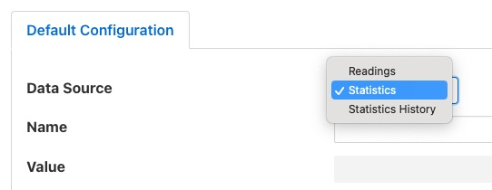

.. Images

Threshold Rule
==============

The threshold rule is used to detect the value of a data point within an asset going above or below a set threshold.

The configuration of the rule allows the threshold value to be set, the operation and the datapoint used to trigger the rule.

+-------------+
| |threshold| |
+-------------+

  - **Data Source**: The source of the data used for the rule evaluation. This may be one of Readings, Statistics or Statistics History. See details below.

    +----------+
    | |source| |
    +----------+

  - **Name**: The name of the asset or statistics that is tested by the rule.

  - **Value**: The name of the datapoint in the asset used for the test. This is only required if the *Data Source* above is set to *Readings*.

  - **Condition**: The condition that is being tested, this may be one of >, >=, <= or <.

  - **Trigger value**: The value used for the test.

  - **Evaluation data**: Select if the data evaluate is a single value or a window of values.

  - **Window evaluation**: Only valid if evaluation data is set to Window. This determines if the value used in the rule evaluation is the average, minimum or maximum over the duration of the window.

  - **Time window**: Only valid if evaluation data is set to Window. This determines the time span of the window.

Data Source
-----------

The rule may be used to test the values of the data that is ingested by
south services within Fledge or the statistics that Fledge itself creates.

When the rule examines a reading in the Fledge data stream it must be
given then name of the asset to observe and the name of the data point
within that asset. The data points within the asset should contain
numeric data.

When observing a statistic there are two choices that can be made,
to monitor the raw statistics value, which is a simple count, or to
examine the statistic history. The value received by the threshold rule
for a statistic is the increment that is added to the statistic and not
the absolute value of the statistics.

The statistic history is the value seen plotted in
the dashboard graphs and shows the change in the statistic value over
a defined period. By default the period is 15 seconds, however this is
configurable. In the case of statistics all that is required is the name
of the statistic to monitor, there is no associated data point name as
each statistic is a single value.
