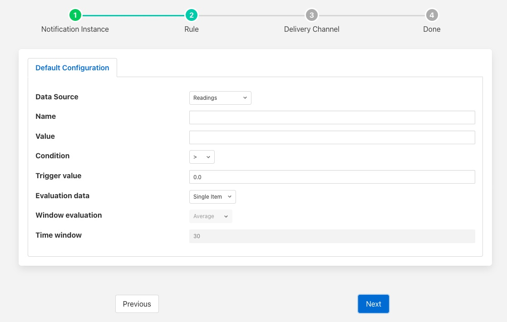

.. Images

Threshold Rule
==============

The threshold rule is used to detect the value of a data point within an asset going above or below a set threshold.

The configuration of the rule allows the threshold value to be set, the operation and the datapoint used to trigger the rule.

+-------------+
| |threshold| |
+-------------+

  - **Asset name**: The name of the asset that is tested by the rule.

  - **Datapoint Name**: The name of the datapoint in the asset used for the test.

  - **Condition**: The condition that is being tested, this may be one of >, >=, <= or <.

  - **Trigger value**: The value used for the test.

  - **Evaluation data**: Select if the data evaluate is a single value or a window of values.

  - **Window evaluation**: Only valid if evaluation data is set to Window. This determines if the value used in the rule evaluation is the average, minimum or maximum over the duration of the window.

  - **Time window**: Only valid if evaluation data is set to Window. This determines the time span of the window.
