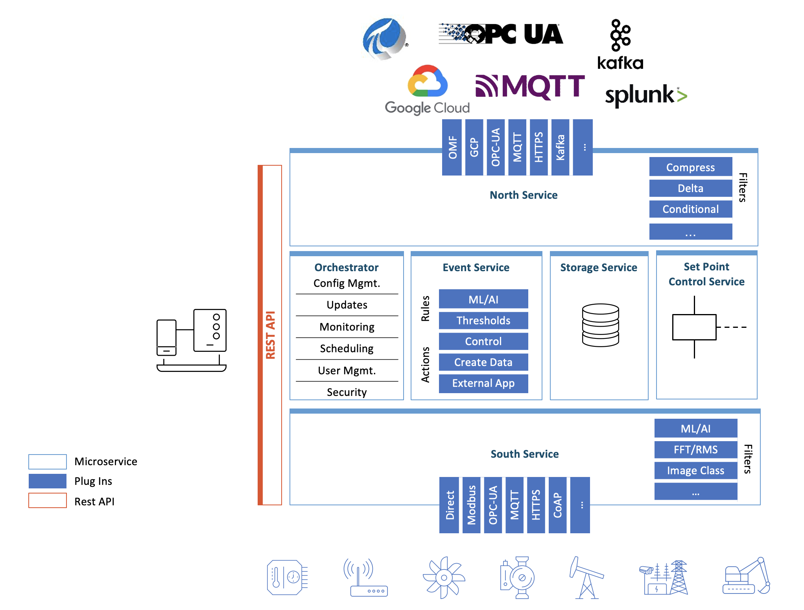

.. Fledge documentation master file, created by
   sphinx-quickstart on Fri Sep 22 02:34:49 2017.
   You can adapt this file completely to your liking, but it should at least
   contain the root `toctree` directive.

.. |br| raw:: html

    

.. Images

.. Links to open in new tabs:
.. |Dianomic Website| raw:: html

   <a href="http://www.dianomic.com" target="_blank">Dianomic Website</a>

.. =============================================

********************
Fledge Architecture
********************

The following diagram shows the architecture of Fledge:

- Components in blue are **plugins**. Plugins are light-weight modules that enable Fledge to be extended. There are a variety of types of plugins: south-facing, north-facing, storage engine, filters, event rules and event delivery mechanisms. Plugins can be written in python (for fast development) or C++ (for high performance).

- Components with a blue line at the top of the box are **microservices**. They can co-exist in the same operating environment or they can be distributed across multiple environments.

|fledge_architecture|

Fledge Core
============

The Core microservice coordinates all of the Fledge operations. Only one Core service can be active at any time.

Core functionality includes:

**Scheduler**: Flexible scheduler to bring up processes.

**Configuration Management**: maintain configuration of all Fledge components. Enable software updates across all Fledge components.

**Monitoring**: monitor all Fledge components, and if a problem is discovered (such as an unresponsive microservice), attempt to self-heal.

**REST API**: expose external management and data APIs for functionality across all components.

**Backup**: Fledge system backup and restore functionality.

**Audit Logging**: maintain logs of system changes for auditing purposes.

**Certificate Storage**: maintain security certificates for different components, including south services, north services, and API security.

**User Management**: maintain authentication and permission info on Fledge administrators.

**Asset Browsing**: enable querying of stored asset data.

Storage Layer
=============

The Storage microservice provides two principal functions: a) maintenance of Fledge configuration and run-time state, and b) storage/buffering of asset data. The type of storage engine is pluggable, so in installations with a small footprint, a plugin for SQLite may be chosen, or in installations with a high number of concurrent requests and larger footprint Postgresql may be suitable. In micro installations, for example on Edge devices, or when high bandwidth is required, an in-memory temporary storage may be the best option.

South Microservices
===================

South microservices offer bi-directional communication of data and metadata between Edge devices, such as sensors, actuators or PLCs and Fledge. Smaller systems may have this service installed onboard Edge devices. South components are typically deployed as always-running services, which continuously wait for new data. Alternatively, they can be deployed as single-shot tasks, which periodically spin up, collect data and spin down.

North Microservices
===================

Northbound microservices offer bi-directional communication of data and metadata between the Fledge platform and larger systems located locally or in the cloud. Larger systems may be private and public Cloud data services, proprietary solutions or Fledge instances with larger footprints. Northbound components are typically deployed as one-shot tasks, which periodically spin up and send data which has been batched, then spin down. However, they can also be deployed as continually-running services.

Filters
=======

Filters are plugins which modify streams of data that flow through Fledge. They can be deployed at ingress (in a South service), or at egress (in a North service). Typically, ingress filters are used to transform or enrich data, and egress filters are used to reduce flow to northbound pipes and infrastructure, i.e. by compressing or reducing data that flows out. Multiple filters can be applied in "pipelines", and once configured, pipelines can be applied to multiple south or north services.

A sample of existing Filters:

**Expression**: apply an arbitrary mathematical equation across one or more assets.

**Python35**: run user-specified python code across one or more assets.

**Metadata**: apply tags to data, to note the device/location it came from, or to attribute data to a manufactured part.

**RMS/Peak**: summarize vibration data by generating a Root Mean Squared (RMS) across n samples.

**FFT**: generate a Fast Fourier Transform (FFT) of vibration data to discover component waveforms.

**Delta**: Only send data that has changed by a specified amount.

**Rate**: buffer data but don’t send it, then if an error condition occurs, send the previous data.

**Contrast**: Enhance the contrast of image type data

Filters may be concatenated together to form a data pipeline from the data source to the storage layer, in the south microservice. Of from the storage layer to the destination in the north.

+-------------+
| |pipelines| |
+-------------+

This allows for data processing to be built up via the graphical interface of Fledge with little or no coding required. Filters that are applied in a south service will affect all out going streams whilst those applied in the north only affect the data that is sent on that particular connection to an external system.

Event Service
==============

The event engine maintains zero or more rule/action pairs. Each rule subscribes to desired asset data, and evaluates it. If the rule triggers, its associated action is executed.

**Data Subscriptions**: Rules can evaluate every data point for a specified asset, or they can evaluate the minimum, maximum or average of a specified window of data points.

**Rules**: the most basic rule evaluates if values are over/under a specified threshold. The Expression plugin will evaluate an arbitrary math equation across one or more assets. The Python35 plugin will execute user-specified python code to one or more assets.

**Actions**: A variety of delivery mechanisms exist to execute a python application, create arbitrary data, alter the configuration of Fledge, send a control message, raise a ticket in a problem ticking system or email/slack/hangout/communicate a message.

Set Point Control Service
=========================

Fledge is not designed to replace real time control systems, it does however allow for non-time-critical control using the control microservice. Control messages may originate from a number of sources; the north microservice, the event service, the REST API or from scheduled events. It is the job of the control service to route these control messages to the correct destination. It also provides a simple form of scripting to allow control messages to generate chains of writes and operations on the south service and also modify the configuration of the Fledge itself.

REST API
========

The Fledge API provides methods to administer Fledge, and to interact with the data inside it.

Graphical User Interface
========================

A GUI enables administration of Fledge. All GUI capability is through the REST API, so Fledge can also be administered through scripts or other management tools. The GUI contains pages to:

**Health**: See if services are responsive. See data that’s flowed in and out of Fledge

**Assets & Readings**: analytics of data in Fledge

**South**: manage south services

**North**: manage north services

**Notifications**: manage event engine rules and delivery mechanisms

**Configuration Management**: manage configuration of all components

**Schedules**: flexible scheduler management for processes and tasks

**Certificate Store**: manage certificates

**Backup & Restore**: backup/restore Fledge

**Logs**: see system, notification, audit, packages and tasks logging information

**Support**: support bundle contents with system diagnostic reports

**Settings**: set/reset connection and GUI related settings

