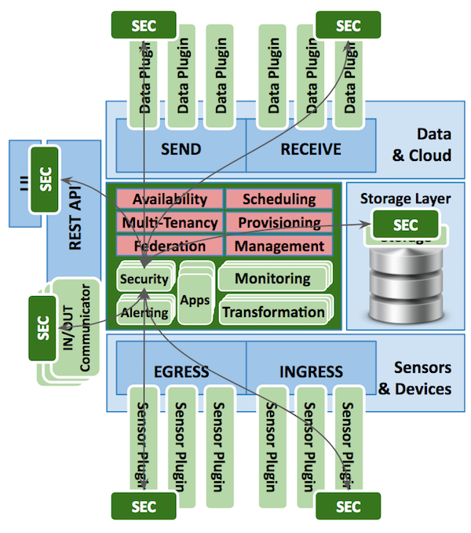
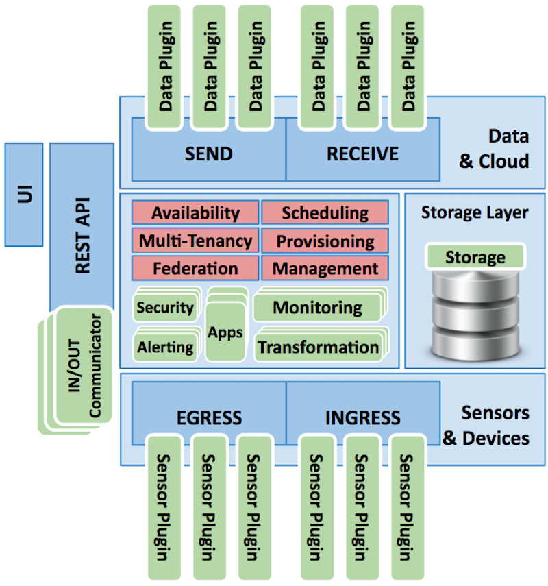
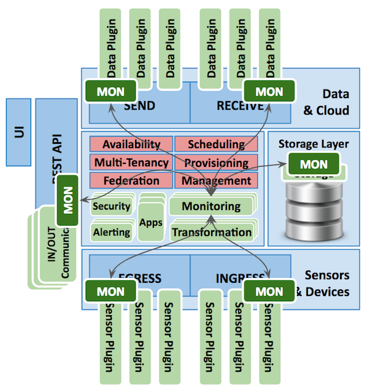
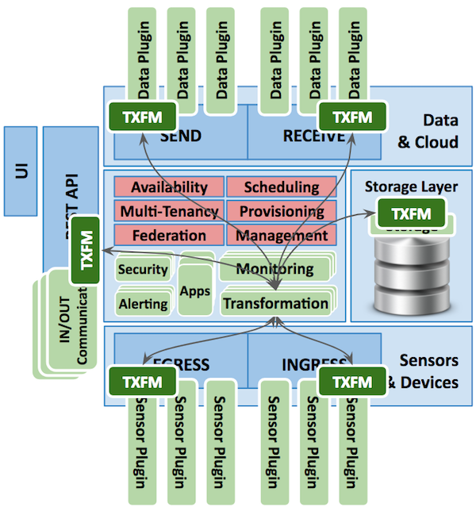

.. FogLAMP documentation master file, created by
   sphinx-quickstart on Fri Sep 22 02:34:49 2017.
   You can adapt this file completely to your liking, but it should at least
   contain the root `toctree` directive.

.. |br| raw:: html

    

*******************
FogLAMP at a Glance
*******************

FogLAMP Architecture
====================

The following diagram shows the architecture of FogLAMP, oriented in a North/South and East/West communication approach:

- Components in light green are **plugins**. They can be loaded/unloaded, activated/deactivated, started/stopped and configured. Configuration is automatically added to the management module when a plugin is activated. Several types of plugins can coexist at the same time. 
- Components in light blue are **microservices**. They can coexist in the same operating environment or they can be distributed on multiple environments.
- Components in pink are part of the **FogLAMP Corei**. They serve as common modules for the platform.

|foglamp_architecture|

Details of the Architecture
---------------------------

- **FogLAMP Core** - A microservice that coordinates all the operations of FogLAMP and provides the resources to handle core tasks . Only one Core service can be active at any time. |br| The core tasks are:

  - High **Availability** of FogLAMP as a cluster platform
  - **Scheduling** of tasks in the platform
  - Centralized **Management** of all the components (microservices, modules, plugins) of the FogLAMP platform.
  - **Multi-tenancy** for external entities (applications, user sessions, devices) and internal entities (scheduled tasks, running services). Entities are identified as tenants. FogLAMP can serve multiple tenants at the same time. Tenants have access to a defined set of resources (data and operations) that can be shared or exclusive.
  - **Federation** of local and distributed data and metadata for tenants. Tenants may have access to a whole set of data or only part of it.
  - **Provisioning & Updates** for FogLAMP, operated automatically, unattended and securely. Updates can be applied to a running FogLAMP without service disruption and in case of issues they can be reverted. In a cluster installation, updates are performed without downtime.
  - **Security** applied as plugins, handled centrally as a service for all the components that require secure communication and authentication for data in motion and at rest. |br| The figure below shows where the security plugins can operate. |foglamp_security|
  - **Data Transformation**: it is a set of multiple plugins that can be loaded/unloaded, activated/deactivated and scheduled to transform stored data (data at rest), based on functions that are executed as external modules. Transformation plugins can also be used to filter or transform data and metadata received or to be sent (data in motion). |br| The figure below shows where the transformation plugins can operate. |foglamp_transformation|
  - **Monitoring**: it is a set of multiple plugins that can be loaded/unloaded, activated/deactivated and scheduled to monitor:

    - Data sent or received
    - Requests received through the REST API
    - Data at rest in the storage layer

    |br|
    The figure below shows where the monitoring plugins can operate. |foglamp_monitoring|
    |br| |br|

  - **Alerting**: it is a set of multiple plugins used as a container for the actions to execute when a particular event occurs. Examples of events are:

    - Activation/deactivation of a component
    - The threshold of the maximum storage capacity has been reached
    - Events generated by monitoring plugins, such as:

      - There is a set of zero or near-zero values collected from a sensor for a given period
      - A sensor has not sent data in the last X minutes
      - A group of sensor is sending values that are below or above average by x%

    |br|
    Alerts may be operations like sending a message to an operator, the interaction with an external system when an internal event occurs or the execution of a user defined function.
    |br| |br|

  - **Applications**: the FogLAMP platform allows the addition of applications written in multiple languages, such as C/C++, Python, JavaScript, Java and many more.
    |br| |br|

- **REST API** - Although the REST API is not a separate microservice (it is part of the FogLAMP core), this set of modules provides features for eastbound/westbound communication. The native API provides User and Administration methods, secured by one of the available Security plugins.

  - A lightweight Administration GUI facilitates the operations of system administrators. For users, the API provides local access to the data and metadata in FogLAMP.
  - A set of IN/OUT Communicator plugins may be used to provide different protocols used by external applications to access the platform. These plugins may also expose non-REST interfaces. Examples of an IN/OUT communicator may be a MySQL connector or a BSON protocol connector.
    |br| |br|

- **Storage Layer** - A microservice that offers storage, either transient or permanent, optionally resilient and/or transactional. The type of storage is pluggable. For example, in installations with a small footprint, a plugin for SQLite may be chosen, whilst in installations with a high number of concurrent requests and larger footprint a plugin for more feature-rich databases may be suitable. In micro installations, for example on Edge devices, an in-memory temporary storage may be the best option. A pass-through option can also reduce the latency of data transiting in FogLAMP, especially when the northbound or east/westbound destination is reachable via a stable network. |br|  Storage plugins may be used to provide extensions to the FogLAMP standard set of data and metadata. |br| |br|
- **Northbound microservice** - A microservice that offers bi-directional communication with data and metadata exchange between the platform and larger systems and databases in the Cloud or in data centers. Larger systems may be private and public Cloud data services, proprietary solutions or FogLAMP instances with larger footprint, optionally distributed on multiple servers, geographically or in the data center. |br| |br|
- **Southbound microservice** - A microservice that offers bi-directional communication with data and metadata exchange between the platform and Edge devices, such as sensors, actuators, PLCs or other FogLAMP installations. Smaller systems may have this service installed on board Edge devices.

