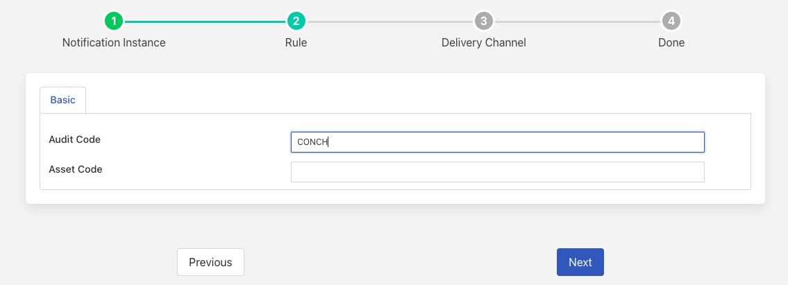
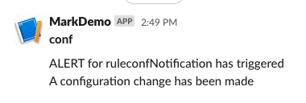
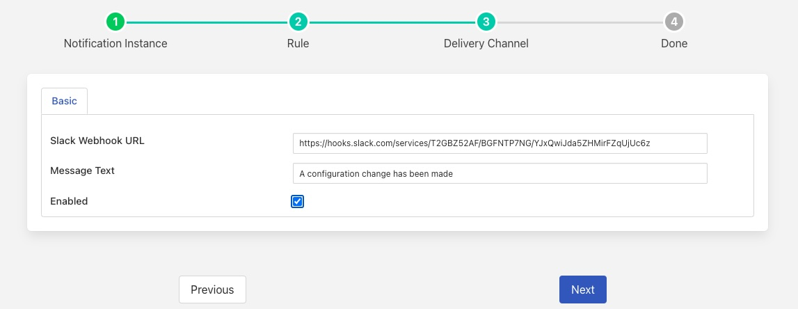
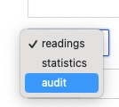
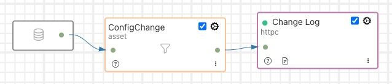

Configuration Changes
=====================

Whenever a configuration category is changed within Fledge an entry is written to the audit log that documents which category was changed along with the old and new value. For example if the configuration category for a south service called sine is changed a record as follows is written to the audit log with the source of the audit entry set to CONCH.

.. code-block:: JSON

   {
      "category": "sine",
      "items": {
             "assetName": {
                            "oldValue": "sinusoid",
                            "newValue": "sinusoid3"
                          }
               }
   }

Since audit data can be used in the same way as an reading data within Fledge, this allows changes of configuration to be monitored and acted upon in the same way as any data that is changed within Fledge.

Using Notifications
-------------------

As an example, let's assume we want to be informed if the configuration of one of the categories in Fledge has been altered. We can create a simple notification instance, using the Data Availability plugin that looks for any audit log entries with a source of CONCH.

+-------------------+
| |CONCH_available| |
+-------------------+

We then define the medium we want to use to deliver our notification, for ease of configuration we will use the Slack delivery plugin to do this.

+---------------+
| |CONCH_slack| |
+---------------+

Each time any user modifies a configuration item a slack message will be sent to alert that the configuration has been altered.

+-----------------+
| |CONCH_message| |
+-----------------+

This is a very simple message that only gives the information that a change has been made, however more sophisticated delivery mechanisms can be used that will detail the actual change.

Sending To External Systems
--------------------------

Audit log data can also be sent to the north in the same way that reading data can. This can be used to send data to third party systems to maintain an change log of internal Fledge changes in other systems. In order to send audit log data to the north e merely setup a new north service or task and when we configure the north plugin we select the data source as *audit* rather than readings or statistics.

+---------------+
| |north_audit| |
+---------------+

.. note::

   Currently not all north destinations support the selection of audit data, however a growing number are now being extended to support audit data

Filters can then be used to filter out particular audit records, the asset filter is a good example of one that can be used. Since the audit code becomes the asset code when sent to a north destination, filtering out just the audit code of CONCH can easily be done with an asset filter configuration of

.. code-block:: JSON

   {
       "rules" : [
                    {
                        "asset_name" : "CONCH",
                        "action"     : "include"
                    }
                 ],
       "defaultAction" : "exclude"
   }

A simple north pipeline that can send a change log to an external application using HTTP would look as follow

+--------------------+
| |north_change_log| |
+--------------------+

Audit Log Data
--------------

Other changes, such as running a service, shutting down a service, executing a purge operation, etc. The complete list of audit log codes are

+=====+==============================+
|Code | Meaning                      |
+=====+==============================+
|PURGE|Data Purging Process          |
+-----+------------------------------+
|LOGGN|Logging Process               |
+-----+------------------------------+
|STRMN|Streaming Process             |
+-----+------------------------------+
|SYPRG|System Purge                  |
+-----+------------------------------+
|START|System Startup                |
+-----+------------------------------+
|FSTOP|System Shutdown               |
+-----+------------------------------+
|CONCH|Configuration Change          |
+-----+------------------------------+
|CONAD|Configuration Addition        |
+-----+------------------------------+
|SCHCH|Schedule Change               |
+-----+------------------------------+
|SCHAD|Schedule Addition             |
+-----+------------------------------+
|SRVRG|Service Registered            |
+-----+------------------------------+
|SRVUN|Service Unregistered          |
+-----+------------------------------+
|SRVFL|Service Fail                  |
+-----+------------------------------+
|SRVRS|Service Restart               |
+-----+------------------------------+
|NHCOM|North Process Complete        |
+-----+------------------------------+
|NHDWN|North Destination Unavailable | 
+-----+------------------------------+
|NHAVL|North Destination Available   |
+-----+------------------------------+
|UPEXC|Update Complete               |
+-----+------------------------------+
|BKEXC|Backup Complete               |
+-----+------------------------------+
|NTFDL|Notification Deleted          |
+-----+------------------------------+
|NTFAD|Notification Added            |
+-----+------------------------------+
|NTFSN|Notification Sent             |
+-----+------------------------------+
|NTFCL|Notification Cleared          |
+-----+------------------------------+
|NTFST|Notification Server Startup   |
+-----+------------------------------+
|NTFSD|Notification Server Shutdown  |
+-----+------------------------------+
|PKGIN|Package installation          |
+-----+------------------------------+
|PKGUP|Package updated               |
+-----+------------------------------+
|PKGRM|Package purged                |
+-----+------------------------------+
|DSPST|Dispatcher Startup            |
+-----+------------------------------+
|DSPSD|Dispatcher Shutdown           |
+-----+------------------------------+
|ESSRT|External Service Startup      |
+-----+------------------------------+
|ESSTP|External Service Shutdown     |
+-----+------------------------------+
|ASTDP|Asset deprecated              |
+-----+------------------------------+
|ASTUN|Asset un-deprecated           |
+-----+------------------------------+
|PIPIN|Pip installation              |
+-----+------------------------------+
|AUMRK|Audit Log Marker              |
+-----+------------------------------+
|USRAD|User Added                    |
+-----+------------------------------+
|USRDL|User Deleted                  |
+-----+------------------------------+
|USRCH|User Changed                  |
+-----+------------------------------+
|USRRS|User Restored                 |
+-----+------------------------------+
|ACLAD|ACL Added                     |
+-----+------------------------------+
|ACLCH|ACL Changed                   |
+-----+------------------------------+
|ACLDL|ACL Deleted                   |
+-----+------------------------------+
|CTSAD|Control Script Added          |
+-----+------------------------------+
|CTSCH|Control Script Changed        |
+-----+------------------------------+
|CTSDL|Control Script Deleted        |
+-----+------------------------------+
|CTPAD|Control Pipeline Added        |
+-----+------------------------------+
|CTPCH|Control Pipeline Changed      |
+-----+------------------------------+
|CTPDL|Control Pipeline Deleted      |
+-----+------------------------------+
|CTEAD|Control Entrypoint Added      |
+-----+------------------------------+
|CTECH|Control Entrypoint Changed    |
+-----+------------------------------+
|CTEDL|Control Entrypoint Deleted    |
+-----+------------------------------+
|BUCAD|Bucket Added                  |
+-----+------------------------------+
|BUCCH|Bucket Changed                |
+-----+------------------------------+
|BUCDL|Bucket Deleted                |
+-----+------------------------------+
|USRBK|User Blocked                  |
+-----+------------------------------+
|USRUB|User Unblocked                |
+-----+------------------------------+

As can be seen from the table above there is more than just configuration change that can be monitored by looking at the audit logs of Fledge.
