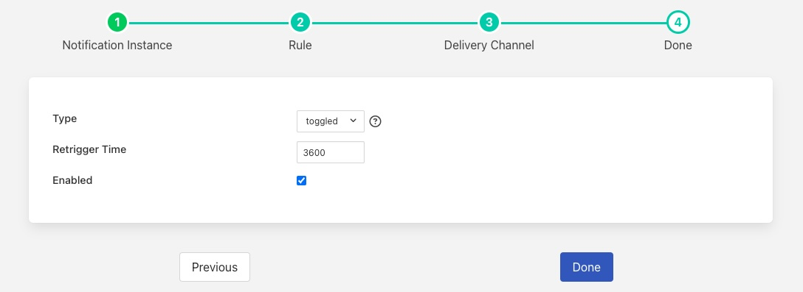

.. |MonitorNorthRate| image:: ../imagesMonitorNorthRate.jpg
.. |MonitorZendesk| image:: ../imagesMonitorZendesk.jpg

.. |MonitorBuffered| image:: ../images/MonitorBuffered.jpg

Pipeline Data Flow
==================

There are several aspect to monitoring the data pipelines within Fledge. The one we will discuss in this section is how to monitor the flow of data. This is about if data is flowing, not if the data that is flowing is good data, just because there is a flow of data says nothing about the quality of that data.

The south services automatically monitor the flow rates out from the south service to the storage layer. The configuration of this monitoring is discussed in the section on tuning Fledge. This automatic monitoring uses statistical methods to detect changes in the flow rate and alerts the user via the user interface status bar alerts.

The main mechanism for monitoring data flow is the statistics that are collected by all the services that implement a Fledge instance.

South Service Data Flow
-----------------------

The south service maintains two distinct statistics: one for the total ingest count for the services and a set for the ingest counts for each asset ingested by the service. These statistics are collected when the data is sent from the south service to the storage service; they do therefore not include any readings that have been bought into the service or removed by any of the filters in the filter pipeline.

The south service may also be configured to reduce the statistics it collects. Very heavily loaded south services, collecting large numbers of distinct assets are often configured to only collect total ingest statistics for the service as this can have a very large impact on the efficiency of the service.

North Service Data Flow
-----------------------

The north services also collect statistics. In this case we can get the total number of readings sent to all north systems or the number sent to each north system. Unlike the south services both of these are always collected and so they can be utilised in all cases.

Statistics Mechanism
--------------------

Statistics are gathered as pure counters that increment as data is traversing the pipeline or whatever the statistic is monitoring. This is not particularly useful when trying to monitor rates. There is however another option. The statistics collector is a task that runs at periodic intervals and takes the raw statistics to create a statistics history table. The statistics collector is run by default every 15 seconds, although this interval can be altered via the configuration. The statistics table will therefore record the increment in each statistic every 15 seconds. This allows us to easily obtain a rate of change for any statistic gathered by the system. It is these statistics history entries that are shown by the Fledge dashboard: it shows the number of readings ingested every 15 seconds by default.

Both the raw statistics and the statistics history can be used as data feeds into the internal Fledge notification service. This means that we can use the Fledge mechanisms for capturing events and sending notifications to many destinations to monitor the flow rates of our south and north services.

Monitor Low North Flow Rate
~~~~~~~~~~~~~~~~~~~~~~~~~~~

As an example we will setup a notification on the flow rate north dropping below a low water mark. For this we will use the threshold notification rule and use the statistics history as the source of data. Let's assume we want to be notified when we send less than 400 readings north in a any given minute. Given our default 15 second statistics collection schedule we can either change that to be once a minute or we can set our threshold lower to 100 readings in every 15 seconds. For this example we will do the latter.

+--------------------+
| |MonitorNorthRate| |
+--------------------+

When can then choose one of Fledge's many supported delivery plugins to have this notification sent to the destination that we require. For the purpose of this example we will use the ZenDesk plugin to raise a problem ticket to have the cause of the issue investigated.

+------------------+
| |MonitorZendesk| |
+------------------+

We can then decide how we want this to trigger. It is probably most appropriate to have the alert trigger first when we drop below that threshold and then be cleared when we rise above that threshold. We also do not wish to have it re-trigger again too soon, so we will set the re-trigger interval to 3600 seconds, or every hour. This way we do not raise excessive numbers of tickets.

+------------------+
| |MonitorTrigger| |
+------------------+

Detecting Fluctuating Flows
~~~~~~~~~~~~~~~~~~~~~~~~~~~

Another useful notification rule plugin that can be used when processing statistical data is the *Simple-Sigma* plugin. This plugin uses statistical methods to collect the mean and standard deviations of a data stream and then detect when it sees values that are a long way outside of the standard deviation from the mean, usually three times the standard deviation.

+---------------------+
| |MonitoredBuffered| |
+---------------------+

In the above example it is shown monitoring the BUFFERED statistic. This is the number of readings written to the storage layer and represents the aggregate of all the data read by all of the south services. This can then be used to monitor if the ingest for the Fledge in total moves outside of the observed operating criteria that has been measured previously. 

.. note::

   This is very similar to the automated monitoring in each south service. Because it is unaware of configured changes to the collection rate it has the disadvantage that it is unable to distinguish from a configured change to a change the occurs because of some failure of equipment or of Fledge.
