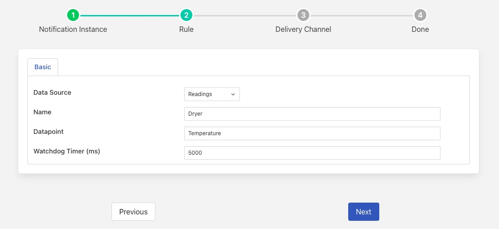

Data Quality
============

There are many different definitions of data quality and many different mechanisms that can be used within Fledge to test the quality of the data ingested into Fledge.

There are several criteria that can be used to determine poor quality data, the very simplest mechanisms are things such as data falling outside of expected limits, this can be very easily detected by using the threshold notification filter to detect over or under limit values. The next level of data quality monitoring it to look for outliers by observing patterns in the data or by viewing the statistical variations within the data.

Causes of "poor quality" data are difficult to ascertain; it could be related to a sensor that is not well calibrated, not well installed or poorly connected. It could equally be because the collection mechanism has problems, or it could simply be that the data looks "poor" because the equipment to which it is connected has failed, is worn or running outside of its operational limits.

Some sensors may provide a measure of the quality of the data that they return along with the data, usually a Fledge south plugin that is connected to a sensor able to do this will report it as a separate datapoint within the asset. It is then a simple job to use the notification tools to monitor for out of bound values of data quality. For example if quality is returned as a percentage the threshold notification rule can be used to trigger when the quality percentage drops below an acceptable threshold.

Unfortunately not many sensors are able to report quality metrics, and even if they could this only accounts for a proportion of the quality issues that may exist in data. In these other cases the issue becomes being able to distinguish between data collection and quality issues and actual issues with the equipment that is being monitored.

Failure Modes
-------------

There are some common failure modes of the collection infrastructure that can probably be determined by looking at the data

Flat Line Data
   The particular data item has stopped changing value for a longer period than is normal for the sensor. This is unlikely to happen, unless the monitored equipment has been shutdown or put into some form of quiescent state.

Out of Range Data
   The data that is being read is out of range for the sensor we are reading, i.e. we are receiving values that the sensor should not be physical capable of returning. A similar issue may also exist, when data it outside the range a machine should normally report. Although this appears like the same issue as out of sensor range, it may be legitimate if the machine itself has issues, so may be a real issue as opposed to a data quality issue.

No Data Read
   There has been a period of time during which no data has been ingested from a service or sensor when the service is running.

Detecting Failure Modes
~~~~~~~~~~~~~~~~~~~~~~~

Out of Range Data
#################

Detecting out of range data is also done very simply using the threshold notification rule or the out of bound rule. The difference between the two plugins is that the out of bound rule allows an upper and lower limit to be set, ensuring the value is within the bounds defined. Whereas the threshold rule detects a threshold being crossed from either direction and only allows one threshold to be set.

No Data Read
############

Detecting the lack of data in Fledge is relatively simple using the watchdog notification rule plugin which is especially designed for this purpose. This will alert the user when there is no data for a specified period. 

+-------------------+
| |MonitorWatchDog| |
+-------------------+

