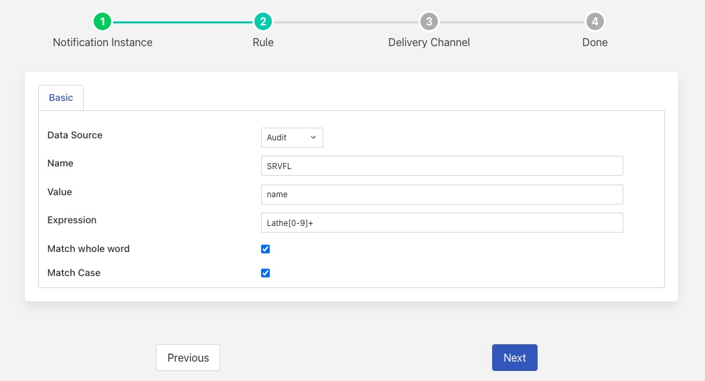

Service State
=============

Fledge is made up of a set of micro services, the precise number and function of which are determined by the configuration of a Fledge instance. Fledge will internally monitor the state of all the microservices and will perform restarts of failed microservices. It is also possible to determine the state of the microservices by using the Fledge external API.

It is also possible to use the Fledge internal notification service to take actions when services fail, although this can be an issue if the notification service itself fails. When a service starts, stops or fails an entry is written to the audit log to this effect. Since the notification service can use the audit log as a source of data to trigger rules, the service state changes can also trigger rules. 

The audit codes that relate to service state changes are:

+------+------------------------------+
| Code | Meaning                      |
+======+==============================+
| SRVRG|Service Registered            |
+------+------------------------------+
| SRVUN|Service Unregistered          |
+------+------------------------------+
| SRVFL|Service Fail                  |
+------+------------------------------+
| SRVRS|Service Restart               |
+------+------------------------------+

Notifications can be created using the data availability plugin or the match notification rule plugins to match the audit code.

+----------------+
| |MonitorMatch| |
+----------------+

This then allows for the notification mechanism to report the change of state of the various services via the notification delivery channels.
