.. Images
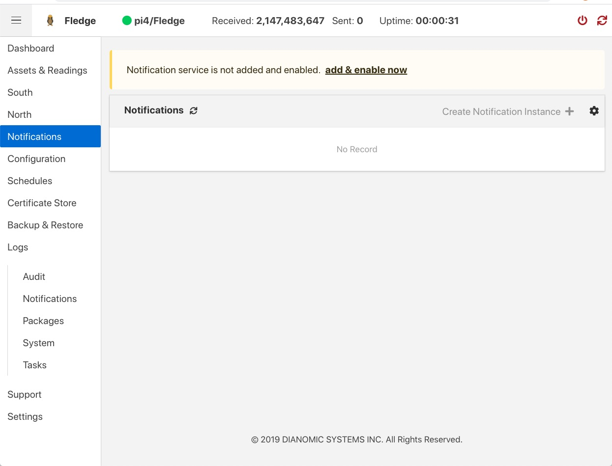
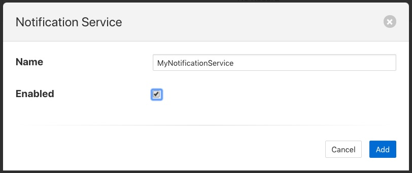
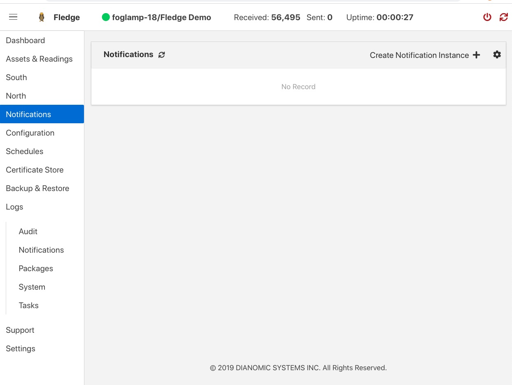
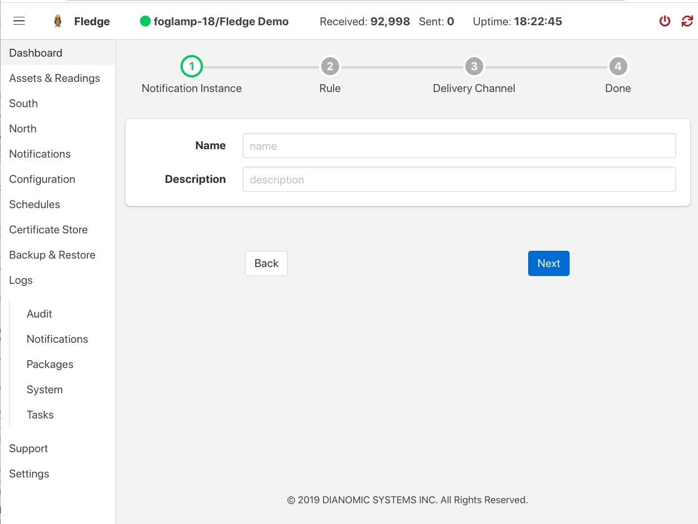
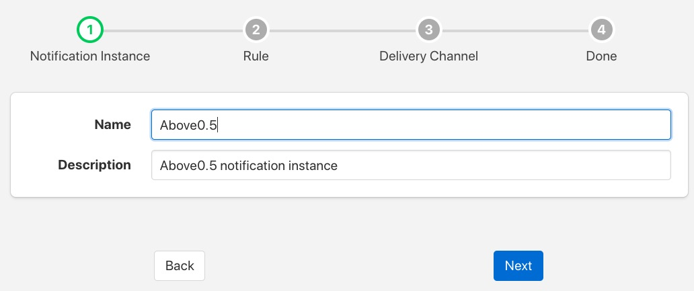
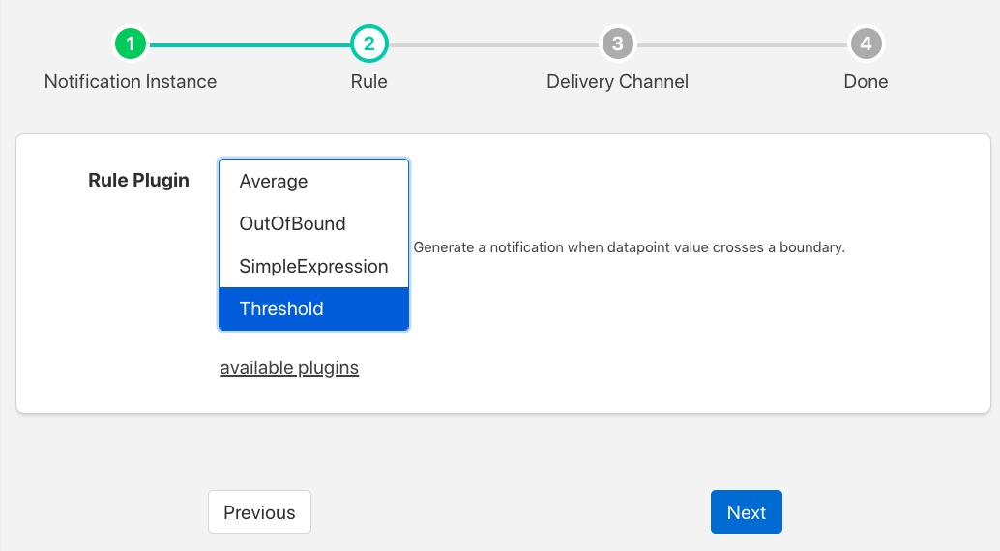
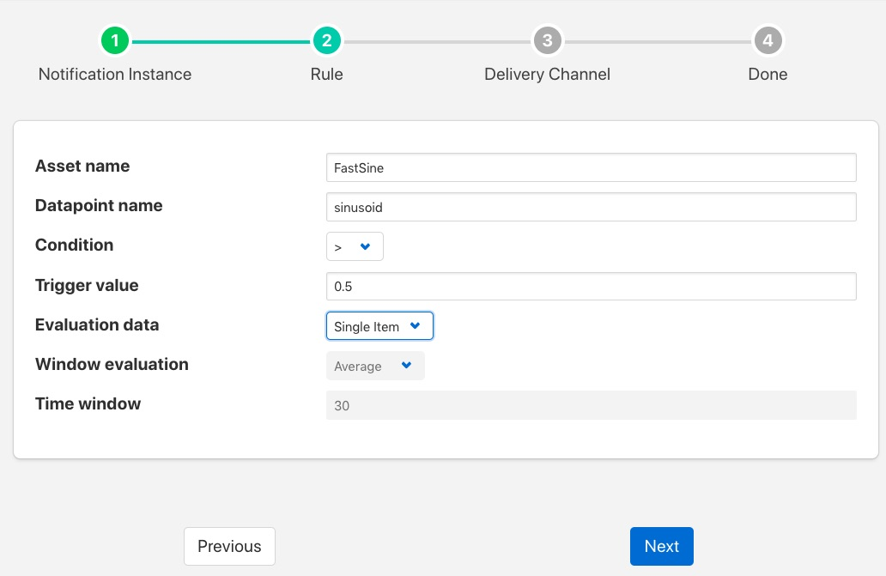
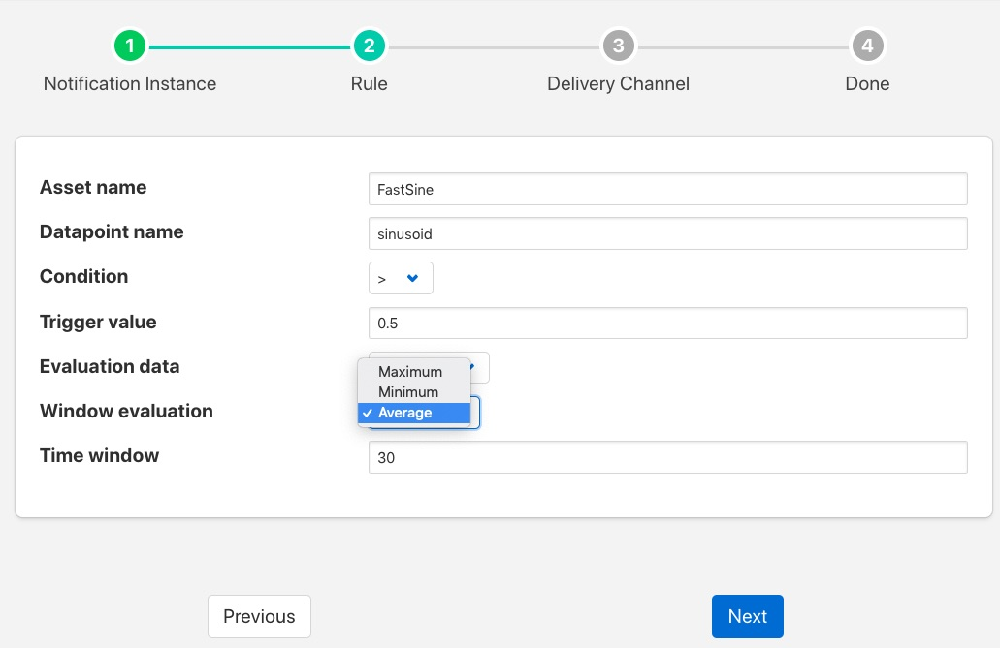
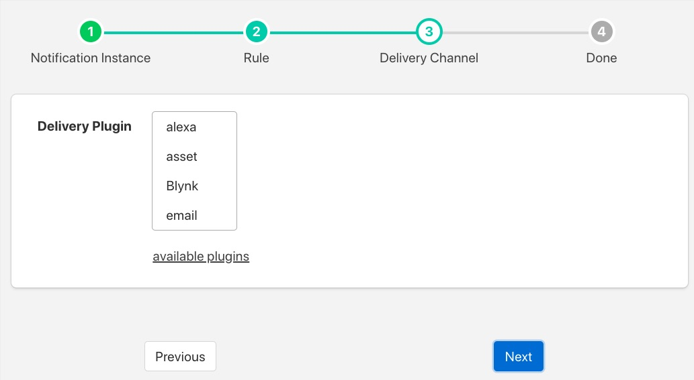
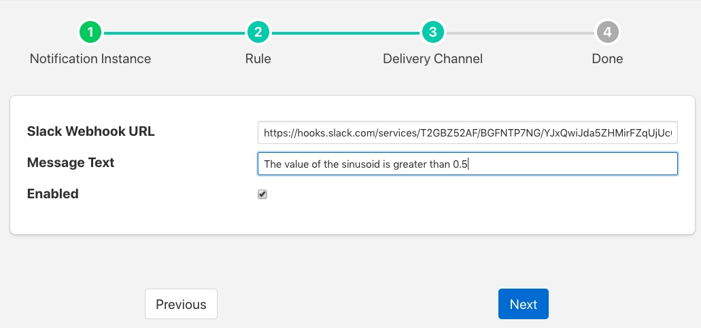
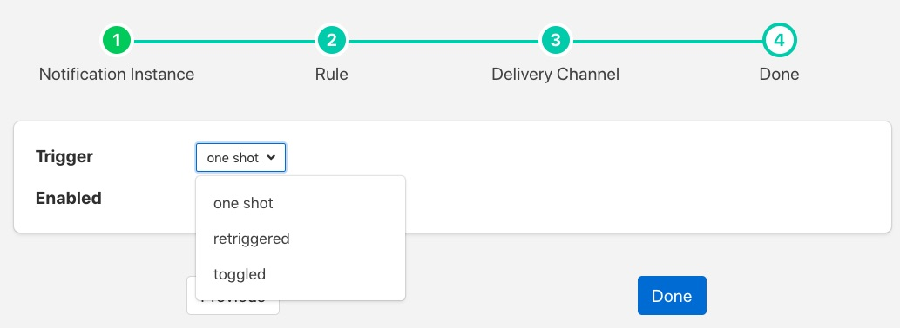
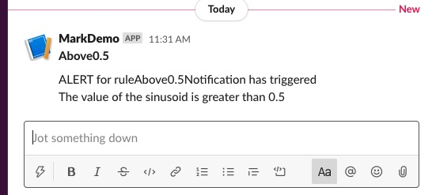
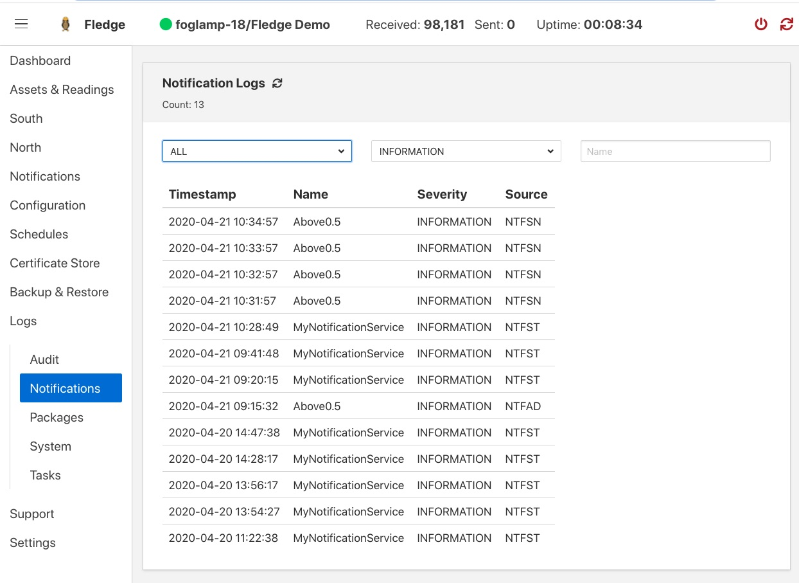
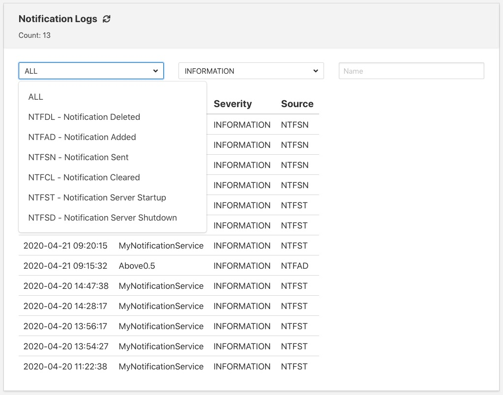
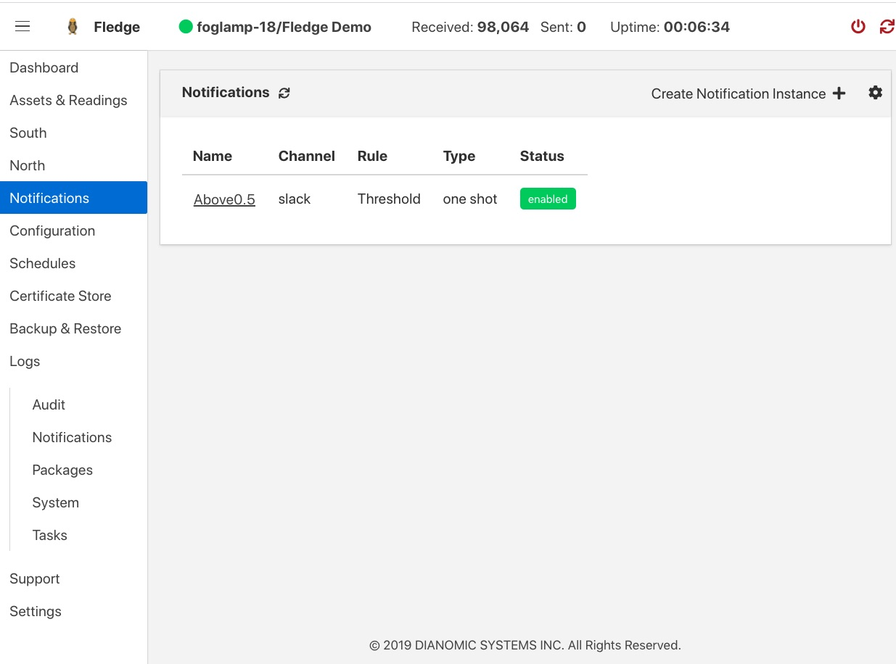
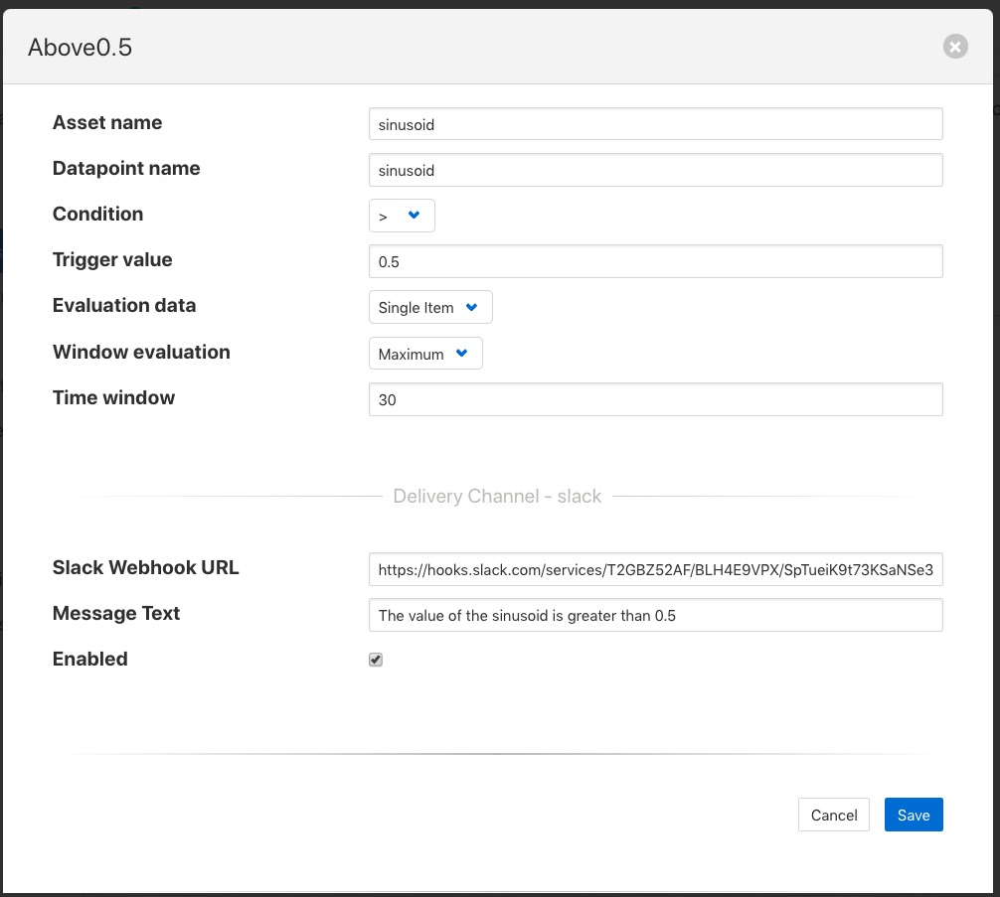
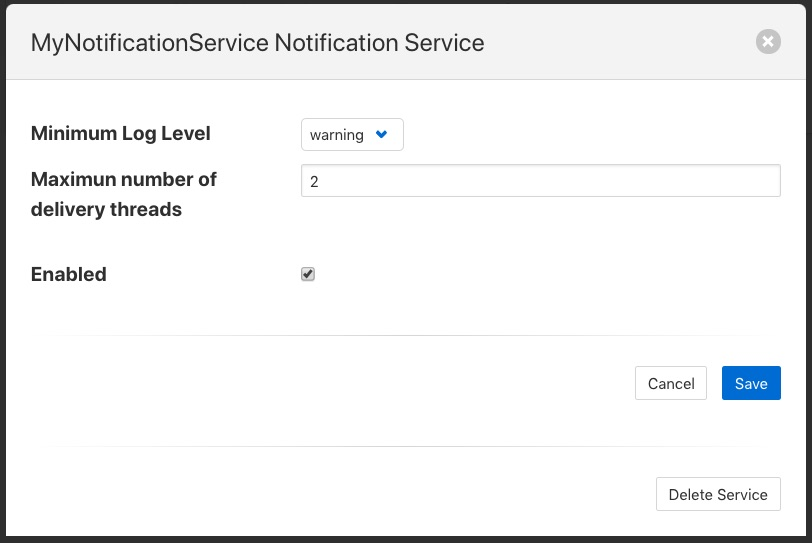
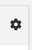

.. Links
.. |rule_plugins| raw:: html

   <a href="fledge_plugins.html#notification-rule-plugins">Notification Rule Plugins</a>

.. |delivery_plugins| raw:: html

   <a href="fledge_plugins.html#notification-delivery-plugins">Notification Delivery Plugins</a>

*********************
Notifications Service
*********************

Fledge supports an optional service, known as the notification service that adds an event engine to the Fledge installation. The notification services observed data as it flows into the Fledge storage service buffer and processes that data against a set of rules that are configurable by the user to determine if an event has occurred. Events may be either when a condition that was previously not met being is, or a condition that was previously met becoming no longer true. The notification service can then send a notification when an event occurs or, in the case of a condition that is met, it can send notifications as long as that condition is met.

The notification services operates on data that is in the storage layer, and is independent of the individual south services. This means that the notification rules can use data from several south services to evaluate if a condition has occurred. Also the data that is observed by the notification is after any filtering rules have been applied in the south services but before any filtering that occurs in the north tasks. The mechanism used to allow the notification service to observe data is that the notifications register with the storage service to be given the values for particular assets as they arrive at the storage service. A notification may register for several assets and is free to buffer that data internally within the notification service. This registration does not impact how the data that is requested is treated in the rest of the system; it will still for example follow the normal processing rules to be sent onward to the north systems.

Notifications
=============

The notification services manages *Notifications*, these are a set of parameters that it uses to determine if an event has occurred and a notification delivery should be made on the basis of that event.

A notification within the notification service consists of;

  - A notification rule plugin that contains the logic to evaluate if a rule has been triggered, thus creating an event.
  - A set of assets that are required to execute a notification rule.
  - Information that defines how the data for each asset should be delivered to the notification rule.
  - Configuration for the rule plugin that customizes that logic to this notification instance.
  - A delivery plugin that provides the mechanism to delivery an event to destination for the notification.
  - Configuration that may be required for the delivery plugin to operate.

Notification Rules
------------------

Notification rules are the logic that is used by the notification to determine if an event has occurred or not. An event is basically based on the values of a number of attributes, either at a single point in time or over a period of time. The notification services is delivered with one built in rule, this is a very simple rule called the *threshold rule* it simply looks at a single asset to determine if the value of a datapoint within the asset goes above or below a set value.

A notification rule has associated with it a set of configuration options, these define how the plugin behaves but also what data the plugin requires to execute the evaluation logic within the plugin. These configuration parameters can be divided into two sets; those items that define the data the rule requires from the notification service itself and those that relate directly to the logic of the rule.

A rule may work across one or more assets, the assets it requires are configured in the rule configuration and passed the the notification service to enable the service to subscribe to those assets and be sent that data by the storage service. A rule plugin may ask for every value of the asset as it changes or it may ask for a window of data. A window is defined as the values of an asset within a given time frame. An example might be the last 10 minutes of values. In the case of the window the rule may be passed the average value, minimum, maximum or all values in that window.  The requirements about how data is delivered to a rule may be hard coded within the logic of a rule or may be part of the configuration a user of the rule should provide.

The second type of configuration parameter a rule might include are those that control the logic itself, in the example of the *threshold rule* this would be the threshold value itself and the control if the event is considered to have triggered if the value is above or below the threshold.

The section |rule_plugins| contains a full list of currently available rule plugins for Fledge. As with other plugin types they are designed to be easily written by end users and developers, a guide is available for anyone wishing to write a notification rule plugin of their own.

Notification Types
------------------

Notifications can be delivered under a number of different conditions based on the state returned from a notification rule and how it related to the previous state returned by the notification rule, this is known as the notification type. A notification may be one of three types, these types are used to define when and how often notification are delivered.

One shot
~~~~~~~~

A one shot notification is sent once when the notification triggers but will not be resent again if the notification triggers on successive evaluations. Once the evaluation does not trigger, the notification is cleared and will be sent again the next time the notification rule triggers.

One shot notifications may be further tailored with a maximum repeat frequency, e.g. no more than once in any 15 minute period.

Toggle
~~~~~~

A toggle notification is sent when the notification rule triggers and will not be resent again until the rule fails to trigger, in exactly the same way as a one shot trigger. However in this case when the notification rule first stops triggering a cleared notification is sent.

Again this may be modified by the addition of a maximum repeat frequency.

Retriggered
~~~~~~~~~~~

A retriggered notification will continue to be sent when a notification rule triggers. The rate at which the notification is sent can be controlled by a maximum repeat frequency, e.g. send a notification every 5 minutes until the condition fails to trigger.

Notification Delivery
---------------------

The notification service does not natively support any form of notification delivery, it relies upon a notification delivery plugin in order to delivery a notification of an event to a user or external system that should be alerted to the event that has occurred. Typical notification deliveries might be to alert a user via some form of paging or messaging system, push an event to an external application by sending some machine level message, execute an external program or code segment to make an action occur, switching on an indication light or in extreme cases maybe shutting down a machine for which a critical fault has been detected. The section |delivery_plugins| contains a full list of currently available notification delivery plugins, however like other plugins these are easily extended and a guide is available for writing notification plugins to extend the available set of plugins.

Installing the Notification Service
===================================

The notification service is not part of the base Fledge installation and is not a plugin, it is a separate microservice dedicated to the detection of events and the sending of notifications. 

.. include:: building_notification.rst

Installing Notification Service Package
---------------------------------------

If you are using the packaged binaries for you system then you can use the package manager to install the *fledge-service-notification* package. The exact command depends on your package manager and how you obtained your packages.

If you downloaded you packages then you should navigate to the directory that contains your package files and run the package manager. If you have deb package files run the command

.. code-block:: console

   $ sudo apt -y install ./fledge-service-notification-1.7.0-armhf.deb

.. note::
   The version number, 1.7.0 may be different on your system, this will depend which version you have downloaded. Also the armhf may be different for your machine architecture. Verify the precise name of your package before running the above command.

If you are using a RedHat or CentOS distribution and have rpm package files then run the command

.. code-block:: console

   $ sudo yum -y localinstall ./fledge-service-notification-1.7.0-x86_64.deb

.. note::
   The version number, 1.7.0 may be different on your system, this will depend which version you have downloaded. Verify the precise name of your package before running the above command.

If you have configured your system to search a package repository that contains the Fledge packages then you can simply run the command

.. code-block:: console

   $ sudo apt-get -y install fledge-service-notification

On a Debian/Ubuntu system, or

.. code-block:: console

   $ sudo yum -y install fledge-service-notification

On a RedHat/CentOS system. This will install the latest version of the notification service on your machine.

Starting The Notification Service
=================================

Once installed you must configure Fledge to start the notification service. This is simply done form the GUI by selecting the *Notifications* option from the left-hand menu. In the page that is then shown you will see a panel at the top that allows you to *add & enable now* the notification service. This only appears if one has not already be added.

+----------------------------+
| |add_notification_service| |
+----------------------------+

Select this link to *add & enable now* the notification service, a new dialog will appear that allows you to name and enable your service.

+-------------------------+
| |enable_notify_service| |
+-------------------------+

Configuring The Notification Service
====================================

Once the notification service has been added and enabled a new icon will appear in the *Notifications* page that allows you to configure the notification service. The icon appears in the top right and is in the shape of a gear wheel. |notification_settings_icon|

Clicking on this icon will display the notification service configuration dialog.

+-------------------------+
| |notification_settings| |
+-------------------------+

You can use this dialog to control the level of logging that is done from the service by setting the *Minimum Log Level* to the least severity log level you wish to see. All log entries at the select level and of greater severity will be logged.

It is also possible to set the number of threads that will be used for delivering notifications. This defines how many notifications can be delivered in parallel. This only needs to be increased if the delivery process of any of the in use delivery plugins are long running.

The final setting allows you to disable the notification service.

Once you have updated the configuration of the service click on *Save*.

It is also possible to delete the notification service using the *Delete Service* button at the bottom of this dialog.

Using The Notification Service
==============================

Add A Notification
------------------

In order to add s notification, select the Notifications page in the left-hand menu, an empty set of notifications will appear.

+-----------------------+
| |empty_notifications| |
+-----------------------+

Click on the + icon to add a new notification.

+------------------+
| |notification_1| |
+------------------+

You will be presented with a dialog to enter a name and description for your notification.

+------------------+
| |notification_2| |
+------------------+

Enter text for the name you require, a suggested description will be automatically added, however you can modify this to any string you desire. When complete click on the *Next* button to move forwards in the definition process. You can always click on *Previous* to go back a screen and modify what has been entered.

+------------------+
| |notification_3| |
+------------------+

You are presented with the set of installed rules on the system. If the rule you wish to use is not installed and you wish to install it then use the link *available plugins* to be presented with the list of plugins that are available to be installed.

.. note::
   The *available plugins* link will only work if you have added the Fledge package repository to the package manager of your system.

When you select a rule plugin a short description of what the rules does will be displayed to the right of the list. In this example we will use the threshold rule that is built into the notification service. Click on *Next* once you have selected the rule you wish to use.

+------------------+
| |notification_4| |
+------------------+

You will be presented with the configuration parameters applicable to the rule you have chosen. Enter the name of the asset and the datapoint within that asset that you wish the rule to operate on. In the case of the *threshold rule* you can also define if you want the rule to trigger if the value is greater than, greater than or equal, less than or less than or equal to a *Trigger value*. 

You can also choose to look at *Single Item* or *Window* data. If you choose the later you can then choose to define if the minimum, maximum or average within the window that must cross the threshold value.

+------------------+
| |notification_5| |
+------------------+

Once you have set the parameters for the rule click on the *Next* button to select the delivery plugin to use to delivery the notification data.

+------------------+
| |notification_6| |
+------------------+

A list of available delivery plugins will be presented, along with a similar link that allows you to install new delivery plugins if desired. As you select a plugin a short text description will be displayed to the right of the plugin list. In this example we will select the *Slack* messaging platform for the delivery of the notification.

Once you have selected the plugin you wish to use click on the *Next* button.

+------------------+
| |notification_7| |
+------------------+

You will then be presented with the configuration parameters the delivery plugin requires to deliver the notification. In the case of the *Slack* plugin this consists of the webhook that you should obtain from the *Slack* application and a message text that will be sent when the event triggers.

.. note::
   You may disable the delivery of a notification separately to enabling or disabling the notification. This allows you to test the logic of a notification without delivering the notification. Entries will still be made in the notification log when delivery is disabled.

Once you have completed the configuration of the delivery plugin click on *Next* to move to the final stage in setting up your notification.

+------------------+
| |notification_8| |
+------------------+

The final stage of setting up your configuration is to set the notification type and the retrigger time for the notification. Enable the notification and click on *Done* to complete setting up your notification.

After a period of time, when a *sinusoid* value greater than 0.5 is received,  a message will appear in your *Slack* window.

+---------+
| |slack| |
+---------+

This will repeat at a maximum rate defined by the *Retrigger Time* whenever a value of greater than 0,5 is received.

Notification Log
~~~~~~~~~~~~~~~~

You can see activity related to the notification service by selecting the *Notifications* option under *Logs* in the left-hand menu.

+--------------------+
| |notification_log| |
+--------------------+

You may filter this output using the drop down menus along the top of the page. The list to the left defines the type of event that you filter, clicking on this list will show you the meaning of the different audit types.

+-------------------------+
| |notification_log_type| |
+-------------------------+

Editing Notifications
---------------------

It is possible to update existing notifications or remove them using the *Notifications* option from the left-hand menu. Clicking on *Notifications* will bring up a list of the currently defined notifications within the system.

+---------------------+
| |notification_list| |
+---------------------+

Click on the name of the notification of interest to display the details of that notification and allow it to be edited.

+---------------------+
| |notification_edit| |
+---------------------+

A single page dialog appears that allows you to change any of the parameters of you notification.

.. note::
   You can not change the rule plugin or delivery plugin you are using. If you wish to change either of these then you must delete this notification and create a new one with the desired plugins.

Once you have updated your notification click *Save* to action the changes.

If you wish to delete your notification this may be done by clicking the *Delete* button at the base of the dialog.
