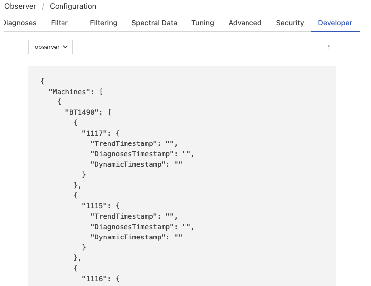
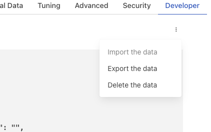

Persisting Data
---------------

Some plugin may wish to persist state between executions of the plugin we discuss here how this can be done.

.. note::

   This topic covers the persistence between executions of the service that is hosting the plugin, but between calls to the plugin entry points. Data is persisted via the plugin handle between these calls and needs no special discussion.

The plugin information, returned by the plugin_init call, provides Fledge with information about the plugin, including a set of flags that describe how to interact with the plugin. One of these flags, the SP_PERSIST_DATA flag informs Fledge that the plugin has data it wishes to persist between runs of the plugin.

When this flag is present in the plugin_information returned it has two further implications

  - The plugin_start entry point should be included in the plugin and that entry point will be altered to allow the passing of a string to the plugin. That string is expected to contain a JSON document which is the data persisted from the previous execution of the plugin.

  - The plugin_shutdown entry point will be altered such that it returns the data the plugin wishes to be persisted after it has shutdown. This data will be passed to the plugin_start entry point of the plugin when it is next started. The data is returned in the form of a string that is assumed to contain a JSON document.

The state information is persisted within the configuration database of the Fledge instance. State is preserved on a per-plugin instance rather than by plugin, therefore there is no sharing of persisted data between two instances of the same plugin that are executing either within a single pipeline or multiple pipelines within a single Fledge instance.

.. note::

   At the time of writing the persistance option is only available for plugins written in C/C++. Support for plugins written in Python will be made available in a future release.

Restoring Persisted Data
########################

It may seem strange to discuss restoring persisted data before it has been persisted, but the reality is this is the order in which the plugin will get calls. Persisted data it passed to the plugin by the plugin_start entry point.

The following is an example taken from a filter plugin

.. code-block:: C

    /**
     * Pass saved plugin configuration
     */
    void plugin_start(PLUGIN_HANDLE *handle, string& data)
    {
    FILTER_INFO *info = (FILTER_INFO *) handle;

        Sigma *filter = info->handle;
        filter->loadState(data);
    }

The plugin_start entry point is called after the plugin_init entry point has been called and before any data is sent to or requested from the plugin.

If there is no data persisted for the plugin, because it has never be previously run or not persisted any data via shutdown, an empty string will be passed to the plugin.

Persisting Data
###############

As discussed above, data is persisted upon shutdown of the plugin, this is achieved by altering the signature of the plugin_shutdown entry point to return a string. The following example is taken from a filter plugin, but persistence of state can be done for any filter type.

.. code-block:: C

   /**
    * Call the shutdown method in the plugin
    */
   std::string plugin_shutdown(PLUGIN_HANDLE *handle)
   {
      FILTER_INFO *info = (FILTER_INFO *) handle;
      Sigma *filter = info->handle;

      // Fetch the state information to persist
      std::string state = filter->saveState();

      // Delete the filter
      delete filter;
      return state;
   }

.. note::

   Data is persisted only on orderly shutdown, therefore it is important to avoid uncontrolled shutdowns if you are using this persistence scheme. It is always best to do an orderly shutdown of Fledge, but even more so in these circumstances.

Viewing Persisted Data
######################

The Fledge user interface has a mechanism that allows features designed for a pipeline developer to be enabled via the settings menu. One of these features allows persisted data to be viewed. Once developer features are enabled a new tab will appear in the configuration of the service. In this *Developer* tab the persisted data can be viewed for the plugins in the pipeline.

+-------------+
| |persist_1| |
+-------------+

When multiple plugin in the pipeline support persistence, the particular plugin can be selected from the drop down menu in the left of the tab.

A menu exists that may be accessed by clicking on the the dots to the right of the *Developer* tab.

+-------------+
| |persist_2| |
+-------------+

This menu allows the import and export of the persisted data to a file. This is useful when debugging pipelines to alter the state of the plugin. The import function is only available if the plugin is shutdown.

You can also delete the persisted data, allowing you to purge the saved state of the plugin and forcing it back to initial operating conditions.
