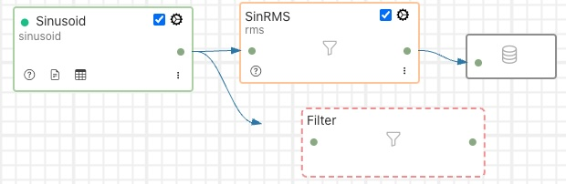
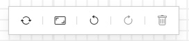

.. Images
.. |filter_south| image:: images/filter_1.jpg
.. |filter_add| image:: images/filter_2.jpg
.. |filter_expression| image:: images/filter_3.jpg
.. |filter_data| image:: images/filter_4.jpg
.. |filter_pipeline| image:: images/filter_5.jpg
.. |filter_reorder| image:: images/filter_6.jpg
.. |filter_edit| image:: images/filter_7.jpg
.. |filter_north| image:: images/filter_8.jpg
.. |filter_select| image:: images/filter_9.jpg
.. |filter_floor| image:: images/filter_10.jpg

.. |flow_added| image:: images/flow_filteradded.jpg

.. |flow_filterpipeline| image:: images/flow_filterpipeline.jpg

.. |flow_filteradded| image:: images/flow_filteradded.jpg

.. Links
.. |filter_plugins| raw:: html

   <a href="fledge_plugins.html#filter-plugins">Filter Plugins</a>

***************
Processing Data
***************

We have already seen that Fledge can collect data from a variety of sources, buffer it locally and send it on to one or more destination systems. It is also possible to process the data within Fledge to edit, augment or remove data as it traverses the Fledge system. In the same way Fledge makes extensive use of plugin components to add new sources of data and new destinations for that data, Fledge also uses plugins to add processing filters to the Fledge system.

Why Use Filters?
================

The concept behind filters is to create a set of small, useful pieces of
functionality that can be inserted into the data flow from the south data
ingress side to the north data egress side. By making these elements
small and dedicated to a single task it increases the re-usability of
the filters and greatly improves the chances when a new requirement
is encountered that it can be satisfied by creating a filter pipeline
from existing components or by augmenting existing components with the
addition of any incremental processing required. The ultimate aim being
to be able to create new applications within Fledge by merely configuring
filters from the existing pool of available filters into a suitable pipeline
without the need to write any new code.

What Can Be Done?
=================

Data processing is done via plugins that are known as *filters* in Fledge, therefore it is not possible to give a definitive list of all the different processing that can occur, the design intent is that it is expandable by the user. The general types of things that can be done are;

  - **Modify a value in a reading**. This could be as simple as applying a scale factor to convert from one measurement scale to another or more complex mathematical operation.
  - **Modify asset or datapoint names**. Perform a simple textual substitution in order to change the name of an asset or a data point within that asset.
  - **Add a new calculated value**. A new value can be calculated from a set of values, either based over a time period or based on a combination of different values, e.g. calculate power from voltage and current.
  - **Add metadata to an asset**. This allows data such as units of measurement or information about the data source to be added to the data.
  - **Compress data**. Only send data forward when the data itself shows significant change from previous values. This can be a useful technique to save bandwidth in low bandwidth or high cost network connections.
  - **Conditionally forward data**. Only send data when a condition is satisfied or send low rate data unless some *interesting* condition is met.
  - **Data conditioning**. Remove data from the data stream if the values are suspect or outside of reasonable conditions.

Where Can it Be Done?
=====================

Filters can be applied in two locations in the Fledge system;

  - In the south service as data arrives in Fledge and before it is added to the storage subsystem for buffering.
  - In the north tasks as the data is sent out to the upstream systems that receive data from the Fledge system.

More than one filter can be added to a single south or north within a Fledge instance. Filters are placed in an ordered pipeline of filters that are applied to the data in the order of the pipeline. The output of the first filter becomes the input to the second. Filters can thus be combined to perform complex sets of operations on a particular data stream into Fledge or out of Fledge.

The same filter plugin can appear in multiple places within a filter pipeline, a different instance is created for each and each one has its own configuration. Pipelines can also contain branches, allow parallel processing of data.

Adding a South Filter
---------------------

In the following example we will add a filter to a south service. The filter we will use is the *expression* filter and we will convert the incoming value to a logarithmic scale. The south plugin used in this simple example is the *sinusoid* plugin that creates a simulated sine wave.

The process starts by selecting the *South* services in the Fledge GUI from the left-hand menu bar. Then click on the south service of interest. This will display a dialog that allows the south service to be edited.

+----------------+
| |filter_south| |
+----------------+

Towards the bottom of this dialog is a section labeled *Applications* with a + icon to the right, select the + icon to add a filter to the south service. A filter wizard is now shown that allows you to select the filter you wish to add and give that filter a name.

+--------------+
| |filter_add| |
+--------------+

Select the *expression* filter and enter a name in the dialog. Now click on the *Next* button. A new page in the wizard appears that allows the configuration of the filter.

+---------------------+
| |filter_expression| |
+---------------------+

In the case of our expression filter we should add the expression we wish to execute *log(sinusoid)* and the name of the datapoint we wish to put the result in, *LogSine*. We can also choose to enable or disable the execution of this filter. We will enable it and click on *Done* to complete adding the filter.

Click on *Save* in the south edit dialog and our filter is now installed and running.

If we select the *Assets & Readings* option from the menu bar we can examine the sinusoid asset and view a graph of that asset. We will now see a second datapoint has been added, *LogSine* which is the result of executing our expression in the filter.

+---------------+
| |filter_data| |
+---------------+

A second filter can be added in the same way, for example a *metadata* filter to create a pipeline. Now when we go back and view the south service we see two applications in the dialog.

+-------------------+
| |filter_pipeline| |
+-------------------+

Reordering Filters
~~~~~~~~~~~~~~~~~~

The order in which the filters are applied can be changed in the south service dialog by clicking and dragging one filter above another in the *Applications* section of dialog.

+------------------+
| |filter_reorder| |
+------------------+

Filters are executed in a top to bottom order always. It may not matter in some cases what order a filter is executed in, in others it can have significant effect on the result.

Editing Filter Configuration
~~~~~~~~~~~~~~~~~~~~~~~~~~~~

A filters configuration can be altered from the south service dialog by selecting the down arrow to the right of the filter name. This will open the edit area for that filter and show the configuration that can be altered.

+---------------+
| |filter_edit| |
+---------------+

You can also remove a filter from the pipeline of filters by select the trash can icon at the bottom right of the edit area for the filter.

Adding Filters To The North
---------------------------

Filters can also be added to the north in the same way as the south. The same set of filters can be applied, however some may be less useful in the north than in the south as they apply to all assets that are sent north.

In this example we will use the metadata filter to label all the data that goes north as coming via a particular Fledge instance. As with the *South* service we start by selecting our north task from the *North* menu item in the left-hand menu bar.

+----------------+
| |filter_north| |
+----------------+

At the bottom of the dialog there is a *Applications* area, you may have to scroll the dialog to find it, click on the + icon. A selection dialog appears that allows you to select the filter to use. Select the *metadata* filter.

+-----------------+
| |filter_select| |
+-----------------+

After clicking *Next* you will be shown the configuration page for the particular filter you have chosen. We will edit the JSON that defines the metadata tags to add and set a name of *floor* and a value of *1*.

+----------------+
| |filter_floor| |
+----------------+

After enabling and clicking on *Done* we save the north changes. All assets sent to this PI Server connection will now be tagged with the tag "floor" and value "1".

Although this is a simple example of labeling data other things can be done here, such as limiting the rate we send data to the PI Server until an *interesting* condition becomes true, perhaps to save costs on an expensive link or prevent a network becoming loaded until normal operating conditions. Another option might be to block particular assets from being sent on this link, this could be useful if you have two destinations and you wish to send a subset of assets to each.

This example used a PI Server as the destination, however the same mechanism and filters may be used for any north destination.

Graphical Pipeline Development
------------------------------

In versions 1.0 up until version 2.4 of Fledge the user interface for creating and editing pipeline was a purely grid based interface as illustrated above. In version 2.4 an option was introduced that allowed a more graphical approach to creating and managing data pipelines. This option was activated via the *Settings* menu option and is call the *Flow editor*. Enabling this will change the user interface for pipeline management.

.. note::

   As of version 3.0 the graphical, flow editor will be the default user interface mode. The previous interface is still available and may be selected by turning off the flow editor in the Settings menu.

Adding A Pipeline
~~~~~~~~~~~~~~~~~

Adding a pipeline, in for example the south, is done by navigating to the *South* menu item, a page will appear that shows all of the current south service, or pipeline, that have been configured.

+--------------+
| |flow_south| |
+--------------+

.. note::

   The north services and tasks are presented in the same way and the interactions are the same as is described here for the south services.

To add a new service, click on the + icon in the dotted service in the top left corner. You will then be presented with a dialog that allows you to choose the south plugin to use to ingest data. If working on a north service or task you Will choose the plugin to use to send data to the system north of Fledge.

+--------------------+
| |flow_southplugin| |
+--------------------+

This dialog will guide you through a number of steps to configure the south plugin. Once complete you will be presented with your new south pipeline that consists of a data ingestion plugin and a connection to the internal storage buffer. The example below shows the sinusoid south plugin in use.

+-----------------+
| |flow_sinusoid| |
+-----------------+

Plugin Interaction
~~~~~~~~~~~~~~~~~~

There are a number of ways of interacting with the south plugin, and likewise in the north. If you hover over the plugin it will display a count of the number of readings processed by the pipeline and the distinct number of asset names observed in the pipeline.

+-------------------+
| |flow_southhover| |
+-------------------+

The subscript number is the count of distinct asset names in the pipeline.

The south plugin also has a number of controls and status indicators around the periphery of the display as well as describing the service name and the name of the south ingest plugin.

+----------------------+
| |flow_southcontrols| |
+----------------------+

  - **Service Status** - a coloured indicator of the current monitored status:
    
      - Green indicates the service is running and the pipeline is processing data.

      - Yellow indicates the service has started to show signs of failure.

      - Red indicates the service has failed.

      - Grey indicates the service is not enabled.

   - **Enable Control** - a toggle control that can be used to enable and disable the service.

   - **Configuration** - a control that can be used to display the configuration dialog for the plugin. This allows the configuration to be changed for an existing south plugin.

   - **Menu** - enable the display of the context menu for the service:

     +------------------+
     | |flow_southmenu| |
     +------------------+

     - Readings - display the readings that are buffered in the storage service as a result of this pipeline.

     - Export Readings - export the buffered readings for this pipeline to a CSV file.

     - Delete - delete the service.

  - **Display Readings** - display the readings that are buffered in the storage service as a result of this pipeline.

  - **Show Logs** - display the logs written by this service.

  - **Help** - show the online documentation of this south plugin. The online documentation will be shown in a new browser tab.

These same controls and status indicators are also available in the south page that shows all of the current south services that are configured within the Fledge instance.

+--------------+
| |flow_south| |
+--------------+

Adding Filters
~~~~~~~~~~~~~~

Adding a new filter to a pipeline is a simple process of dragging the blank filter icon from the bottom left of the canvas and dropping it on one of the connecting lines in the filter pipeline.

+------------------+
| |flow_addfilter| |
+------------------+

Once the new filter has been dropped onto the connection, the pipeline will redraw and show an empty filter in the pipeline.

+--------------------+
| |flow_filteradded| |
+--------------------+

The dashed outline of the filter signifies that the filter has yet to be defined, its place within the pipeline is set, but the actual filter to be inserted as not been selected and it has not been configured. Clicking on the + icon will bring up the filter selection dialog.

+---------------------+
| |flow_definefilter| |
+---------------------+

Select the filter plugin to use from the list of plugins given. If a filter you need has not been installed you may install it by clicking on the *Install from available plugins* link below the list.

Give the filter a name, names must be unique within the Fledge instance. Once complete click on the *Next* button to configure your chosen filter plugin.

Here we have assumed you selected the *RMS* plugin and see the configuration screen for that plugin.

+---------------------+
| |flow_filterconfig| | 
+---------------------+

Configure your plugin and then click on *Done*. The filter screen will be displayed with the empty filter now replaced with your newly defined and configured filter.

+-------------------+
| |flow_filterdone| |
+-------------------+

.. note::

   The colour of the filter components outline is used to distinguish the type of element it is. South plugins are shown in green and filters in yellow. Filters also display a "funnel" icon in the centre of the element.

Similar controls are shown around the periphery of the filter icon to those shown on the south plugin. There is no count display when you hover over the filter and no readings or logs are available that related just to this filter.

The context menu has a single entry, *Delete*. This will delete the filter from the pipeline.

The filter element also has two green dots that represent the ingress and egress points of the filter.

Reordering Filters
~~~~~~~~~~~~~~~~~~

Using the flow based pipeline editor the process of reordering filters within a pipeline is simply a case of clicking and dragging the filter you wish to move it.

+-----------------+
| |flow_dragging| |
+-----------------+

In this case the filter called *rename* has been dragged from its position between *Sinusoid* and *SineRMS* and will be dropped on the connection coming from *SinRMS* to the storage layer.

Releasing the mouse button to drop the filter on the connection will cause the pipeline to be drawn with the new filter order.

+------------------+
| |flow_reordered| |
+------------------+

Accessing An Existing Pipeline
~~~~~~~~~~~~~~~~~~~~~~~~~~~~~~

To access an existing pipeline from the *South* or *North* screen you may either click on the service name or select the *Details* item from the services context menu.

+----------------+
| |flow_details| |
+----------------+

Canvas Action Bar
~~~~~~~~~~~~~~~~~

At the top of the working canvas for the pipeline flow editor a small action bar allows for some actions related to the drawing of the pipeline.

+------------------+
| |flow_actionbar| |
+------------------+

From left to right in the action bar the operations support are:

  - **Reload** - reloads the pipeline, discarding any part complete actions.

  - **Reset** - Resets the canvas to include the pipeline, useful if you have scrolled or zoomed the display and want to revert to seeing the entire pipeline.

  - **Undo** - Undo the last action.

  - **Redo** - Redo the last action.

  - **Delete** - Deletes the currently selected item in the pipeline. This may be a filter or connection.

Also displayed in the bottom right of the working canvas is an overview "map" that shows the working area, the pipeline and the area shown currently.  You can click and drag on this to scroll the visible area of the pipeline canvas.

Pipeline Branching
------------------

It is possible, using the graphical pipeline development view to create pipelines that are not linear. This allows for data to be sent via two parallel branches of a pipeline and processed in parallel. This can be very useful when two sets of operations are required to be performed on the same data and you wish to not have the data from both operations combined in a single assets or pipeline. An example of this might be the processing of vibration data. You may wish to run an FFT filter over the data to examine the frequency distribution of the signals, but also calculate the power in the vibration using the RMS filter. It is unlikely that you want to do these two different approaches to the analysis of the vibration data in the same asset.

To create a branch, drag the filter from the bottom right corner and drop it onto the canvas in free space.

+------------+
| |branch_1| |
+------------+

Not click on the green circle on the output side of the pipeline element from which the branch is to start and drag out a connection.

+------------+
| |branch_2| |
+------------+

.. note::

   The branch may start from the output of the south plugin or from the output of a filter. Outputs of filters are the right must green dots and inputs are the left most green dots.

Drop the end of the connection on the input of the filter you just dropped onto the canvas.

+------------+
| |branch_3| |
+------------+

Now click on the output of the filter and again drag out a connection. This time drop the end of the connection onto the input of the storage icon or the input side.

+------------+
| |branch_4| |
+------------+

Now the filter is connected into the pipeline you can click on the *+* icon to select the filter plugin.

.. note::

   The workflow shown here connects the input side before the output side, these may actually be done in the opposite order.

To add more filters on your new branch you can drag and drop the new filter icon from the bottom left of the screen onto one of the connection arrows in the same way as you would with the linear pipeline when using the flow editor view.

.. note::

   It is very important when using branches that if two or more branches write to the storage service that they do not write data with the same asset name and timestamp. Typically a branch should create an asset name that differs from those on any other branch. The easiest way to ensure this is the use the *rename* filter or the *asset* filter to change the name of the asset within each branch.

Some Useful Filters
===================

A number of simple filters are worthy of mention here, a complete list of the currently available filters in Fledge can be found in the section |filter_plugins|.

Scale
-----

The filter *fledge-filter-scale* applies a scale factor and offset to the numeric values within an asset. This is useful for operations such as changing the unit of measurement of a value. An example might be to convert a temperature reading from Centigrade to Fahrenheit.

Metadata
--------

The filter *fledge-filter-metadata* will add metadata to an asset. This could be used to add information such as unit of measurement, machine data (make, model, serial no)  or the location of the asset to the data.

Delta
-----

The filter *fledge-filter-delta* allows duplicate data to be removed, only forwarding data that changes by more than a configurable percentage. This can be useful if a value does not change often and there is a desire not to forward all the *similar* values in order to save network bandwidth or reduce storage requirements.

Rate
----

The filter *fledge-filter-rate* is similar to the delta filter above, however it forwards data at a fixed rate that is lower the rate of the oncoming data but can send full rate data should an *interesting* condition be detected. The filter is configured with a rate to send data, the values sent at that rate are an average of the values seen since the last value was sent.

A rate of one reading per minute for example would average all the values for 1 minute and then send that average as the reading at the end of that minute. A condition can be added, when that condition is triggered all data is forwarded at full rate of the incoming data until a further condition is triggered that causes the reduced rate to be resumed.

