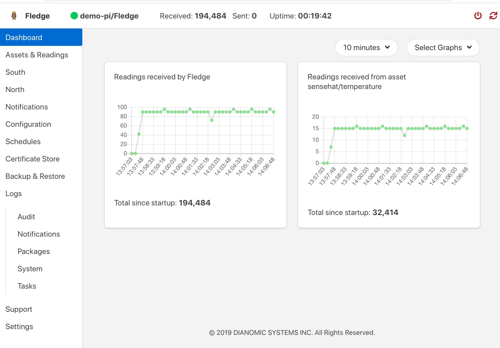
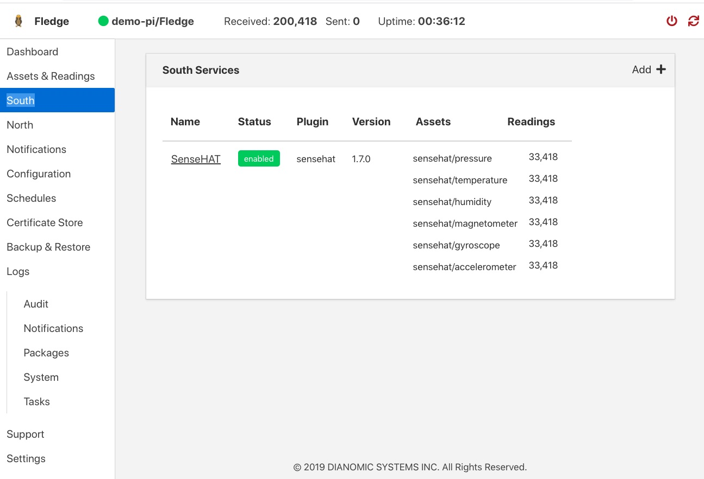
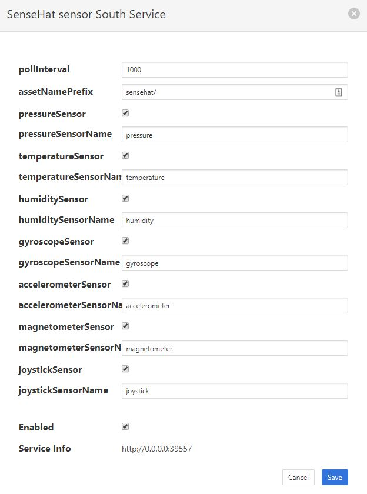
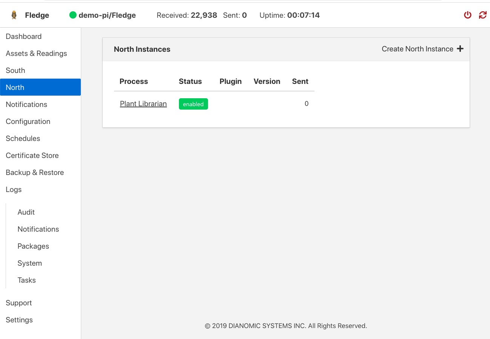
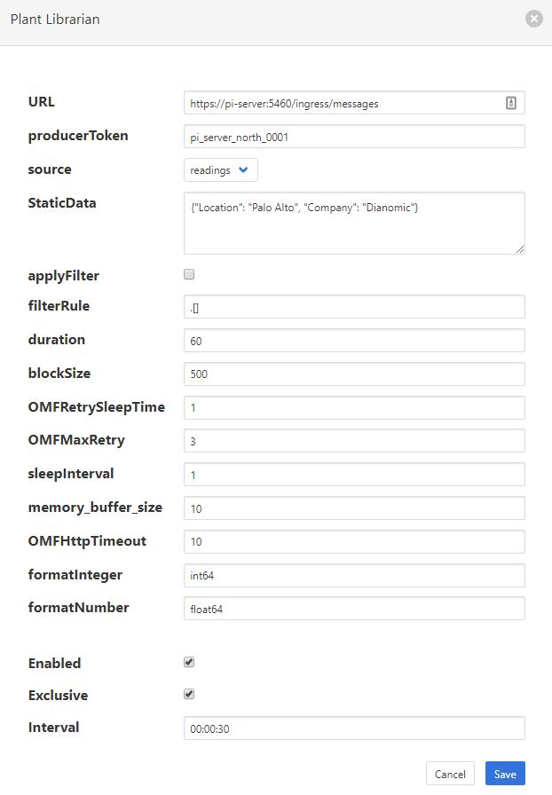
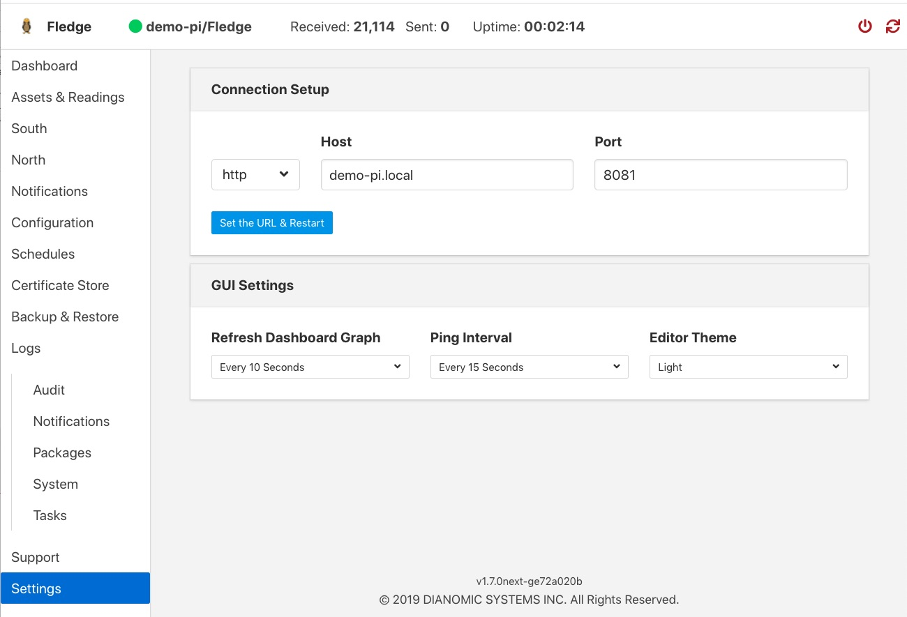
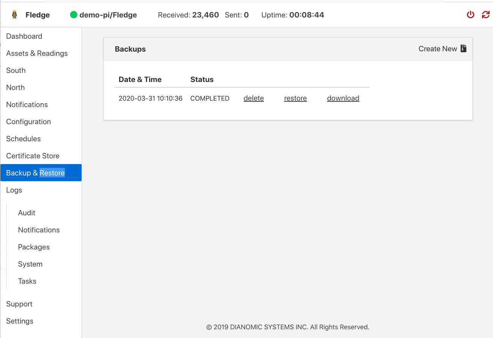
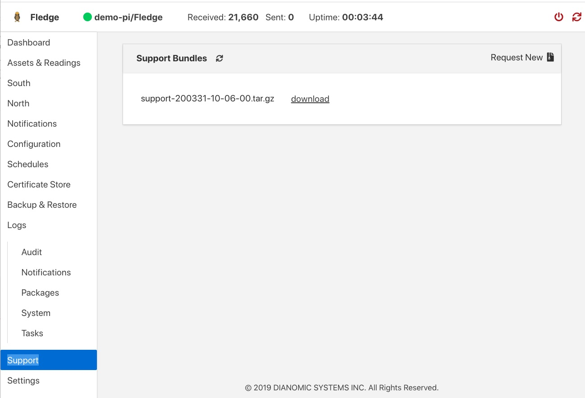
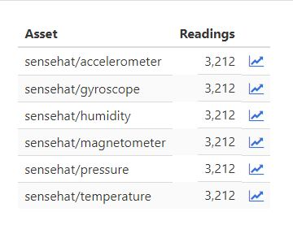

.. Images

.. |PI_connect| image:: images/PI_connect.jpg
.. |PI_connectors| image:: images/PI_connectors.jpg
.. |PI_token| image:: images/PI_token.jpg

*****************
Quick Start Guide
*****************

Introduction to FogLAMP
=======================

FogLAMP is an open sensor-to-cloud data fabric for the Internet of Things (IoT) that connects people and systems to the information they need to operate their business.  It provides a scalable, secure, robust infrastructure for collecting data from sensors, processing data at the edge and transporting data to historian and other management systems. FogLAMP can operate over the unreliable, intermittent and low bandwidth connections often found in IoT applications.

FogLAMP is implemented as a collection of microservices which include:

- Core services, including security, monitoring, and storage
- Data transformation and alerting services
- South services: Collect data from sensors and other FogLAMP systems
- North services: Transmit data to historians and other systems
- Edge data processing applications

Services can easily be developed and incorporated into the FogLAMP framework. The FogLAMP Developer Guides describe how to do this.

Installing FogLAMP
==================

FogLAMP is extremely lightweight and can run on inexpensive edge devices, sensors and actuator boards.  For the purposes of this manual, we assume that all services are running on a Raspberry Pi running the Raspbian operating system. Be sure your system has plenty of storage available for data readings.

If your system does not have Raspbian pre-installed, you can find instructions on downloading and installing it at https://www.raspberrypi.org/downloads/raspbian/.  After installing Raspbian, ensure you have the latest updates by executing the following commands on your FogLAMP server::

  sudo apt-get update
  sudo apt-get upgrade
  sudo apt-get update

You can obtain FogLAMP in two ways:

- Dianomic Systems offers pre-built, certified binaries of FogLAMP for Debian using either Intel or ARM architectures. This is the recommended method, especially for new users. You can download these from https://FogLAMP.readthedocs.io/en/master/92_downloads.html.
- As source code from https://github.com/foglamp/.  Instructions for downloading and building FogLAMP source code can be found in the FogLAMP Developer’s Guide

In general, FogLAMP installation will require the following packages:

- FogLAMP core
- FogLAMP user interface
- One or more FogLAMP South services
- One or more FogLAMP North service (OSI PI and OCS north services are included in FogLAMP core)

Installing FogLAMP packages
###########################

SSH into the system that will host FogLAMP services. For each FogLAMP package that you choose to install, type the following command::

  sudo apt -y install PackageName

The key packages to install are the FogLAMP core and the FogLAMP User Interface::

  sudo apt -y install ./foglamp-1.4.1-armhf.deb
  sudo apt -y install ./foglamp-gui-1.4.0-dev.deb

You will need to install one of more South plugins to acquire data.  You can either do this now or when you are adding the data source. For example, to install the plugin for the Sense HAT sensor board, type::

  sudo apt -y install ./foglamp-south-sensehat-1.0-armhf.deb

You may also need to install one or more North plugins to transmit data.  Support for OSIsoft PI and OCS are included with the FogLAMP core package, so you don't need to install anything more if you are sending data to only these systems.

Checking package installation
#############################

To check what packages have been installed, ssh into your host system and use the dpkg command::

  dpkg -l | grep 'foglamp'

Starting and stopping FogLAMP
=============================

FogLAMP administration is performed using the “foglamp” command line utility.  You must first ssh into the host system.  The FogLAMP utility is installed by default in /usr/local/foglamp/bin.

The following command options are available:

  - **Start:** Start the FogLAMP system
  - **Stop:** Stop the FogLAMP system
  - **Status:** Lists currently running FogLAMP services and tasks
  - **Reset:** Delete all data and configuration and return FogLAMP to factory settings
  - **Kill:** Kill FogLAMP services that have not correctly responded to Stop
  - **Help:** Describe FogLAMP options

For example, to start the FogLAMP system, open a session to the FogLAMP device and type::

/usr/local/foglamp/bin/foglamp start

Troubleshooting FogLAMP
#######################

FogLAMP logs status and error messages to syslog.  To troubleshoot a FogLAMP installation using this information, open a session to the FogLAMP server and type::

  grep -a 'foglamp' /var/log/syslog | tail -n 20

Running the FogLAMP GUI
=======================

FogLAMP offers an easy-to-use, browser-based GUI.  To access the GUI, open your browser and enter the IP address of the FogLAMP server into the address bar.  This will display the FogLAMP dashboard.

You can easily use the FogLAMP UI to monitor multiple FogLAMP servers.  To view and manage a different server, click "Settings" in the left menu bar. In the "Connection Setup" pane, enter the IP address and port number for the new server you wish to manage.  Click the "Set the URL & Restart" button to switch the UI to the new server.

If you are managing a very lightweight server or one that is connected via a slow network link, you may want to reduce the UI update frequency to minimize load on the server and network.  You can adjust this rate in the "GUI Settings" pane of the Settings screen.  While the graph rate and ping rate can be adjusted individually, in general you should set them to the same value.

FogLAMP Dashboard
#################
+-------------+
| |dashboard| |
+-------------+

This screen provides an overview of FogLAMP operations.  You can customize the information and time frames displayed on this screen using the drop-down menus in the upper right corner.  The information you select will be displayed in a series of graphs.

You can choose to view a graph of any of the sensor reading being collected by the FogLAMP system.  In addition, you can view graphs of the following system-wide information:

  - **Readings:** The total number of data readings collected by FogLAMP since system boot
  - **Buffered:** The number of data readings currently stored by the system
  - **Discarded:** Number of data readings discarded before being buffered (due to data errors, for example)
  - **Unsent:** Number of data readings that were not sent successfully
  - **Purged:** The total number of data readings that have been purged from the system
  - **Unsnpurged:** The number of data readings that were purged without being sent to a North service.

Managing Data Sources
=====================
+------------------+
| |south_services| |
+------------------+

Data sources are managed from the South Services screen.  To access this screen, click on “South” from the menu bar on the left side of any screen.

The South Services screen displays the status of all data sources in the FogLAMP system.  Each data source will display its status, the data assets it is providing, and the number of readings that have been collected.

Adding Data Sources
###################

To add a data source, you will first need to install the plugin for that sensor type.  If you have not already done this, open a terminal session to your FogLAMP server.  Download the package for the plugin and enter::

  sudo apt -y install PackageName

Once the plugin is installed return to the FogLAMP GUI and click on “Add+” in the upper right of the South Services screen.  FogLAMP will display a series of 3 screens to add the data source:

1. The first screen will ask you to select the plugin for the data source from the list of installed plugins.  If you do not see the plugin you need, refer to the Installing FogLAMP section of this manual.  In addition, this screen allows you to specify a display name for the data source.
2. The second screen allows you to configure the plugin and the data assets it will provide.  Note that every data asset in FogLAMP must have a unique name.  If you have multiple sensors using the same plugin, modify the asset names on this screen so they are unique. (Some plugins allow you to specify an asset name prefix that will apply to all the asset names for that sensor.)  Refer to the individual plugin documentation for descriptions of the fields on this screen.  If you modify any of the configuration fields, click on the “save” button to save them.
3. The final screen loads the plugin.  You can specify whether it will be enabled immediately for data collection or to await enabling in the future.

Configuring Data Sources
########################
+------------------------+
| |south_service_config| |
+------------------------+

To modify the configuration of a data source, click on its name in the South Services screen. This will display a list of all parameters available for that data source.  If you make any changes, click on the “save” button in the top panel to save the new configuration.  Click on the “x” button in the upper right corner to return to the South Services screen.

Enabling and Disabling Data Sources
###################################

To enable or disable a data source, click on its name in the South Services screen. Under the list of data source parameters, there is a check box to enable or disable the service.  If you make any changes, click on the “save” button in the bottom panel near the check box to save the new configuration.

Viewing Data
############
+----------------+
| |viewing_data| |
+----------------+

You can inspect all the data buffered by the FogLAMP system on the Assets page.  To access this page, click on “Assets & Readings” from the left-side menu bar.

This screen will display a list of every data asset in the system.  By clicking on the graph button next to each asset name, you can view a graph of individual data readings.  You can change the horizontal scale of the graph by entering the number of data readings to display in the dialog box of this screen.

Sending Data to Other Systems
=============================
+------------------+
| |north_services| |
+------------------+

Data destinations are managed from the North Services screen.  To access this screen, click on “North” from the menu bar on the left side of any screen.

The North Services screen displays the status of all data sending processes in the FogLAMP system.  Each data destination will display its status and the number of readings that have been collected.

Adding Data Destinations
########################

To add a data destination, click on “Create North Instance+” in the upper right of the North Services screen.  FogLAMP will display a series of 3 screens to add the data destination:

1. The first screen will ask you to select the plugin for the data destination from the list of installed plugins.  If you do not see the plugin you need, refer to the Installing FogLAMP section of this manual.  In addition, this screen allows you to specify a display name for the data destination. In addition, you can specify how frequently data will be forwarded to the destination in days, hours, minutes and seconds.  Enter the number of days in the interval in the left box and the number of hours, minutes and seconds in format HH:MM:SS in the right box.
2. The second screen allows you to configure the plugin and the data assets it will send.  See the section below for specifics of configuring a PI, EDS or OCS destination.
3. The final screen loads the plugin.  You can specify whether it will be enabled immediately for data sending or to await enabling in the future.

Configuring Data Destinations
#############################

To modify the configuration of a data destination, click on its name in the North Services screen. This will display a list of all parameters available for that data source.  If you make any changes, click on the “save” button in the top panel to save the new configuration.  Click on the “x” button in the upper right corner to return to the North Services screen.

Enabling and Disabling Data Destinations
########################################

To enable or disable a data source, click on its name in the North Services screen. Under the list of data source parameters, there is a check box to enable or disable the service.  If you make any changes, click on the “save” button in the bottom panel near the check box to save the new configuration.

Using the FogLAMP PI plugin
###########################

OSISoft PI systems are one of the most common destinations for FogLAMP data.  To send data to a PI server, open and sign into the PI Relay Data Connection Manager.

+-----------------+
| |PI_connectors| |
+-----------------+

To add a new connector for the FogLAMP system, click on the drop down menu to the right of "Connectors" and select "Add an OMF application".  Add and save the requested configuration information.

+--------------+
| |PI_connect| |
+--------------+

Connect the new application to the OMF Connector Relay by selecting the new FogLAMP application, clicking the check box for the OMF Connector Relay and then clicking "Save Configuration".

+------------+
| |PI_token| |
+------------+

Finally, select the new FogLAMP application. Click "More" at the bottom of the Configuration panel. Make note of the Producer Token and Relay Ingress URL.

Now go to the FogLAMP user interface, create a new North instance and select the “pi_server” plugin on the first screen.
The second screen will request the following information:

+--------------------+
| |pi_plugin_config| |
+--------------------+

- Basic Information
   - **URL:** The Relay Ingress URL provided by PI
   - **producerToken:** The Producer Token provided by PI
   - **Static Data:** Data to include in every reading sent to PI.  For example, you can use this to specify the location of the devices being monitored by the FogLAMP server.
- Data Filtering
   - **applyFilter:** Set to True if you are using a filter rule, false if not.
   - **filterRule:** A JQ formatted filter that determines which readings to send to PI
- Connection management (These should only be changed with guidance from support)
   - **OMFHttpTimeout:** Number of seconds to wait before FogLAMP will time out an HTTP connection attempt
   - **OMFRetrySleepTime:** Number of seconds to wait before retrying the HTTP connection (FogLAMP doubles this time after each failed attempt).
   - **OMFMaxRetry:** Maximum number of times to retry connecting to the PI server
- Other (Rarely changed)
   - **formatInteger:** Used to match FogLAMP data types to the data type configured in PI
   - **formatNumber:** Used to match FogLAMP data types to the data type configured in PI

Backing up and Restoring FogLAMP
=================================
+----------+
| |backup| |
+----------+

You can make a complete backup of all FogLAMP data and configuration.  To do this, click on "Backup & Restore" in the left menu bar. This screen will show a list of all backups on the system and the time they were created.
To make a new backup, click the "Backup" button in the upper right corner of the screen.  You will briefly see a "Running" indicator in the lower left of the screen.  After a period of time, the new backup will appear in the list.  You may need to click the refresh button in the upper left of the screen to refresh the list.
You can restore, delete or download any backup simply by clicking the appropriate button next to the backup in the list.

Troubleshooting and Support Information
=======================================
+-----------+
| |support| |
+-----------+

FogLAMP keep detailed logs of system events for both auditing and troubleshooting use.  To access them, click "Logs" in the left menu bar.  There are three logs in the system:

  - **Audit:** Tracks all configuration changes and data uploads performed on the FogLAMP system.
  - **System:** All events and scheduled tasks and their status.
  - **Tasks:** The most recent scheduled tasks that have run and their status

If you have a service contract for your FogLAMP system, your support technician may ask you to send system data to facilitate troubleshooting an issue.  To do this, click on “Support” in the left menu and then “Request New” in the upper right of the screen.  This will create an archive of information.  Click download to retrieve this archive to your system so you can email it to the technician.
