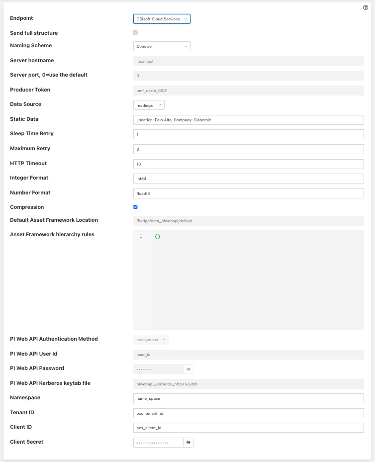
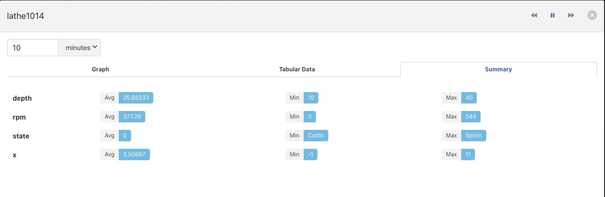
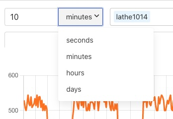
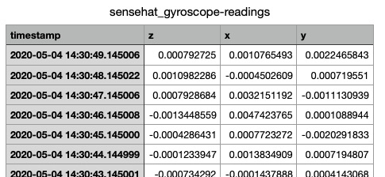

.. Images
.. |dashboard| image:: images/dashboard.JPG
.. |south_services| image:: images/south_services.JPG
.. |south_service_config| image:: images/south_service_config.JPG
.. |north_services| image:: images/north_services.JPG
.. |pi_plugin_config| image:: images/pi_plugin_config.JPG
.. |settings| image:: images/settings.JPG
.. |backup| image:: images/backup.JPG
.. |support| image:: images/support.JPG
.. |viewing_data| image:: images/viewing_data.JPG
.. |PI_connect| image:: images/PI_connect.jpg
.. |PI_connectors| image:: images/PI_connectors.jpg
.. |PI_token| image:: images/PI_token.jpg
.. |omf_plugin_pi_web_config| image:: images/omf-plugin-pi-web.jpg
.. |omf_plugin_connector_relay_config| image:: images/omf-plugin-connector-relay.jpg
.. |omf_plugin_eds_config| image:: images/omf-plugin-eds.jpg

.. |view_graph| image:: images/view_graph.jpg
.. |view_hide| image:: images/view_hide.jpg

*****************
Quick Start Guide
*****************

Introduction to Fledge
=======================

Fledge is an open sensor-to-cloud data fabric for the Internet of Things (IoT) that connects people and systems to the information they need to operate their business.  It provides a scalable, secure, robust infrastructure for collecting data from sensors, processing data at the edge and transporting data to historian and other management systems. Fledge can operate over the unreliable, intermittent and low bandwidth connections often found in IoT applications.

Fledge is implemented as a collection of microservices which include:

- Core services, including security, monitoring, and storage
- Data transformation and alerting services
- South services: Collect data from sensors and other Fledge systems
- North services: Transmit data to historians and other systems
- Edge data processing applications

Services can easily be developed and incorporated into the Fledge framework. The Fledge Developer Guides describe how to do this.

Installing Fledge
==================

Fledge is extremely lightweight and can run on inexpensive edge devices, sensors and actuator boards.  For the purposes of this manual, we assume that all services are running on a Raspberry Pi running the Raspbian operating system. Be sure your system has plenty of storage available for data readings.

If your system does not have Raspbian pre-installed, you can find instructions on downloading and installing it at https://www.raspberrypi.org/downloads/raspbian/.  After installing Raspbian, ensure you have the latest updates by executing the following commands on your Fledge server::

  sudo apt-get update
  sudo apt-get upgrade
  sudo apt-get update

You can obtain Fledge in two ways:

- Dianomic Systems offers pre-built, certified binaries of Fledge for Debian using either Intel or ARM architectures. This is the recommended method, especially for new users. You can download these from https://fledge-iot.readthedocs.io/en/latest/92_downloads.html.
- As source code from https://github.com/fledge-iot/.  Instructions for downloading and building Fledge source code can be found in the Fledge Developer’s Guide

In general, Fledge installation will require the following packages:

- Fledge core
- Fledge user interface
- One or more Fledge South services
- One or more Fledge North service (OSI PI and OCS north services are included in Fledge core)

Installing Fledge packages
###########################

SSH into the system that will host Fledge services. For each Fledge package that you choose to install, type the following command::

  sudo apt -y install PackageName

The key packages to install are the Fledge core and the Fledge User Interface::

  sudo apt -y install ./fledge-1.4.1-armhf.deb
  sudo apt -y install ./fledge-gui-1.4.0-dev.deb

You will need to install one of more South plugins to acquire data.  You can either do this now or when you are adding the data source. For example, to install the plugin for the Sense HAT sensor board, type::

  sudo apt -y install ./fledge-south-sensehat-1.0-armhf.deb

You may also need to install one or more North plugins to transmit data.  Support for OSIsoft PI and OCS are included with the Fledge core package, so you don't need to install anything more if you are sending data to only these systems.

Checking package installation
#############################

To check what packages have been installed, ssh into your host system and use the dpkg command::

  dpkg -l | grep 'fledge'

Starting and stopping Fledge
=============================

Fledge administration is performed using the “fledge” command line utility.  You must first ssh into the host system.  The Fledge utility is installed by default in /usr/local/fledge/bin.

The following command options are available:

  - **Start:** Start the Fledge system
  - **Stop:** Stop the Fledge system
  - **Status:** Lists currently running Fledge services and tasks
  - **Reset:** Delete all data and configuration and return Fledge to factory settings
  - **Kill:** Kill Fledge services that have not correctly responded to Stop
  - **Help:** Describe Fledge options

For example, to start the Fledge system, open a session to the Fledge device and type::

/usr/local/fledge/bin/fledge start

Troubleshooting Fledge
#######################

Fledge logs status and error messages to syslog.  To troubleshoot a Fledge installation using this information, open a session to the Fledge server and type::

  grep -a 'fledge' /var/log/syslog | tail -n 20

Running the Fledge GUI
=======================

Fledge offers an easy-to-use, browser-based GUI.  To access the GUI, open your browser and enter the IP address of the Fledge server into the address bar.  This will display the Fledge dashboard.

You can easily use the Fledge UI to monitor multiple Fledge servers.  To view and manage a different server, click "Settings" in the left menu bar. In the "Connection Setup" pane, enter the IP address and port number for the new server you wish to manage.  Click the "Set the URL & Restart" button to switch the UI to the new server.

If you are managing a very lightweight server or one that is connected via a slow network link, you may want to reduce the UI update frequency to minimize load on the server and network.  You can adjust this rate in the "GUI Settings" pane of the Settings screen.  While the graph rate and ping rate can be adjusted individually, in general you should set them to the same value.

Fledge Dashboard
#################
+-------------+
| |dashboard| |
+-------------+

This screen provides an overview of Fledge operations.  You can customize the information and time frames displayed on this screen using the drop-down menus in the upper right corner.  The information you select will be displayed in a series of graphs.

You can choose to view a graph of any of the sensor reading being collected by the Fledge system.  In addition, you can view graphs of the following system-wide information:

  - **Readings:** The total number of data readings collected by Fledge since system boot
  - **Buffered:** The number of data readings currently stored by the system
  - **Discarded:** Number of data readings discarded before being buffered (due to data errors, for example)
  - **Unsent:** Number of data readings that were not sent successfully
  - **Purged:** The total number of data readings that have been purged from the system
  - **Unsnpurged:** The number of data readings that were purged without being sent to a North service.

Managing Data Sources
=====================
+------------------+
| |south_services| |
+------------------+

Data sources are managed from the South Services screen.  To access this screen, click on “South” from the menu bar on the left side of any screen.

The South Services screen displays the status of all data sources in the Fledge system.  Each data source will display its status, the data assets it is providing, and the number of readings that have been collected.

Adding Data Sources
###################

To add a data source, you will first need to install the plugin for that sensor type.  If you have not already done this, open a terminal session to your Fledge server.  Download the package for the plugin and enter::

  sudo apt -y install PackageName

Once the plugin is installed return to the Fledge GUI and click on “Add+” in the upper right of the South Services screen.  Fledge will display a series of 3 screens to add the data source:

1. The first screen will ask you to select the plugin for the data source from the list of installed plugins.  If you do not see the plugin you need, refer to the Installing Fledge section of this manual.  In addition, this screen allows you to specify a display name for the data source.

2. The second screen allows you to configure the plugin and the data assets it will provide. 

   .. note::

      Every data asset in Fledge must have a unique name.  If you have multiple sensors using the same plugin, modify the asset names on this screen so they are unique. 
      
   Some plugins allow you to specify an asset name prefix that will apply to all the asset names for that sensor. Refer to the individual plugin documentation for descriptions of the fields on this screen.

3. If you modify any of the configuration fields, click on the “save” button to save them.

4. The final screen allows you to specify whether the service will be enabled immediately for data collection or await enabling in the future.

Configuring Data Sources
########################
+------------------------+
| |south_service_config| |
+------------------------+

To modify the configuration of a data source, click on its name in the South Services screen. This will display a list of all parameters available for that data source.  If you make any changes, click on the “save” button in the top panel to save the new configuration.  Click on the “x” button in the upper right corner to return to the South Services screen.

Enabling and Disabling Data Sources
###################################

To enable or disable a data source, click on its name in the South Services screen. Under the list of data source parameters, there is a check box to enable or disable the service.  If you make any changes, click on the “save” button in the bottom panel near the check box to save the new configuration.

Viewing Data
############
+----------------+
| |viewing_data| |
+----------------+

You can inspect all the data buffered by the Fledge system on the Assets page.  To access this page, click on “Assets & Readings” from the left-side menu bar.

This screen will display a list of every data asset in the system.  Alongside each asset are two icons; one to display a graph of the asset and another to download the data stored for that asset as a CSV file.

Display Graph
-------------

.. image:: images/graph_icon.jpg
   :align: left

By clicking on the graph button next to each asset name, you can view a graph of individual data readings. A graph will be displayed with a plot for each data point within the asset.

+--------------+
| |view_graph| |
+--------------+

It is possible to change the time period to which the graph refers by use of the plugin list in the top left of the graph.

+--------------+
| |view_times| |
+--------------+

Where an asset contains multiple data points each of these is displayed in a different colour. Graphs for particular data points can be toggled on and off by clicking on the key at the top of the graph. Those data points not should will be indicated by striking through the name of the data point.

+-------------+
| |view_hide| |
+-------------+

A summary tab is also available, this will show the minimum, maximum and average values for each of the data points. Click on *Summary* to show the summary tab.

+----------------+
| |view_summary| |
+----------------+

Download Data
-------------

.. image:: images/download_icon.jpg
   :align: left

By clicking on the download icon adjacent to each asset you can download the stored data for the asset. The format of the file is download is a CSV file that is designed to be loaded int a spreadsheet such as Excel, Numbers or OpenOffice Calc.

The file contains a header row with the names of the data points within the asset, the first column is always the timestamp when the reading was taken, the header for this being *timestamp*. The data is sorted in chronological order with the newest data first.

+--------------------+
| |view_spreadsheet| |
+--------------------+

Sending Data to Other Systems
=============================
+------------------+
| |north_services| |
+------------------+

Data destinations are managed from the North Services screen.  To access this screen, click on “North” from the menu bar on the left side of any screen.

The North Services screen displays the status of all data sending processes in the Fledge system.  Each data destination will display its status and the number of readings that have been collected.

Adding Data Destinations
########################

To add a data destination, click on “Create North Instance+” in the upper right of the North Services screen.  Fledge will display a series of 3 screens to add the data destination:

1. The first screen will ask you to select the plugin for the data destination from the list of installed plugins.  If you do not see the plugin you need, refer to the Installing Fledge section of this manual.  In addition, this screen allows you to specify a display name for the data destination. In addition, you can specify how frequently data will be forwarded to the destination in days, hours, minutes and seconds.  Enter the number of days in the interval in the left box and the number of hours, minutes and seconds in format HH:MM:SS in the right box.
2. The second screen allows you to configure the plugin and the data assets it will send.  See the section below for specifics of configuring a PI, EDS or OCS destination.
3. The final screen loads the plugin.  You can specify whether it will be enabled immediately for data sending or to await enabling in the future.

Configuring Data Destinations
#############################

To modify the configuration of a data destination, click on its name in the North Services screen. This will display a list of all parameters available for that data source.  If you make any changes, click on the “save” button in the top panel to save the new configuration.  Click on the “x” button in the upper right corner to return to the North Services screen.

Enabling and Disabling Data Destinations
########################################

To enable or disable a data source, click on its name in the North Services screen. Under the list of data source parameters, there is a check box to enable or disable the service.  If you make any changes, click on the “save” button in the bottom panel near the check box to save the new configuration.

Using the OMF plugin
####################

OSISoft data historians are one of the most common destinations for Fledge data.  Fledge supports the full range of OSISoft historians; the PI System, Edge Data Store (EDS) and OSISoft Cloud Services (OCS). To send data to a PI server you may use either the older PI Connector Relay or the newer PI Web API OMF endpoint. It is recommended that new users use the PI Web API OMF endpoint rather then the Connector Relay which is no longer supported.

PI Connector Relay
------------------

To use the Connector Relay, open and sign into the PI Relay Data Connection Manager.

+-----------------+
| |PI_connectors| |
+-----------------+

To add a new connector for the Fledge system, click on the drop down menu to the right of "Connectors" and select "Add an OMF application".  Add and save the requested configuration information.

+--------------+
| |PI_connect| |
+--------------+

Connect the new application to the OMF Connector Relay by selecting the new Fledge application, clicking the check box for the OMF Connector Relay and then clicking "Save Configuration".

+------------+
| |PI_token| |
+------------+

Finally, select the new Fledge application. Click "More" at the bottom of the Configuration panel. Make note of the Producer Token and Relay Ingress URL.

Now go to the Fledge user interface, create a new North instance and select the “OMF” plugin on the first screen.
The second screen will request the following information:

+-------------------------------------+
| |omf_plugin_connector_relay_config| |
+-------------------------------------+

- Basic Information
   - **Endpoint:** Select what you wish to connect to, in this case the Connector Relay.
   - **Server hostname:** The hostname or address of the Connector Relay.
   - **Server port:** The port the Connector Relay is listening on. Leave as 0 if you are using the default port.
   - **Producer Token:** The Producer Token provided by PI
   - **Data Source:** Defines which data is sent to the PI Server. The readings or Fledge's internal statistics.
   - **Static Data:** Data to include in every reading sent to PI.  For example, you can use this to specify the location of the devices being monitored by the Fledge server.
- Connection management (These should only be changed with guidance from support)
   - **Sleep Time Retry:** Number of seconds to wait before retrying the HTTP connection (Fledge doubles this time after each failed attempt).
   - **Maximum Retry:** Maximum number of times to retry connecting to the PI server.
   - **HTTP Timeout:** Number of seconds to wait before Fledge will time out an HTTP connection attempt.
- Other (Rarely changed)
   - **Integer Format:** Used to match Fledge data types to the data type configured in PI. This defaults to int64 but may be set to any OMF data type compatible with integer data, e.g. int32.
   - **Number Format:** Used to match Fledge data types to the data type configured in PI. The defaults is float64 but may be set to any OMF datatype that supports floating point values.
   - **Compression:** Compress the readings data before sending it to the PI System.

PI Web API OMF Endpoint
-----------------------

To use the PI Web API OMF endpoint first  ensure the OMF option was included in your PI Server when it was installed.  

Now go to the Fledge user interface, create a new North instance and select the “OMF” plugin on the first screen.
The second screen will request the following information:

+----------------------------+
| |omf_plugin_pi_web_config| |
+----------------------------+

Select PI Web API from the Endpoint options.

- Basic Information
   - **Endpoint:** Select what you wish to connect to, in this case PI Web API.
   - **Server hostname:** The hostname or address of the PI Server.
   - **Server port:** The port the PI Web API OMF endpoint is listening on. Leave as 0 if you are using the default port.
   - **Data Source:** Defines which data is sent to the PI Server. The readings or Fledge's internal statistics.
   - **Static Data:** Data to include in every reading sent to PI.  For example, you can use this to specify the location of the devices being monitored by the Fledge server.
- Asset Framework
   - **Asset Framework Hierarchies Tree:** The location in the Asset Framework into which the data will be inserted. All data will be inserted at this point in the Asset Framework unless a later rule overrides this.
   - **Asset Framework Hierarchies Rules:** A set of rules that allow specific readings to be placed elsewhere in the Asset Framework. These rules can be based on the name of the asset itself or some metadata associated with the asset.
- PI Web API authentication
   - **PI Web API Authentication Method:** The authentication method to be used, anonymous equates to no authentication, basic authentication requires a user name and password and Kerberos allows integration with your single sign on environment.
   - **PI Web API User Id:**  The user name to authenticate with the PI Web API.
   - **PI Web API Password:** The password of the user we are using to authenticate.
   - **PI Web API Kerberos keytab file:** The Kerberos keytab file used to authenticate.
- Connection management (These should only be changed with guidance from support)
   - **Sleep Time Retry:** Number of seconds to wait before retrying the HTTP connection (Fledge doubles this time after each failed attempt).
   - **Maximum Retry:** Maximum number of times to retry connecting to the PI server.
   - **HTTP Timeout:** Number of seconds to wait before Fledge will time out an HTTP connection attempt.
- Other (Rarely changed)
   - **Integer Format:** Used to match Fledge data types to the data type configured in PI. This defaults to int64 but may be set to any OMF data type compatible with integer data, e.g. int32.
   - **Number Format:** Used to match Fledge data types to the data type configured in PI. The defaults is float64 but may be set to any OMF datatype that supports floating point values.
   - **Compression:** Compress the readings data before sending it to the PI System.

EDS OMF Endpoint
----------------

To use the OSISoft Edge Data Store first install Edge Data Store on the same machine as your Fledge instance. It is a limitation of Edge Data Store that it must reside on the same host as any system that connects to it with OMF.

Now go to the Fledge user interface, create a new North instance and select the “OMF” plugin on the first screen.
The second screen will request the following information:

+-------------------------+
| |omf_plugin_eds_config| |
+-------------------------+

Select Edge Data Store from the Endpoint options.

- Basic Information
   - **Endpoint:** Select what you wish to connect to, in this case Edge Data Store.
   - **Server hostname:** The hostname or address of the PI Server. This must be the localhost for EDS.
   - **Server port:** The port the Edge Datastore is listening on. Leave as 0 if you are using the default port.
   - **Data Source:** Defines which data is sent to the PI Server. The readings or Fledge's internal statistics.
   - **Static Data:** Data to include in every reading sent to PI.  For example, you can use this to specify the location of the devices being monitored by the Fledge server.
- Connection management (These should only be changed with guidance from support)
   - **Sleep Time Retry:** Number of seconds to wait before retrying the HTTP connection (Fledge doubles this time after each failed attempt).
   - **Maximum Retry:** Maximum number of times to retry connecting to the PI server.
   - **HTTP Timeout:** Number of seconds to wait before Fledge will time out an HTTP connection attempt.
- Other (Rarely changed)
   - **Integer Format:** Used to match Fledge data types to the data type configured in PI. This defaults to int64 but may be set to any OMF data type compatible with integer data, e.g. int32.
   - **Number Format:** Used to match Fledge data types to the data type configured in PI. The defaults is float64 but may be set to any OMF datatype that supports floating point values.
   - **Compression:** Compress the readings data before sending it to the PI System.

OCS OMF Endpoint
----------------

Go to the Fledge user interface, create a new North instance and select the “OMF” plugin on the first screen.
The second screen will request the following information:

+-------------------------+
| |omf_plugin_ocs_config| |
+-------------------------+

Select OSIsoft Cloud Services from the Endpoint options.

- Basic Information
   - **Endpoint:** Select what you wish to connect to, in this case OSIsoft Cloud Services.
   - **Data Source:** Defines which data is sent to the PI Server. The readings or Fledge's internal statistics.
   - **Static Data:** Data to include in every reading sent to PI.  For example, you can use this to specify the location of the devices being monitored by the Fledge server.
- Authentication
   - **OCS Namespace:** Your namespace within the OSISoft Cloud Services.
   - **OCS Tenant ID:** Your OSISoft Cloud Services tenant ID for yor account.
   - **OCS Client ID:** Your OSISoft Cloud Services client ID for your account.
   - **OCS Client Secret:** Your OCS client secret.
- Connection management (These should only be changed with guidance from support)
   - **Sleep Time Retry:** Number of seconds to wait before retrying the HTTP connection (Fledge doubles this time after each failed attempt).
   - **Maximum Retry:** Maximum number of times to retry connecting to the PI server.
   - **HTTP Timeout:** Number of seconds to wait before Fledge will time out an HTTP connection attempt.
- Other (Rarely changed)
   - **Integer Format:** Used to match Fledge data types to the data type configured in PI. This defaults to int64 but may be set to any OMF data type compatible with integer data, e.g. int32.
   - **Number Format:** Used to match Fledge data types to the data type configured in PI. The defaults is float64 but may be set to any OMF datatype that supports floating point values.
   - **Compression:** Compress the readings data before sending it to the PI System.

Backing up and Restoring Fledge
=================================
+----------+
| |backup| |
+----------+

You can make a complete backup of all Fledge data and configuration.  To do this, click on "Backup & Restore" in the left menu bar. This screen will show a list of all backups on the system and the time they were created.
To make a new backup, click the "Backup" button in the upper right corner of the screen.  You will briefly see a "Running" indicator in the lower left of the screen.  After a period of time, the new backup will appear in the list.  You may need to click the refresh button in the upper left of the screen to refresh the list.
You can restore, delete or download any backup simply by clicking the appropriate button next to the backup in the list.

Troubleshooting and Support Information
=======================================
+-----------+
| |support| |
+-----------+

Fledge keep detailed logs of system events for both auditing and troubleshooting use.  To access them, click "Logs" in the left menu bar.  There are five logs in the system:

  - **Audit:** Tracks all configuration changes and data uploads performed on the Fledge system.
  - **Notifications:** If you are using the Fledge notification service this log will give details of notifications that have been triggered
  - **Packages:** This log will give you information about the installation and upgrade of Fledge packages for services and plugins.
  - **System:** All events and scheduled tasks and their status.
  - **Tasks:** The most recent scheduled tasks that have run and their status

If you have a service contract for your Fledge system, your support technician may ask you to send system data to facilitate troubleshooting an issue.  To do this, click on “Support” in the left menu and then “Request New” in the upper right of the screen.  This will create an archive of information.  Click download to retrieve this archive to your system so you can email it to the technician.
