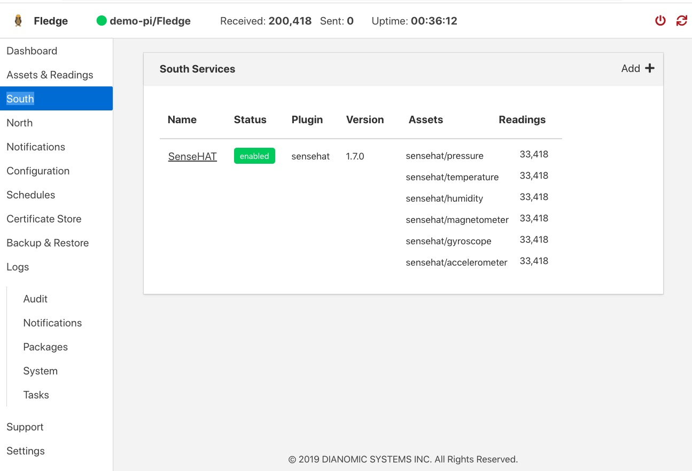

.. Images

.. |south_service_config| image:: ../images/south_service_config.JPG

Managing Data Sources
=====================
+------------------+
| |south_services| |
+------------------+

Data sources are managed from the South Services screen.  To access this screen, click on “South” from the menu bar on the left side of any screen.

The South Services screen displays the status of all data sources in the Fledge system.  Each data source will display its status, the data assets it is providing, and the number of readings that have been collected.

Adding Data Sources
###################

To add a data source, you will first need to install the plugin for that sensor type.  If you have not already done this, open a terminal session to your Fledge server.  Download the package for the plugin and enter::

  sudo apt -y install PackageName

Once the plugin is installed return to the Fledge GUI and click on “Add+” in the upper right of the South Services screen.  Fledge will display a series of 3 screens to add the data source:

1. The first screen will ask you to select the plugin for the data source from the list of installed plugins.  If you do not see the plugin you need, refer to the Installing Fledge section of this manual.  In addition, this screen allows you to specify a display name for the data source.

2. The second screen allows you to configure the plugin and the data assets it will provide. 

   .. note::

      Every data asset in Fledge must have a unique name.  If you have multiple sensors using the same plugin, modify the asset names on this screen so they are unique. 
      
   Some plugins allow you to specify an asset name prefix that will apply to all the asset names for that sensor. Refer to the individual plugin documentation for descriptions of the fields on this screen.

3. If you modify any of the configuration fields, click on the “save” button to save them.

4. The final screen allows you to specify whether the service will be enabled immediately for data collection or await enabling in the future.

Configuring Data Sources
########################
+------------------------+
| |south_service_config| |
+------------------------+

To modify the configuration of a data source, click on its name in the South Services screen. This will display a list of all parameters available for that data source.  If you make any changes, click on the “save” button in the top panel to save the new configuration.  Click on the “x” button in the upper right corner to return to the South Services screen.

Enabling and Disabling Data Sources
###################################

To enable or disable a data source, click on its name in the South Services screen. Under the list of data source parameters, there is a check box to enable or disable the service.  If you make any changes, click on the “save” button in the bottom panel near the check box to save the new configuration.
