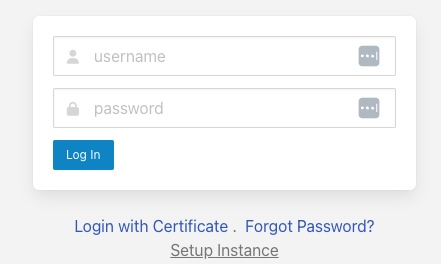
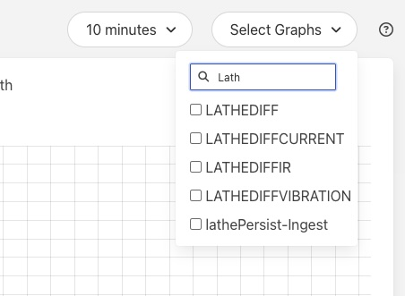

.. Images

.. |dashboard| image:: ../images/dashboard.JPG

.. Links
.. |secure| raw:: html

   <a href="../securing_fledge.html">Securing Fledge</a>

Running the Fledge GUI
=======================

Fledge offers an easy-to-use, browser-based GUI. To access the GUI, open your browser and enter the IP address of the Fledge server into the address bar. This will display the Fledge dashboard.

.. note::

   As of version 3.0 of Fledge and onward the user must login in order to access Fledge. Two default usernames; *admin* and *user* are created on installation. The password for both of these is set to *fledge*. It is strongly recommended to change both passwords at the earliest opportunity.

+---------+
| |login| |
+---------+

Enter a username and password to authenticate, unless changed, the username to use is *admin* with a password of *fledge*.

The *Setup Instance* link can be used to configure the URL of the Fledge instance if you have installed the Fledge GUI on a different host from Fledge itself.

To understand more relating to the Fledge security features please see the |secure| section of the documentation.

You can easily use the Fledge UI to monitor multiple Fledge servers. To view and manage a different server, click "Settings" in the left menu bar. In the "Connection Setup" pane, enter the IP address and port number for the new server you wish to manage. Click the "Set the URL & Restart" button to switch the UI to the new server.

If you are managing a very lightweight server or one that is connected via a slow network link, you may want to reduce the UI update frequency to minimize load on the server and network.  You can adjust this rate in the "GUI Settings" pane of the Settings screen. While the graph rate and ping rate can be adjusted individually, in general you should set them to the same value.

Fledge Dashboard
#################
+-------------+
| |dashboard| |
+-------------+

This screen provides an overview of Fledge operations. You can customize the information and time frames displayed on this screen using the drop-down menus in the upper right corner. The information you select will be displayed in a series of graphs.

You can choose to view a graph of any of the statistics for sensor readings being collected by the Fledge system or the ingest rates for any of the Fledge services. In addition, you can view graphs of the following system-wide statistics:

  - **READINGS:** The total number of data readings collected by Fledge since system boot.
  - **BUFFERED:** The number of data readings currently in the Fledge buffer.
  - **DISCARDED:** Number of data readings discarded before being buffered (due to data errors, for example).
  - **UNSENT:** Number of data readings that were not sent successfully.
  - **PURGED:** The total number of data readings that have been purged from the system.
  - **UNSNPURGED:** The number of data readings that were purged without being sent to a North service.

In a Fledge system that has many services, or where multiple assets are ingested per service, the list of available statistics to display can become long very quickly. In order to aid the process of finding the statistic you wish to view in the dashboard a search option is provided.

+-------------------+
| |DashboardSearch| |
+-------------------+

Simply type part of the name you wish to locate in the drop down and the content of the drop down list will be filtered to show just those statistics that match the string you type.

.. note::

   The filtering algorithm is independent of the case of the string you enter and in the name of the matching statistic.

