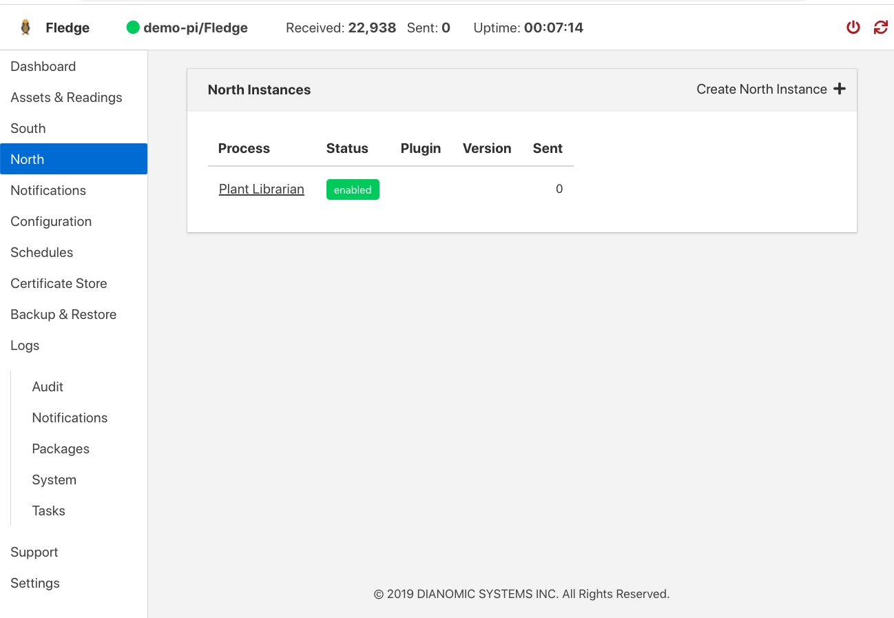

.. Images

.. |pi_plugin_config| image:: ../images/pi_plugin_config.JPG

Sending Data to Other Systems
=============================
+------------------+
| |north_services| |
+------------------+

Data destinations are managed from the North Services screen.  To access this screen, click on “North” from the menu bar on the left side of any screen.

The North Services screen displays the status of all data sending processes in the Fledge system.  Each data destination will display its status and the number of readings that have been collected.

Adding Data Destinations
########################

To add a data destination, click on “Create North Instance+” in the upper right of the North Services screen.  Fledge will display a series of 3 screens to add the data destination:

1. The first screen will ask you to select the plugin for the data destination from the list of installed plugins.  If you do not see the plugin you need, refer to the Installing Fledge section of this manual.  In addition, this screen allows you to specify a display name for the data destination. In addition, you can specify how frequently data will be forwarded to the destination in days, hours, minutes and seconds.  Enter the number of days in the interval in the left box and the number of hours, minutes and seconds in format HH:MM:SS in the right box.
2. The second screen allows you to configure the plugin and the data assets it will send.  See the section below for specifics of configuring a PI, EDS or OCS destination.
3. The final screen loads the plugin.  You can specify whether it will be enabled immediately for data sending or to await enabling in the future.

Configuring Data Destinations
#############################

To modify the configuration of a data destination, click on its name in the North Services screen. This will display a list of all parameters available for that data source.  If you make any changes, click on the “save” button in the top panel to save the new configuration.  Click on the “x” button in the upper right corner to return to the North Services screen.

Enabling and Disabling Data Destinations
########################################

To enable or disable a data source, click on its name in the North Services screen. Under the list of data source parameters, there is a check box to enable or disable the service.  If you make any changes, click on the “save” button in the bottom panel near the check box to save the new configuration.

Failure to Send Data
####################

If Fledge is unable to send data to another system via a north service it will write a log message to the error log and also raise an alarm. These alarms are shown in the status bar of the Fledge user interface.

+----------------+
| |NorthFailure| |
+----------------+

The failure could be an incorrect configuration within Fledge for the particular north plugin or it may be caused by the upstream system being unavailable or there being no network route to the upstream system.

Using the OMF plugin
####################

OSISoft data historians are one of the most common destinations for Fledge data.  Fledge supports the full range of OSISoft historians; the PI System, Edge Data Store (EDS) and OSISoft Cloud Services (OCS). To send data to a PI server you may use either the older PI Connector Relay or the newer PI Web API OMF endpoint. It is recommended that new users use the PI Web API OMF endpoint rather then the Connector Relay which is no longer supported by OSIsoft.

