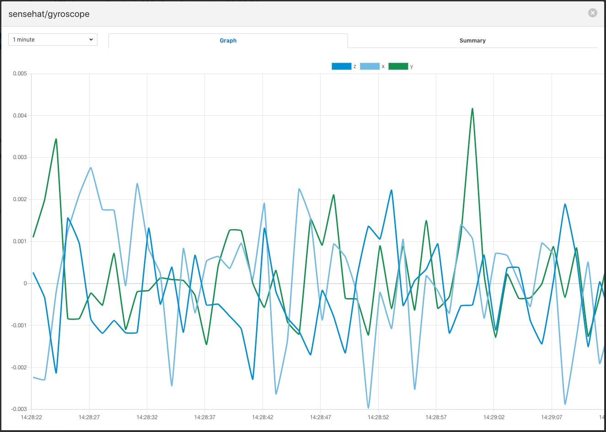
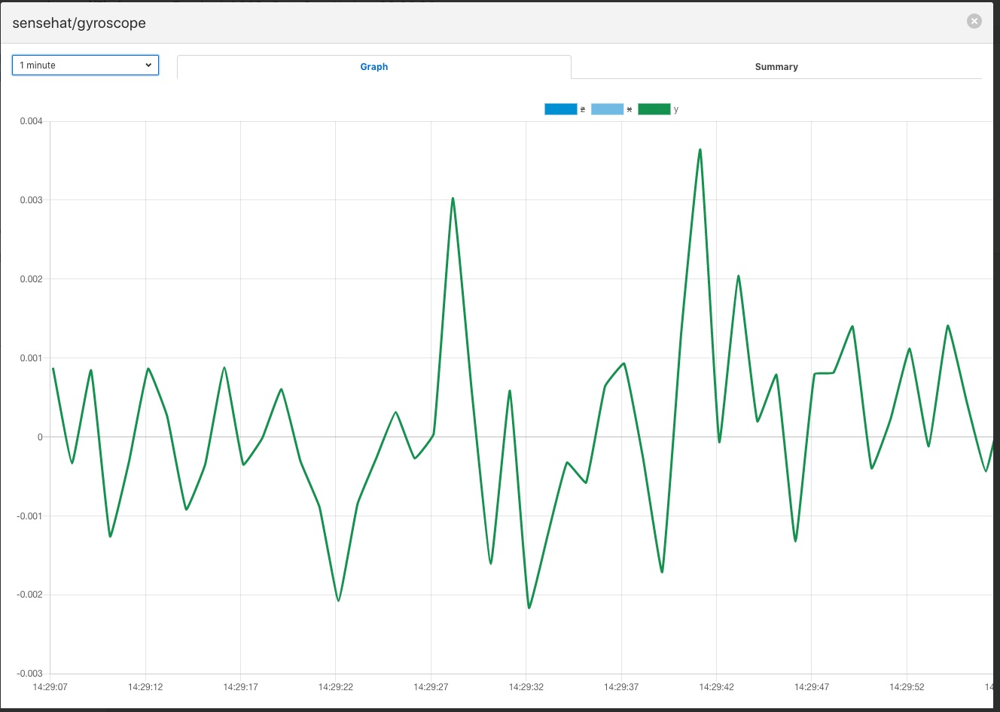
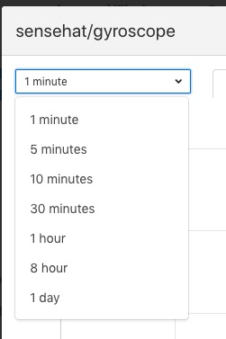
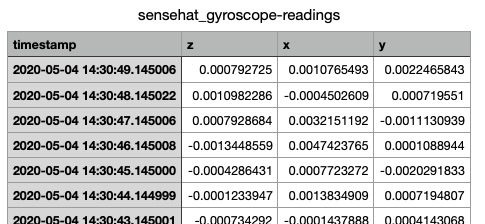
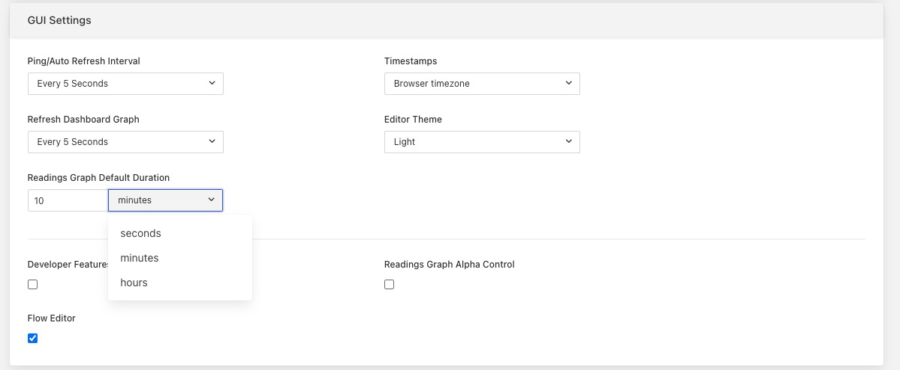
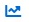
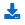

.. Images
.. |viewing_data| image:: ../images/viewing_data.JPG

.. |view_summary| image:: ../images/view_summary.jpg

Viewing Data
############
+----------------+
| |viewing_data| |
+----------------+

You can inspect all the data buffered by the Fledge system on the Assets page.  To access this page, click on “Assets & Readings” from the left-side menu bar.

This screen will display a list of every data asset in the system.  Alongside each asset are two icons; one to display a graph of the asset and another to download the data stored for that asset as a CSV file.

Display Graph
~~~~~~~~~~~~~

By clicking on the graph button next to each asset name, you can view a graph of individual data readings. A graph will be displayed with a plot for each data point within the asset.

+--------------+
| |view_graph| |
+--------------+

It is possible to change the time period to which the graph refers by use of the plugin list in the top left of the graph.

+--------------+
| |view_times| |
+--------------+

It is also possible to change the default duration of a graph when it is first displayed. This is done via the *Settings* menu item.

+----------------+
| |gui_settings| |
+----------------+

This can be useful when very high frequency data is ingested into the system as it will prevent the inital graph that is displayed from pulling large amounts of data from the system and slowing down the response of the system and the GUI.

Where an asset contains multiple data points each of these is displayed in a different colour. Graphs for particular data points can be toggled on and off by clicking on the key at the top of the graph. Those data points not should will be indicated by striking through the name of the data point.

+-------------+
| |view_hide| |
+-------------+

A summary tab is also available, this will show the minimum, maximum and average values for each of the data points. Click on *Summary* to show the summary tab.

+----------------+
| |view_summary| |
+----------------+

Download Data
~~~~~~~~~~~~~

By clicking on the download icon adjacent to each asset you can download the stored data for the asset. The format of the file is download is a CSV file that is designed to be loaded int a spreadsheet such as Excel, Numbers or OpenOffice Calc.

The file contains a header row with the names of the data points within the asset, the first column is always the timestamp when the reading was taken, the header for this being *timestamp*. The data is sorted in chronological order with the newest data first.

+--------------------+
| |view_spreadsheet| |
+--------------------+

