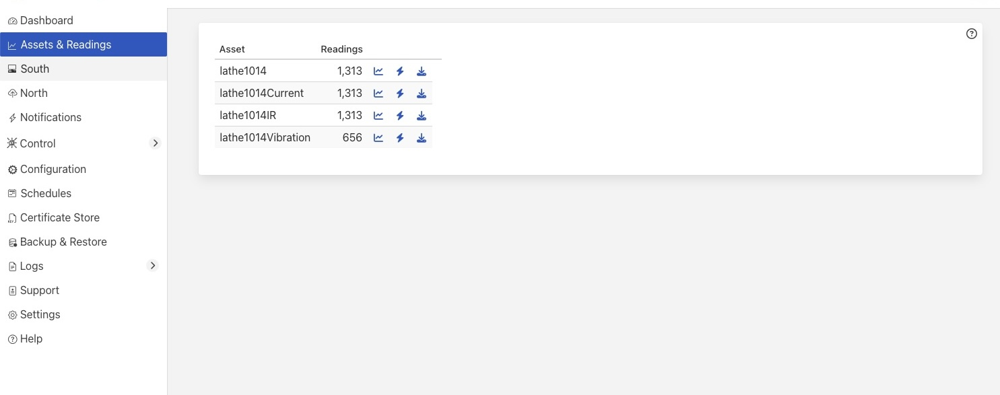
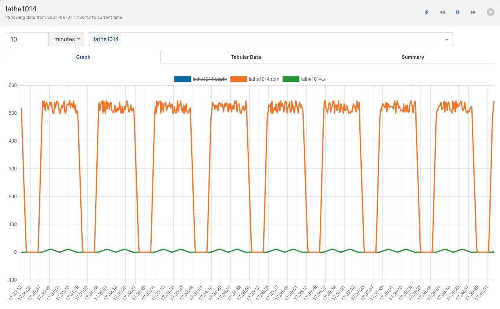

.. Images

.. |view_graph| image:: ../images/view_graph.jpg

.. |view_summary| image:: ../images/view_summary.jpg

.. |view_times| image:: ../images/view_times.jpg
.. |view_spreadsheet| image:: ../images/view_spreadsheet.jpg

.. |multi_graph2| image:: ../images/multi_graph2.jpg
.. |multi_graph3| image:: ../images/multi_graph3.jpg

.. |br| raw:: html

    

Viewing Data
############

+----------------+
| |viewing_data| |
+----------------+

You can inspect all the data buffered by the Fledge system on the Assets page.  To access this page, click on “Assets & Readings” from the left-side menu bar.

This screen will display a list of every data asset in the system.  Alongside each asset are two icons; one to display a graph of the asset and another to download the data stored for that asset as a CSV file.

Displaying A Graph
------------------

.. image:: ../images/graph_icon.jpg
   :align: left

By clicking on the graph button next to each asset name, you can view a graph of individual data readings. A graph will be displayed with a plot for each data point within the asset.

+--------------+
| |view_graph| |
+--------------+

It is possible to change the time period to which the graph refers by use of the time entry field and time units drop down menu in the top right of the screen.

+--------------+
| |view_times| |
+--------------+

It is also possible to change the default duration of a graph when it is first displayed. This is done via the *Settings* menu item.

+----------------+
| |gui_settings| |
+----------------+

This can be useful when very high frequency data is ingested into the system as it will prevent the initial graph that is displayed from pulling large amounts of data from the system and slowing down the response of the system and the GUI.

Where an asset contains multiple data points each of these is displayed in a different colour. Graphs for particular data points can be toggled on and off by clicking on the key at the top of the graph. Those data points not should will be indicated by striking through the name of the data point.

+-------------+
| |view_hide| |
+-------------+

Adjusting The Timeframe
~~~~~~~~~~~~~~~~~~~~~~~

There are a number of button on the top right of the graph window that can be used to control the time period of the graph that is shown. 

+-----------------+
| |graph_buttons| |
+-----------------+

The default behavior of the graph window is to show the data up to the current point in time for as far back in time as is defined by the duration as described above. As new data arrives it will be plotted on the right hand side of the graph, and the graph will scroll to the left. Using these control buttons this behavior can be changed.

Before you can use the two navigation buttons to navigate the graph you must first pause the graph update by clicking on the pause button. The two navigation buttons will now become active and the pause button will change to a play symbol.

+----------------+
| |graph_paused| |
+----------------+

If you click on the play button the graph will once move switch to automatically updating and will shown the time window for the current time.

The two double arrow buttons allow you to move backwards and forwards in time. 

Clicking the arrows facing left will move you back in time by the current window of data that is shown. This will result in older data being seen.

Clicking the right arrows moves you forwards in time, newer data will now be seen.

|br|

When an asset does not continuously ingest data you may need to move back in time in order to see the last data that was ingested for an ingest. The interface provides a convenient shortcut to allow you to quickly navigate back in time to see the last data that was ingested.

Simply click on the icon to the left of the time navigation buttons. The graph will change to show the latest data available for the chosen asset.

|br|

+----------------+
| |latest_graph| |
+----------------+

Notice that the icon used to get this graph has now changed.

Clicking on the icon will cause the graph to return to showing the current time frame and refresh as data is freshly ingested.

|br|

Viewing Multiple Assets
~~~~~~~~~~~~~~~~~~~~~~~

It is also possible to overlay the graphs for other assets onto the asset you are viewing.

+----------------+
| |multi_graph1| |
+----------------+

Using the pull down menu above the graph you may select another asset to add to the graph.

+----------------+
| |multi_graph2| |
+----------------+

All the data points from that asset will then be added to the graph. Multiple assets may be chosen from this pull down in order to build up more complex sets of graphs, individual data points for any of the assets may be hidden as above, or an entire asset may be removed from the graph by clicking on the **x** next to the asset name.

+----------------+
| |multi_graph3| |
+----------------+

Non-graphical Data
~~~~~~~~~~~~~~~~~~

Some types data are not capable of being displayed in a graph, such as string data and images. These are shown in separates tabs on the screen. String data will be shown in a *Tabular Data* tab.

+----------------+
| |view_tabular| |
+----------------+

A summary tab is also available, this will show the minimum, maximum and average values for each of the data points. Click on *Summary* to show the summary tab.

+----------------+
| |view_summary| |
+----------------+

Download Data
-------------

.. image:: ../images/download_icon.jpg
   :align: left

By clicking on the download icon adjacent to each asset you can download the stored data for the asset. The format of the file is download is a CSV file that is designed to be loaded int a spreadsheet such as Excel, Numbers or OpenOffice Calc.

The file contains a header row with the names of the data points within the asset, the first column is always the timestamp when the reading was taken, the header for this being *timestamp*. The data is sorted in chronological order with the newest data first.

+--------------------+
| |view_spreadsheet| |
+--------------------+

Most Recent Data
----------------

By clicking on the most recent reading icon you can view just the latest values that have been read for the given asset. The data will be displayed in a tabular format.

+--------------------+
| |most_recent_data| |
+--------------------+

This data will be automatically refreshed as new data arrives.
