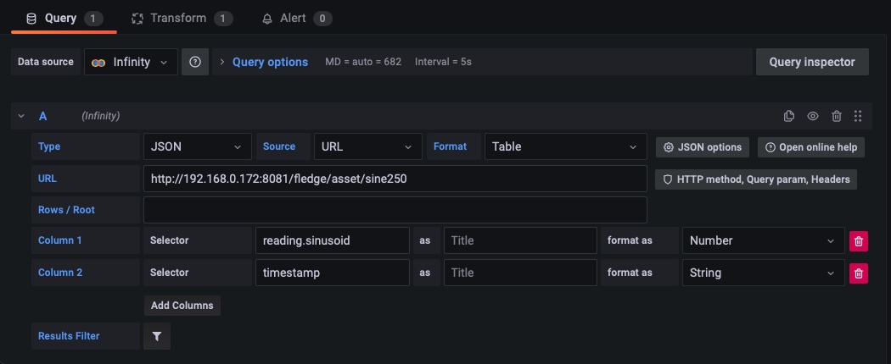
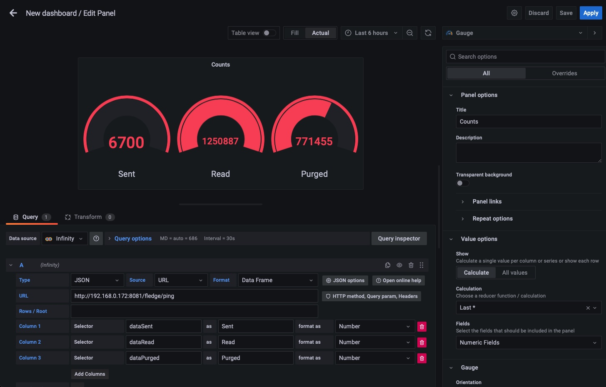
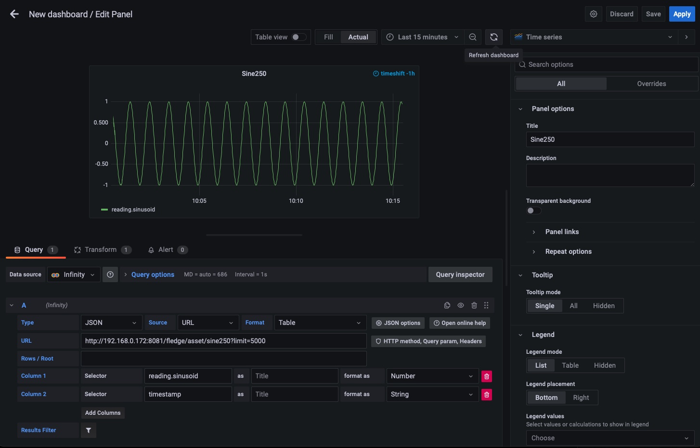
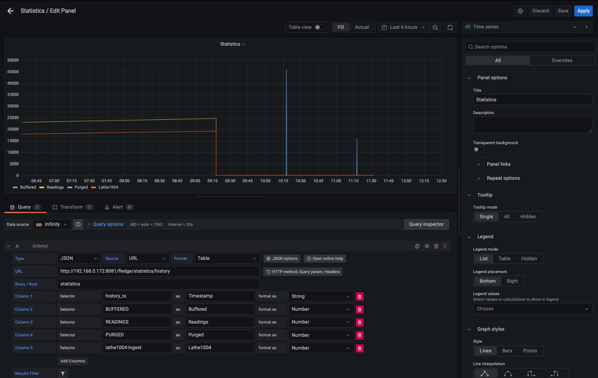
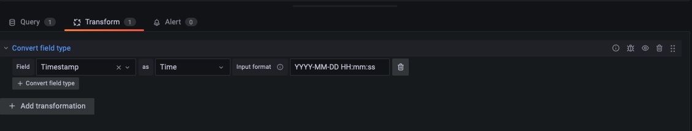

..
.. Images

.. Links
.. |grafana| raw:: html

   <a href="https://grafana.com" target="_blank">Grafana</a>

Grafana Examples
================

The REST API of Fledge provides a way to integrate other applications with Fledge, these applications can control Fledge or that may be used to monitor the operation of Fledge itself or to visualize the data held within a Fledge instance. One such tool is |grafana|. Here we will show some simple examples of how the Fledge REST API can be used with Grafana and the Infinity data source plugin. This is intended to be a simple example, more complex systems can be built using these tools.

Show Fledge Status
------------------

Using the *GET /fledge/ping* endpoint we can retrieve information about the number of readings read, sent, purged etc. 

.. code-block:: console

   $ curl http://localhost:8081/fledge/ping

Which would return a JSON payload that looks similar to that shown below

.. code-block:: JSON

	{
	  "uptime": 13203,
	  "dataRead": 2045868,
	  "dataSent": 6700,
	  "dataPurged": 1293723,
	  "authenticationOptional": true,
	  "serviceName": "Fledge",
	  "hostName": "foglamp-18",
	  "ipAddresses": [
	    "192.168.0.172"
	  ],
	  "health": "green",
	  "safeMode": false,
	  "version": "1.9.2"
	}

We can use this URL as the query for a Grafana dashboard panel to retrieve the basic statistics. We then select the items we want to display as columns and set the type of these, in this case we have chosen the basic counters which are numeric value.

+---------------+
| |GrafanaPing| |
+---------------+

Display Statistics
------------------

This example sow how to take a set of values over time and display them graphically within Grafana. The major difference here is the treatment of the timestamp. In this example we are using the statistics history API to retrieve statistics data over time.

Using the curl command to look at the API call

.. code-block:: console

    curl http://localhost:8081/fledge/statistics/history|jq

We get a JSON response as follows

.. code-block:: console

    {
      "interval": 15,
      "statistics": [
	{
	  "history_ts": "2022-08-25 11:31:29.565",
	  "READINGS": 68,
	  "BUFFERED": 0,
	  "UNSENT": 0,
	  "PURGED": 0,
	  "UNSNPURGED": 0,
	  "DISCARDED": 0,
	  "coap-Ingest": 0,
	  "COAP": 0,
	  "Sine-Ingest": 0,
	  "SINUSOID": 0,
	  "exp-Ingest": 0,
	  "EXPRESSION": 0,
	  "Readings Sent": 0,
	  "OP": 0,
	  "test1-Ingest": 0,
	  "sine2-Ingest": 15,
	  "SINE210": 0,
	  "SINE25": 0,
	  "SINE2": 0,
	  "SINE250": 15,
	  "OMF": 0,
	  "PRESINE2.SINUSOID": 0,
	  "SINUSOID2": 0,
	  "lathe1004-Ingest": 53,
	  "LATHE1004": 15,
	  "LATHE1004CURRENT": 15,
	  "LATHE1004IR": 15,
	  "LATHE1004VIBRATION": 8,
	  "testacl-Ingest": 0,
	  "dsds-Ingest": 0,
	  "OMF2": 0,
	  "test-Ingest": 0
	},
	...
    }

We are interested in the array of data under the *statistics* object in the JSON, therefore we choose a value of *statistics* for the *Rows / Root* value. This means that each array element under *statistics* will be considered as a row in the query result.

+---------------------+
| |GrafanaStatistics| |
+---------------------+

We then select the columns as before to extract the values we are interested in displaying. These are all set to be of type *Number*.

In order to have the data graphed over time we must also select a timestamp column, in this case *history_ts* will be used. We can not set this as a timestamp type column as the Fledge timestamp format is not directly supported by Grafana. We must set up a transformation to take the string value from *history_ts* and convert it to a timestamp that can be understood by Grafana.

+--------------------+
| |GrafanaTimestamp| |
+--------------------+

In this transform we give it the Fledge timestamp format and set the desired result type to be a Timestamp. This now allows Grafana to understand the timestamps and display the Fledge data.

One final point to mention, the Fledge timestamps are returned in UTC whereas Grafana assumes the data is in the local timezone. To resolve this merely set the preferences in Grafana to expect UTC data or add a time adjustment based on the number of hours from UTC at your location.

Graph Reading Data
------------------

This example is very similar to that of the statistics history example above, the major difference is that we are extracting the readings data from the buffer using the */fledge/asset/{assetName}* URL.

+------------------+
| |GrafanaReading| |
+------------------+

We must select the data to display in the same way, we use the *limit=* to allow the query to return sufficient data. Ideally we would have a time bound query here, but that is outside the scope of this simple example.

.. code-block:: console

    $ curl http://localhost:8081/fledge/asset/sine250?limit=2 |jq
    [
      {
	"reading": {
	  "sinusoid": -0.951056516
	},
	"timestamp": "2022-08-25 13:47:45.624800"
      },
      {
	"reading": {
	  "sinusoid": -0.978147601
	},
	"timestamp": "2022-08-25 13:47:44.624586"
      }
    ]

We add the columns we require, there is no need to select the *Rows / Root* in this example as the array is already at the root of the JSON document returned.

We must also do the same transformation for the timestamp format we did above.
