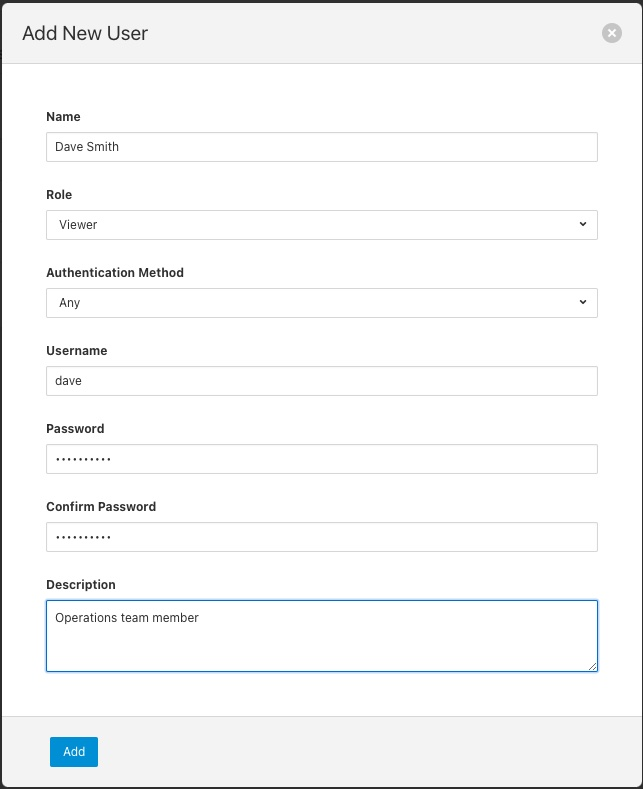

.. Images
.. |admin_api| image:: images/admin_api.jpg
.. |auth_options| image:: images/authentication.jpg
.. |login| image:: images/login.jpg
.. |login_dashboard| image:: images/login_dashboard.jpg
.. |user_pulldown| image:: images/user_pulldown.jpg
.. |profile| image:: images/profile.jpg
.. |password| image:: images/password.jpg
.. |user_management| image:: images/user_management.jpg

.. Links
.. |filter_plugins| raw:: html

   <a href="fledge_plugins.html#filer-plugins">Filter Plugins</a>

***************
Securing Fledge
***************

The default installation of a Fledge service comes with security features turned off, there are several things that can be done to add security to Fledge, the most basic is to protect the REST API and thre GUI to prevent users being able to change the configuration of the Fledge system. Authentication can be via username and password or by means of an authnetication certificate.

Requiring User Login
====================

In order to set the REST API and GUI to force users to login before accessing Fledge select the *Configuration* option from the left-hand menu and then select *Admin API* from the cofiguration tree that appears.

+-------------+
| |admin_api| |
+-------------+

Two particular items are of interest in this configuration category that is then displayed; *Authentication* and *Authentication method*

+----------------+
| |auth_options| |
+----------------+

Select the *Authentication* field to be mandatory and the *Authentication method* to be password. Click on *Save* at the bottom of the dialog.

In order for the changes to take effect Fledge must be restarted, this can be done in the GUI by slectioning the restart otem in the top status bar of Fledge. Confirm the restart of Fledge and wait for it to be restarted.

Once restarted refresh your browser page. You should be presented with a login request.

+---------+
| |login| |
+---------+

The default username is "admin" with a password of "fledge". Use these to login to Fledge, you should be presented with a slightly changed dashboard view.

+-------------------+
| |login_dashboard| |
+-------------------+

The status bar now contains the name of the user that is currently logged in and a new option has appeared in the left-hand menu, *User Management*.

Changing Your Password
----------------------

The top status bar of the Fledge GUI now contains the user name on the right-hand side and a pull down arrow, selectign this arrow gives a numebr of options including one labelled *Profile*.

+-----------------+
| |user_pulldown| |
+-----------------+

.. note::
   This pulldown menu is also where the *Shutdown* and *Restart* options have moved.

Selecting the *Profile* option will display the profile for the user.

+-----------+
| |profile| |
+-----------+

Towards the bottom of this profile display the *change password* option appears. Click on this text and a new password dialog will appear.

+------------+
| |password| |
+------------+

This popup can be used to change your password. On succesfully changing your password you will be logged out of the user interface and will be required to log back in using this new password.

User Management
===============

Once manadatory authentication has been enabled and the currently logged in user has the role *admin*, a new option appears in the GUI, *User Management*.

+-------------------+
| |user_management| |
+-------------------+

The user management pages allows

  - Adding new users.
  - Deleteing users.
  - Resetting user passwords.
  - Changing the role of a user.

Fledge currently supports two roles for users,

  - **admin**: a user with admin role is able to fully configure Fledge and also manage Fledge users
  - **user**: a user with this role is able to configure Fledge but can not manage users

Adding Users
------------

To add a new user from the *User Management* 
