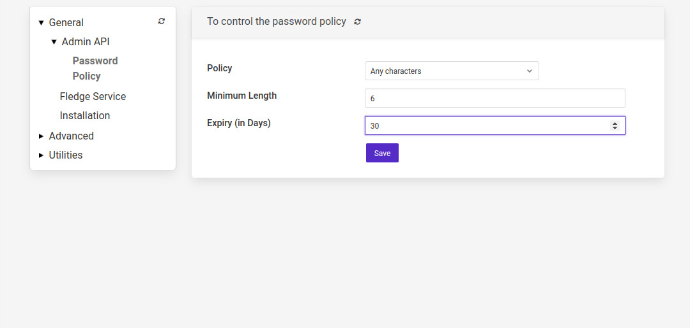
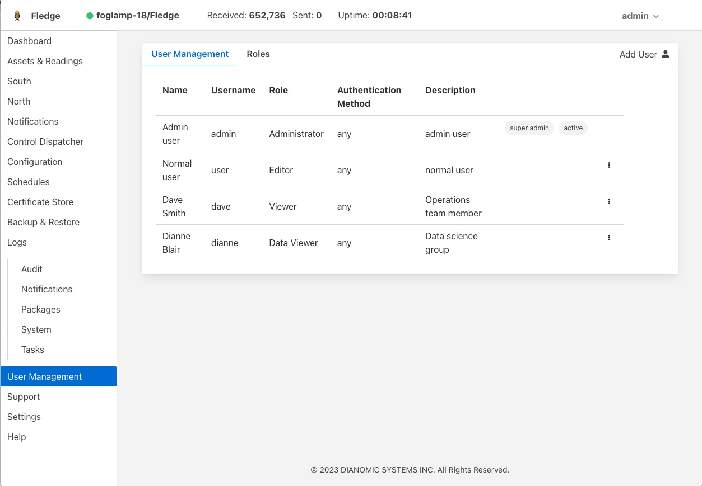

.. Images
.. |admin_api| image:: images/admin_api.jpg
.. |enable_https| image:: images/enable_https.jpg
.. |connection_https| image:: images/connection_https.jpg
.. |auth_options| image:: images/authentication.jpg
.. |login| image:: images/login.jpg
.. |login_dashboard| image:: images/login_dashboard.jpg
.. |user_pulldown| image:: images/user_pulldown.jpg
.. |profile| image:: images/profile.jpg
.. |password| image:: images/password.jpg

.. |add_user| image:: images/add_user.jpg

.. |change_role| image:: images/change_role.jpg
.. |reset_password| image:: images/reset_password.jpg
.. |certificate_store| image:: images/certificate_store.jpg
.. |update_certificate| image:: images/update_certificate.jpg

*****************
Securing Fledge
*****************

The default installation of a Fledge service comes with security features turned off, there are several things that can be done to add security to Fledge.  The REST API by default support unencrypted HTTP requests, it can be switched to require HTTPS to be used. The REST API and the GUI can be protected by requiring authentication to prevent users being able to change the configuration of the Fledge system. Authentication can be via username and password or by means of an authentication certificate.

Enabling HTTPS Encryption
=========================

Fledge can support both HTTP and HTTPS as the transport for the REST API used for management, to switch between there two transport protocols select the *Configuration* option from the left-hand menu and the select *Admin API* from the configuration tree that appears,

+-------------+
| |admin_api| |
+-------------+

The first option you will see is a tick box labeled *Enable HTTP*, to select HTTPS as the protocol to use this tick box should be deselected.

+----------------+
| |enable_https| |
+----------------+

When this is unticked two options become active on the page, *HTTPS Port* and *Certificate Name*. The HTTPS Port is the port that Fledge will listen on for HTTPS requests, the default for this is port 1995.

The *Certificate Name* is the name of the certificate that will be used for encryption. The default s to use a self signed certificate called *fledge* that is created as part of the installation process. This certificate is unique per fledge installation but is not signed by a certificate authority. If you require the extra security of using a signed certificate you may use the Fledge :ref:`certificate_store` functionality to upload a certificate that has been created and signed by a certificate authority.

After enabling HTTPS and selecting save you must restart Fledge in order for the change to take effect. You must also update the connection setting in the GUI to use the HTTPS transport and the correct port.

*Note*: if using the default self-signed certificate you might need to authorise the browser to connect to IP:PORT.
Just open a new browser tab and type the URL https://YOUR_FLEDGE_IP:1995

Then follow browser instruction in order to allow the connection and close the tab.
In the Fledge GUI you should see the green icon (Fledge is running).

+--------------------+
| |connection_https| |
+--------------------+

Requiring User Login
====================

In order to set the REST API and GUI to force users to login before accessing Fledge select the *Configuration* option from the left-hand menu and then select *Admin API* from the configuration tree that appears.

+-------------+
| |admin_api| |
+-------------+

Two particular items are of interest in this configuration category that is then displayed; *Authentication* and *Authentication method*

+----------------+
| |auth_options| |
+----------------+

Select the *Authentication* field to be mandatory and the *Authentication method* to be password. Click on *Save* at the bottom of the dialog.

In order for the changes to take effect Fledge must be restarted, this can be done in the GUI by selecting the restart item in the top status bar of Fledge. Confirm the restart of Fledge and wait for it to be restarted.

Once restarted refresh your browser page. You should be presented with a login request.

+---------+
| |login| |
+---------+

The default username is "admin" with a password of "fledge". Use these to login to Fledge, you should be presented with a slightly changed dashboard view.

+-------------------+
| |login_dashboard| |
+-------------------+

The status bar now contains the name of the user that is currently logged in and a new option has appeared in the left-hand menu, *User Management*.

Changing Your Password
----------------------

The top status bar of the Fledge GUI now contains the user name on the right-hand side and a pull down arrow, selecting this arrow gives a number of options including one labeled *Profile*.

+-----------------+
| |user_pulldown| |
+-----------------+

.. note::
   This pulldown menu is also where the *Shutdown* and *Restart* options have moved.

Selecting the *Profile* option will display the profile for the user.

+-----------+
| |profile| |
+-----------+

Towards the bottom of this profile display the *change password* option appears. Click on this text and a new password dialog will appear.

+------------+
| |password| |
+------------+

This popup can be used to change your password. On successfully changing your password you will be logged out of the user interface and will be required to log back in using this new password.

Password Rotation Mechanism
---------------------------

Fledge provides a mechanism to limit the age of passwords in use within the system. A value for the maximum allowed age of a password is defined in the configuration page of the user interface.

+---------------------+
| |password_rotation| |
+---------------------+

Whenever a user logs into Fledge the age of their password is checked against the maximum allowed password age. If their password has reached that age then the user is not logged in, but is instead forced to enter a new password. They must then login with that new password. In addition the system maintains a history of the last three passwords the user has used and prevents them being reused.

User Management
===============

Once mandatory authentication has been enabled and the currently logged in user has the role *admin*, a new option appears in the GUI, *User Management*.

+-------------------+
| |user_management| |
+-------------------+

The user management pages allows

  - Adding new users.
  - Deleting users.
  - Resetting user passwords.
  - Changing the role of a user.

Fledge currently supports two roles for users,

  - **admin**: a user with admin role is able to fully configure Fledge and also manage Fledge users
  - **user**: a user with this role is able to configure Fledge but can not manage users

Adding Users
------------

To add a new user from the *User Management* page select the *Add User* icon in the top right of the *User Management* pane. a new dialog will appear that will allow you to enter details of that user.

+------------+
| |add_user| |
+------------+

You can select a role for the new user, a user name and an initial password for the user. Only users with the role *admin* can add new users.

Changing User Roles
-------------------

The role that a particular user has when the login can be changed from the *User Management* page. Simply select on the *change role* link next to the user you wish to change the role of. 

+---------------+
| |change_role| |
+---------------+

Select the new role for the user from the drop down list and click on update. The new role will take effect the next time the user logs in.

Reset User Password
-------------------

Users with the *admin* role may reset the password of other users. In the *User Management* page select the *reset password* link to the right of the user name of the user you wish to reset the password of. A new dialog will appear prompting for a new password to be created for the user.

+------------------+
| |reset_password| |
+------------------+

Enter the new password and confirm that password by entering it a second time and click on *Update*.

Delete A User
-------------

Users may be deleted from the *User Management* page. Select the *delete* link to the right of the user you wish to delete. A confirmation dialog will appear. Select *Delete* and the user will be deleted.

+---------------+
| |delete_user| |
+---------------+

You can not delete the last user with role *admin* as this will prevent you from being able to manage Fledge.

.. _certificate_store:

Certificate Store
=================

The Fledge *Certificate Store* allows certificates to be stored that may be referenced by various components within the system, in particular these certificates are used for the encryption of the REST API traffic and authentication. They may also be used by particular plugins that require a certificate of one type or another. A number of different certificate types re supported by the certificate store;

  - PEM files as created by most certificate authorities
  - CRT files as used by GlobalSign, VeriSign and Thawte
  - Binary CER X.509 certificates
  - JSON certificates as used by Google Cloud Platform

The *Certificate Store* functionality is available in the left-hand menu by selecting *Certificate Store*. When selected it will show the current content of the store.

+---------------------+
| |certificate_store| |
+---------------------+

Certificates may be removed by selecting the delete option next to the certificate name, note that the keys and certificates can be deleted independently.
The self signed certificate that is created at installation time can not be deleted.

To add a new certificate select the *Import* icon in the top right of the certificate store display.

+----------------------+
| |update_certificate| |
+----------------------+

A dialog will appear that allows a key file and/or a certificate file to be selected and uploaded to the *Certificate Store*. An option allows to allow overwrite of an existing certificate. By default certificates may not be overwritten.
