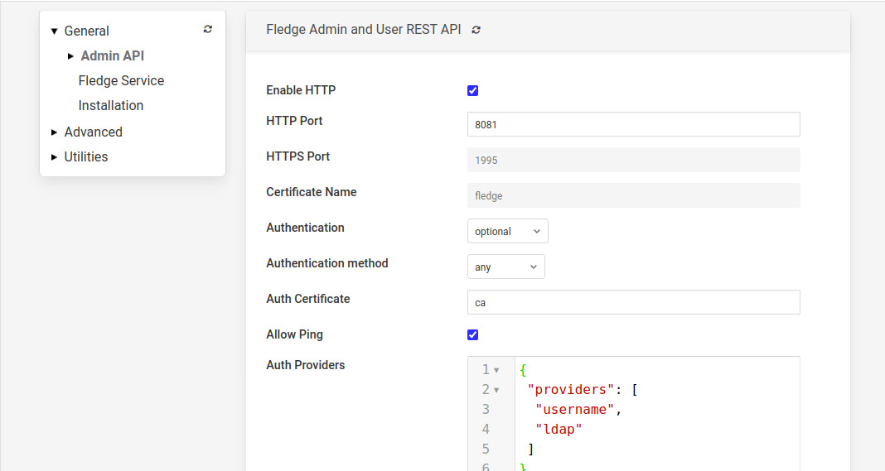
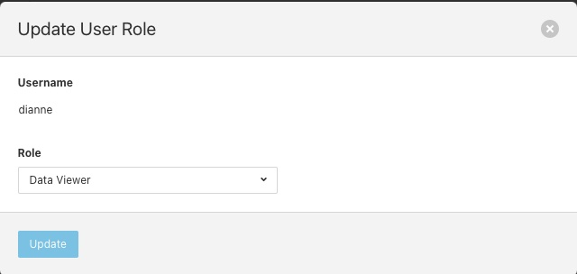
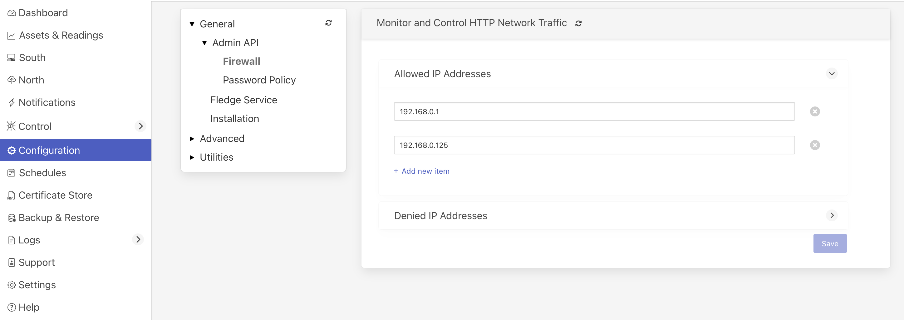

.. Images

.. |enable_https| image:: images/enable_https.jpg
.. |connection_https| image:: images/connection_https.jpg
.. |auth_options| image:: images/authentication.jpg
.. |login| image:: images/login.jpg
.. |login_dashboard| image:: images/login_dashboard.jpg
.. |user_pulldown| image:: images/user_pulldown.jpg
.. |profile| image:: images/profile.jpg
.. |password| image:: images/password.jpg
.. |password_rotation| image:: images/password_rotation.jpg

.. |user_management| image:: images/user_management.jpg
.. |add_user| image:: images/add_user.jpg

.. |delete_user| image:: images/delete_user.jpg

.. |reset_password| image:: images/reset_password.jpg
.. |certificate_store| image:: images/certificate_store.jpg
.. |update_certificate| image:: images/update_certificate.jpg

.. Links
.. |REST API| raw:: html

   <a href="rest_api_guide/02_RESTauthentication.html">REST API</a>

.. |Require User Login| raw:: html

    <a href="#requiring-user-login">Require User Login</a>

.. |User Management| raw:: html

    <a href="#user-management">User Management</a>

*****************
Securing Fledge
*****************

The default installation of Fledge in version 3.0 and after have authentication features enabled by default, using the username and password option. Two users are created, one with administrator privileges and another as an edit user. There are other security features that are not enabled by default that should be considered in order to enhance security and for compliance with any local security restrictions.

.. note::

   It is strongly recommended that once installation is complete the default passwords are changed at the earliest opportunity.

In installations of Fledge prior to version 3.0 authentication is disabled by default. Whilst this is acceptable for demonstration purposes or in completely closed networks it is unwise to use Fledge unsecured in real world deployments. Fledge offers several features that can enhance security. Versions of Fledge from 3.0 and onward can still be configured to be open by disabling the security features if desired, although this is not recommended.

  - The REST API by default supports unencrypted HTTP requests, it can be switched to require HTTPS to be used.

  - The REST API and the GUI can be protected by requiring authentication to prevent users being able to change the configuration of the Fledge system. This has now become the default in version 3.0 and later.
   
  - Authentication can be via username and password or by means of an authentication certificate. The default authentication in Fledge 3.0 and onward is to use username and password for authentication.

    .. note::
    
       When using username and password authentication it is recommended to disable support for unencrypted HTTP requests.

  - Fledge supports a number of different user types or roles, care should be taken to only give users access they require and in particular the administration user rights should be reserved.

  - If authentication is via username and password the administrator is able to select one of a set of password policy that define restrictions as to what characters must be included in any password as well as requiring a minimum length of password.

  - The system can be configured to require users to change their password regularly and a list of previous passwords is maintained to prevent users simply reusing old passwords.

  - If a user attempts to authenticate and fails then that user will be blocked for a short time. If multiple failures occur the blocked period will be increased until ultimately the user is blocked for a 24 hour period. This is to prevent automated systems attempting to guess passwords.

  - Fledge maintains full audit logs of all updates to the Fledge configuration, and other events. This allows for complete auditing of who made what changes to the Fledge configuration and when the changes were made.

  - Fledge can have optional allow and deny lists configured that list those hosts that are either permitted to connect to the UI and REST API or are denied access.

.. note::

   It is recommended to run Fledge behind firewalls and restrict access to the Fledge API port to trusted networks when using it in production environments.

Enabling HTTPS Encryption
=========================

Fledge can support both HTTP and HTTPS as the transport for the REST API used for management, to switch between there two transport protocols select the *Configuration* option from the left-hand menu and the select *Admin API* from the configuration tree that appears,

+-------------+
| |admin_api| |
+-------------+

The first option you will see is a tick box labeled *Enable HTTP*, to select HTTPS as the protocol to use this tick box should be deselected.

+----------------+
| |enable_https| |
+----------------+

When this is unticked two options become active on the page, *HTTPS Port* and *Certificate Name*. The HTTPS Port is the port that Fledge will listen on for HTTPS requests, the default for this is port 1995.

The *Certificate Name* is the name of the certificate that will be used for encryption. The default is to use a self signed certificate called *fledge* that is created as part of the installation process. This certificate is unique per fledge installation but is not signed by a certificate authority. If you require the extra security of using a signed certificate you may use the Fledge :ref:`certificate_store` functionality to upload a certificate that has been created and signed by a certificate authority.

After enabling HTTPS and selecting save you must restart Fledge in order for the change to take effect. You must also update the connection setting in the GUI to use the HTTPS transport and the correct port.

.. note::
  If using the default self-signed certificate you might need to authorise the browser to connect to IP:PORT.
  Just open a new browser tab and type the URL https://YOUR_FLEDGE_IP:1995
  
  Then follow the instructions in the browser in order to allow the connection and close the tab.
  In the Fledge GUI you should see the green icon (Fledge is running).

+--------------------+
| |connection_https| |
+--------------------+

Allow & Deny Lists
==================

Fledge supports a pair of optional lists of IP addresses that can be set to allow or deny access to the Fledge API. These lists can be accessed via the *Configuration* menu option in the user interface in the *General*, *Admin API*, *Firewall* configuration category.

+------------+
| |firewall| |
+------------+

  - Clicking on the arrow icon beside each list will expand the list and show the current contents of the list.

  - Click on the *Add new item* link to create a new entry in the list.

  - To remove an entry from the list click on the *x* icon to the right of the list item.

If the allow list is non-empty, then any access, including ping, to the Fledge API port will be checked to see if the source IP address of the request matches an entry in the allow list. If the address of the requester is not in this allow list then the API will not send any response to the caller and the connection will be closed. The only address that is exempt from this checking is the localhost via the loopback interface, 127.0.0.1. This is required for local management of the Fledge instance and must always be accessible.

If the blocked list is non-empty then any access, including ping, to the API will check the source address of the caller to see if it is included in the block list. If it is then the connection will be closed without sending any response to the caller. Again the address 127.0.0.1 is immune from this test.

Requiring User Login
====================

In order to set the REST API and GUI to force users to login before accessing Fledge select the *Configuration* option from the left-hand menu and then select *Admin API* from the configuration tree that appears.

+-------------+
| |admin_api| |
+-------------+

Two particular items are of interest in this configuration category that is then displayed; *Authentication* and *Authentication method*

+----------------+
| |auth_options| |
+----------------+

Select the *Authentication* field to be mandatory and the *Authentication method* to be password. Click on *Save* at the bottom of the dialog.

In order for the changes to take effect Fledge must be restarted, this can be done in the GUI by selecting the restart item in the top status bar of Fledge. Confirm the restart of Fledge and wait for it to be restarted.

Once restarted refresh your browser page. You should be presented with a login request.

+---------+
| |login| |
+---------+

The default username is "admin" with a password of "fledge". Use these to login to Fledge, you should be presented with a slightly changed dashboard view.

+-------------------+
| |login_dashboard| |
+-------------------+

The status bar now contains the name of the user that is currently logged in and a new option has appeared in the left-hand menu, *User Management*.

.. note::
   Any session that is idle for 15 minutes or longer will be disconnected. The user will then be required to authenticate again before being able to issue any further commands via the API or user interface.

Failed Login Attempts
---------------------

If a user makes an incorrect login attempt, such as entering the wrong password, that user will be blocked from logging in for a short period. If more than a certain number of consecutive login attempts fail then the user account will be blocked for 24 hours. The account may be unblocked by an administrative user before the 24 hours has elapsed.

Changing Your Password
----------------------

The top status bar of the Fledge GUI now contains the user name on the right-hand side and a pull down arrow, selecting this arrow gives a number of options including one labeled *Profile*.

+-----------------+
| |user_pulldown| |
+-----------------+

.. note::
   This pulldown menu is also where the *Shutdown* and *Restart* options have moved.

Selecting the *Profile* option will display the profile for the user.

+-----------+
| |profile| |
+-----------+

Towards the bottom of this profile display the *change password* option appears. Click on this text and a new password dialog will appear.

+------------+
| |password| |
+------------+

This popup can be used to change your password. On successfully changing your password you will be logged out of the user interface and will be required to log back in using this new password.

Password Policy
---------------

Fledge provides different policies to control the managed users password. The following options are currently available:

+-------------------+
| |password_policy| |
+-------------------+

- *Any characters* - there are no restrictions placed on the characters within a password.

- *Mixed case Alphabetic* -  passwords must contain upper and lower case letters. The user is free to add numeric values and special characters if they wish, but there is no requirement to add these.

- *Mixed case and numeric* - password must contain upper, lower case letters and numeric values.

- *Mixed case, numeric and special characters* - password must contain at least one upper and lower case letter, numeric and special characters.

.. note::

    In addition to the above rules on password content, the minimum password length is by default 6 and can be controlled with the 'Minimum length' configuration item. The maximum password length that can be configured is 80 characters.

Password Rotation Mechanism
---------------------------

Fledge provides a mechanism to limit the age of passwords in use within the system. A value for the maximum allowed age of a password is defined in the configuration page of the user interface.

+---------------------+
| |password_rotation| |
+---------------------+

Whenever a user logs into Fledge the age of their password is checked against the maximum allowed password age. If their password has reached that age then the user is not logged in, but is instead forced to enter a new password. They must then login with that new password. In addition the system maintains a history of the last three passwords the user has used and prevents them being reused.

User Management
===============

The user management option becomes active once the Fledge has been configured to require authentication of users. This is enabled via the *Admin API* page of the *Configuration* menu item. A new menu item *User Management* will appear in the left hand menu.

.. note::

   After setting the Authentication option to mandatory in the configuration page the Fledge instance should be restarted.

+-------------------+
| |user_management| |
+-------------------+

The user management pages allows

  - Adding new users.
  - Deleting users.
  - Resetting user passwords.
  - Changing the role of a user.
  - Changing the details of a user

Fledge currently supports a number of roles for users:

  - **Administrator**: a user with admin role is able to fully configure Fledge, view the data read by the Fledge instance and also manage Fledge users, backups and support bundles.

  - **Control**: a user with this role is able to configure Fledge, execute control scripts and pipelines and also view the data read by Fledge. The user can not manage other users or add new users.

  - **Editor**: a user with this role is able to configure Fledge and view the data read by Fledge. The user can not manage other users or add new users.

  - **Viewer**: a user that can only view the configuration of the Fledge instance and the data that has been read by Fledge. The user has no ability to modify the Fledge instance in any way.

  - **Data Viewer**: a user that can only view the data in Fledge and not the configuration of Fledge itself. The user has no ability to modify the Fledge instance in any way.

Restrictions apply to both the API calls that can be made when authenticated as particular users and the access the user will have to the graphical user interface. Users will observe both that menu items will be removed completely or options on certain pages will be unavailable if they are not privileged to access those features.

Adding Users
------------

To add a new user from the *User Management* page select the *Add User* icon in the top right of the *User Management* pane. a new dialog will appear that will allow you to enter details of that user.

+------------+
| |add_user| |
+------------+

You can select a role for the new user, a user name and an initial password for the user. Only users with the role *admin* can add new users.

Update User Details
-------------------

The edit user option allows the name, authentication method and description of a user to be updated. This option is only available to users with the *admin* role.

+---------------+
| |update_user| |
+---------------+

Changing User Roles
-------------------

The role that a particular user has when the login can be changed from the *User Management* page. Simply select on the *change role* link next to the user you wish to change the role of. 

+---------------+
| |change_role| |
+---------------+

Select the new role for the user from the drop down list and click on update. The new role will take effect the next time the user logs in.

Reset User Password
-------------------

Users with the *admin* role may reset the password of other users. In the *User Management* page select the *reset password* link to the right of the user name of the user you wish to reset the password of. A new dialog will appear prompting for a new password to be created for the user.

+------------------+
| |reset_password| |
+------------------+

Enter the new password and confirm that password by entering it a second time and click on *Update*.

Delete A User
-------------

Users may be deleted from the *User Management* page. Select the *delete* link to the right of the user you wish to delete. A confirmation dialog will appear. Select *Delete* and the user will be deleted.

+---------------+
| |delete_user| |
+---------------+

You can not delete the last user with role *admin* as this will prevent you from being able to manage Fledge.

.. _certificate_store:

Certificate Store
=================

The Fledge *Certificate Store* allows certificates to be stored that may be referenced by various components within the system, in particular these certificates are used for the encryption of the REST API traffic and authentication. They may also be used by particular plugins that require a certificate of one type or another. A number of different certificate types re supported by the certificate store;

  - PEM files as created by most certificate authorities
  - CRT files as used by GlobalSign, VeriSign and Thawte
  - Binary CER X.509 certificates
  - JSON certificates as used by Google Cloud Platform

The *Certificate Store* functionality is available in the left-hand menu by selecting *Certificate Store*. When selected it will show the current content of the store.

+---------------------+
| |certificate_store| |
+---------------------+

Certificates may be removed by selecting the delete option next to the certificate name, note that the keys and certificates can be deleted independently.
The self signed certificate that is created at installation time can not be deleted.

To add a new certificate select the *Import* icon in the top right of the certificate store display.

+----------------------+
| |update_certificate| |
+----------------------+

A dialog will appear that allows a key file and/or a certificate file to be selected and uploaded to the *Certificate Store*. An option allows to allow overwrite of an existing certificate. By default certificates may not be overwritten.

Generate a new auth certificates for user login
-----------------------------------------------

Default ca certificate is available inside $FLEDGE_DATA/etc/certs and named as ca.cert. Also default admin and non-admin certs are available in the same location which will be used for Login with Certificate in Fledge i.e admin.cert, user.cert. See |Require User Login|

Below are the steps to create custom certificate along with existing fledge based ca signed for auth certificates.

a) To create a user with the name **test** (case sensitive), please note that only an admin has the permission to do so. The cURL commands are provided below.

.. code-block:: console

    $ AUTH_TOKEN=$(curl -d '{"username": "<ADMIN_USERNAME>", "password": "<ADMIN_PASSWORD>"}' -sX POST <PROTOCOL>://<FLEDGE_IP>:<FLEDGE_REST_API_PORT>/fledge/login | jq '.token' | tr -d '""')
    $ USER_ID=$(curl -H "authorization: $AUTH_TOKEN" -skX POST <PROTOCOL>://<FLEDGE_IP>:<FLEDGE_REST_API_PORT>/fledge/admin/user -d '{"username":"test","real_name":"Test","access_method":"cert","description":"Non-admin based role","role_id":2}' | jq '.user.userId')

b) It is now time to generate a new certificate for the **test** username that was created earlier.

.. code-block:: console

    $ curl -H "authorization: $AUTH_TOKEN" -sX POST <PROTOCOL>://<FLEDGE_IP>:<FLEDGE_REST_API_PORT>/fledge/admin/$USER_ID/authcertificate

You can now locate the **test** certificate within the $FLEDGE_DATA/etc/certs/, which will be used for login. It is advisable to relocate this certificate to a different location to prevent it from being shared with others.

.. note::

   Fledge supports a number of different user roles, the appropriate role_id should be passed for the user role required. The full list of supported role_id's can be obtained by called the /fledge/user/role GET API entry point. This entry point is only available to users with the *admin* role.

You may also refer the documentation of |REST API| cURL commands. If you are not comfortable with cURL commands then use the GUI steps |User Management| and make sure Login with admin user.

.. note::

   Steps a (cert creation) and b (create user) can be executed in any order.

c) Now you can login with the newly created user **test**, with the following cURL

.. code-block:: console

    $ curl -T $FLEDGE_DATA/etc/certs/test.cert -skX POST <PROTOCOL>://<FLEDGE_IP>:<FLEDGE_REST_API_PORT>/fledge/login

Or use GUI |Require User Login|
