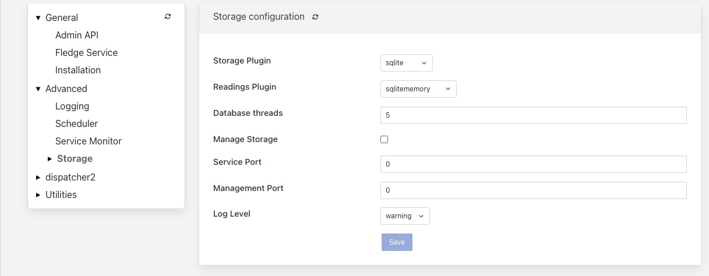

.. Images

*******************
Buffering & Storage
*******************

One of the micro-services that makes up the core of a Fledge
implementation is the storage micro-service. This is responsible for

  - storing the configuration of Fledge

  - buffering the data read from the south

  - maintaining the Fledge audit log

  - persisting the state of the system

The storage service is configurable, like other services within Fledge
and uses plugins to extend the functionality of the storage system. These
storage plugins provide the underlying mechanism by which data is
stored within Fledge. Fledge can make use of either one or two of these
plugins at any one time. If a single plugin is used then this plugin
provides the storage for all data. If two plugins are used, one will
be for the buffering of readings and the other for the storage of the
configuration.

As standard Fledge comes with 3 storage plugins

  - **SQLite**: A plugin that can store both configuration data and the
  readings data using SQLite files as the backing store.

  - **PostgreSQL**: A plugin that can store both configuration and
  readings data which uses the PostgreSQL SQL server as a storage medium.

  - **SQLiteMemory**: A plugin that can only be used to store reading
  data. It uses SQLite's in memory storage engine to store the reading
  data. This provides a high performance reading store however capacity
  is limited by available memory and if Fledge is stopped or there is
  a power failure the buffered data will be lost.

The default configuration uses the SQLite disk based storage engine for
both configuration and reading data

Configuring The Storage Plugin
==============================

Once installed the storage plugin can be reconfigured in much the same
way as any Fledge configuration, either using the API or the graphical
user interface to set the storage engine and its options.

  - Using the user interface to configuration the storage, select the
  *Configuration* item in the left hand menu bar.

    +--------------+
    | |storage_01| |
    +--------------+
   
  - In the category pull down menu select *Advanced*.

    +--------------+
    | |storage_02| |
    +--------------+
  
 - To change the storage plugin to use for both configuration and readings
 enter the name of the new plugin in the *Storage Plugin* entry field. If
 *Readings Plugin* is left empty then the storage plugin will also be
 used to store reading data. The default set of plugins installed with
 Fledge that can be used as *Storage Plugin* values are:

     - *sqlite* - the SQLite file based storage engine.

     - *postgress* - the PostgreSQL server. Note the Postgres server
     is not installed by default when Fledge is installed and must be
     installed before it can be used.

  - The *Readings Plugin* may be set to any of the above and may
  also be set to use the SQLite In Memory plugin by entering the value
  *sqlitememory* into the configuration field.

  - The *Database threads* field allows for the number of threads used
  for database housekeeping to be controlled. In normal circumstances
  1 is sufficient. If performance issues are seen this can be increased
  however it is rarely required to be greater than 1 and can have counter
  productive effects on heavily loaded systems.

  - The *Manage Storage* option is only used when the database storage
  uses an external database server, such as PostgreSQL. Toggling this
  option on causes Fledge to start as stop the database server when Fledge
  is started and stopped. If it s left off then Fledge will assume the
  database server is running when it starts.

  - The *Management Port* and *Service Port* options allow fixed ports
  to be assigned to the storage service. These settings are for debugging
  purposes only and the values should be set to 0 in normal operation.

Note: Additional storage engines may be installed to extend the set
that is delivered with the standard Fledge installation. These will be
documented in the packages that provide the storage plugin.

Storage plugin configurations are not dynamic and Fledge *must* be
restarted after changing these values. Changing the plugin used to store
readings will *not* cause the data in the previous storage system to be
migrated to the new storage system and this data may be lost if it has
not been sent onward from Fledge.

Installing A PostgreSQL server
==============================

The precise commands needed to install a PostgreSQL server vary for system
to system, in general a packaged version of PostgreSQL is best used and
these are often available within the standard package repositories for
your system.

Ubuntu Install
--------------

On Ubuntu or other apt based distributions the command to install postgres is

.. code-block:: console

  sudo apt install postgresql postgresql-client

CentOS/Red Hat Install
----------------------

On CentOS and Red Hat systems, and other RPM based distributions the command is

.. code-block:: console

  sudo yum install postgresql-server postgresql

Post Installation Activities
----------------------------

Once installed the PostgreSQL server must be configured. Run the commands

.. code-block:: console

  sudo postgresql-setup initdb
  sudo systemctl start postgresql
  sudo -u postgres createuser -d fledge

SQLite Plugin Configuration
===========================

The SQLite storage engine has further options that may be used to
configure its behavior. To access these configuration parameters click
on the *sqlite* option under the *Storage* category in the configuration
page.

+--------------+
| |storage_03| |
+--------------+

Many of these configuration options control the performance of SQLite and
it is important to have some background on how readings are stored within
SQLite. The storage plugin stores readings for each distinct asset in
a table for that asset. These tables are stored within a database. In
order to improve concurrency multiple databases are used within the
storage plugin. A set of parameters are used to define how these tables
and databases are used.

  - **Pool Size**: The number of connections to maintain to the database
  server.

  - **No. Readings per database**: This controls the number of different
  assets that will be stored in each database file within SQLite.

  - **No. databases to allocate in advance**: The number of SQLite
  databases that will be created at startup.

  - **Database allocation threshold**: The point at which new databases
  are created. If the number of empty databases falls below this value
  then an other set of databases will be created.

  - **Database allocation size**: The number of database to allocate
  each time a new set of databases is required.

The setting of these parameters also imposes an upper limit on the number
of assets that can be stored within a Fledge instance as SQLite has a
maximum limit of 61 databases that can be in use at any time. Therefore
the maximum number of readings is 60 times the number of readings per
database. One database is reserved for the configuration data.
