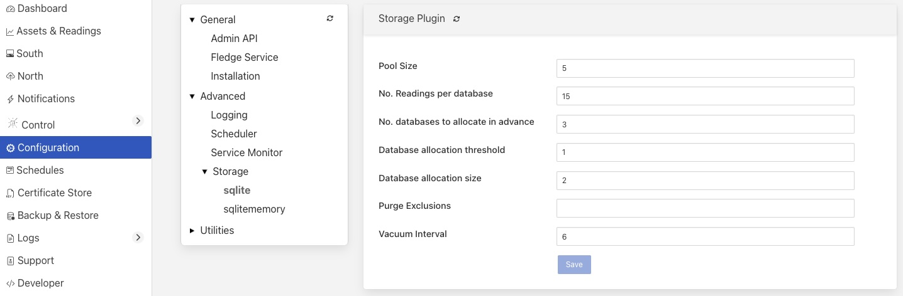
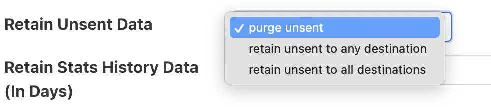

.. Images
.. |storage_01| image:: images/storage_01.jpg
.. |storage_03| image:: images/storage_03.jpg

*******************
Buffering & Storage
*******************

One of the micro-services that makes up the core of a Fledge
implementation is the storage micro-service. This is responsible for

  - storing the configuration of Fledge

  - buffering the data read from the south

  - maintaining the Fledge audit log

  - persisting the state of the system

The storage service is configurable, like other services within Fledge
and uses plugins to extend the functionality of the storage system. These
storage plugins provide the underlying mechanism by which data is
stored within Fledge. Fledge can make use of either one or two of these
plugins at any one time. If a single plugin is used then this plugin
provides the storage for all data. If two plugins are used, one will
be for the buffering of readings and the other for the storage of the
configuration.

As standard Fledge comes with 3 storage plugins

  - **SQLite**: A plugin that can store both configuration data and the readings data using SQLite files as the backing store. The plugin uses multiple SQLite database to store different assets, allowing for high bandwidth data at the expense of limiting the number of assets that a single instance can ingest.,

  - **SQLiteLB**: A plugin that can store both configuration data and the readings data using SQLite files as the backing store. This version of the SQLite plugin uses a single readings database and is better suited for environments that do not have very high bandwidth data. It does not limit the number of distinct assets that can be ingested.

  - **PostgreSQL**: A plugin that can store both configuration and readings data which uses the PostgreSQL SQL server as a storage medium.

  - **SQLiteMemory**: A plugin that can only be used to store reading data. It uses SQLite's in memory storage engine to store the reading data. This provides a high performance reading store however capacity is limited by available memory and if Fledge is stopped or there is a power failure the buffered data will be lost.

The default configuration uses the SQLite disk based storage engine for
both configuration and reading data

Configuring The Storage Plugin
==============================

Once installed the storage plugin can be reconfigured in much the same
way as any Fledge configuration, either using the API or the graphical
user interface to set the storage engine and its options.

  - Using the user interface to configuration the storage, select the *Configuration* item in the left hand menu bar.

  - In the category category tree select *Advanced* and under that select *Storage*.

    +--------------+
    | |storage_01| |
    +--------------+
  
 - To change the storage plugin to use for both configuration and readings enter the name of the new plugin in the *Storage Plugin* entry field. If *Readings Plugin* is left empty then the storage plugin will also be used to store reading data. The default set of plugins installed with Fledge that can be used as *Storage Plugin* values are:

     - *sqlite* - the SQLite file based storage engine.

     - *postgres* - the PostgreSQL server. Note the Postgres server is not installed by default when Fledge is installed and must be installed before it can be used.

  - The *Readings Plugin* may be set to any of the above and may also be set to use the SQLite In Memory plugin by entering the value *sqlitememory* into the configuration field.

  - The *Database threads* field allows for the number of threads used for database housekeeping to be controlled. In normal circumstances 1 is sufficient. If performance issues are seen this can be increased however it is rarely required to be greater than 1 and can have counter productive effects on heavily loaded systems.

  - The *Manage Storage* option is only used when the database storage uses an external database server, such as PostgreSQL. Toggling this option on causes Fledge to start as stop the database server when Fledge is started and stopped. If it s left off then Fledge will assume the database server is running when it starts.

  - The *Management Port* and *Service Port* options allow fixed ports to be assigned to the storage service. These settings are for debugging purposes only and the values should be set to 0 in normal operation.

.. note::

   Additional storage engines may be installed to extend the set
   that is delivered with the standard Fledge installation. These will be
   documented in the packages that provide the storage plugin.

   Storage plugin configurations are not dynamic and Fledge *must* be
   restarted after changing these values. Changing the plugin used to store
   readings will *not* cause the data in the previous storage system to be
   migrated to the new storage system and this data may be lost if it has
   not been sent onward from Fledge.

   If selecting the Postgres storage engine then PostgreSQL must be installed and running with a fledge user created in order for Fledge to start successfully.

SQLite Plugin Configuration
---------------------------

The SQLite storage engine has further options that may be used to
configure its behavior. To access these configuration parameters click
on the *sqlite* option under the *Storage* category in the configuration
page.

+-------------+
| |sqlite_01| |
+-------------+

Many of these configuration options control the performance of SQLite and
it is important to have some background on how readings are stored within
SQLite. The plugin is designed to allow greater ingests rates in
situations where multiple different assets are being ingested by a
single instance.

The storage plugin stores readings for each distinct asset in
a table for that asset. These tables are stored within a database, however
the SQLite database engine will lock an entire database to insert into
any table within that database. In order to improve concurrency, multiple
databases are used within the storage plugin. A set of parameters are
used to define how these tables and databases are used.

.. note::

   SQLite has a limitation on the number of databases that can be attached
   to a single process. Therefore we can not create an unlimited number
   of databases and attach them.

Once the tables within all the databases have been assigned to a
particular asset, any new assets ingested will be inserted into an
overflow tables that contains multiple assets. There is one overflow
table per database within the process. The impact of this is that once
the total number of distinct assets exceeds the number of tables allocated
the gain in performance from using multiple tables in multiple databases
start to diminish.

  - **Pool Size**: The number of connections to create in the database connection pool.

  - **No. Readings per database**: This option control how many assets can be stored in a single database. Each asset will be stored in a distinct table within the database. Once all tables within a database are allocated the plugin will use more databases to store further assets.

  - **No. databases allocate in advance**: This option defines how many databases are create initially by the SQLite plugin.

  - **Database allocation threshold**: The number of unused databases that must exist within the system. Once the number of available databases falls below this value the system will begin the process of creating extra databases.

  - **Database allocation size**: The number of databases to create when the above threshold is crossed. Database creation is a slow process and hence the tuning of these parameters can impact performance when an instance receives a large number of new asset names for which it has previously not allocated readings tables.

  - **Purge Exclusions**: This option allows the user to specify that the purge process should not be applied to particular assets. The user can give a comma separated list of asset names that should be excluded from the purge process. Note, it is recommended that this option is only used for extremely low bandwidth, lookup data that would otherwise be completely purged from the system when the purge process runs.

  - **Vacuum Interval**: The interval in hours between running a database vacuum command to reclaim space. Setting this too high will impact performance, setting it too low will mean that more storage may be required for longer periods.

Installing A PostgreSQL server
==============================

The precise commands needed to install a PostgreSQL server vary for system
to system, in general a packaged version of PostgreSQL is best used and
these are often available within the standard package repositories for
your system.

Ubuntu Install
--------------

On Ubuntu or other apt based distributions the command to install postgres:

.. code-block:: console

  sudo apt install -y postgresql postgresql-client

Now, make sure that PostgreSQL is installed and running correctly:

.. code-block:: console

  sudo systemctl status postgresql

Before you proceed, you must create a PostgreSQL user that matches your Linux user. Supposing that user is *<fledge_user>*, type:

.. code-block:: console

  sudo -u postgres createuser -d <fledge_user>

The *-d* argument is important because the user will need to create the Fledge database.

A more generic command is:

.. code-block:: console

  sudo -u postgres createuser -d $(whoami)

Red Hat Install
---------------

On Red Hat or other yum based distributions to install postgres:

Add PostgreSQL YUM Repository to your System

.. code-block:: console

    sudo yum install -y https://download.postgresql.org/pub/repos/yum/reporpms/EL-9-x86_64/pgdg-redhat-repo-latest.noarch.rpm

Check whether PostgreSQL 13 is available using the command shown below

.. code-block:: console

    sudo yum search -y postgresql13

Once you have confirmed that PostgreSQL 13 repositories are available on your system. Then, you can proceed to install PostgreSQL 13

.. code-block:: console

    sudo yum install -y postgresql13 postgresql13-server

Before using the PostgreSQL server, you need to first initialize the database service using the command

.. code-block:: console

    sudo /usr/pgsql-13/bin/postgresql-13-setup initdb

You can then proceed to start the database server as follows

.. code-block:: console

    sudo systemctl enable --now postgresql-13

Confirm if the just started service above is running by checking its status using the command

.. code-block:: console

    sudo systemctl status postgresql-13

Next, you must create a PostgreSQL user that matches your Linux user.

.. code-block:: console

  sudo -u postgres createuser -d $(whoami)

Storage Management
==================

Fledge manages the amount of storage used by means of purge processes that run periodically to remove older data and thus limit the growth of storage use. The purging operations are implemented as Fledge tasks that can be scheduled to run periodically. There are two distinct tasks that are run

  - **purge**: This task is responsible for limiting the readings that are maintained within the Fledge buffer.

  - **system purge**: This task limit the amount of system data in the form of logs, audit trail and task history that is maintained.

Purge Task
----------

The purge task is run via a scheduled called *purge*, the default for this schedule is to run the purge task every hour. This can be modified via the user interface in the *Schedules* menu entry or via the REST API by updating the schedule.

The purge task has two metrics it takes into consideration, the age of the readings within the system and the number of readings in the system. These can be configured to control how much data is retained within the system. Note however that this does not mean that there will never be data older than specified or more rows than specified as purge runs periodically and between executions of the purge task the readings buffered will continue to grow.

The configuration of the purge task can be found in the *Configuration* menu item under the *Utilities* section.

+------------+
| |purge_01| |
+------------+

  - **Age Of Data To Be Retained**: This configuration option sets the limit on how old data has to be before it is considered for purging from the system. It defines a value in hours, and only data older than this is considered for purging from the system.

  - **Max rows of data to retain**: This defines how many readings should be retained in the buffer. This can override the age of data to retain and defines the maximum allowed number of readings that should be in the buffer after the purge process has completed.

  - **Retain Unsent Data**: This defines how to treat data that has been read by Fledge but not yet sent onward to one or more of the north destinations for data. It supports a number of options

    +------------+
    | |purge_02| |
    +------------+

    - **purge unsent**: Data will be purged regardless if it has been sent onward from Fledge or not.

    - **retain unsent to any destination**: Data will not be purged, i.e. it will be retained, if it has not been sent to any of the north destinations. If it has been sent to at least one of the north destinations then it will be purged.

    - **retain unset to all destinations**: Data will be retained until it has been sent to all north destinations that are enabled at the time the purge process runs. Disabled north destinations are not included in order to prevent them from stopping all data from being purged.

Note: This configuration category will not appear until after the purge process has run for the first time. By default this will be 1 hour after the Fledge instance is started for the first time.

System Purge Task
-----------------

The system purge task is run via a scheduled called *system_purge*, the default for this schedule is to run the system purge task every 23 hours and 50 minutes. This can be modified via the user interface in the *Schedules* menu entry or via the REST API by updating the schedule.

The configuration category for the system purge can be found in the *Configuration* menu item under the *Utilities* section.

+------------+
| |purge_03| |
+------------+

  - **Statistics Retention**: This defines the number of days for which full statistics are held within Fledge. Statistics older than this number of days are removed and only a summary of the statistics is held.

  - **Audit Retention**: This defines the number of day for which the audit log entries will be retained. Once the entries reach this age they will be removed from the system.

  - **Task Retention**: This defines the number of days for which history if task execution within Fledge is maintained.

Note: This configuration category will not appear until after the system purge process has run for the first time.
