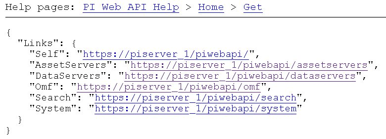
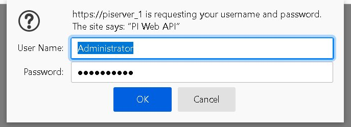
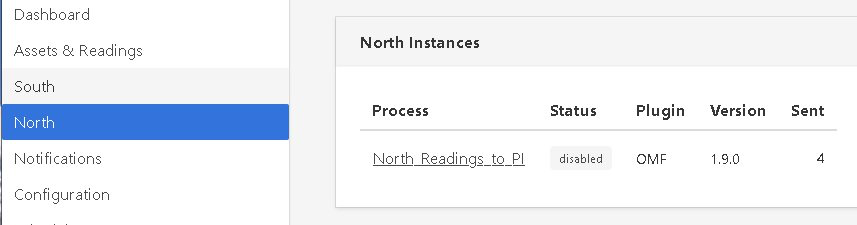
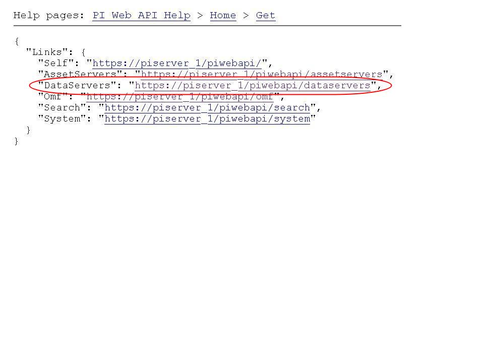
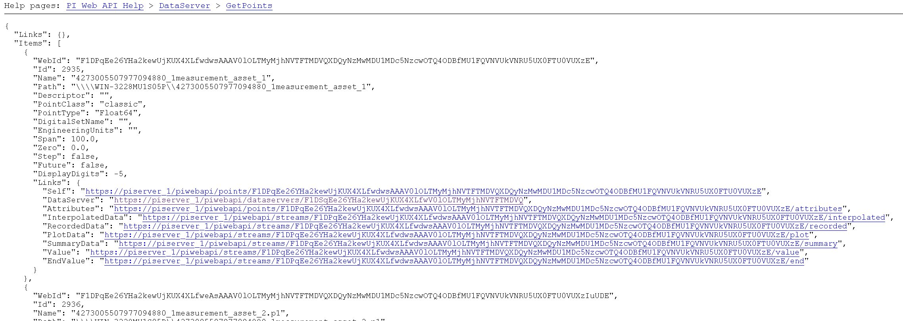
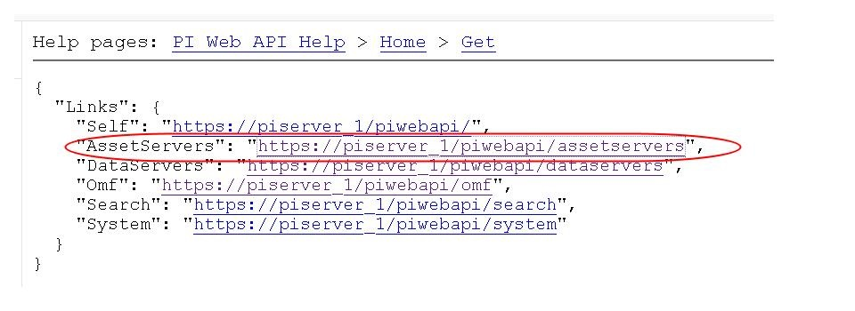
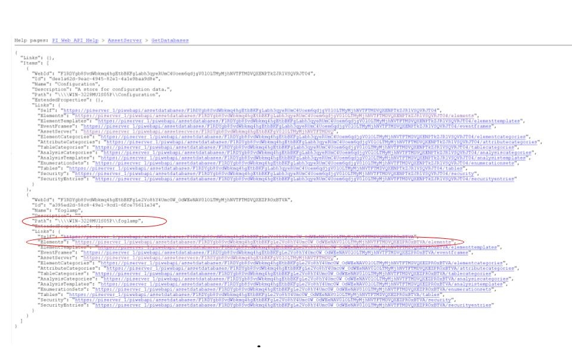
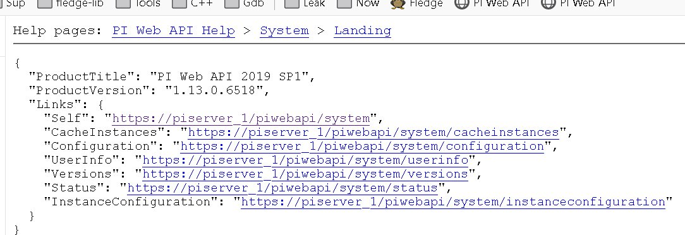

.. Images

.. |img_005| image:: images/tshooting_pi_005.jpg

.. |img_008| image:: images/tshooting_pi_008.jpg

*****************************************
Troubleshooting the PI-Server integration
*****************************************

This section describes how to troubleshoot issues with the PI-Server integration
using Fledge version >= 1.9.1 and PI Web API 2019 SP1 1.13.0.6518

- `Log files`_
- `How to check the PI Web API is installed and running`_
- `Commands to check the PI Web API`_
- `Error messages and causes`_
- `Possible solutions to common problems`_

Log files
=========

Fledge logs messages at error and warning levels by default, it is possible to increase the verbosity of messages logged to include information and debug messages also. This is done by altering the minimum log level setting for the north service or task. To change the minimal log level within the graphical user interface select the north service or task, click on the advanced settings link and then select a new minimal log level from the option list presented.
The name of the north instance should be used to extract just the logs about the PI-Server integration, as in this example:

screenshot from the Fledge GUI

|img_003|

.. code-block:: console

    $ sudo cat /var/log/syslog | grep North_Readings_to_PI

Sample message:

    user.info, 6,1,Mar 15 08:29:57,localhost,Fledge, North_Readings_to_PI[15506]: INFO: SendingProcess is starting

Another sample message:

    North_Readings_to_PI[20884]: WARNING: Error in retrieving the PIWebAPI version, The PI Web API server is not reachable, verify the network reachability

How to check the PI Web API is installed and running
====================================================

Open the URL *https://piserver_1/piwebapi* in the browser, substituting *piserver_1* with the name/address of your PI Server, to
verify the reachability and proper installation of PI Web API.
If PI Web API is configured for Basic authentication a prompt, similar to the one shown below, requesting entry of the user name and password will be displayed

|img_002|

**NOTE:**

- *Enter the user name and password which you set in your Fledge configuration.*

The *PI Web API* *OMF* plugin must be installed to allow the integration with Fledge, in this screenshot the 4th row shows the
proper installation of the plugin:

|img_001|

Select the item *System* to verify the installed version:

|img_010|

Commands to check the PI WEB API
================================

Open the PI Web API URL and drill drown into the Data Archive and the Asset Framework hierarchies to verify the proper configuration on the PI-Server side. Also confirm that the correct permissions have be granted to access these hierarchies.

**Data Archive drill down**

Following the path *DataServers* -> *Points*:

|img_004|

|img_005|

You should be able to browse the *PI Points* page and see your *PI Points* if some data was already sent:

|img_006|

**Asset Framework drill down**

Following the path *AssetServers* -> Select the *Instance* -> Select the proper *Databases* -> drill down into the AF hierarchy up to the required level -> *Elements*:

|img_007|

*selecting the instance*

|img_008|

*selecting the database*

|img_009|

Proceed with the drill down operation up to the desired level/asset.

Error messages and causes
=========================

Some error messages and causes:

.. list-table::
    :widths: 50 50
    :header-rows: 1

    * - Message
      - Cause
    * - North_Readings_to_PI[20884]: WARNING: Error in retrieving the PIWebAPI version, The **PI Web API server is not reachable**, verify the network reachability
      - Fledge is not able to reach the machine in which PI-Server is running due to a network problem or a firewall restriction.
    * - North_Readings_to_PI[5838]: WARNING: Error in retrieving the PIWebAPI version, **503 Service Unavailable**
      - Fledge is able to reach the machine in which PI-Server is executing but the PI Web API is not running.
    * - North_Readings_to_PI[24485]: ERROR: Sending JSON data error : **Container not found**. 4273005507977094880_1measurement_sin_4816_asset_1 - WIN-4M7ODKB0RH2:443 /piwebapi/omf
      - Fledge is able to interact with PI Web API but there is an attempt to store data in a PI Point that does not exist.

Possible solutions to common problems
=====================================

**Recreate a single or a sets of PI-Server objects and resend all the data for them to the PI Server on the Asset Framework hierarchy level**
    procedure:
        - disable the 1st north instance
        - delete the objects in the PI Server, AF + Data archive, that are to be recreated or were partially sent.
        - create a new **DISABLED** north instance using a new, unique name and having the same AF hierarchy as the 1st north instance
        - install *fledge-filter-asset* on the new north instance
        - configure *fledge-filter-asset* with a rule like the following one

          .. code-block:: JSON

              {
                "rules": [
                  {
                    "asset_name": "asset_4",
                    "action": "include"
                  }
                ],
                "defaultAction": "exclude"
              }

        - enable the 2nd north instance
        - let the  2nd north instance send the desired amount of data and then disable it
        - enable the 1st north instance

    note:
        - the 2nd north instance will be used only to recreate the objects and resend the data
        - the 2nd north instance will resend all the data available for the specified *included* assets
        - there will some data duplicated for the recreated assets because part of the information will be managed by both the north instances

**Recreate all the PI-Server objects and resend all the data to the PI Server on a different Asset Framework hierarchy level**
    procedure:
        - disable the 1st north instance
        - create a new north instance using a new, unique name and having a new AF hierarchy (North option 'Asset Framework hierarchies tree')

    note:
        - this solution will create a set of new objects unrelated to the previous ones
        - all the data stored in Fledge will be sent

**Recreate all the PI-Server objects and resend all the data to the PI Server on the same Asset Framework hierarchy level of the 1st North instance WITH data duplication**
    procedure:
        - disable the 1st north instance
        - delete properly the objects on the PI Server, AF + Data archive, that were eventually partially deleted
        - stop / start PI Web API
        - create a new north instance 2nd using the same AF hierarchy (North option 'Asset Framework hierarchies tree)

    note:
        - all the types will be recreated on the PI-Server. If the structure of each asset, number and types of the properties, does not change the data will be accepted and laced into the PI Server without any error. PI Web API 2019 SP1 1.13.0.6518 will accept the data.
        - Using PI Web API 2019 SP1 1.13.0.6518 the PI-Server creates objects with the compression feature disabled. This will cause any data that was previously loaded and is still present in the Data Archive, to be duplicated.

**Recreate all the PI-Server objects and resend all the data to the PI Server on the same Asset Framework hierarchy level of the 1st North instance WITHOUT data duplication**
    procedure:
        - disable the 1st north instance
        - delete all the objects on the PI Server side, both in the AF and in the Data Archive, sent by the 1st north instance
        - stop / start PI Web API
        - create a new north instance using the same AF hierarchy (North option 'Asset Framework hierarchies' tree)

    note:
        - all the data stored in Fledge will be sent

