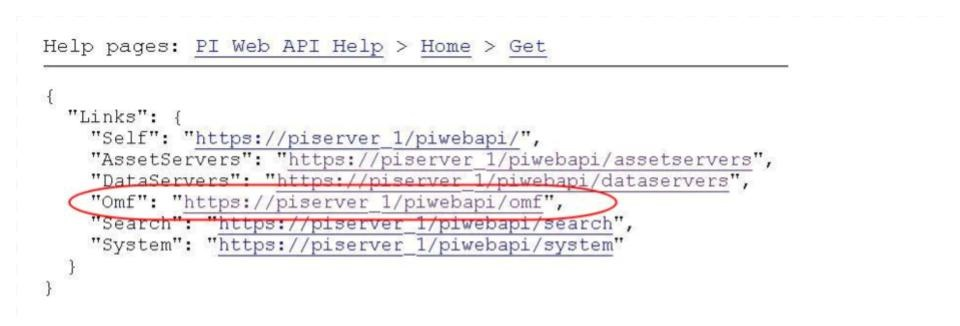
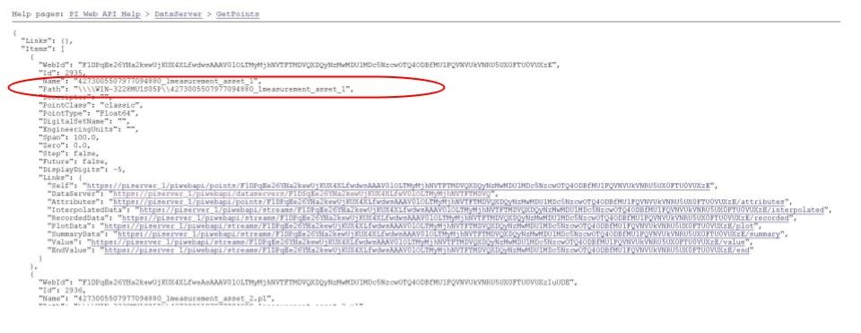
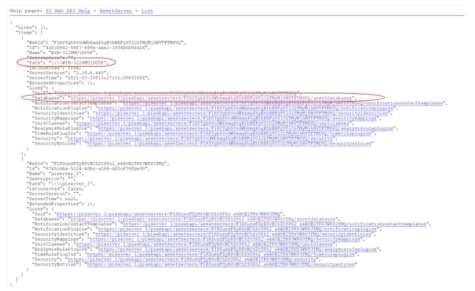

.. Images

.. |img_002| image:: images/tshooting_pi_002.jpg
.. |img_003| image:: images/tshooting_pi_003.png
.. |img_004| image:: images/tshooting_pi_004.jpg
.. |img_005| image:: images/tshooting_pi_005.jpg

.. |img_009| image:: images/tshooting_pi_009.jpg
.. |img_010| image:: images/tshooting_pi_010.jpg
.. |OMF_tabs| image:: images/OMF_tabs.png

.. |PersistedPlugins| image:: images/PersistedPlugins.png

.. |OMF_Formats| image:: images/OMF_Formats.jpg

*****************************************
Troubleshooting the PI Server integration
*****************************************

This section describes how to troubleshoot issues with the PI Server integration
using Fledge version >= 1.9.1 and PI Web API 2019 SP1 1.13.0.6518

- `Log files`_
- `How to check the PI Web API is installed and running`_
- `Commands to check the PI Web API`_
- `Error messages and causes`_
- `Possible solutions to common problems`_

Fledge 2.1.0 and later
======================

In version 2.1 of Fledge a major change was introduced to the OMF plugin in the form of support for OMF version 1.2. This provides for a different method of adding data to the OMF end points that greatly improves the flexibility and removes the need to create complex types in OMF to map onto the Fledge reading structure.
When upgrading from a version prior to 2.1 where data had previously been sent to OMF, the plugin will continue to use the older, pre-OMF 1.2 method to add data. This ensures that data will continue to be written to the same tags within the PI Server or other OMF end points. New data, not previously sent to OMF will be written using the newer OMF 1.2 mechanism.

It is possible to force the OMF plugin to always send data in the pre-OMF 1.2 format, using complex OMF data types, by turning on the option *Complex Types* in the *Formats & Types* tab of the plugin configuration.

+---------------+
| |OMF_Formats| |
+---------------+

Log files
=========

Fledge logs messages at error and warning levels by default, it is possible to increase the verbosity of messages logged to include information and debug messages also. This is done by altering the minimum log level setting for the north service or task. To change the minimal log level within the graphical user interface select the north service or task, click on the advanced settings link and then select a new minimal log level from the option list presented.

The name of the north instance should be used to extract just the logs about the PI Server integration, as in this example:

screenshot from the Fledge GUI

|img_003|

.. code-block:: console

    $ sudo cat /var/log/syslog | grep North_Readings_to_PI

Sample message:

    user.info, 6,1,Mar 15 08:29:57,localhost,Fledge, North_Readings_to_PI[15506]: INFO: SendingProcess is starting

Another sample message:

    North_Readings_to_PI[20884]: WARNING: Error in retrieving the PIWebAPI version, The PI Web API server is not reachable, verify the network reachability

How to check the PI Web API is installed and running
====================================================

Open the URL *https://piserver_1/piwebapi* in the browser, substituting *piserver_1* with the name/address of your PI Server, to
verify the reachability and proper installation of PI Web API.
If PI Web API is configured for Basic authentication a prompt, similar to the one shown below, requesting entry of the user name and password will be displayed

|img_002|

**NOTE:**

- *Enter the user name and password which you set in your Fledge configuration.*

The *PI Web API* *OMF* plugin must be installed to allow the integration with Fledge, in this screenshot the 4th row shows the
proper installation of the plugin:

|img_001|

Select the item *System* to verify the installed version:

|img_010|

Commands to check the PI WEB API
================================

Open the PI Web API URL and drill drown into the Data Archive and the Asset Framework hierarchies to verify the proper configuration on the PI Server side. Also confirm that the correct permissions have be granted to access these hierarchies.

**Data Archive drill down**

Following the path *DataServers* -> *Points*:

|img_004|

|img_005|

You should be able to browse the *PI Points* page and see your *PI Points* if some data was already sent:

|img_006|

**Asset Framework drill down**

Following the path *AssetServers* -> Select the *Instance* -> Select the proper *Databases* -> drill down into the AF hierarchy up to the required level -> *Elements*:

|img_007|

*selecting the instance*

|img_008|

*selecting the database*

|img_009|

Proceed with the drill down operation up to the desired level/asset.

Error messages and causes
=========================

Some error messages and causes:

.. list-table::
    :widths: 50 50
    :header-rows: 1

    * - Message
      - Cause
    * - North_Readings_to_PI[20884]: WARNING: Error in retrieving the PIWebAPI version, The **PI Web API server is not reachable**, verify the network reachability
      - Fledge is not able to reach the machine in which PI Server is running due to a network problem or a firewall restriction.
    * - North_Readings_to_PI[5838]: WARNING: Error in retrieving the PIWebAPI version, **503 Service Unavailable**
      - Fledge is able to reach the machine in which PI Server is executing but the PI Web API is not running.
    * - North_Readings_to_PI[24485]: ERROR: Sending JSON data error : **Container not found**. 4273005507977094880_1measurement_sin_4816_asset_1 - WIN-4M7ODKB0RH2:443 /piwebapi/omf
      - Fledge is able to interact with PI Web API but there is an attempt to store data in a PI Point that does not exist.

OMF Plugin Data
===============

The OMF north plugin must create type information within the OMF subsystem of the PI Server before any data can be sent. This type information is persisted within the PI Server between sessions and must also be persisted within Fledge for each connection to a PI Server. This is done using the plugin data persistence features of the Fledge north plugin.

This results in an important connection between a north service or task and a PI Server, which does add extra constraints as to what may be done at each end. It is very important this data is kept synchronized between the two ends. In normal circumstances this is not a problem, but there are some actions that can cause problems and require action on both ends.

Delete a north service or task using the OMF plugin
    If a north service or task using the OMF plugin is deleted then the persisted data of the plugin is also lost. This is Fledge's record of what types have been created in the PI Server and is no longer synchronized following the deletion of the north service. Any new service or task that is created and connected to the same PI Server will receive duplicate type errors from the PI Server. There are two possible solutions to this problem;

        - Remove the type data from the PI Server such that neither end has the type information.

        - Before deleting the north service or task export the plugin persisted data and import that data into the new service or task.

Cleanup a PI Server and reuse and existing OMF North service or task
    This is the opposite problem to that stated above, the plugin will try to send data thinking that the types have already been created in the PI Server and receive an error. Fledge will automatically correct for this and create new types. These new types however will be created with new names, which may not be the desired behavior. Type names are created using a fixed algorithm. To re-use the previous names, stopping the north service and deleting the plugin persisted data will reset the algorithm and recreate the types using the names that had been previously used.

Taking an existing Fledge north task or service and moving it to a new PI Server
    This new PI Server will not have the type information from the old and we will once again get errors when sending data due to these missing types. Fledge will automatically correct for this and create new types. These new types however will be created with new names, which may not be the desired behavior. Type names are created using a fixed algorithm. To re-use the previous names, stopping, the north service and deleting the plugin persisted data will reset the algorithm and recreate the types using the names that had been previously used.

Managing Plugin Persisted Data
------------------------------

This is not a feature that users would ordinarily need to be concerned with, however it is possible to enable *Developer Features* in the Fledge User Interface that will provide a mechanism to manage this data.

Enable Developer Features
~~~~~~~~~~~~~~~~~~~~~~~~~

Navigate to the *Settings* page of the GUI and toggle on the *Developer Features* check box on the bottom left of the page.

Viewing Persisted Data
~~~~~~~~~~~~~~~~~~~~~~

In order to view the persisted data for the plugins of a service open either the *North* or *South* page on the user interface and select your service or task. An page will open that allows you to update the configuration of the plugin. This contains a set of tabs that may be selected, when *Developer Features* are enabled one of these tabs will be labeled *Developer*.

+------------+
| |OMF_tabs| |
+------------+

The *Developer* tab will allow the viewing of the persisted data for all of the plugins in that service, filters and either north or south plugins, for which data is persisted.

Persisted data is only written when a plugin is shutdown, therefore in order to get the most up to date view of the data it is recommended that service is disabled before viewing the persisted data. It is possible to view the persisted data of a running service, however this will be a snapshot taken from the last time the service was shutdown.

+-----------------+
| |OMF_Persisted| |
+-----------------+

It is possible for more than one plugin within a pipeline to persist data, in order to select between the plugins that have persisted data a menu is provided in the top left which will list all those plugins for which data can be viewed.

+--------------------+
| |PersistedPlugins| |
+--------------------+

As well as viewing the persisted data it is also possible to perform other actions, such as *Delete*, *Export* and *Import*. These actions are available via a menu that appears in the top right of the screen.

+--------------------+
| |PersistedActions| |
+--------------------+

.. note::

    The service must be disabled before use of the Delete or Import features and to get the latest values when performing an Export.

Understanding The OMF Persisted Data
------------------------------------

The persisted data takes the form of a JSON document, the following is an example for a Fledge instance configured with just the Sinusoid plugin.

.. code-block:: json

    {
      "sentDataTypes": [
	{
	  "sinusoid": {
	    "type-id": 1,
	    "dataTypesShort": "0x101",
	    "hintChecksum": "0x0",
	    "namingScheme": 0,
	    "afhHash": "15489826335467873671",
	    "afHierarchy": "fledge/data_piwebapi/mark",
	    "afHierarchyOrig": "fledge/data_piwebapi/mark",
	    "dataTypes": {
	      "sinusoid": {
		"type": "number",
		"format": "float64"
	      }
	    }
	  }
	}
      ]
    }

The *SentDataTypes* is a JSON array of object, with each object representing one data type that has been sent to the PI Server. The key/value pairs within the object are as follow

+-----------------+-------------------------------------------------------------------------------------------+
| Key             | Description                                                                               |
+=================+===========================================================================================+
| type-id         | An index of the different types sent for this asset. Each time a new type is sent to the  |
|                 | PI Server for this asset this index will be incremented.                                  |
+-----------------+-------------------------------------------------------------------------------------------+
| dataTypesShort  | A summary of the types in the datatypes of the asset. The value is an encoded number that |
|                 | contains the count of each of base types, integer, float and string, in the datapoints of |
|                 | this asset.                                                                               |
+-----------------+-------------------------------------------------------------------------------------------+
| hintChecksum    | A checksum of the OMFHints used to create this type. 0 if no OMF Hint was used.           |
+-----------------+-------------------------------------------------------------------------------------------+
| namingScheme    | The current OMF naming scheme when the type was sent.                                     |
+-----------------+-------------------------------------------------------------------------------------------+
| afhHash         | A Hash of the AF settings for the type.                                                   |
+-----------------+-------------------------------------------------------------------------------------------+
| afHierarchy     | The AF Hierarchy location.                                                                |
+-----------------+-------------------------------------------------------------------------------------------+
| afHierarchyOrig | The original setting of AF Hierarchy. This may differ from the above if specific AF rules |
|                 | are in place.                                                                             |
+-----------------+-------------------------------------------------------------------------------------------+
| dataTypes       | The data type sent to the PI Server. This is an actually OMF type definition and is the   |
|                 | exact type definition sent to the PI Web API endpoint.                                    |
+-----------------+-------------------------------------------------------------------------------------------+

Possible solutions to common problems
=====================================

**Recreate a single or a sets of PI Server objects and resend all the data for them to the PI Server on the Asset Framework hierarchy level**
    procedure:
        - disable the 1st north instance
        - delete the objects in the PI Server, AF + Data archive, that are to be recreated or were partially sent.
        - create a new **DISABLED** north instance using a new, unique name and having the same AF hierarchy as the 1st north instance
        - install *fledge-filter-asset* on the new north instance
        - configure *fledge-filter-asset* with a rule like the following one

          .. code-block:: JSON

              {
                "rules": [
                  {
                    "asset_name": "asset_4",
                    "action": "include"
                  }
                ],
                "defaultAction": "exclude"
              }

        - enable the 2nd north instance
        - let the  2nd north instance send the desired amount of data and then disable it
        - enable the 1st north instance

    note:
        - the 2nd north instance will be used only to recreate the objects and resend the data
        - the 2nd north instance will resend all the data available for the specified *included* assets
        - there will some data duplicated for the recreated assets because part of the information will be managed by both the north instances

**Recreate all the PI Server objects and resend all the data to the PI Server on a different Asset Framework hierarchy level**
    procedure:
        - disable the 1st north instance
        - create a new north instance using a new, unique name and having a new AF hierarchy (North option 'Asset Framework hierarchies tree')

    note:
        - this solution will create a set of new objects unrelated to the previous ones
        - all the data stored in Fledge will be sent

**Recreate all the PI Server objects and resend all the data to the PI Server on the same Asset Framework hierarchy level of the 1st North instance WITH data duplication**
    procedure:
        - disable the 1st north instance
        - delete properly the objects on the PI Server, AF + Data archive, that were eventually partially deleted
        - stop / start PI Web API
        - create a new north instance 2nd using the same AF hierarchy (North option 'Asset Framework hierarchies tree)

    note:
        - all the types will be recreated on the PI Server. If the structure of each asset, number and types of the properties, does not change the data will be accepted and laced into the PI Server without any error. PI Web API 2019 SP1 1.13.0.6518 will accept the data.
        - Using PI Web API 2019 SP1 1.13.0.6518 the PI Server creates objects with the compression feature disabled. This will cause any data that was previously loaded and is still present in the Data Archive, to be duplicated.

**Recreate all the PI Server objects and resend all the data to the PI Server on the same Asset Framework hierarchy level of the 1st North instance WITHOUT data duplication**
    procedure:
        - disable the 1st north instance
        - delete all the objects on the PI Server side, both in the AF and in the Data Archive, sent by the 1st north instance
        - stop / start PI Web API
        - create a new north instance using the same AF hierarchy (North option 'Asset Framework hierarchies' tree)

    note:
        - all the data stored in Fledge will be sent

