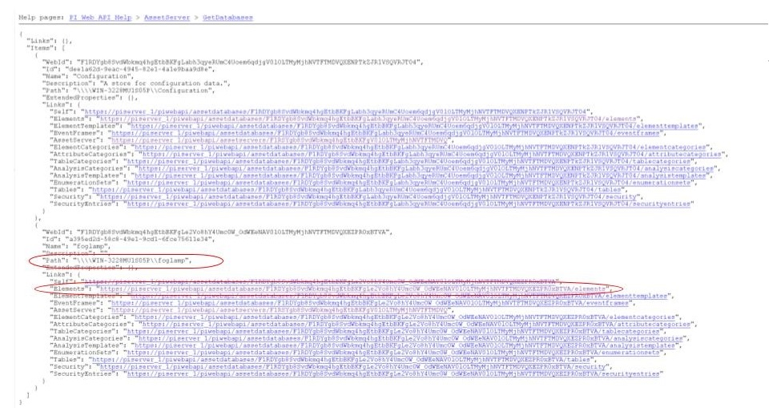
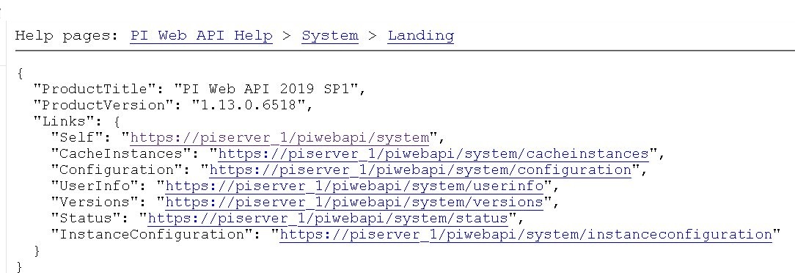
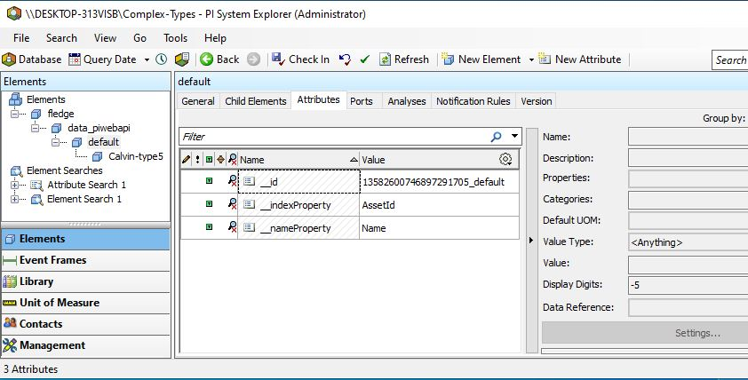

.. Images
.. |img_001| image:: images/tshooting_pi_001.jpg
.. |img_002| image:: images/tshooting_pi_002.jpg
.. |img_003| image:: images/tshooting_pi_003.png
.. |img_004| image:: images/tshooting_pi_004.jpg
.. |img_005| image:: images/tshooting_pi_005.jpg
.. |img_006| image:: images/tshooting_pi_006.jpg
.. |img_007| image:: images/tshooting_pi_007.jpg
.. |img_008| image:: images/tshooting_pi_008.jpg

.. |OMF_Persisted| image:: images/OMF_Persisted.png

.. |PersistedActions| image:: images/PersistActions.png

*****************************************
Troubleshooting the PI Server integration
*****************************************

This section describes how to troubleshoot issues with the PI Server integration using the OMF North plugin.
You should be running PI Web API 2019 SP1 (1.13.0.6518) or later.

- `Log files`_
- `How to confirm that PI Web API is installed and running`_
- `Error Messages and Causes`_
- `Possible Solutions to Common Problems`_

Complex Types vs. Linked Types
==============================

This section describes the representation of Readings in the PI System using either Complex Types or Linked Types.
**Linked Types are highly recommended for new OMF North configurations.**

Complex Types
-------------

When the OMF North plugin operates, it accepts Readings from the Fledge storage and uses them to create OMF Types, Containers and Data messages.
In the initial release of the OMF North plugin, all Types were Complex Types.
This means the Type would include data streams that represent all Datapoints in the Reading.
If a Reading arrived later with the same asset name but with additional Datapoints, OMF would be forced to create a new Type and new Containers.
Previously defined Containers would be abandoned.

Linked Types
------------

In Fledge 2.1.0, support for OMF version 1.2 was introduced to the OMF North plugin.
OMF 1.2 includes support for Linked Types.
Each Datapoint becomes an AF Attribute mapped to a PI Point.
OMF then links the AF Attribute to a parent AF Element to create a complete representation of the Reading in AF.
A major advantage of Linked Types is that new Readings with additional Datapoints will not break any OMF Types.
OMF will simply create a new AF Attribute and PI Point and link it to the existing parent AF Element.

Understanding Types when upgrading Fledge
-----------------------------------------

When upgrading from a Fledge version prior to 2.1 where data had previously been sent to OMF, the plugin will continue to use the pre-OMF 1.2 Complex Types definitions to send data.
This ensures that data will continue to be written to the same PI Points within the PI Server or other OMF end points. New OMF North instances will send data using the newer OMF 1.2 mechanism.

It is possible to create a new OMF North plugin instance that sends data using Complex Types (that is, pre-OMF 1.2 format) by turning on the option *Complex Types* in the *Formats & Types* tab of the plugin configuration.
**This is not recommended.**

+---------------+
| |OMF_Formats| |
+---------------+

Log files
=========

Fledge logs messages at error and warning levels by default, it is possible to increase the verbosity of messages logged to include information and debug messages also. This is done by altering the minimum log level setting for the north service or task. To change the minimal log level within the graphical user interface select the north service or task, click on the advanced settings link and then select a new minimal log level from the option list presented.

The name of the north instance should be used to extract just the logs about the PI Server integration, as in this example:

screenshot from the Fledge GUI

|img_003|

.. code-block:: console

    $ sudo cat /var/log/syslog | grep North_Readings_to_PI

Information Messages
--------------------

If the minimum logging level is set to Information, the OMF North plugin will write messages that list the OMF Types, Containers and Links it creates.
These messages can aid in understanding the artifacts created in the PI AF Server and the PI Data Archive and can help with troubleshooting.
For example, if the *Default Asset Framework Location* is left at its default of */fledge/data_piwebapi/default* and the target AF Database is new,
the following informational messages will be written to the log:

.. code-block:: bash

    INFO: Created Type 16634532276179036866_fledge_typeid
    INFO: Created Element fledge
    INFO: Created Type 4258086130383245257_data_piwebapi_typeid
    INFO: Created Element data_piwebapi
    INFO: Created Link 16634532276179036866_fledge to 4258086130383245257_data_piwebapi
    INFO: Created Type 13582600746897291705_default_typeid
    INFO: Created Element default
    INFO: Created Link 4258086130383245257_data_piwebapi to 13582600746897291705_default

Types, Elements and Links
~~~~~~~~~~~~~~~~~~~~~~~~~

OMF Types appear in the AF Database as AF Element Templates.
Templates can be viewed by running the PI System Explorer and navigating to the *Library* tab and expanding *Element Templates*.
When an AF Element is created by OMF, its defining AF Template is displayed in the *Template* field of the *General* tab.
This is the PI System Explorer view of the *default* AF Element:

|AFElement_Default|

The *Created Link* messages show the creation of links between parent and child AF Elements thereby creating a hierarchy.
The identifiers in the *Created Link* messages are the "index" values of the AF Elements.
The index values can be viewed by clicking the *Attributes* tab for an AF Element in PI System Explorer.
Look for the value of the Attribute "__id."
This is a view of the Attributes of the *default* AF Element:

|AFAttribute_Default|

Containers
~~~~~~~~~~

The Information messages logged for a Linked Types configuration are different from messages logged for a Complex Types configuration.
Each Datapoint in a Reading will become a PI Point mapped to an AF Attribute for both configuration types but how they are organized is different.

Containers with Linked Types
############################

With Linked Types, Containers become PI Points mapped to AF Attributes.
Containers defined by Datapoints in a single Reading are created at once but additional Containers can be added later without breaking the configuration.
For example, if a Reading with an asset named "Calvin" and 3 Datapoints named "random1" through "random3" is received by the plugin,
the following message will be logged when the Containers are created:

.. code-block:: bash

    INFO: Containers created: Calvin.random1,Calvin.random2,Calvin.random3

If at a later time another Reading named "Calvin" is received but with 4 Datapoints, a new message will be logged:

.. code-block:: bash

    INFO: Containers confirmed: Calvin.random1,Calvin.random2,Calvin.random3,Calvin.random4

Strictly speaking, this message is not completely accurate.
The first three Containers already exist so their presence is confirmed.
The last Container (Calvin.random4) will be new.

The data type of the created PI Points and AF Attributes is not logged.
You can check the data types by using the PI System Explorer to view the AF Attributes of the AF Element "Calvin" or by using PI System Management Tools to view the PI Points.

Containers with Complex Types
#############################

With Complex Types, Containers are defined by an OMF Type which will have one or more data streams in it.
The Type will define the names and data types of the individual data streams.
Types are created by the plugin to reflect a Reading and its Datapoints when the Reading is received by the plugin.
When the Container is created, it is important to log its OMF Type as well:

.. code-block:: bash

    INFO: Created Container (Type: A_13582600746897291705_default_2_Calvin_typename_measurement) 2measurement_Calvin
    INFO: Created Element Calvin-type2

The data streams in this example will be Attributes of a new AF Element called "Calvin-type2."
To find the names of the individual data streams, check the definition of the AF Element Template "*A_13582600746897291705_default_2_Calvin_typename_measurement*"
using PI System Explorer.
You will see this AF Template has 3 AF Attributes named "random1" through "random3."
The names of the underlying PI Points will be the Container name from the logged message concatenated with the AF Attribute names separated by a dot (".").
This means the PI Point names will be *2measurement_Calvin.random1*, *2measurement_Calvin.random2* and *2measurement_Calvin.random3*.

If at a later time another Reading named "Calvin" is received but with 4 Datapoints, the situation is much more complicated than for Linked Types.
Once created, an OMF Type cannot be redefined to allow for additional data streams.
The plugin will attempt to match the new Reading to the existing Type but this will fail:

.. code-block:: bash

    ERROR: Error 409 creating Type A_13582600746897291705_default_2_Calvin_typename_sensor
    ERROR: Error 409 creating Type A_13582600746897291705_default_2_Calvin_typename_measurement
    ERROR: HTTP 409: Type conflict for Calvin (random1,random2,random3,random4). Creating a new Type: 2 messages
    WARNING: Message 0 HTTP 200: Warning, The type with the supplied ID and version already exists.,
    ERROR: Message 1 HTTP 409: Error, A type with the supplied ID and version already exists, but it does not match the supplied type.,

This is not a fatal error.
The plugin will search for an existing Type that matches the definition of the newest Reading.
It it can't find one, it will create a new Type.
The process should end with messages like these:

.. code-block:: bash

    INFO: Created Type A_13582600746897291705_default_3_Calvin_typename_sensor
    INFO: Created Type A_13582600746897291705_default_3_Calvin_typename_measurement
    INFO: Created Container (Type: A_13582600746897291705_default_3_Calvin_typename_measurement) 3measurement_Calvin
    INFO: Created Element Calvin-type3

This means the new PI Point names will be *3measurement_Calvin.random1*, *3measurement_Calvin.random2* and *3measurement_Calvin.random3*.
Unfortunately, the previously-defined Containers with their underlying AF Attributes and PI Points cannot be reused.

Created vs. Confirmed
~~~~~~~~~~~~~~~~~~~~~

You may see the terms *Created* and *Confirmed* in the Information messages.
They have specific meanings:

- *Created* means an item did not exist in the PI Server and was created.
- *Confirmed* means an item already exists and is correctly defined.

.. note::

    The plugin makes this distinction by evaluating the HTTP return code from OMF POST calls.
    If an OMF POST call returns an HTTP return code of 200 (OK), it means an item already exists and is correctly defined.
    If an OMF POST call returns an HTTP return code of 201 (Created), it means a new item has been created.
    
Tracing File
------------

It is possible to generate a detailed trace of all OMF messages POSTed to the AVEVA web server for troubleshooting purposes.
This applies to all AVEVA OMF web server types: PI Web API, AVEVA CONNECT and Edge Data Store.
To enable this feature, click the *Enable Tracing* checkbox on the `OMF Basic tab <../plugins/fledge-north-OMF/index.html#basic>`_.

The web server's response to the POSTing of an OMF message is almost always a JSON document which is included in the *omf.log* trace file.
You can temporarily configure PI Web API to include additional information for debugging purposes.
To include debugging information, set the *DebugMode* boolean attribute to *true* in the PI Web API System Configuration.
See the `Configuration at runtime <https://docs.aveva.com/bundle/pi-web-api/page/1023022.html>`_
and `Other security settings <https://docs.aveva.com/bundle/pi-web-api/page/1023034.html>`_ webpages on the AVEVA documentation website for instructions on how to do this.
Debug information for OMF messages appears as a new *Parameters* array in an *EventInfo* object.
For example, this JSON response snippet includes the identifier of the OMF Container and the name of the underlying PI Point:

.. code-block:: json

       "Parameters":[
          {
             "Name":"Container.Id",
             "Value":"sinusoid.sinusoid"
          },
          {
             "Name":"Container.TypeId",
             "Value":"Double64"
          },
          {
             "Name":"Container.TypeVersion",
             "Value":"1.0.0.0"
          },
          {
             "Name":"Property",
             "Value":"Double64"
          },
          {
             "Name":"PIPoint.Name",
             "Value":"sinusoid.sinusoid"
          }
       ]

.. note::

    AVEVA notes that *DebugMode* should be used for troubleshooting only and should be disabled when you are done.
    In a production environment, the *DebugMode* attribute should be set to *false* to reduce vulnerability to cross-site scripting (XSS).

How to confirm that PI Web API is installed and running
=======================================================

Open the URL *https://piserver_1/piwebapi* in the browser (substituting *piserver_1* with the name and address of your PI Server) to
confirm that your server is reachable and that PI Web API is properly installed.
If PI Web API is configured for Basic authentication, a prompt similar to the example shown below requesting entry of the user name and password will be displayed:

|img_002|

**NOTE:**

- *Enter the user name and password which you set in your Fledge configuration.*

The *PI Web API* *OMF* plugin must be installed to allow the integration with Fledge, in this screenshot the 4th row shows the
proper installation of the plugin:

|img_001|

Select the item *System* to verify the installed version:

|img_010|

Commands to check PI Web API
----------------------------

Open the PI Web API URL and drill drown into the Data Archive and the Asset Framework hierarchies to verify the proper configuration on the PI Server side. Also confirm that the correct permissions have be granted to access these hierarchies.

**Data Archive drill down**

Following the path *DataServers* -> *Points*:

|img_004|

|img_005|

You should be able to browse the *PI Points* page and see your *PI Points* if some data was already sent:

|img_006|

**Asset Framework drill down**

Following the path *AssetServers* -> Select the *Instance* -> Select the proper *Databases* -> drill down into the AF hierarchy up to the required level -> *Elements*:

|img_007|

*selecting the instance*

|img_008|

*selecting the database*

|img_009|

Proceed with the drill down operation up to the desired level/asset.

Error Messages and Causes
=========================

This section documents some of the OMF North error messages that can appear in the Linux system log file */var/log/syslog*.

Loss of Connection to the PI Web API Server
-------------------------------------------

If the OMF North plugin cannot communicate with the PI Web API server over the network, these messages will appear:

.. code-block:: bash

    ERROR: Error sending Data, Failed to send data: Operation canceled - piserver:443 /piwebapi/omf
    WARNING: Connection to the destination data archive has been lost
    ERROR: The PI Web API service piserver:443 is not available. HTTP Code: 503

Whenever the message "*Connection to the destination data archive has been lost*" appears, OMF North will not attempt to send data again until connection is reestablished.
OMF North will attempt to reach the PI Web API server every 60 seconds.
When connection is reestablished, these messages will appear:

.. code-block:: bash

    WARNING: PI Web API 2023 SP1-1.19.0.621 reconnected to piserver:443 OMF Version: 1.2
    INFO: The sending of data has resumed

If the PI Web API server machine is running but PI Web API itself is not, the "*Operation canceled*" message will not appear.
OMF North's attempt to send data to PI Web API will result in an HTTP return code 503 (Service Unavailable):

.. code-block:: bash

    ERROR: The PI Web API service piserver:443 is not available. HTTP Code: 503

HTTP Code 409: Processing cannot continue until data archive errors are corrected
---------------------------------------------------------------------------------

The HTTP return code 409 means Conflict.
If OMF North receives an HTTP return code 409, it means the message it sent has attempted to create an item that already exists but is defined differently.
Neither OMF North nor PI Web API can resolve these conflicts automatically.
OMF North will not attempt to send data again.
You must shut down the OMF North instance and address the problem.

Manual intervention by the system manager will be necessary.
This usually means editing or deleting an item in the PI Asset Framework or the PI Data Archive.
Some specific examples are listed in this section.

HTTP Code 409: The supplied container overlaps with a different existing container
----------------------------------------------------------------------------------

This message means that OMF North is attempting to create a new PI Point but a point with the same name already exists with a different configuration.
There is a procedure for repairing the PI Points if this occurs.
The context in which this message appears differs between configurations with Complex Types and Linked Types.
In both cases, the list of messages ends with "*Processing cannot continue until data archive errors are corrected.*"
This means OMF North must be shut down to correct the problem.

Complex Types
~~~~~~~~~~~~~

.. code-block:: bash

    INFO: Created Type A_13582600746897291705_default_1_Calvin_typename_sensor
    INFO: Created Type A_13582600746897291705_default_1_Calvin_typename_measurement
    ERROR: Error 409 creating Container Calvin
    ERROR: HTTP 409: A Conflict occurred sending the Container message for the asset Calvin (Type: A_13582600746897291705_default_1_Calvin_typename_measurement): 1 message
    ERROR: Message 0 HTTP 409: Error, The supplied container overlaps with a different existing container., Data Archive requires PI Point names to be unique, and treats PI Point names as case-insensitive. The specified type and container were translated into PI Point names, but one or more resulting names were already being used.
    WARNING: HTTP Code 409: Processing cannot continue until data archive errors are corrected

Follow the description in the `Containers with Complex Types`_ section to find the names of the PI Points referenced by these messages.

Linked Types
~~~~~~~~~~~~

.. code-block:: bash

    ERROR: HTTP 409: The OMF endpoint reported a Conflict when sending Containers: 4 messages
    WARNING: Message 0 HTTP 200: Warning, The specified container already exists in cache. If the associated points were manually modified or removed and need to be repaired, please restart PI Web API and send the message again.,
    ERROR: Message 3 HTTP 409: Error, The supplied container overlaps with a different existing container., Data Archive requires PI Point names to be unique, and treats PI Point names as case-insensitive. The specified type and container were translated into PI Point names, but one or more resulting names were already being used.
    WARNING: 2 duplicate messages skipped
    WARNING: Containers attempted: Calvin.random1,Calvin.random2,Calvin.random3,Calvin.random4
    WARNING: HTTP Code 409: Processing cannot continue until data archive errors are corrected

Finding the problem PI Points in a Linked Types configuration is straightforward:
the point names appear in the *Containers attempted* message.
It is not possible to tell which of the PI Points has the problem.
Applying the repair procedure to all PI Points listed in the message is safe.

Repair Procedure
~~~~~~~~~~~~~~~~

- Shut down your OMF North instance
- Start PI System Management Tools as Administrator
- Navigate to *Points* then *Point Builder*
- Search for the problem PI Points
- Click the *General* tab in the lower pane. For each PI Point you wish to repair:

  - Change *Point Source* to "L"
  - Clear the *Exdesc*
- Click the *Save* icon at the top of the page, or press Control-S on your keyboard
- Stop and restart PI Web API
- Start your OMF North instance

When your OMF North instance starts, you may see messages that Containers were created:

.. code-block:: bash

    INFO: Containers created: Calvin.random1,Calvin.random2,Calvin.random3,Calvin.random4

This does not mean that new PI Points were created.
It means the OMF processor in PI Web API overwrote the *Point Source* and *Exdesc* point attributes, thereby adopting the PI Point.
OMF returns HTTP return code 201 (Created) when it does this which is why OMF North logs a *Containers created* message.
If you are examining the *omf.log* trace file, you will see messages reading "*A PI Point was overwritten.*"

HTTP Code 409:  One or more PI Points could not be created
----------------------------------------------------------

If OMF North cannot create a PI Point, the messages are these:

.. code-block:: bash

    ERROR: Error 409 creating Container Calvin
    ERROR: HTTP 409: A Conflict occurred sending the Container message for the asset Calvin: 1 message
    ERROR: Message 0 HTTP 409: Error, One or more PI Points could not be created.,
    WARNING: HTTP Code 409: Processing cannot continue until PI Server errors are corrected

The reason why a PI Point cannot be created is not provided by PI Web API.
It is possible that the user account configured for your OMF North instance does not have privileges to create or edit points.
You can test this by starting PI System Management Tools under the same user account and trying to create or edit a PI Point.

It is possible that your PI License has expired or you have exceeded the licensed number of points.
If this is the case, the messages are different.
See the next section.

PI License Expired or Limit Exceeded
------------------------------------

Processing of OMF Container messages may require creation of one or more PI Points.
If the PI Data Archive license has expired or the limit on the number of PI Points has been exceeded, PI Point creation will fail.
PI Web API responds with an exception which is logged by OMF North:

.. code-block:: bash

    ERROR: HTTP 500: An exception occurred when sending container information to the OMF endpoint: 1 message
    ERROR: Message 0 HTTP 500: Error, One or more PI Points could not be created.,
    ERROR: Message 0 Exception: [-12216] Maximum licensed aggregate Point /Module Count exceeded. Parameter name: FatalError (System.ArgumentException)
    WARNING: Containers attempted: Calvin.random4
    WARNING: HTTP Code 500: Processing cannot continue until data archive errors are corrected

OMF Plugin Persisted Data
=========================

The OMF North plugin must create type information within the OMF subsystem of the PI Server before any data can be sent. This type information is persisted within the PI Server between sessions and must also be persisted within Fledge for each connection to a PI Server. This is done using the plugin data persistence features of the OMF North plugin.

This results in an important connection between a north service or task and a PI Server, which does add extra constraints as to what may be done at each end. It is very important this data is kept synchronized between the two ends. In normal circumstances this is not a problem, but there are some actions that can cause problems and require action on both ends.

Delete a north service or task using the OMF plugin
    If a north service or task using the OMF plugin is deleted then the persisted data of the plugin is also lost. This is Fledge's record of what types have been created in the PI Server and is no longer synchronized following the deletion of the north service. Any new service or task that is created and connected to the same PI Server will receive duplicate type errors from the PI Server. There are two possible solutions to this problem;

        - Remove the type data from the PI Server such that neither end has the type information.

        - Before deleting the north service or task export the plugin persisted data and import that data into the new service or task.

Cleanup a PI Server and reuse and existing OMF North service or task
    This is the opposite problem to that stated above, the plugin will try to send data thinking that the types have already been created in the PI Server and receive an error. Fledge will automatically correct for this and create new types. These new types however will be created with new names, which may not be the desired behavior. Type names are created using a fixed algorithm. To re-use the previous names, stopping the north service and deleting the plugin persisted data will reset the algorithm and recreate the types using the names that had been previously used.

Taking an existing Fledge north task or service and moving it to a new PI Server
    This new PI Server will not have the type information from the old and we will once again get errors when sending data due to these missing types. Fledge will automatically correct for this and create new types. These new types however will be created with new names, which may not be the desired behavior. Type names are created using a fixed algorithm. To re-use the previous names, stopping, the north service and deleting the plugin persisted data will reset the algorithm and recreate the types using the names that had been previously used.

Managing Plugin Persisted Data
------------------------------

This is not a feature that users would ordinarily need to be concerned with.
It is possible to enable *Developer Features* in the Fledge User Interface that will provide a mechanism to manage this data.

Enable Developer Features
~~~~~~~~~~~~~~~~~~~~~~~~~

Navigate to the *Settings* page of the GUI and toggle on the *Developer Features* check box on the bottom left of the page.

Viewing Persisted Data
~~~~~~~~~~~~~~~~~~~~~~

In order to view the persisted data for the plugins of a service open either the *North* or *South* page on the user interface and select your service or task. An page will open that allows you to update the configuration of the plugin. This contains a set of tabs that may be selected, when *Developer Features* are enabled one of these tabs will be labeled *Developer*.

+------------+
| |OMF_tabs| |
+------------+

The *Developer* tab will allow the viewing of the persisted data for all of the plugins in that service, filters and either north or south plugins, for which data is persisted.

Persisted data is only written when a plugin is shutdown, therefore in order to get the most up to date view of the data it is recommended that service is disabled before viewing the persisted data. It is possible to view the persisted data of a running service, however this will be a snapshot taken from the last time the service was shutdown.

+-----------------+
| |OMF_Persisted| |
+-----------------+

It is possible for more than one plugin within a pipeline to persist data.
In order to select between the plugins that have persisted data, a menu is provided in the top left which will list all those plugins for which data can be viewed.

+--------------------+
| |PersistedPlugins| |
+--------------------+

As well as viewing the persisted data it is also possible to perform other actions, such as *Delete*, *Export* and *Import*. These actions are available via a menu that appears in the top right of the screen.

+--------------------+
| |PersistedActions| |
+--------------------+

.. note::

    The service must be disabled before use of the Delete or Import features and to get the latest values when performing an Export.

Understanding The OMF Persisted Data
------------------------------------

The persisted data takes the form of a JSON document.
The format of the persisted data differs between *Linked Type* and *Complex Type* configurations.

Linked Type Persisted Data
~~~~~~~~~~~~~~~~~~~~~~~~~~~

Persisted data for Linked Type configurations does not change.
It is always:

.. code-block:: json

    {
        "type-id":1
    }

Complex Type Persisted Data
~~~~~~~~~~~~~~~~~~~~~~~~~~~

The following is an example of an OMF North instance configured for Complex Types with just the Sinusoid plugin:

.. code-block:: json

    {
      "sentDataTypes": [
	{
	  "sinusoid": {
	    "type-id": 1,
	    "dataTypesShort": "0x101",
	    "hintChecksum": "0x0",
	    "namingScheme": 0,
	    "afhHash": "15489826335467873671",
	    "afHierarchy": "fledge/data_piwebapi/mark",
	    "afHierarchyOrig": "fledge/data_piwebapi/mark",
	    "dataTypes": {
	      "sinusoid": {
		"type": "number",
		"format": "float64"
	      }
	    }
	  }
	}
      ]
    }

The *SentDataTypes* is a JSON array of object, with each object representing one data type that has been sent to the PI Server. The key/value pairs within the object are as follow

+-----------------+-------------------------------------------------------------------------------------------+
| Key             | Description                                                                               |
+=================+===========================================================================================+
| type-id         | An index of the different types sent for this asset. Each time a new type is sent to the  |
|                 | PI Server for this asset this index will be incremented.                                  |
+-----------------+-------------------------------------------------------------------------------------------+
| dataTypesShort  | A summary of the types in the datatypes of the asset. The value is an encoded number that |
|                 | contains the count of each of base types, integer, float and string, in the datapoints of |
|                 | this asset.                                                                               |
+-----------------+-------------------------------------------------------------------------------------------+
| hintChecksum    | A checksum of the OMFHints used to create this type. 0 if no OMF Hint was used.           |
+-----------------+-------------------------------------------------------------------------------------------+
| namingScheme    | The current OMF naming scheme when the type was sent.                                     |
+-----------------+-------------------------------------------------------------------------------------------+
| afhHash         | A Hash of the AF settings for the type.                                                   |
+-----------------+-------------------------------------------------------------------------------------------+
| afHierarchy     | The AF Hierarchy location.                                                                |
+-----------------+-------------------------------------------------------------------------------------------+
| afHierarchyOrig | The original setting of AF Hierarchy. This may differ from the above if specific AF rules |
|                 | are in place.                                                                             |
+-----------------+-------------------------------------------------------------------------------------------+
| dataTypes       | The data type sent to the PI Server. This is an actually OMF type definition and is the   |
|                 | exact type definition sent to the PI Web API endpoint.                                    |
+-----------------+-------------------------------------------------------------------------------------------+

Possible Solutions to Common Problems
=====================================

The solutions in this section apply to *Complex Type* configurations only.

Recreate PI Server objects and resend data to the same AF Hierarchy
-------------------------------------------------------------------

Recreate a single PI Server object or a set of PI Server objects.
Resend all the data for them to the PI Server on the Asset Framework hierarchy level.
    
Procedure:
    - Disable the first OMF North instance
    - Delete the AF Elements in the AF Database that are to be recreated or were partially sent
    - Create a new **DISABLED** OMF North instance using a new, unique name and having the same AF hierarchy as the first OMF North instance
    - Install *fledge-filter-asset* on the new OMF North instance
    - Configure *fledge-filter-asset* with a rule like this:

    .. code-block:: JSON

	{
	   "rules":[
	      {
	         "asset_name":"asset_4",
	         "action":"include"
	      }
	   ],
	   "defaultAction":"exclude"
	}

    - Enable the second OMF North instance
    - Let the second OMF North instance send the desired amount of data and then disable it
    - Enable the first OMF North instance

.. note::

    - The second OMF North instance will be used only to recreate the objects and resend the data
    - The second OMF North instance will resend all the data available for the specified *included* assets
    - There will some data duplicated for the recreated assets because part of the information will be managed by both the north instances

Recreate PI Server objects and resend data to the same AF Hierarchy
-------------------------------------------------------------------

This is similar to the previous procedure except that the destination AF hierarchy will be different from the original.

Procedure:
    - Disable the first OMF North instance
    - Create a new OMF North instance using a new, unique name and having a new AF hierarchy.
      The location in the AF hierarchy is set on the *Asset Framework* tab, *Default Asset Framework Location* field.

.. note::

    - This solution will create a set of new objects unrelated to the previous ones
    - All the data stored in Fledge will be sent

Resend Data with Data Duplication
---------------------------------

Recreate all the PI Server objects and resend all the data to the PI Server on the same Asset Framework hierarchy level of the first OMF North instance WITH data duplication.

Procedure:
    - Disable the first OMF North instance
    - Delete the AF Elements and AF Element Templates in the AF Database that were partially deleted
    - Stop and restart PI Web API
    - Create a new OMF North instance using the same AF hierarchy.
      The location in the AF hierarchy is set on the *Asset Framework* tab, *Default Asset Framework Location* field.

.. note::

    - All the Types will be recreated on the PI Server.
      If the structure of each asset, number and types of the properties do not change, the data will be accepted and laced into the PI Server without any error.
      PI Web API 2019 SP1 (1.13.0.6518) (and later) will accept the data.
    - Using PI Web API 2019 SP1 1.13.0.6518, the PI Data Archive creates objects with the compression feature disabled.
      This will cause any data that was previously loaded and is still present in the PI Data Archive to be duplicated.

Resend Data without Data Duplication
------------------------------------

Recreate all the PI Server objects and resend all the data to the PI Server on the same Asset Framework hierarchy level of the first OMF North instance WITHOUT data duplication.

Procedure:
    - Disable the first OMF North instance
    - Delete all the AF Elements and AF Element Templates in the AF Database and PI Points in the PI Data Archive that were sent by the first OMF North instance
    - Stop and restart PI Web API
    - Create a new OMF North instance using the same AF hierarchy.
      The location in the AF hierarchy is set on the *Asset Framework* tab, *Default Asset Framework Location* field.

.. note::

    - All the data stored in Fledge will be sent
