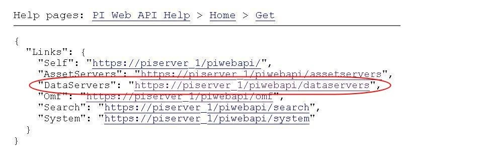
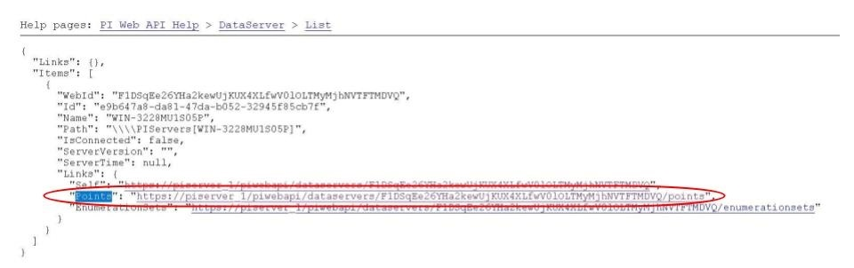

.. Images
.. |img_001| image:: images/tshooting_pi_001.jpg

.. |img_003| image:: images/tshooting_pi_003.jpg

.. |img_006| image:: images/tshooting_pi_006.jpg

Troubleshooting the PI-Server integration
=========================================

This section describes how to trouble shoot issues with the PI-Server integration
using Fledge version >= 1.9.1 and PI Web API 2019 SP1 1.13.0.6518

- Log files
- How to check the PI Web API is installed and running
- Commands to check the PI Web API
- Error messages an the related causes
- Some possible solution to common situations

Log files
---------

Fledge logs into the system syslog, mainly warnings and errors and in some circumstances rows of severity information.
The name of the north instance should be used to extract just the logs about the PI-Server integration, as in this example:

screen short from the Fledge GUI

|img_003|

.. code-block:: console

    $ sudo cat /var/log/syslog | grep North_Readings_to_PI

sample message:

    user.info, 6,1,Mar 15 08:29:57,localhost,Fledge, North_Readings_to_PI[15506]: INFO: SendingProcess is starting

another sample message:

    North_Readings_to_PI[20884]: WARNING: Error in retrieving the PIWebAPI version, The PI Web API server is not reachable, verify the network reachability

How to check the PI Web API is installed and running
----------------------------------------------------

Open the URL *https://piserver_1/piwebapi* in the browser, substituting *piserver_1* with the name/address of your PI Server, to
verify the reachability and proper installation of PI Web API, if PI Web API is configured for *Basic* authentication
a prompt asking user name/password like the following one will appear:

|img_002|

**NOTE:**

- *The same user name/password configured in Fledge should be used.*

The *PI Web API OMF* plugin must be installed to allow the integration with Fledge, in this screen shot the 4th row shows the
proper installation of the plugin:

|img_001|

Commands to check the PI WEB API
--------------------------------

To verify the proper configuration on the PI-Server side, also in terms of granted permissions, drill drown in PI Web API following the path *DataServers* - *Points*:

|img_004|

|img_005|

you should be able to browse the *PI Points* page and see your *PI Points* if some data was already sent:

|img_006|

Error messages an the related causes
------------------------------------

Same messages and the related causes:

The response payload is a set of configuration items within the category, each item is a JSON object with the following set of properties.

.. list-table::
    :widths: 50 50
    :header-rows: 1

    * - Message
      - Cause
    * - North_Readings_to_PI[20884]: WARNING: Error in retrieving the PIWebAPI version, The PI Web API server is not reachable, verify the network reachability
      - Fledge is not able to reach the machine in which PI-Server is running due to a network problem of a firewall restriction.
    * - North_Readings_to_PI[5838]: WARNING: Error in retrieving the PIWebAPI version, 503 Service Unavailable
      - Fledge is capable to reach the machine in which PI-Server is executed but the PI Web API is not running.
    * - North_Readings_to_PI[24485]: ERROR: Sending JSON data error : Container not found. 4273005507977094880_1measurement_sin_4816_asset_1 - WIN-4M7ODKB0RH2:443 /piwebapi/omf
      - Fledge is able to interact with PI Web API but there is an attempt to store data in a PI Point that is not existing.

Some possible solution to common situations
-------------------------------------------

- **Recreate all the objets and send again all the data to the PI Server on a different Asset Framework hierarchy level**
    procedure:
        - disable the 1st north instance
        - create a new north instance, using a new/unique name, having a new AF hierarchy (North option 'Asset Framework hierarchies tree')

    consideration:
        - this solution will create a new set of objects unrelated to the previous ones
        - all the data stored in Fledge will be sent

- **Recreate all the objets and send again all the data to the PI Server on a same Asset Framework hierarchy level of the 1st North instance WITH data duplication***
    procedure:
        - disable the 1st north instance
        - delete properly the objects on the PI Server, AF + Data archive, *that were eventually partially deleted*
        - stop / start PI Web API
        - create a new north instance 2nd using the same AF hierarchy (North option 'Asset Framework hierarchies tree)

    consideration:
        - all the types will be recreated on the PI-Server, if the structure of each asset (number and types of the properties) is always the same and never changes everything should work properly as PI Web API 2019 SP1 1.13.0.6518 is not going to complain with it
        - PI Web API 2019 SP1 1.13.0.6518 sets the PI-Server compression disabled by default, so the data for all the objects already present in the Data Archive will be duplicated

- **Recreate all the objets and send again all the data to the PI Server on a same Asset Framework hierarchy level of the 1st North instance WITHOUT data duplication**
    procedure:
        - disable the 1st north instance
        - properly delete all the objects related to the 1st north instance on the PI Server side, both in the AF and in the Data Archive
        - stop / start PI Web API
        - create a new north instance using the same AF hierarchy (North option 'Asset Framework hierarchies' tree)

    consideration:
        - all the data stored in Fledge will be sent

---  -----------------------------------------------------------------------------------------:

North_Readings_to_PI[24485]: ERROR: Sending JSON data error : Container not found. 4273005507977094880_1measurement_sin_4816_asset_1 - WIN-4M7ODKB0RH2:443 /piwebapi/omf

consideration:

---  -----------------------------------------------------------------------------------------:

TBD:

**Recreated and restored an unintentionally deleted data point in Data Archive**

consideration:
---  -----------------------------------------------------------------------------------------:

How should we proceed when setting up the new Fledge Server,
without losing the data stored on the OSI Server?

---  -----------------------------------------------------------------------------------------:

NOTE:
The current implementation of PI Web API has a limited set of functionalities implemented,
they will extend them in a future version, and we are bound to this capability.

This means that if you partially delete some objects in the PI Server, for example just in the Data archive,
you could end up in a non consistent situation
