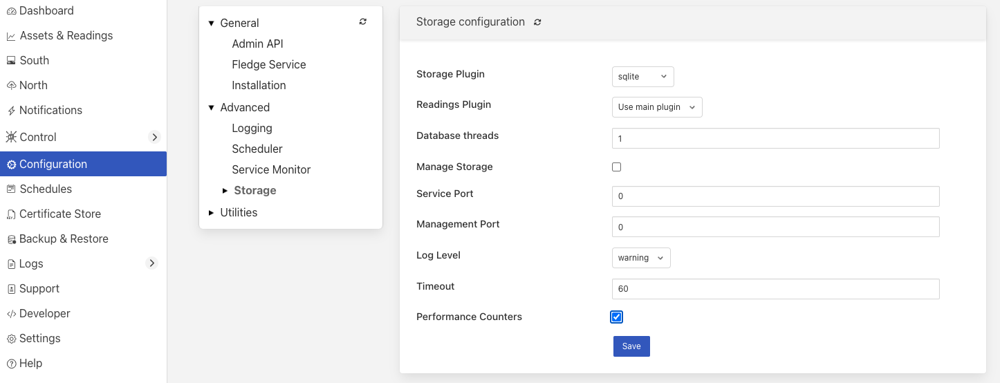

.. Images
.. |south_advanced| image:: images/south_advanced.jpg
.. |stats_options| image:: images/stats_options.jpg

.. |service_monitor| image:: images/service_monitor.jpg
.. |scheduler_advanced| image:: images/scheduler_advanced.jpg

.. |sqlite_config| image:: images/sqlite_config.png
.. |sqlitelb_config| image:: images/sqlitelb_config.png

.. |poll_type| image:: images/poll_type.png

***************
Tuning Fledge
***************

Many factors will impact the performance of a Fledge system

  - The CPU, memory and storage performance of the underlying hardware

  - The communication channel performance to the sensors

  - The communications to the north systems

  - The choice of storage system

  - The external demands via the public REST API

Many of these are outside of the control of Fledge itself, however it is possible to tune the way Fledge will use certain resources to achieve better performance within the constraints of a deployment environment.

South Service Advanced Configuration
====================================

The south services within Fledge each have a set of advanced configuration options defined for them. These are accessed by editing the configuration of the south service itself. A screen with a set of tabbed panes will appear, select the tab labeled *Advanced Configuration* to view and edit the advanced configuration options.

+------------------+
| |south_advanced| |
+------------------+

  - *Maximum Reading Latency (mS)* - This is the maximum period of time for which a south service will buffer a reading before sending it onward to the storage layer. The value is expressed in milliseconds and it effectively defines the maximum time you can expect to wait before being able to view the data ingested by this south service.

  - *Maximum buffered Readings* - This is the maximum number of readings the south service will buffer before attempting to send those readings onward to the storage service. This and the setting above work together to define the buffering strategy of the south service.

  - *Throttle* - If enabled this allows the reading rate to be throttled by the south service. The service will attempt to poll at the rate defined by *Reading Rate*, however if this is not possible, because the readings are being forwarded out of the south service at a lower rate, the reading rate will be reduced to prevent the buffering in the south service from becoming overrun.

  - *Reading Rate* - The rate at which polling occurs for this south service. This parameter only has effect if your south plugin is polled, asynchronous south services do not use this parameter. The units are defined by the setting of the *Reading Rate Per* item.

  - *Asset Tracker Update* - This control how frequently the asset tracker flushes the cache of asset tracking information to the storage layer. It is a value expressed in milliseconds. The asset tracker only write updates, therefore if you have a fixed set of assets flowing in a pipeline the asset tracker will only write any data the first time each asset is seen and will then perform no further writes. If you have variablility in your assets or asset structure the asset tracker will be more active and it becomes more useful to tune this parameter.

  - *Reading Rate Per* - This defines the units to be used in the *Reading Rate* value. It allows the selection of per *second*, *minute* or *hour*.

  - *Poll Type* - This defines the mechanism used to control the poll requests that will be sent to the plugin. Three options are currently available, interval polling and fixed time polling and polling on demand.

    +-------------+
    | |poll_type| |
    +-------------+

    - *Interval* polling will issue a poll request at a fixed rate, that rate being determined by the *Reading Rate* and *Reading Rate Per* settings described above. The first poll request will be issued after startup of the plugin and will not be synchronized to any time or other events within the system.

    - *Fixed Times* polling will issue poll requests at fixed times that are defined by a set of hours, minutes and seconds. These times are defined in the local time zone of the machine that is running the Fledge instance.

    - *On Demand* polling will not perform any regular polling, instead it will wait for a control operation to be sent to the service. That operation is named *poll* and takes no arguments. This allow a poll to be trigger by the control mechanisms from notifications, schedules, north services or API requests.

  - *Hours* - This defines the hours when a poll request will be made. The hours are expressed using the 24 hour clock, with poll requests being made only when the current hour matches one of the hours in the coma separated list of hours. If the *Hours* field is left blank then poll will be issued during every hour of the day.

  - *Minutes* - This defines the minutes in the day when poll requests are made. Poll requests are only made when the current minute matches one of the minutes in the comma separated list of minutes. If the *Minutes* field is left blank then poll requests will be made in any minute within the hour.

  - *Seconds* - This defines the seconds when a poll requests will be made. Seconds is a comma separated list of seconds, poll requests are made when the current second match one of the seconds in the list. If *Fixed Times* polling is selected then the *Seconds* field must not be empty.

  - *Minimum Log Level* - This configuration option can be used to set the logs that will be seen for this service. It defines the level of logging that is send to the syslog and may be set to *error*, *warning*, *info* or *debug*. Logs of the level selected and higher will be sent to the syslog. You may access the contents of these logs by selecting the log icon in the bottom left of this screen.

  - *Statistics Collection* - This configuration option can be used to control how detailed the statistics collected by the south service are. There are three options that may be selected

    +-----------------+
    | |stats_options| |
    +-----------------+

    The *per asset & per service* setting will collect one statistic per asset ingested and an overall statistic for the entire service. The *per service* option just collects the overall service ingest statistics and the *per asset* option just collects the statistics for each asset and not for the entire service. The default is to collect statistics on a per asset & service basis, this is not the best setting if large numbers of distinct assets are ingested by a single south service. Use of the per asset or the per asset and service options should be limited to south service that collect a relatively small number of distinct assets. Collecting large number of statistics, for 1000 or more distinct assets will have a significant performance overhead and may overwhelm less well provisioned Fledge instances. When a large number of assets are ingested by a single south service this value should be set to *per service*.

    .. note::

       The *Statistics Collection* setting will not remove any existing statistics, these will remain and remain to be represented in the statistics history. This only impacts new values that are collected. It is recommended that this be set before a service is started for the first time if the desire it to have no statistics values recorded for either assets or the service.

    .. note::

       If the *per service* option is used then the UI page that displays the south services will not show the asset names and counts for each of the assets that are ingested by that service.

  - *Performance Counters* - This option allows for the collection of performance counters that can be used to help tune the south service.

Performance Counters
--------------------

A number of performance counters can be collected in the south service to help characterise the performance of the service. This is intended to provide input into the tuning of the service and the collection of these counters should not be left on during production use of the service.

Performance counters are collected in the service and a report is written once per minute to the storage layer for later retrieval. The values written are

  - The minimum value of the counter observed within the current minute

  - The maximum value of the counter observed within the current minute

  - The average value of the counter observed within the current minute

  - The number of samples of the counter collected within the current minute

In the current release the performance counters can only be retrieved by direct access to the configuration and statistics database, they are stored in the *monitors* table. Or via the REST API. Future releases will include tools for the retrieval and analysis of these performance counters.

To access the performance counters via the REST API use the entry point /fledge/monitors to retrieve all counters, or /fledge/monitor/{service name} to retrieve counters for a single service.

When collection is enabled the following counters will be collected for the south service that is enabled.

.. list-table::
    :widths: 15 30 55
    :header-rows: 1

    * - Counter
      - Description
      - Causes & Remedial Actions
    * - queueLength
      - The total number of readings that have been queued within the south service for sending to the storage service.
      - Large queues in the south service will mean that the service will have a larger than normal footprint but may not be an issue in itself. However if the queue size grows continuously then there will eventually be a memory allocation failure in the south service. Turning on throttling of the ingest rate will reduce the data that is added to the queue and may be enough to resole the problem, however data will be collected at a reduced rate. A faster storage plugin, perhaps using an in-memory storage engine may be another solution. If your instance has many south services it may be worth considering splitting the south services between multiple instances.
    * - ingestCount
      - The number of readings ingested in each plugin interaction.
      - The counter reflects the number of readings that are returned for each call to the south plugin poll entry point or by the south plugin ingest asynchronous call. Typically this number should be moderately low, if very large numbers are returned in a single call it will result in very large queues building up within the south service and the performance of the system will be degraded with large burst of data that possibly overwhelm other layers interspersed with periods of inactivity. Ideally the peaks should be eliminated and the rate kept 'flat' in order to make the best use of the system. Consider altering the configuration of the south plugin such that it returns less data but more frequently.
    * - readLatency
      - The longest time a reading has spent in the queue between being returned by the south plugin and sent to the storage layer.
      - This counter describes how long, in milliseconds, the oldest reading waiting in the internal south service queue before being sent to the storage layer. This should be less than or equal to the define maximum latency, it may be a little over to allow for queue management times, but should not be significantly higher. If it is significantly higher for long periods of time it would indicate that the storage service is unable to handle the load that is being placed upon it. It may be possible that by tuning the storage layer, changing t a higher performance plugin or one that is better suited to your workload, may resolve the problem. Alternatively consider reducing the load by splitting the south services across multiple Fledge instances.
    * - flow controlled
      - The number of times the reading rate has been reduced due to excessive queues building up in the south service.
      - This is closely related to the queuLength counter and has much the same set of actions that should be taken if the service is frequently flow controlled. Reducing the ingest rate, or adding filtering in the pipeline to reduce the amount of data passed onward to the storage service may alleviate the problem. In general if processing can be done that reduces high bandwidth data into lower bandwidth data that can still characterise the high bandwidth content, then this should be done as close as possible to the source of the data to reduce the overall load on the system.
    * - throttled rate
      - The rate that data is being ingested at as a result of flow control throttling.
      - This counter is more for information as to what might make a reasonable ingest rate the system can sustain with the current configuration. It is useful as it gives a good idea of how far away from your desired performance the current configuration of the system is currently
    * - storedReadings
      - The readings successfully sent to the storage layer.
      - This counter gives an indication of the bandwidth available from the service to the storage engine. This should be at least as high as the ingest rate if data is not to accumulate in buffers within the storage. Altering the maximum latency and maximum buffered readings advanced settings in the south server can impact this throughput.
    * - resendQueued
      - The number of readings queued for resend. Note that readings may be queued for resend multiple times if the resend also failed.
      - This is a good indication of overload conditions within the storage engine. Consistent high values of this counter point to the need to improve the performance of the storage layer.
    * - removedReadings
      - A count of the readings that have been removed after too many attempts to save them in the storage layer.
      - This should normally be zero or close to zero. Any significant values here are a pointer to a critical error with either the south plugin data that is being created or the operation of the storage layer.

Fixed Time Polling
------------------

The fixed time polling can be used in a number of ways to control when poll requests occur, amongst the possible scenarios are;

 - Poll at fixed times within a minute or hour.

 - Poll only for certain periods of the day.

To poll at fixed, regular times then simply set the times when a poll is required. For example to poll every 15 seconds at 0 seconds past the minute, 15, 30 and 45 seconds past the hour, simply st the *Seconds* field to have the value 0, 15, 30, 45 and leave the minutes and hours blank.

If you wished to poll at the hour and every 15 minutes thereafter set the *Minutes* field to 0, 15, 30 and 45 and set the *Seconds* field to 0. Settings *Seconds* to another single value, for example 30, would simply move the poll time to be 0 minutes and 30 seconds, 15 minutes and 30 seconds etc. If multiple values of seconds are given then multiple polls would occur. For example if *Minutes* is set to 0, 15, 30, 45 and *Seconds* is set to 0, 30. A poll would occur at 0 minutes and 0 seconds, 0 minutes and 30 seconds, 15 minutes and 0 seconds, 15 minutes and thirty seconds.

The *Hours* field, if not left empty, would work in the same way as the minutes above.

Another use of the feature is to only poll at certain times of the day. As an example, if we wished to poll every 15 minutes between the hours of 8am and 5pm then we can set the *Hours* field to be 8,9,10,11,12,13,14,15,16 and the *Minutes* field to be 0, 15, 30, 45. The seconds field can be left as 0.

.. note::

   The last poll of the day would be at 16:45 in the above configuration.

Although the intervals between poll times shown in the above examples have all been equal, there is no requirement for this to be the case.

Tuning Buffer Usage
-------------------

The tuning of the south service allows the way the buffering is used within the south service to be controlled. Setting the latency value low results in frequent calls to send data to the storage service and therefore means data is more quickly available. However sending small quantities of data in each call the the storage system does not result in the most optimal use of the communications or of the storage engine itself. Setting a higher latency value results in more data being sent per transaction with the storage system and a more efficient system. The cost of this is the requirement for more in-memory storage within the south service.

Setting the *Maximum buffers Readings* value allows the user to place a cap on the amount of memory used to buffer within the south service, since when this value is reach, regardless of the age of the data and the setting of the latency parameter, the data will be sent to the storage service. Setting this to a smaller value allows tighter control on the memory footprint at the cost of less efficient use of the communication and storage service.

Tuning between performance, latency and memory usage is always a balancing act, there are situations where the performance requirements mean that a high latency will need to be incurred in order to make the most efficient use of the communications between the micro services and the transnational performance of the storage engine. Likewise the memory resources available for buffering may restrict the performance obtainable.

North Advanced Configuration
============================

In a similar way to the south services, north services and tasks also have advanced configuration that can be used to tune the operation of the north side of Fledge. The north advanced configuration is accessed in much the same way as the south, select the North page and open the particular north service or task. A tabbed screen will be shown which contains an *Advanced Configuration* tab.

+------------------+
| |north_advanced| |
+------------------+

  - *Minimum Log Level* - This configuration option can be used to set the logs that will be seen for this service or task. It defines the level of logging that is send to the syslog and may be set to *error*, *warning*, *info* or *debug*. Logs of the level selected and higher will be sent to the syslog. You may access the contents of these logs by selecting the log icon in the bottom left of this screen.

  - *Data block size* - This defines the number of readings that will be sent to the north plugin for each call to the *plugin_send* entry point. This allows the performance of the north data pipeline to be adjusted, with larger blocks sizes increasing the performance, by reducing overhead, but at the cost of requiring more memory in the north service or task to buffer the data as it flows through the pipeline. Setting this value too high may cause issues for certain of the north plugins that have limitations on the number of messages they can handle within a single block.

  - *Asset Tracker Update* - This control how frequently the asset tracker flushes the cache of asset tracking information to the storage layer. It is a value expressed in milliseconds. The asset tracker only write updates, therefore if you have a fixed set of assets flowing in a pipeline the asset tracker will only write any data the first time each asset is seen and will then perform no further writes. If you have variablility in your assets or asset structure the asset tracker will be more active and it becomes more useful to tune this parameter.

  - *Performance Counters* - This option allows for collection of performance counters that can be use to help tune the north service.

Performance Counters
--------------------

A number of performance counters can be collected in the north service to help characterise the performance of the service. This is intended to provide input into the tuning of the service and the collection of these counters should not be left on during production use of the service.

Performance counters are collected in the service and a report is written once per minute to the storage layer for later retrieval. The values written are

  - The minimum value of the counter observed within the current minute

  - The maximum value of the counter observed within the current minute

  - The average value of the counter observed within the current minute

  - The number of samples of the counter collected within the current minute

In the current release the performance counters can only be retrieved by direct access to the configuration and statistics database, they are stored in the *monitors* table. Future releases will include tools for the retrieval and analysis of these performance counters.

To access the performance counters via the REST API use the entry point */fledge/monitors* to retrieve all counters, or */fledge/monitor/{service name}* to retrieve counters for a single service.

.. code-block:: bash

    $ curl -s http://localhost:8081/fledge/monitors | jq
    {
      "monitors": [
        {
          "monitor": "storedReadings",
          "values": [
            {
              "average": 102,
              "maximum": 102,
              "minimum": 102,
              "samples": 20,
              "timestamp": "2024-02-19 16:33:46.690",
              "service": "si"
            },
            {
              "average": 102,
              "maximum": 102,
              "minimum": 102,
              "samples": 20,
              "timestamp": "2024-02-19 16:34:46.713",
              "service": "si"
            },
            {
              "average": 102,
              "maximum": 102,
              "minimum": 102,
              "samples": 20,
              "timestamp": "2024-02-19 16:35:46.736",
              "service": "si"
            }
          ]
        },
        {
          "monitor": "readLatency",
          "values": [
            {
              "average": 2055,
              "maximum": 2064,
              "minimum": 2055,
              "samples": 20,
              "timestamp": "2024-02-19 16:33:46.698",
              "service": "si"
            },
            {
              "average": 2056,
              "maximum": 2068,
              "minimum": 2053,
              "samples": 20,
              "timestamp": "2024-02-19 16:34:46.719",
              "service": "si"
            },
            {
              "average": 2058,
              "maximum": 2079,
              "minimum": 2056,
              "samples": 20,
              "timestamp": "2024-02-19 16:35:46.743",
              "service": "si"
            }
          ]
        },
        {
          "monitor": "ingestCount",
          "values": [
            {
              "average": 34,
              "maximum": 34,
              "minimum": 34,
              "samples": 60,
              "timestamp": "2024-02-19 16:33:46.702",
              "service": "si"
            },
            {
              "average": 34,
              "maximum": 34,
              "minimum": 34,
              "samples": 60,
              "timestamp": "2024-02-19 16:34:46.724",
              "service": "si"
            },
            {
              "average": 34,
              "maximum": 34,
              "minimum": 34,
              "samples": 60,
              "timestamp": "2024-02-19 16:35:46.748",
              "service": "si"
            }
          ]
        },
        {
          "monitor": "queueLength",
          "values": [
            {
              "average": 55,
              "maximum": 100,
              "minimum": 34,
              "samples": 60,
              "timestamp": "2024-02-19 16:33:46.706",
              "service": "si"
            },
            {
              "average": 55,
              "maximum": 100,
              "minimum": 34,
              "samples": 60,
              "timestamp": "2024-02-19 16:34:46.729",
              "service": "si"
            },
            {
              "average": 55,
              "maximum": 100,
              "minimum": 34,
              "samples": 60,
              "timestamp": "2024-02-19 16:35:46.753",
              "service": "si"
            }
          ]
        }
      ]
    }

When collection is enabled the following counters will be collected for the south service that is enabled.

.. list-table::
    :widths: 15 30 55
    :header-rows: 1

    * - Counter
      - Description
      - Causes & Remedial Actions
    * - No of waits for data
      - This counter reports how many times the north service requested data from storage and no data was available.
      - If this value is consistently low or zero it indicates the other services are providing data faster than the north service is able to send that data. Improving the throughput of the north service would be advisable to prevent the accumulation of unsent data in the storage service.
    * - Block utilisation %
      - Data is read by the north service in blocks, the size of this blocks is defined in the advanced configuration of the north service. This counter reflects what percentage of the requested blocks are actually populated with data on each call to the storage service.
      - A constantly high utilisation is an indication that more data is available than can be sent, increasing the block size may improve this situation and allow for a high throughput.
    * - Reading sets buffered
      - This is a counter of the number of blocks that are waiting to be sent in the north service
      - if this figure is more than a couple of blocks it is an indication that the north plugin is failing to sent complete blocks of data and that partial blocks are failing. Reducing the block size may improve the situation and reduce the amount of storage required in the north service.
    * - Total readings buffered
      - This is a count of the total number of readings buffered within the north service.
      - This should be equivalent to 2 or 3 blocks size worth of readings. If it is high then it is an indication that the north plugin is not able to sustain a high enough data rate to match the ingest rates of the system.
    * - Readings sent
      - This gives an indication, for each block, how many readings are sent in the block.
      - This should typically match the blocks read, if not it is an indication of failures to send data by the north plugin.
    * - Percentage readings sent
      - Closely related to the above the s the percentage of each block read that was actually sent.
      - In a well tuned system this figure should be close to 100%, if it is not then it may be that the north plugin is failing to send data, possibly because of an issue in an upstream system. Alternatively the block size may be too high for the upstream system to handle and reducing the block size will bring this value closer to 100%.
    * - Readings added to buffer
      - An absolute count of the number of readings read into each block.
      - If this value is significantly less than the block size it is an indication that the block size can be lowered. If it is always close to the block size then consider increasing the block size.

Health Monitoring
=================

The Fledge core monitors the health of other services within Fledge, this is done with the *Service Monitor* within Fledge and can be configured via the *Configuration* menu item in the Fledge user interface. In the configuration page select the *Advanced* options and then the *Service Monitor* section.

+-------------------+
| |service_monitor| |
+-------------------+

  - *Health Check Interval* - This setting determines how often Fledge will send a health check request to each of the microservices within the Fledge instance. The value is expressed in seconds. Making this value small will decrease the amount of time it will take to detect a failure, but will increase the load on the system for performing health checks. Making this too frequent is likely to increase the occurrence of false failure detection.

  - *Ping Timeout* - Amount of time to wait, in seconds, before declaring that a health check request has failed. Failure for a health check response to be seen within this time will make a service as unresponsive. Small values can result in busy services becoming suspect erroneously.

  - *Max Attempts To Check Heartbeat* - This is the number of heartbeat requests that must fail before the core determines that the service has failed and attempts any restorative action. Reducing this value will cause the service to be declared as failed sooner and hence recovery can be performed sooner. If this value is too small then it can result in multiple instances of a service running or frequent restarts occurring. Making this too long results in loss of data.

  - *Restart Failed* - Determine what action should be taken when a service is detected as failed. Two options are available, *Manual*, in which case not automatic action will be taken, or *Auto*, in which case the service will be automatically restarted.

Scheduler
=========

The Fledge core contains a scheduler that is used for running periodic tasks, this scheduler has a couple of tuning parameters. To access these parameters from the Fledge User Interface, in the configuration page select the *Advanced* options and then the *Scheduler* section.

+----------------------+
| |scheduler_advanced| |
+----------------------+

  - *Max Running Tasks* - Specifies the maximum number of tasks that can be running at any one time. This parameter is designed to stop runaway tasks adversely impacting the performance of the system. When this number is reached no new tasks will be created until one or more of the currently running tasks terminated. Set this too low and you will not be able to run all the task you require in parallel. Set it too high and the system is more at risk from runaway tasks.

  - *Max Age of Task* - Specifies, in days, how long a task can run for. Tasks that run longer than this will be killed by the system.

.. note::

    Individual tasks have a setting that they may use to stop multiple instances of the same task running in parallel. This also helps protect the system from runaway tasks.

Storage
=======

The storage layer is perhaps one of the areas that most impacts the overall performance of the Fledge instance as it is the end point for the data pipelines; the location at which all ingest pipelines in the south terminate and the point of origin for all north pipelines to external systems.

The storage system in Fledge serves two purposes

  - The storage of configuration and persistent state of Fledge itself

  - The buffering of reading data as it traverses the Fledge instance

The physical storage is managed by plugins that are loaded dynamically into the storage service in the same way as with other services in Fledge. In the case of the storage service it may have either one or two plugins loaded. If a single plugin is loaded this will be used for the storage of both configuration and readings; if two plugins are loaded then one will be used for storing the configuration and the other for storing the readings. Not all plugins support both classes of data.

Choosing A Storage Plugin
-------------------------

Fledge comes with a number of storage plugins that may be used, each one has it benefits and limitations, below is an overview of each of the plugins that are currently included with Fledge.

sqlite
    The default storage plugin that is used. It is implemented using the *SQLite* database and is capable of storing both configuration and reading data. It is optimized to allow parallelism when multiple assets are being ingested into the Fledge instance. It does however have limitations on the number of different assets that can be ingested within an instance. The precise limit is dependent upon a number of other factors, but is of the order of 900 unique asset names per instance. This is a good general purpose storage plugin and can manage reasonably high rates of data reading.

sqlitelb
    This is another *SQLite* based plugin able to store both readings and configuration data. It is designed for lower bandwidth data, hence the name suffix *lb*. It does not have the same parallelism optimization as the default *sqlite* plugin, and is therefore less good when high rate data spread across multiple assets is being ingested. However it does perform well when ingesting high rates of a single asset or low rates of a very large number of assets. It does not have any limitations on the number of different assets that can be stored within the Fledge instance.

sqlitememory
    This is a *SQLite* based plugin that uses in memory tables and can only be used to store reading data, it must be used in conjunction with another plugin that will be used to store the configuration. Reading data is stored in tables in memory and thus very high bandwidth data can be supported. If Fledge is shutdown however the data stored in these tables will be lost.

postgres
    This plugin is implemented using the *PostgreSQL* database and supports the storage of both configuration and reading data. It uses the standard Postgres storage engine and benefits from the additional features of Postgres for security and replication. It is capable of high levels of concurrency however has slightly less overall performance than the *sqlite* plugins. Postgres also does not work well with certain types of storage media, such as SD cards as it has a higher ware rate on the media.

In most cases the default *sqlite* storage plugin is perfectly acceptable, however if very high data rates, or huge volumes of data (i.e. large images at a reasonably high rate) are ingested this plugin can start to exhibit issues. This usually exhibits itself by large queues building in the south service or in extreme cases by transaction failure messages in the log for the storage service. If this happens then the recommended course of action is to either switch to a plugin that stores data in memory rather than on external storage, *sqlitememory*, or investigate the media where the data is stored. Low performance storage will adversely impact the *sqlite* plugin.

The *sqlite* plugin may also prove less than optimal if you are ingesting many hundreds of different assets in the same Fledge instance. The *sqlite* plugin has been optimized to allow concurrent south services to write to the storage in parallel. This is done by the use of multiple databases to improve the concurrency, however there is a limit, imposed by the number of open databases that can be supported. If this limit is exceeded it is recommend to switch to the *sqlitelb* plugin. There are configuration options regarding how these databases are used that can change the point at which it becomes necessary to switch to the other plugin.

If you wish to use the same plugin to both store the configuration data and the reading data then you may either choose the same plugin for both or select the option *Use main plugin* for the *Reading Plugin* value. Use the later is perhaps a slightly safer option as changes to the *Storage Plugin* will then automatically cause the readings to use that same plugin.

Configuring Storage Plugins
###########################

The storage plugins to use can be selected in the *Advanced* section of the *Configuration* page. Select the *Storage* category from the category tree display and the following will be displayed.

+------------------+
| |storage_config| |
+------------------+

- **Storage Plugin**: The name of the storage plugin to use. This will be used to store the configuration data and must be one of the supported storage plugins. 
    
.. note:: 

   This can not be the *sqlitememory* plugin as that plugin does not support the storage of configuration.

- **Reading Plugin**: The name of the storage plugin that will be used to store the readings data. If left blank then the *Storage Plugin* above will be used to store both configuration and readings.

- **Database threads**: Increase the number of threads used within the storage service to manage the database activity. This is not the number of threads that can be used to read or write the database and increasing this will not improve the throughput of the data.

- **Manage Storage**: This is used when an external storage application, such as the Postgres database is used that requires separate initialization. If this external process is not run by default setting this to true will cause Fledge to start the storage process. Normally this is not required as Postgres should be run as a system service and SQLite does not require it.

- **Service Port**: Normally the storage service will dynamically create a service port that will be used by the storage service. Setting this to a value other than 0 will cause a fixed port to be used. This can be useful when developing a new storage plugin or to allow access to a non-fledge application to the storage layer. This should only be changed with extreme caution.

- **Management Port**: Normally the storage service will dynamically create a management port that will be used by the storage service. Setting this to a value other than 0 will cause a fixed port to be used. This can be useful when developing a new storage plugin.

- **Log Level**: This control the level at which the storage plugin will output logs. 

Changing will be saved once the *save* button is pressed. Fledge uses a mechanism whereby this data is not only saved in the configuration database, but also cached to a file called *storage.json* in the *etc* directory of the data directory. This is required such that Fledge can find the configuration database during the boot process. If the configuration becomes corrupt for some reason simply removing this file and restarting Fledge will cause the default configuration to be restored. The location of the Fledge data directory will depend upon how you installed Fledge and the environment variables used to run Fledge.

- Installation from a package will usually put the data directory in */usr/local/fledge/data*. However this can be overridden by setting the *$FLEDGE_DATA* environment variable to point at a different location.

- When running a copy of Fledge built from source the data directory can be found in *${FLEDGE_ROOT}/data*. Again this may be overridden by setting the *$FLEDGE_DATA* environment variable.

.. note::

    When changing the storage service a reboot of the Fledge instance is required before the new storage plugins will be used. Also, data is not migrated from one plugin to another and hence if there is unsent data within the database this will be lost when changing the storage plugin. The sqlite and sqlitelb plugin however share the same configuration data tables and hence configuration will be preserved when changing between these databases but reading data will not.

sqlite Plugin Configuration
###########################

The storage plugin configuration can be found in the *Advanced* section of the *Configuration* page. Select the *Storage* category from the category tree display and the plugin name from beneath that category. In the case of the *sqlite* storage plugin the following will be displayed.

+-----------------+
| |sqlite_config| |
+-----------------+

- **Pool Size**: The storage service uses a connection pool to communicate with the underlying database, it is this pool size that determines how many parallel operations can be invoked on the database.

  This pool size is only the initial size, the storage service will grow the pool if required, however setting a realistic initial pool size will improve the ramp up performance of Fledge.

.. note::

        Although the pool size denotes the number of parallel operations that can take place, database locking considerations may reduce the number of actual operations in progress at any point in time.

- **No. Readings per database**: The *sqlite* plugin support multiple readings databases, with the name of the asset used to determine which database to store the readings in. This improves the level of parallelism by reducing the lock contention when data is being written. Setting this value to 1 will cause only a single asset name to be stored within a single readings database, resulting in no contention between assets. However there is a limit on the number of databases, therefore setting this to 1 will limit the number of different assets that can be ingested into the instance.

- **No. databases to allocate in advance**: This controls how many reading databases Fledge should initially created. Creating databases is a slow process and thus is best achieved before data starts to flow through Fledge. Setting this too high will cause Fledge to allocate a large number of databases than required and waste open database connections. Ideally set this to the number of different assets you expect to ingest divided by the number of readings per database configuration above. This should give you sufficient databases to store the data you require.

- **Database allocation threshold**: The allocation of a new database is a slow process, therefore rather than wait until there are no available databases before allocating new ones, it is possible to pre-allocate database as the number of free databases becomes low. This value allows you to set the point at which to allocation more databases. As soon as the number of free databases declines to this value the plugin will allocate more databases.

- **Database allocation size**: The number of new databases to create whenever an allocation occurs. This effectively denotes the size of the free pool of databases that should be created.

- **Purge Exclusion**: This is not a performance settings, but allows a number of assets to be exempted from the purge process. This value is a comma separated list of asset names that will be excluded from the purge operation.

sqlitelb Configuration
######################

The storage plugin configuration can be found in the *Advanced* section of the *Configuration* page. Select the *Storage* category from the category tree display and the plugin name from beneath that category. In the case of the *sqlitelb* storage plugin the following will be displayed.

+-------------------+
| |sqlitelb_config| |
+-------------------+

.. note::

   The *sqlite* configuration is still present and selectable since this instance has run that storage plugin in the past and the configuration is preserved when switching between *sqlite* and *sqlitelb* plugins.

- **Pool Size**: The storage service uses a connection pool to communicate with the underlying database, it is this pool size that determines how many parallel operations can be invoked on the database.

  This pool size is only the initial size, the storage service will grow the pool if required, however setting a realistic initial pool size will improve the ramp up performance of Fledge.

.. note::

    Although the pool size denotes the number of parallel operations that can take place, database locking considerations may reduce the number of actual operations in progress at any point in time.

postgres Configuration
######################

The storage plugin configuration can be found in the *Advanced* section of the *Configuration* page. Select the *Storage* category from the category tree display and the plugin name from beneath that category. In the case of the *postgres* storage plugin the following will be displayed.

+-------------------+
| |postgres_config| |
+-------------------+

  - **Pool Size**: The storage service uses a connection pool to communicate with the underlying database, it is this pool size that determines how many parallel operations can be invoked on the database.
   
    This pool size is only the initial size, the storage service will grow the pool if required, however setting a realistic initial pool size will improve the ramp up performance of Fledge.

  - **Max. Insert Rows**: The maximum number of readings that will be inserted in a single call to Postgres. This is a tuning parameter that has two effects on the system

    - It limits the size, and hence memory requirements, for a single insert statement

    - It prevents very long running insert transactions from blocking access to the readings table

    This parameter is useful on systems with very high data ingest rates or when the ingest contains sporadic large bursts of readings, to limit resource usage and database lock contention.

.. note::

   Although the pool size denotes the number of parallel operations that can take place, database locking considerations may reduce the number of actual operations in progress at any point in time.

sqlitememory Configuration
##########################

The storage plugin configuration can be found in the *Advanced* section of the *Configuration* page. Select the *Storage* category from the category tree display and the plugin name from beneath that category. Since this plugin only supports the storage of readings there will always be at least one other reading plugin displayed. Selecting the *sqlitememory* storage plugin the following will be displayed.

+-----------------------+
| |sqlitememory_config| |
+-----------------------+

  - **Pool Size**: The storage service uses a connection pool to communicate with the underlying database, it is this pool size that determines how many parallel operations can be invoked on the database.

    This pool size is only the initial size, the storage service will grow the pool if required, however setting a realistic initial pool size will improve the ramp up performance of Fledge.

.. note::

    Although the pool size denotes the number of parallel operations that can take place, database locking considerations may reduce the number of actual operations in progress at any point in time.

 - **Persist Data**: Control the persisting of the in-memory database on shutdown. If enabled the in-memory database will be persisted on shutdown of Fledge and reloaded when Fledge is next started. Selecting this option will slow down the shutdown and startup processing for Fledge.

 - **Persist File**: This defines the name of the file to which the in-memory database will be persisted.
