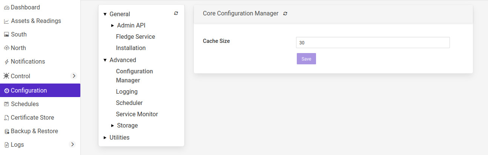

.. Images
.. |south_advanced| image:: images/south_advanced.jpg

.. |stats_options| image:: images/stats_options.jpg
.. |north_advanced| image:: images/north_advanced.jpg
.. |service_monitor| image:: images/service_monitor.jpg

.. |storage_config| image:: images/storage_config.png

.. |postgres_config| image:: images/postgres_config.png
.. |sqlitememory_config| image:: images/sqlitememory_config.png

.. |resource_limit_south_advanced| image:: images/resource_limit_south_advanced.png

***************
Tuning Fledge
***************

Many factors will impact the performance of a Fledge system

  - The CPU, memory and storage performance of the underlying hardware

  - The communication channel performance to the sensors

  - The communications to the north systems

  - The choice of storage system

  - The external demands via the public REST API

Many of these are outside of the control of Fledge itself, however it is possible to tune the way Fledge will use certain resources to achieve better performance within the constraints of a deployment environment.

Setting Log Level
=================

Fledge writes logs via the *syslog* facility of Linux, this allows for multiple different log levels. Altering the log level will impact the performance of the system and can use significant disk space when set to *debug* or *info* levels. Each of the services within a Fledge instance may have the log level set of that service individually.

The logging level for the Fledge core can be set in the *Logging* configuration category in the *Advanced* parent category that can be accessed from the *Configuration* menu item.

+------------------+
| |core_log_level| |
+------------------+

The logging level can be set to *error*, *warning*, *info* or *debug*, the default setting is *warning*. The level set defines the least severe error that will be logged, logs or higher severity that set will also be logged. In the default setting both *error* and *warning* level logs will be sent to the syslog facility.

The storage log level setting can be found in the *Storage* configuration category.

+------------------+
| |storage_config| |
+------------------+

The south and north services also have log level settings for each service that can be accessed via the *Advanced* tab within the configuration of each of the services.

All other optional services will also have a log level setting accessible via the configuration for each service.

.. note::

   It is recommended to only set the log level of a service to *info* or *debug* when actively tracing a problem with the configuration or operation of a service and to always run with the default, *warning*, log level in production.

Configuration Manager Cache
===========================

The Fledge system has an internal configuration manager that is used to load, distribute configuration categories and to dynamically update the other components of the system. These configuration categories are stored in the Fledge storage layer, in order to prevent the need for the configuration manager to query the database for each request to read a configuration category. The size of this cache can be configured in the *Configuration Manager* configuration page which is located with the *Advanced* configuration parent category.

+----------------+
| |config_cache| |
+----------------+

The cache size is expressed as a number of configuration categories to hold in the cache. Increasing this value will increase the amount of memory required for the core service, but will increase the performance, particularly when starting up with a large number of services. Increasing the cache size will also reduce the load on the storage service.

South Service Advanced Configuration
====================================

The south services within Fledge each have a set of advanced configuration options defined for them. These are accessed by editing the configuration of the south service itself. A screen with a set of tabbed panes will appear, select the tab labeled *Advanced Configuration* to view and edit the advanced configuration options.

+------------------+
| |south_advanced| |
+------------------+

  - *Maximum Reading Latency (mS)* - This is the maximum period of time for which a south service will buffer a reading before sending it onward to the storage layer. The value is expressed in milliseconds and it effectively defines the maximum time you can expect to wait before being able to view the data ingested by this south service.

  - *Maximum buffered Readings* - This is the maximum number of readings the south service will buffer before attempting to send those readings onward to the storage service. This and the setting above work together to define the buffering strategy of the south service.

  - *Throttle* - If enabled this allows the reading rate to be throttled by the south service. The service will attempt to poll at the rate defined by *Reading Rate*, however if this is not possible, because the readings are being forwarded out of the south service at a lower rate, the reading rate will be reduced to prevent the buffering in the south service from becoming overrun.

  - *Reading Rate* - The rate at which polling occurs for this south service. This parameter only has effect if your south plugin is polled, asynchronous south services do not use this parameter. The units are defined by the setting of the *Reading Rate Per* item.

  - *Asset Tracker Update* - This control how frequently the asset tracker flushes the cache of asset tracking information to the storage layer. It is a value expressed in milliseconds. The asset tracker only write updates, therefore if you have a fixed set of assets flowing in a pipeline the asset tracker will only write any data the first time each asset is seen and will then perform no further writes. If you have variability in your assets or asset structure the asset tracker will be more active and it becomes more useful to tune this parameter.

  - *Reading Rate Per* - This defines the units to be used in the *Reading Rate* value. It allows the selection of per *second*, *minute* or *hour*.

  - *Poll Type* - This defines the mechanism used to control the poll requests that will be sent to the plugin. Three options are currently available, interval polling and fixed time polling and polling on demand.

    +-------------+
    | |poll_type| |
    +-------------+

    - *Interval* polling will issue a poll request at a fixed rate, that rate being determined by the *Reading Rate* and *Reading Rate Per* settings described above. The first poll request will be issued after startup of the plugin and will not be synchronized to any time or other events within the system.

    - *Fixed Times* polling will issue poll requests at fixed times that are defined by a set of hours, minutes and seconds. These times are defined in the local time zone of the machine that is running the Fledge instance.

    - *On Demand* polling will not perform any regular polling, instead it will wait for a control operation to be sent to the service. That operation is named *poll* and takes no arguments. This allow a poll to be trigger by the control mechanisms from notifications, schedules, north services or API requests.

  - *Hours* - This defines the hours when a poll request will be made. The hours are expressed using the 24 hour clock, with poll requests being made only when the current hour matches one of the hours in the coma separated list of hours. If the *Hours* field is left blank then poll will be issued during every hour of the day.

  - *Minutes* - This defines the minutes in the day when poll requests are made. Poll requests are only made when the current minute matches one of the minutes in the comma separated list of minutes. If the *Minutes* field is left blank then poll requests will be made in any minute within the hour.

  - *Seconds* - This defines the seconds when a poll requests will be made. Seconds is a comma separated list of seconds, poll requests are made when the current second match one of the seconds in the list. If *Fixed Times* polling is selected then the *Seconds* field must not be empty.

  - *Minimum Log Level* - This configuration option can be used to set the logs that will be seen for this service. It defines the level of logging that is send to the syslog and may be set to *error*, *warning*, *info* or *debug*. Logs of the level selected and higher will be sent to the syslog. You may access the contents of these logs by selecting the log icon in the bottom left of this screen.

  - *Statistics Collection* - This configuration option can be used to control how detailed the statistics collected by the south service are. There are three options that may be selected

    +-----------------+
    | |stats_options| |
    +-----------------+

    The *per asset & per service* setting will collect one statistic per asset ingested and an overall statistic for the entire service. The *per service* option just collects the overall service ingest statistics and the *per asset* option just collects the statistics for each asset and not for the entire service. The default is to collect statistics on a per asset & service basis, this is not the best setting if large numbers of distinct assets are ingested by a single south service. Use of the per asset or the per asset and service options should be limited to south service that collect a relatively small number of distinct assets. Collecting large number of statistics, for 1000 or more distinct assets will have a significant performance overhead and may overwhelm less well provisioned Fledge instances. When a large number of assets are ingested by a single south service this value should be set to *per service*.

    .. note::

       The *Statistics Collection* setting will not remove any existing statistics, these will remain and remain to be represented in the statistics history. This only impacts new values that are collected. It is recommended that this be set before a service is started for the first time if the desire it to have no statistics values recorded for either assets or the service.

    .. note::

       If the *per service* option is used then the UI page that displays the south services will not show the asset names and counts for each of the assets that are ingested by that service.

  - *Performance Counters* - This option allows for the collection of performance counters that can be used to help tune the south service.

  - *Monitoring Period* - This defines a period in minutes over which the service collects ingest counts to determine the flow rate of the service. This is averaged over a number of samples to build the average rate and standard deviation from that rate in order to detect anomalous changes in the rate. The user is warned when the rate does not appear consistent with the learnt average and standard deviation. Setting this value to 0 will disable the ingest rate monitoring.

  - *Monitoring Sensitivity* -  This defines the sensitivity of the rate monitoring reports. It is expressed as a factor and is used to determine how many standard deviations from the mean ingest rate is considered as an anomalous ingest rate. The high this number the less sensitive the monitoring process is.

Performance Counters
--------------------

A number of performance counters can be collected in the south service to help characterise the performance of the service. This is intended to provide input into the tuning of the service and the collection of these counters should not be left on during production use of the service.

Performance counters are collected in the service and a report is written once per minute to the storage layer for later retrieval. The values written are

  - The minimum value of the counter observed within the current minute

  - The maximum value of the counter observed within the current minute

  - The average value of the counter observed within the current minute

  - The number of samples of the counter collected within the current minute

In the current release the performance counters can only be retrieved by direct access to the configuration and statistics database, they are stored in the *monitors* table. Or via the REST API. Future releases will include tools for the retrieval and analysis of these performance counters.

To access the performance counters via the REST API use the entry point /fledge/monitors to retrieve all counters, or /fledge/monitors/{service name} to retrieve counters for a single service.

When collection is enabled the following counters will be collected for the south service that is enabled.

.. list-table::
    :widths: 15 30 55
    :header-rows: 1

    * - Counter
      - Description
      - Causes & Remedial Actions
    * - queueLength
      - The total number of readings that have been queued within the south service for sending to the storage service.
      - Large queues in the south service will mean that the service will have a larger than normal footprint but may not be an issue in itself. However if the queue size grows continuously then there will eventually be a memory allocation failure in the south service. Turning on throttling of the ingest rate will reduce the data that is added to the queue and may be enough to resole the problem, however data will be collected at a reduced rate. A faster storage plugin, perhaps using an in-memory storage engine may be another solution. If your instance has many south services it may be worth considering splitting the south services between multiple instances.
    * - ingestCount
      - The number of readings ingested in each plugin interaction.
      - The counter reflects the number of readings that are returned for each call to the south plugin poll entry point or by the south plugin ingest asynchronous call. Typically this number should be moderately low, if very large numbers are returned in a single call it will result in very large queues building up within the south service and the performance of the system will be degraded with large burst of data that possibly overwhelm other layers interspersed with periods of inactivity. Ideally the peaks should be eliminated and the rate kept 'flat' in order to make the best use of the system. Consider altering the configuration of the south plugin such that it returns less data but more frequently.
    * - readLatency
      - The longest time a reading has spent in the queue between being returned by the south plugin and sent to the storage layer.
      - This counter describes how long, in milliseconds, the oldest reading waiting in the internal south service queue before being sent to the storage layer. This should be less than or equal to the define maximum latency, it may be a little over to allow for queue management times, but should not be significantly higher. If it is significantly higher for long periods of time it would indicate that the storage service is unable to handle the load that is being placed upon it. It may be possible that by tuning the storage layer, changing t a higher performance plugin or one that is better suited to your workload, may resolve the problem. Alternatively consider reducing the load by splitting the south services across multiple Fledge instances.
    * - flow controlled
      - The number of times the reading rate has been reduced due to excessive queues building up in the south service.
      - This is closely related to the queuLength counter and has much the same set of actions that should be taken if the service is frequently flow controlled. Reducing the ingest rate, or adding filtering in the pipeline to reduce the amount of data passed onward to the storage service may alleviate the problem. In general if processing can be done that reduces high bandwidth data into lower bandwidth data that can still characterise the high bandwidth content, then this should be done as close as possible to the source of the data to reduce the overall load on the system.
    * - throttled rate
      - The rate that data is being ingested at as a result of flow control throttling.
      - This counter is more for information as to what might make a reasonable ingest rate the system can sustain with the current configuration. It is useful as it gives a good idea of how far away from your desired performance the current configuration of the system is currently
    * - storedReadings
      - The readings successfully sent to the storage layer.
      - This counter gives an indication of the bandwidth available from the service to the storage engine. This should be at least as high as the ingest rate if data is not to accumulate in buffers within the storage. Altering the maximum latency and maximum buffered readings advanced settings in the south server can impact this throughput.
    * - resendQueued
      - The number of readings queued for resend. Note that readings may be queued for resend multiple times if the resend also failed.
      - This is a good indication of overload conditions within the storage engine. Consistent high values of this counter point to the need to improve the performance of the storage layer.
    * - removedReadings
      - A count of the readings that have been removed after too many attempts to save them in the storage layer.
      - This should normally be zero or close to zero. Any significant values here are a pointer to a critical error with either the south plugin data that is being created or the operation of the storage layer.

Ingest Rate Monitoring
----------------------

The ingest rate monitoring in the south service is designed to warn the user when the observed ingest rate of the service falls outside of the expected range observed previously for the service. The mechanism does not rely an option the user provides defining an expected rate, but rather uses observed data to determine an expected range of rates that can be considered normal. The user has options to configure the period over which the rate is observed for reporting purposes and also the sensitivity of the monitoring. This has the advantage over simply defining an upper and lower acceptable ingest rate that it does not need to be adjusted each time the poll rate is adjusted and it can be used with asynchronous data sources where the rate may be unknown, provided those sources are relatively consistent with the rate they supply data.

The monitoring period may be adjusted to suit the consistency of the incoming data rate and tune the frequency with which reports are made. A report can be made at most once per every two monitoring periods,  therefore setting a long monitoring period will reduce the responsive of the alerts to failures. However too short a monitoring period, with rates that fluctuate can result in false positives because the average rate over the given period in not stable even to provide consistent results.

In cases where the data rate is so inconsistent that the monitoring is giving too many false alerts it may be disabled by setting a monitoring period of 0.

The algorithm uses the well known outlier detection mechanism which states that the distribution of data usually falls within a bell curve, with the likelihood of data being higher closer to the average of the data set. It uses standard deviation and mean calculation to determine this and the sensitivity setting defines the number of standard deviation plus or minus of the computed mean that are considered to be good ingest rates.

The monitoring process will collect a number of samples, to create an initial mean and standard deviation before it will start to actively monitor the flow rate. Should the collection rate configuration of the service be altered, the algorithm will discard the learnt mean and standard deviation and restart the collection of the initial sample. The initial sample size is set to be 10 monitoring periods.

Once the monitoring algorithm has completed the initial sample collection and switched to active monitoring, it will continue to refine the current mean value and standard deviation. This allows the monitoring to adjust to small, natural variations in collection rates over time.

When two consecutive  monitoring periods are detected that sent either more than or fewer than the number of readings defined by the current mean, standard deviation and sensitivity factory an alert will be displayed in the Fledge status bar and a warning will be written to the error log. 

+---------------+
| |south_alert| |
+---------------+

The algorithm requires two consecutive out of range ingest rates to prevent the alert trigger for an isolated peak or trough in data collection caused by a one off action occurring on the host platform, or within Fledge. If in a subsequent monitoring period the flow rate returns to acceptable limits, the alert in the status bar will be cleared.

.. note::

   This ingest rate monitoring is designed to be applicable in as many situations as possible. There are however some cases in which this monitoring will create false reports of issues. This may be able to be reduced or eliminated by using the tuning options, but this may not be true in all cases. In particular an asynchronous south plugin that reports data at unpredictable time intervals will most likely not be suitable for this type of monitoring and the monitoring should be disabled by setting a value of 0 for the monitoring interval.

Fixed Time Polling
------------------

The fixed time polling can be used in a number of ways to control when poll requests occur, amongst the possible scenarios are;

 - Poll at fixed times within a minute or hour.

 - Poll only for certain periods of the day.

To poll at fixed, regular times then simply set the times when a poll is required. For example to poll every 15 seconds at 0 seconds past the minute, 15, 30 and 45 seconds past the hour, simply st the *Seconds* field to have the value 0, 15, 30, 45 and leave the minutes and hours blank.

If you wished to poll at the hour and every 15 minutes thereafter set the *Minutes* field to 0, 15, 30 and 45 and set the *Seconds* field to 0. Settings *Seconds* to another single value, for example 30, would simply move the poll time to be 0 minutes and 30 seconds, 15 minutes and 30 seconds etc. If multiple values of seconds are given then multiple polls would occur. For example if *Minutes* is set to 0, 15, 30, 45 and *Seconds* is set to 0, 30. A poll would occur at 0 minutes and 0 seconds, 0 minutes and 30 seconds, 15 minutes and 0 seconds, 15 minutes and thirty seconds.

The *Hours* field, if not left empty, would work in the same way as the minutes above.

Another use of the feature is to only poll at certain times of the day. As an example, if we wished to poll every 15 minutes between the hours of 8am and 5pm then we can set the *Hours* field to be 8,9,10,11,12,13,14,15,16 and the *Minutes* field to be 0, 15, 30, 45. The seconds field can be left as 0.

.. note::

   The last poll of the day would be at 16:45 in the above configuration.

Although the intervals between poll times shown in the above examples have all been equal, there is no requirement for this to be the case.

Tuning Buffer Usage
-------------------

The tuning of the south service allows the way the buffering is used within the south service to be controlled. Setting the latency value low results in frequent calls to send data to the storage service and therefore means data is more quickly available. However sending small quantities of data in each call the the storage system does not result in the most optimal use of the communications or of the storage engine itself. Setting a higher latency value results in more data being sent per transaction with the storage system and a more efficient system. The cost of this is the requirement for more in-memory storage within the south service.

Setting the *Maximum buffers Readings* value allows the user to place a cap on the amount of memory used to buffer within the south service, since when this value is reach, regardless of the age of the data and the setting of the latency parameter, the data will be sent to the storage service. Setting this to a smaller value allows tighter control on the memory footprint at the cost of less efficient use of the communication and storage service.

Tuning between performance, latency and memory usage is always a balancing act, there are situations where the performance requirements mean that a high latency will need to be incurred in order to make the most efficient use of the communications between the micro services and the transactional performance of the storage engine. Likewise the memory resources available for buffering may restrict the performance obtainable.

Reading Latency
---------------

Closely related to buffer usage is reading latency in the south service. This is a measure of the delay between the south service receiving a new reading and that reading appearing in the storage subsystem. We deliberately delay the forwarding of readings from the south service to storage in order to create blocks of multiple readings to send per call to the storage layer. This increases the overall throughput of the south to storage interface at the cost of increasing the latency. There are two settings that come into play when defining this, the maximum latency we will accept and the maximum number of readings we will buffer.

.. note::

   The maximum reading latency may be set to any value between 0 and 600000 milliseconds. A value of zero will disable the buffering. See below for a discussion of the impact of large values of maximum reading latency.

In situations where readings are arriving in the south service relatively frequently these can be set to values to allow data to build up reasonable size blocks of readings to send and hence be more efficient in sending the data to the storage layer. However if data does not arrive frequently or is not predictable in the way it arrives then these settings may cause unexpected latency and delays within the system.

The buffering subsystem within the south service will buffer readings in the south as they arrive. It checks the time difference between the oldest buffered reading and the current time to see if the maximum latency setting is about to be exceeded. If it is it will send the buffered data. If latency check does not result in the data queue being sent to the storage subsystems, the south service will check the number of readings buffered. If the count of buffered readings is about to exceed the maximum allowed number of buffered readings, the south service will then send all the buffered readings to the storage service. No further checks are done until the next reading arrives.

Therefore, if readings do not arrive very frequently, or the south plugin is asynchronous and data arrives sporadically, then it may not check the buffer status for more than the maximum configured latency period. The requirement for more data to arrive before more checks are made, may result in that maximum latency being exceeded. When this occurs a warning message will be logged in the system logs.

In these circumstances, it is recommended to disable or severely limit the buffering in the south service. This will result in less efficient interactions with the storage system, but these will be infrequent due to the infrequent nature of data arrival.

.. note::

   Data arrives at the buffering subsystem **after** it has passed through the processing pipeline in the south service. Therefore if the pipeline does data compression, for example using the delta filter, this may reduce the arrival rate of data at the buffering subsystem and convert high bandwidth data from the plugin to low bandwidth data to send to the storage subsystem.

The system imposes an upper limit of 600000 milliseconds (10 minutes) on the maximum send latency to prevent it being set so high that it appears that the south service is no longer functioning. This is really only an issue in situations where the south service does not receive high rates of data and the send latency is set very high. In these cases the data may reside in the south service for a long period, during which it is not accessible to other services within the system. There is also a risk, in these circumstances, that data for a long period of time might be lost if there was a failure that caused the south service to terminate before sending the data to the storage service.

North Advanced Configuration
============================

In a similar way to the south services, north services and tasks also have advanced configuration that can be used to tune the operation of the north side of Fledge. The north advanced configuration is accessed in much the same way as the south, select the North page and open the particular north service or task. A tabbed screen will be shown which contains an *Advanced Configuration* tab.

+------------------+
| |north_advanced| |
+------------------+

  - *Minimum Log Level* - This configuration option can be used to set the logs that will be seen for this service or task. It defines the level of logging that is send to the syslog and may be set to *error*, *warning*, *info* or *debug*. Logs of the level selected and higher will be sent to the syslog. You may access the contents of these logs by selecting the log icon in the bottom left of this screen.

  - *Data block size* - This defines the number of readings that will be sent to the north plugin for each call to the *plugin_send* entry point. This allows the performance of the north data pipeline to be adjusted, with larger blocks sizes increasing the performance, by reducing overhead, but at the cost of requiring more memory in the north service or task to buffer the data as it flows through the pipeline. Setting this value too high may cause issues for certain of the north plugins that have limitations on the number of messages they can handle within a single block.

  - *Stream update frequency* - This controls how frequently the north service updates the current position it has reached in the stream of data it is sending north. The value is expressed as a number of data blocks between updates. Increasing this value will write the position to the storage less frequently, increasing the performance. However in the event of a failure data in the stream may be repeated for this number of blocks.

  - *Data block prefetch* - The north service has a read-ahead buffering scheme to allow a thread to prefetch buffers of readings data ready to be consumed by the thread sending to the plugin. This value allows the number of blocks that will be prefetched to be tuned. If the sending thread is starved of data, and data is available to be sent, increasing this value can increase the overall throughput of the north service. Caution should however be exercised as increasing this value will also increase the amount of memory consumed.

  - *Asset Tracker Update* - This control how frequently the asset tracker flushes the cache of asset tracking information to the storage layer. It is a value expressed in milliseconds. The asset tracker only write updates, therefore if you have a fixed set of assets flowing in a pipeline the asset tracker will only write any data the first time each asset is seen and will then perform no further writes. If you have variability in your assets or asset structure the asset tracker will be more active and it becomes more useful to tune this parameter.

  - *Performance Counters* - This option allows for collection of performance counters that can be use to help tune the north service.

Performance Counters
--------------------

A number of performance counters can be collected in the north service to help characterise the performance of the service. This is intended to provide input into the tuning of the service and the collection of these counters should not be left on during production use of the service.

Performance counters are collected in the service and a report is written once per minute to the storage layer for later retrieval. The values written are

  - The minimum value of the counter observed within the current minute

  - The maximum value of the counter observed within the current minute

  - The average value of the counter observed within the current minute

  - The number of samples of the counter collected within the current minute

In the current release the performance counters can only be retrieved by direct access to the configuration and statistics database, they are stored in the *monitors* table. Future releases will include tools for the retrieval and analysis of these performance counters.

To access the performance counters via the REST API use the entry point */fledge/monitors* to retrieve all counters, or */fledge/monitors/{service name}* to retrieve counters for a single service.

.. code-block:: bash

    $ curl -s http://localhost:8081/fledge/monitors | jq
    {
      "monitors": [
        {
          "monitor": "storedReadings",
          "values": [
            {
              "average": 102,
              "maximum": 102,
              "minimum": 102,
              "samples": 20,
              "timestamp": "2024-02-19 16:33:46.690",
              "service": "si"
            },
            {
              "average": 102,
              "maximum": 102,
              "minimum": 102,
              "samples": 20,
              "timestamp": "2024-02-19 16:34:46.713",
              "service": "si"
            },
            {
              "average": 102,
              "maximum": 102,
              "minimum": 102,
              "samples": 20,
              "timestamp": "2024-02-19 16:35:46.736",
              "service": "si"
            }
          ]
        },
        {
          "monitor": "readLatency",
          "values": [
            {
              "average": 2055,
              "maximum": 2064,
              "minimum": 2055,
              "samples": 20,
              "timestamp": "2024-02-19 16:33:46.698",
              "service": "si"
            },
            {
              "average": 2056,
              "maximum": 2068,
              "minimum": 2053,
              "samples": 20,
              "timestamp": "2024-02-19 16:34:46.719",
              "service": "si"
            },
            {
              "average": 2058,
              "maximum": 2079,
              "minimum": 2056,
              "samples": 20,
              "timestamp": "2024-02-19 16:35:46.743",
              "service": "si"
            }
          ]
        },
        {
          "monitor": "ingestCount",
          "values": [
            {
              "average": 34,
              "maximum": 34,
              "minimum": 34,
              "samples": 60,
              "timestamp": "2024-02-19 16:33:46.702",
              "service": "si"
            },
            {
              "average": 34,
              "maximum": 34,
              "minimum": 34,
              "samples": 60,
              "timestamp": "2024-02-19 16:34:46.724",
              "service": "si"
            },
            {
              "average": 34,
              "maximum": 34,
              "minimum": 34,
              "samples": 60,
              "timestamp": "2024-02-19 16:35:46.748",
              "service": "si"
            }
          ]
        },
        {
          "monitor": "queueLength",
          "values": [
            {
              "average": 55,
              "maximum": 100,
              "minimum": 34,
              "samples": 60,
              "timestamp": "2024-02-19 16:33:46.706",
              "service": "si"
            },
            {
              "average": 55,
              "maximum": 100,
              "minimum": 34,
              "samples": 60,
              "timestamp": "2024-02-19 16:34:46.729",
              "service": "si"
            },
            {
              "average": 55,
              "maximum": 100,
              "minimum": 34,
              "samples": 60,
              "timestamp": "2024-02-19 16:35:46.753",
              "service": "si"
            }
          ]
        }
      ]
    }

When collection is enabled the following counters will be collected for the south service that is enabled.

.. list-table::
    :widths: 15 30 55
    :header-rows: 1

    * - Counter
      - Description
      - Causes & Remedial Actions
    * - No of waits for data
      - This counter reports how many times the north service requested data from storage and no data was available.
      - If this value is consistently low or zero it indicates the other services are providing data faster than the north service is able to send that data. Improving the throughput of the north service would be advisable to prevent the accumulation of unsent data in the storage service.
    * - Block utilisation %
      - Data is read by the north service in blocks, the size of this blocks is defined in the advanced configuration of the north service. This counter reflects what percentage of the requested blocks are actually populated with data on each call to the storage service.
      - A constantly high utilisation is an indication that more data is available than can be sent, increasing the block size may improve this situation and allow for a high throughput.
    * - Reading sets buffered
      - This is a counter of the number of blocks that are waiting to be sent in the north service
      - if this figure is more than a couple of blocks it is an indication that the north plugin is failing to sent complete blocks of data and that partial blocks are failing. Reducing the block size may improve the situation and reduce the amount of storage required in the north service.
    * - Total readings buffered
      - This is a count of the total number of readings buffered within the north service.
      - This should be equivalent to 2 or 3 blocks size worth of readings. If it is high then it is an indication that the north plugin is not able to sustain a high enough data rate to match the ingest rates of the system.
    * - Readings sent
      - This gives an indication, for each block, how many readings are sent in the block.
      - This should typically match the blocks read, if not it is an indication of failures to send data by the north plugin.
    * - Percentage readings sent
      - Closely related to the above the s the percentage of each block read that was actually sent.
      - In a well tuned system this figure should be close to 100%, if it is not then it may be that the north plugin is failing to send data, possibly because of an issue in an upstream system. Alternatively the block size may be too high for the upstream system to handle and reducing the block size will bring this value closer to 100%.
    * - Readings added to buffer
      - An absolute count of the number of readings read into each block.
      - If this value is significantly less than the block size it is an indication that the block size can be lowered. If it is always close to the block size then consider increasing the block size.
    * - No data available to fetch
      - Signifies how often there was no data available to be sent to the north plugin.
      - This performance monitor is useful to aid in tuning the number of buffers to prefetch. It is set to one each time the north plugin is ready to consume more data and no data is available. The count of samples will indicate how often this condition was true within the one minute sampling period.

Health Monitoring
=================

The Fledge core monitors the health of other services within Fledge, this is done with the *Service Monitor* within Fledge and can be configured via the *Configuration* menu item in the Fledge user interface. In the configuration page select the *Advanced* options and then the *Service Monitor* section.

+-------------------+
| |service_monitor| |
+-------------------+

  - *Health Check Interval* - This setting determines how often Fledge will send a health check request to each of the microservices within the Fledge instance. The value is expressed in seconds. Making this value small will decrease the amount of time it will take to detect a failure, but will increase the load on the system for performing health checks. Making this too frequent is likely to increase the occurrence of false failure detection.

  - *Ping Timeout* - Amount of time to wait, in seconds, before declaring that a health check request has failed. Failure for a health check response to be seen within this time will make a service as unresponsive. Small values can result in busy services becoming suspect erroneously.

  - *Max Attempts To Check Heartbeat* - This is the number of heartbeat requests that must fail before the core determines that the service has failed and attempts any restorative action. Reducing this value will cause the service to be declared as failed sooner and hence recovery can be performed sooner. If this value is too small then it can result in multiple instances of a service running or frequent restarts occurring. Making this too long results in loss of data.

  - *Restart Failed* - Determine what action should be taken when a service is detected as failed. Two options are available, *Manual*, in which case not automatic action will be taken, or *Auto*, in which case the service will be automatically restarted.

Scheduler
=========

The Fledge core contains a scheduler that is used for running periodic tasks, this scheduler has a couple of tuning parameters. To access these parameters from the Fledge User Interface, in the configuration page select the *Advanced* options and then the *Scheduler* section.

+----------------------+
| |scheduler_advanced| |
+----------------------+

  - *Max Running Tasks* - Specifies the maximum number of tasks that can be running at any one time. This parameter is designed to stop runaway tasks adversely impacting the performance of the system. When this number is reached no new tasks will be created until one or more of the currently running tasks terminated. Set this too low and you will not be able to run all the task you require in parallel. Set it too high and the system is more at risk from runaway tasks.

  - *Max Age of Task* - Specifies, in days, how long a task can run for. Tasks that run longer than this will be killed by the system.

.. note::

    Individual tasks have a setting that they may use to stop multiple instances of the same task running in parallel. This also helps protect the system from runaway tasks.

Startup Ordering
----------------

The Fledge scheduler also provides for ordering the startup sequence of the various services within a Fledge instance. This ensures that the support services are started before any south or north services are started, with the south services started before the north services.

There is no ordering within the south or north services, with all south services being started in a single block and all north services started in a single block.

The order in which a service is started is controlled by assigning a priority to the service. This priority is a numeric value and services are started based on this value. The lower the value the earlier in the sequence the service is started.

Priorities are stored in the database table, scheduled_processes. There is currently no user interface to modify the priority of scheduled processes, but it may be changed by direct access to the database. Future versions of Fledge may add an interface to allow for the tuning of process startup priorities.

Storage
=======

The storage layer is perhaps one of the areas that most impacts the overall performance of the Fledge instance as it is the end point for the data pipelines; the location at which all ingest pipelines in the south terminate and the point of origin for all north pipelines to external systems.

The storage system in Fledge serves two purposes

  - The storage of configuration and persistent state of Fledge itself

  - The buffering of reading data as it traverses the Fledge instance

The physical storage is managed by plugins that are loaded dynamically into the storage service in the same way as with other services in Fledge. In the case of the storage service it may have either one or two plugins loaded. If a single plugin is loaded this will be used for the storage of both configuration and readings; if two plugins are loaded then one will be used for storing the configuration and the other for storing the readings. Not all plugins support both classes of data.

Choosing A Storage Plugin
-------------------------

Fledge comes with a number of storage plugins that may be used, each one has it benefits and limitations, below is an overview of each of the plugins that are currently included with Fledge.

sqlite
    The default storage plugin that is used. It is implemented using the *SQLite* database and is capable of storing both configuration and reading data. It is optimized to allow parallelism when multiple assets are being ingested into the Fledge instance. It does however have limitations on the number of different assets that can be ingested within an instance. The precise limit is dependent upon a number of other factors, but is of the order of 900 unique asset names per instance. This is a good general purpose storage plugin and can manage reasonably high rates of data reading.

sqlitelb
    This is another *SQLite* based plugin able to store both readings and configuration data. It is designed for lower bandwidth data, hence the name suffix *lb*. It does not have the same parallelism optimization as the default *sqlite* plugin, and is therefore less good when high rate data spread across multiple assets is being ingested. However it does perform well when ingesting high rates of a single asset or low rates of a very large number of assets. It does not have any limitations on the number of different assets that can be stored within the Fledge instance.

sqlitememory
    This is a *SQLite* based plugin that uses in memory tables and can only be used to store reading data, it must be used in conjunction with another plugin that will be used to store the configuration. Reading data is stored in tables in memory and thus very high bandwidth data can be supported. If Fledge is shutdown however the data stored in these tables will be lost.

postgres
    This plugin is implemented using the *PostgreSQL* database and supports the storage of both configuration and reading data. It uses the standard Postgres storage engine and benefits from the additional features of Postgres for security and replication. It is capable of high levels of concurrency however has slightly less overall performance than the *sqlite* plugins. Postgres also does not work well with certain types of storage media, such as SD cards as it has a higher ware rate on the media.

In most cases the default *sqlite* storage plugin is perfectly acceptable, however if very high data rates, or huge volumes of data (i.e. large images at a reasonably high rate) are ingested this plugin can start to exhibit issues. This usually exhibits itself by large queues building in the south service or in extreme cases by transaction failure messages in the log for the storage service. If this happens then the recommended course of action is to either switch to a plugin that stores data in memory rather than on external storage, *sqlitememory*, or investigate the media where the data is stored. Low performance storage will adversely impact the *sqlite* plugin.

The *sqlite* plugin may also prove less than optimal if you are ingesting many hundreds of different assets in the same Fledge instance. The *sqlite* plugin has been optimized to allow concurrent south services to write to the storage in parallel. This is done by the use of multiple databases to improve the concurrency, however there is a limit, imposed by the number of open databases that can be supported. If this limit is exceeded it is recommend to switch to the *sqlitelb* plugin. There are configuration options regarding how these databases are used that can change the point at which it becomes necessary to switch to the other plugin.

If you wish to use the same plugin to both store the configuration data and the reading data then you may either choose the same plugin for both or select the option *Use main plugin* for the *Reading Plugin* value. Use the later is perhaps a slightly safer option as changes to the *Storage Plugin* will then automatically cause the readings to use that same plugin.

Configuring Storage Plugins
###########################

The storage plugins to use can be selected in the *Advanced* section of the *Configuration* page. Select the *Storage* category from the category tree display and the following will be displayed.

+------------------+
| |storage_config| |
+------------------+

- **Storage Plugin**: The name of the storage plugin to use. This will be used to store the configuration data and must be one of the supported storage plugins. 
    
.. note:: 

   This can not be the *sqlitememory* plugin as that plugin does not support the storage of configuration.

- **Reading Plugin**: The name of the storage plugin that will be used to store the readings data. If left blank then the *Storage Plugin* above will be used to store both configuration and readings.

- **Database threads**: Increase the number of threads used within the storage service to manage the database activity. This is not the number of threads that can be used to read or write the database and increasing this will not improve the throughput of the data.

- **Manage Storage**: This is used when an external storage application, such as the Postgres database is used that requires separate initialization. If this external process is not run by default setting this to true will cause Fledge to start the storage process. Normally this is not required as Postgres should be run as a system service and SQLite does not require it.

- **Service Port**: Normally the storage service will dynamically create a service port that will be used by the storage service. Setting this to a value other than 0 will cause a fixed port to be used. This can be useful when developing a new storage plugin or to allow access to a non-fledge application to the storage layer. This should only be changed with extreme caution.

- **Management Port**: Normally the storage service will dynamically create a management port that will be used by the storage service. Setting this to a value other than 0 will cause a fixed port to be used. This can be useful when developing a new storage plugin.

- **Log Level**: This control the level at which the storage plugin will output logs. 

- **Timeout**: Sets the timeout value in seconds for each request to the storage layer. This causes a timeout error to be returned to a client if a storage call takes longer than the specified value.

Changing will be saved once the *save* button is pressed. Fledge uses a mechanism whereby this data is not only saved in the configuration database, but also cached to a file called *storage.json* in the *etc* directory of the data directory. This is required such that Fledge can find the configuration database during the boot process. If the configuration becomes corrupt for some reason simply removing this file and restarting Fledge will cause the default configuration to be restored. The location of the Fledge data directory will depend upon how you installed Fledge and the environment variables used to run Fledge.

- Installation from a package will usually put the data directory in */usr/local/fledge/data*. However this can be overridden by setting the *$FLEDGE_DATA* environment variable to point at a different location.

- When running a copy of Fledge built from source the data directory can be found in *${FLEDGE_ROOT}/data*. Again this may be overridden by setting the *$FLEDGE_DATA* environment variable.

.. note::

    When changing the storage service a reboot of the Fledge instance is required before the new storage plugins will be used. Also, data is not migrated from one plugin to another and hence if there is unsent data within the database this will be lost when changing the storage plugin. The sqlite and sqlitelb plugin however share the same configuration data tables and hence configuration will be preserved when changing between these databases but reading data will not.

sqlite Plugin Configuration
###########################

The storage plugin configuration can be found in the *Advanced* section of the *Configuration* page. Select the *Storage* category from the category tree display and the plugin name from beneath that category. In the case of the *sqlite* storage plugin the following will be displayed.

+-----------------+
| |sqlite_config| |
+-----------------+

- **Deployment**: This option controls a number of settings within the SQLite storage layer. Three options are available;

  - **Small** Used when Fledge is installed with minimal resources. This reduces the disk and memory footprint of the storage layer. It is only recommended when the data flowing through the Fledge instance is of limited quantity and frequency.

  - **Normal** This is the most commonly used setting and provides a compromise of memory and disk footprint for the storage system. This is the setting that is recommended in most circumstances and should be sufficient in must cases.

  - **High Bandwidth** This setting is best when the Fledge instance is being used to process very high traffic loads. It increases both the disk and memory footprint of the storage layer in order to provide for high throughput of data in the storage layer.

- **Pool Size**: The storage service uses a connection pool to communicate with the underlying database, it is this pool size that determines how many parallel operations can be invoked on the database.

  This pool size is only the initial size, the storage service will grow the pool if required, however setting a realistic initial pool size will improve the ramp up performance of Fledge.

.. note::

        Although the pool size denotes the number of parallel operations that can take place, database locking considerations may reduce the number of actual operations in progress at any point in time.

- **No. Readings per database**: The *sqlite* plugin support multiple readings databases, with the name of the asset used to determine which database to store the readings in. This improves the level of parallelism by reducing the lock contention when data is being written. Setting this value to 1 will cause only a single asset name to be stored within a single readings database, resulting in no contention between assets. However there is a limit on the number of databases, therefore setting this to 1 will limit the number of different assets that can be ingested into the instance.

- **No. databases to allocate in advance**: This controls how many reading databases Fledge should initially created. Creating databases is a slow process and thus is best achieved before data starts to flow through Fledge. Setting this too high will cause Fledge to allocate a large number of databases than required and waste open database connections. Ideally set this to the number of different assets you expect to ingest divided by the number of readings per database configuration above. This should give you sufficient databases to store the data you require.

- **Database allocation threshold**: The allocation of a new database is a slow process, therefore rather than wait until there are no available databases before allocating new ones, it is possible to pre-allocate database as the number of free databases becomes low. This value allows you to set the point at which to allocation more databases. As soon as the number of free databases declines to this value the plugin will allocate more databases.

- **Database allocation size**: The number of new databases to create whenever an allocation occurs. This effectively denotes the size of the free pool of databases that should be created.

- **Purge Exclusion**: This is not a performance settings, but allows a number of assets to be exempted from the purge process. This value is a comma separated list of asset names that will be excluded from the purge operation.

- **Vacuum Interval**: The interval between execution of vacuum operations on the database, expressed in hours. A vacuum operation is used to reclaim space occupied in the database by data that has been deleted.

sqlitelb Configuration
######################

The storage plugin configuration can be found in the *Advanced* section of the *Configuration* page. Select the *Storage* category from the category tree display and the plugin name from beneath that category. In the case of the *sqlitelb* storage plugin the following will be displayed.

+-------------------+
| |sqlitelb_config| |
+-------------------+

.. note::

   The *sqlite* configuration is still present and selectable since this instance has run that storage plugin in the past and the configuration is preserved when switching between *sqlite* and *sqlitelb* plugins.

- **Pool Size**: The storage service uses a connection pool to communicate with the underlying database, it is this pool size that determines how many parallel operations can be invoked on the database.

  This pool size is only the initial size, the storage service will grow the pool if required, however setting a realistic initial pool size will improve the ramp up performance of Fledge.

.. note::

    Although the pool size denotes the number of parallel operations that can take place, database locking considerations may reduce the number of actual operations in progress at any point in time.

- **Vacuum Interval**: The interval between execution of vacuum operations on the database, expressed in hours. A vacuum operation is used to reclaim space occupied in the database by data that has been deleted.

- **Purge Block Size**: The maximum number of rows that will be deleted within a single transactions when performing a purge operation on the readings data. Large block sizes are potential the most efficient in terms of the time to complete the purge operation, however this will increase database contention as a database lock is required that will cause any ingest operations to be stalled until the purge completes. By setting a lower block size the purge will take longer, nut ingest operations can be interleaved with the purging of blocks.

postgres Configuration
######################

The storage plugin configuration can be found in the *Advanced* section of the *Configuration* page. Select the *Storage* category from the category tree display and the plugin name from beneath that category. In the case of the *postgres* storage plugin the following will be displayed.

+-------------------+
| |postgres_config| |
+-------------------+

  - **Pool Size**: The storage service uses a connection pool to communicate with the underlying database, it is this pool size that determines how many parallel operations can be invoked on the database.
   
    This pool size is only the initial size, the storage service will grow the pool if required, however setting a realistic initial pool size will improve the ramp up performance of Fledge.

  - **Max. Insert Rows**: The maximum number of readings that will be inserted in a single call to Postgres. This is a tuning parameter that has two effects on the system

    - It limits the size, and hence memory requirements, for a single insert statement

    - It prevents very long running insert transactions from blocking access to the readings table

    This parameter is useful on systems with very high data ingest rates or when the ingest contains sporadic large bursts of readings, to limit resource usage and database lock contention.

.. note::

   Although the pool size denotes the number of parallel operations that can take place, database locking considerations may reduce the number of actual operations in progress at any point in time.

sqlitememory Configuration
##########################

The storage plugin configuration can be found in the *Advanced* section of the *Configuration* page. Select the *Storage* category from the category tree display and the plugin name from beneath that category. Since this plugin only supports the storage of readings there will always be at least one other reading plugin displayed. Selecting the *sqlitememory* storage plugin the following will be displayed.

+-----------------------+
| |sqlitememory_config| |
+-----------------------+

  - **Pool Size**: The storage service uses a connection pool to communicate with the underlying database, it is this pool size that determines how many parallel operations can be invoked on the database.

    This pool size is only the initial size, the storage service will grow the pool if required, however setting a realistic initial pool size will improve the ramp up performance of Fledge.

.. note::

    Although the pool size denotes the number of parallel operations that can take place, database locking considerations may reduce the number of actual operations in progress at any point in time.

 - **Persist Data**: Control the persisting of the in-memory database on shutdown. If enabled the in-memory database will be persisted on shutdown of Fledge and reloaded when Fledge is next started. Selecting this option will slow down the shutdown and startup processing for Fledge.

 - **Persist File**: This defines the name of the file to which the in-memory database will be persisted.

 - **Purge Block Size**: The maximum number of rows that will be deleted within a single transactions when performing a purge operation on the readings data. Large block sizes are potential the most efficient in terms of the time to complete the purge operation, however this will increase database contention as a database lock is required that will cause any ingest operations to be stalled until the purge completes. By setting a lower block size the purge will take longer, nut ingest operations can be interleaved with the purging of blocks.

Performance Counters
--------------------

A number of performance counters can be collected in the storage service to help characterise the performance of the service. This is intended to provide input into the tuning of the service and the collection of these counters should not be left on during production use of the service.

The performance counters are turned on and off using a toggle control in the storage service configuration 
that can be found by selecting the *Advanced* item in the *Configuration* page categories shown. Then select the *Storage* category within *Advanced* from the category tree display. The following will be displayed.

+------------------+
| |storage_config| |
+------------------+

The **Performance Counters** tick box indicates the current state of collection of storage layer statistics. Unlike a number of the other items within this configuration category it does not require a reboot of the system for the new setting to take effect.

Performance counters are collected in the storage service and a report is written once per minute to the configuration database for later retrieval. The values written are

  - The minimum value of the counter observed within the current minute.

  - The maximum value of the counter observed within the current minute.

  - The average value of the counter observed within the current minute.

  - The number of samples of the counter collected within the current minute. Since one sample is made per call to the storage API, this value actually gives you the number of insert, update, delete or reading append calls made to the storage layer.

In the current release the performance counters can only be retrieved by direct access to the configuration and statistics database, they are stored in the *monitors* table. Or via the REST API. Future releases will include tools for the retrieval and analysis of these performance counters.

To access the performance counters via the REST API use the entry point /fledge/monitors to retrieve all counters, or /fledge/monitors/Storage to retrieve counters for just the storage service.

When collection is enabled the following counters will be collected for the storage service that is enabled.

.. list-table::
    :widths: 15 30 55
    :header-rows: 1

    * - Counter
      - Description
      - Causes & Remedial Actions
    * - Reading Append Time (ms)
      - The amount of time it took to append the readings to the storage system
      - High values of this could result from high levels of contention within the system or if the underlying storage system does not have enough bandwidth to handle the rate of data ingestion. A number of things can be tried to reduce high values observed here. Reducing the number of calls by increasing the maximum block size and latency setting in the south service. Switching to a faster plugin or improving the storage subsystem if the machine hosting Fledge.
    * - Reading Append Rows <plugin>
      - The number of readings inserted in each call to the storage layer.
      - Low values of this can be an indication that the south services are configured with either a latency value that is too low or a maximum number of readings to buffer that is too low. If performance is not sufficient then increasing the number of readings sent to the storage service per call can improve the performance.
    * - Reading Append PayloadSize <plugin>
      - The size of the JSON payload containing the readings
      - High payload sizes with small rows counts indicates very rich reading contents, reducing the payload size by filtering or processing the data will improve performance and reduce the storage requirements for the Fledge instance.
    * - insert rows <table>
      - A set of counters, one per table, that indicate the number of inserts into the table within the one minute collection time. The number of samples equates to the number of calls to the storage API to insert rows. The minimum, average and maximum values refer to the number of rows inserted in a single insert call.
      - The action to take is very much related to which table is involved. For example if it is the statistics table then reducing the number of statistics maintained by the system will reduce the load on the system to store them.
    * - update rows <table>
      - A set of counters, one per table, that indicate the number of updates of the table within the one minute collection time. The number of samples equates to the number of calls to the storage API to update rows. The minimum, average and maximum values refer to the number of rows updated in a single call.
      - The action to take is very much related to which table is involved. For example if it is the statistics table then reducing the number of statistics maintained by the system will reduce the load on the system to store them.
    * - delete rows <table>
      - A set of counters, one per table, that indicate the number of delete calls related to the table within the one minute collection time. The number of samples equates to the number of calls to the storage API to delete rows. The minimum, average and maximum values refer to the number of rows deleted in a single call.
      - The delete API is not frequently used and there is little that is configurable that will impact its usage.
    * - insert Payload Size <table>
      - The size of the JSON payload in the insert calls to the storage layer for the given table.
      - There is little an end user can influence regarding the payload size, however it gives an indication of bandwidth usage for the storage API.
    * - update Payload Size <table>
      - The size of the JSON payload in the update calls to the storage layer for the given table.
      - There is little an end user can influence regarding the payload size, however it gives an indication of bandwidth usage for the storage API.
    * - delete Payload Size <table>
      - The size of the JSON payload in the delete calls to the storage layer for the given table.
      - There is little an end user can influence regarding the payload size, however it gives an indication of bandwidth usage for the storage API.

Purge
=====

The purpose of the purge processes within Fledge is to control the usage of the storage system. Fledge has two different purge processes that run, each of which purges a different aspect of the storage within the system.

  - **System Purge** - The system purge process is responsible for purging the logs held internally within the Fledge storage system. There are three types of log information held in the storage system: statistics, the audit trail, and task execution history.

    .. note::

        The *System Logs*, or message logs, are not held within the Fledge storage system but are rather sent to the Linux system logging facility, *syslog*. This is configured within the Linux system itself to rotate, compress and ultimately remove logs using the system defined log rotation settings.

  - **Purge** - The purge process is responsible for purging the readings data from the system. 

Purge System
------------

The log purging is perhaps the simpler of the two purge process to discuss as it has the least impact on the performance of the system. The configuration of the process itself can be found under the *Configuration* menu option in the *Utilities::Purge System* category.

+---------------------+
| |PurgeSystemConfig| |
+---------------------+

The configuration options merely allow you to set the number of days worth of data that should be retained for each of the three log categories: audit, tasks and statistics. The important consideration here is that the various logs should not be allowed to grow to such an extent that you risk exhausting the storage system, but should retain sufficient information to be able to examine enough history of the system.

The other dimension to consider is that performance is known to degrade as these tables become large. It is therefore not simply keeping an extensive history just because you have the storage to do so. Reducing the history kept can improve the performance.

Typically the statistics that are held will take the most space in the system, especially if you are collecting per asset ingest statistics and you collect data for many assets.  There are actually two forms of statistics kept; the absolute counters and the history snapshot of the statistics. The history snapshot records the statistics values every 15 seconds and create an entry in the statistics history table for each statistic every 15 seconds. It is these statistic history entries that are purged and not the absolute statistics counters. Hence the retention period for statistics, the statistics history, is generally lower.

.. note::

   The 15 second statistics history update can itself be tuned by changing the frequency with which the statistics history task is run. This is done via the *Schedules* menu item by changing the interval for the *stats collection* task. Changing this will impact the dashboard seen in the Fledge as this shows values from the statistics history table. The values shown are the deltas in the statistics between each run of the stats collection task. Therefore by default the rates shown in the dashboard are per 15 second intervals.

Similar decisions should be made for the task and the audit log data. In the case of the audit log you should consider what use is being made of that data and how frequently it is updated. Typically systems do not undergo much reconfiguration after the initial setup period. Therefore most of the audit data is likely to be around significant events that occur, such as a restart or failure. If you are making heavy use of the notification or control features of Fledge then these will increase the growth rate of the audit log as these are auditable events.

.. note::

   The audit log is also used by the *FogLAMP Manage* product to determine if changes have been made locally to the instance. Therefore the retention period for audit log data must be greater that the frequency with which that product is collecting this data from the instance.

The task log is used internally within Fledge to track the state of running tasks as well as to give the history of tasks that have run for support purposes; this data is included in the support bundles. Therefore the retention should be such that there is sufficient history to cover any period that might be needed to diagnose issues within Fledge. Also the period should not be so small that it risks the data for a running task being purged before the task has completed. As a guideline it must never be less than 1 day. It is recommended to keep at least 7 days to allow for some history to be available for diagnostic purposes.

As well as the configuration of the retention period for the various logs the other tuning that can be done is the frequency of the execution of the system purge process. This is done in the *Schedules* menu item and is the tasks named *purge_system*. The default is to run it every 23 hours and 50 minutes.

.. note::

   If you run the system purge every 24 hours and you retain 7 days worth of data for the statistics, you will have 8 days of data stored at the peak of storage use. This is because when the process runs it will reduce the data down to 7 days, but as soon as it has completed new data will accumulate until it is next run a day later. The same is obviously also true for the task and audit data.

Purge Process
-------------

The purge process is probably the more important process to tune of the two. It manages the storage for the reading data that is the more dynamic and larger data set of the two controlled by purge processes. As with the purge system process above, the configuration of how the purge process runs is available in the *Configuration* menu item in the category *Utilities::Purge*.

+---------------+
| |PurgeConfig| |
+---------------+

The details of each of the options are covered elsewhere in the documentation, but the salient points will be repeated here. The operation of the purge process reduces the number of readings that are retained in the readings storage subsystem using two parameters:

   - the age of the reading

   - the number of readings

The age is set in hours. Any reading older than this age is a candidate to be removed from the readings data. The purge process also looks at the number of readings stored and will remove the oldest, even if they are newer than the age to be retained if the number exceeds the *Max rows of data to retain* value.

These are the candidates to be removed, but may not be removed depending upon the sent status of the readings and the configuration item *Retain Unsent Data*.

Candidate data that has already been sent to all the defined north destinations in the system will always be removed regardless of the *Retain Unsent Data* setting. Data that has not be marked as a candidate for removal will be retained event after it has been sent to all the north destinations.

If the *Retain Unsent Data* setting is set to *retain unsent to any destination*, then candidate data will be removed if it has been sent to at least one north destination. Data that has not be sent to any destination will be retained.

As with the purge system process the purge process is also run by a schedule that is accessed via the *Schedules* menu item.

+------------------+
| |PurgeSchedules| |
+------------------+

The frequency of running the purge process is very important, since it as the same effect as described for the purge system execution, but the impact is much higher. Consider a system that wants to retain data for 12 hours. If the purge process is set to run every 12 hours the number of readings over time would be as shown in the graph below

+---------------+
| |PurgeCycles| |
+---------------+

The red line indicates the configured retention point for the readings. Each point where the blue line drops is an execution of the purge process.

This assumes we started with a system with no readings. We read in data for 12 hours and then run the purge process. This is shown as removing a small number of readings to reduce the retained readings to those less than 12 hours old. The initial run is in fact not likely to find any data to remove, or at most a handful of readings, depending on how long it takes the purge process to start executing.

The system now continues to ingest data and will accumulate another 12 hours of data before purge is run again and the data reduced to the newest 12 hours of data.

.. note::

   We are assuming that either unsent data is not retained or we are sending all data north immediately as it is received.

This means that at a peak we are storing 24 hours of data, or twice what we wish to retain. Running the purge process more frequently than the retention period will not remove any more data than defined within the retention period, but will reduce the peaks of data that are stored. The other impact of this, not shown in the graph above, is that purge is **not an instantaneous process**. It takes time to purge the data and with some storage engines the system is blocked from ingesting more data during the purge. In this case the services will buffer the data in memory whilst waiting to gain access to the storage. Purging more often will decrease the number of readings that are removed for each execution and hence reduce the time that the ingest is locked out of the storage system. This reduces the time, and memory resources, that services have to buffer data in memory.

.. note::

   Since all data must go via the storage system from south service to the north services and tasks, the period when services are buffering in memory because the purge process is running, will increase the latency for data to traverse from the south to the north.

There are many advantages to running the purge process more frequently than the retention period. Running it too frequently, however, can cause increase in latency for readings. In addition, if one purge process does not complete before another starts, issues can be seen whereby the purge process dominates the usage of the storage subsystem. If this happens, readings build up in the service memory buffers, eventually causing issues with excessive memory usage. The execution interval for the purge process must be balanced to not create issues with memory and storage utilisation.

The *Logs::Tasks* menu item can be used to view the execution duration of the *purge* and other tasks and provides useful information for tuning the schedule of the purge process.

+-----------+
| |TaskLog| |
+-----------+

It is recommended that the interval between running the purge task should be no lower than 10 times the duration of the purge task itself.

Using Performance Counters
==========================

Performance counters are a way to look at specific indicators within a service to ascertain greater insights into the performance of the individual services and the system as a whole. The documentation above describes the usage of these counters for a number of the different services, however to aid in interpreting those counters it is useful to understand in more depth how the data is collected and what it means.

Performance counters are implemented internally within the services to collect data over a fixed period of time and present a summary of the values collected. Each counter, or monitor is collected for one minutes and then four items of data are stored regarding the counter.

 - The number of samples collected during that minute.

 - The minimum value observed within the minute.

 - The maximum value observed within the minute.

 - The average value observed within the minute.

These values are recorded against the counter name and a timestamp that represent the end of the minute during which the values were collected.

Sampling
--------

Sampling is perhaps a slightly misleading term regarding a number of the counters. In the majority of cases a sample is taken when an event occurs, for example in the case of the storage service each sample represents one of the storage APIs receiving a call. Therefore, in the case of the storage service the number of samples gives you the number of API calls made within the minute. The counter name tells you which API call it was, and in the case of storage also the table on which that call was made. The values, for these API calls tell you something about the parameters passed to the API call.

In the south and north services the events related to data ingest, forwarding and reading. Most commonly a sample is taken when a block of data, which consists of one or more readings is processed by the system. Again the sample quantity is a indication of the number of operations per minute the service is making and the values represent the volume of data processed in most cases.

Identifying bottlenecks
-----------------------

Looking at long term trends in performance counters that report queue length is a useful way to determine where a bottleneck might exist within a system. Ideally queue lengths should be proportional to the volume of data being read and should be stable over time if the data volumes are stable. If there are not stable and are growing it is an indication that something north of that queue is unable to handle the sustained data volumes being presented. If queue lengths are decreasing it indicates that something south of the queue is not managing to maintain the load offered to it.

Processing times increasing can also indicate that something north of that location in the pipeline, or the location itself, is unable to obtain sufficient resource to maintain the processing load requested of it.

Increasing payload sizes or row counts in the case of storage performance counters is an indication that the components south of the the counter are presenting data faster than it can be processed and more and more data is being buffered in those service.

Removing Monitors
-----------------

The performance monitors are stored in the configuration database of the Fledge instance in a single tables named *monitors*. These will remain in the database until manually removed. This removal may be done using the API or by directly accessing the database table. The API to remove monitors using the DELETE method in the API call. The URL's used are identical to those when fetching the performance counters. To remove all performance monitors use the URL /fledge/monitors with the DELETE method, to remove just those for a particular service then use a URL of the form /fledge/monitors/{service}.

.. code-block:: console

   curl -X DELETE http://localhost:8081/fledge/monitors

Cautions
--------

Care should be taken when using performance counters, as with almost any system the act of observing the system impacts the behavior of the system. This is certainly true of the performance counters.

  - Collection time. Although internally the performance counters are stored in a memory structure, this is indexed by the counter name and does take a finite amount of time to collect. This will detract from the overall system performance to a small degree.

  - Memory usage. Performance counters are keep in memory, with values recorded for each sample. This can take significant memory when working in a system we large number of events that trigger performance counter sampling taking place. This not just impacts the size of the system, but also the performance as it requires dynamic memory allocation to take place.

  - Storing counters. The Performance counters are stored in the configuration database of the storage layer. The storing of these counters not only puts more load on the storage system, making API calls to insert rows into the monitors table, but also increases contention on the configuration database.

  - Database growth. There is no automatic process for purging performance counters. This must be done manually via the API or directly on the monitors table.

.. note::

  Performance counters can be a very useful tool when tuning or debugging Fledge systems, but should **never** be left on during production use.

Resource Limit Configuration of South Services
==============================================

Fledge includes a *Resource Limit* configuration for South Services, offering controls to manage resource usage and buffering effectively, thereby preventing excessive memory consumption or system overload due to unbounded buffering.

+---------------------------------+
| |resource_limit_south_advanced| |
+---------------------------------+

The following parameters are available for configuration:

  - **South Service Buffering** : Defines whether the buffering for South Services is unlimited or capped. If set to `"Limited"`, additional configuration options become applicable.  

  - **South Service Limit** : Specifies the maximum number of readings that can be buffered in the South Service. This setting is only valid when the *South Service Buffering* option is set to `"Limited"`.  

  - **Discard Policy** : Determines the policy for discarding readings when the buffer limit is reached. This setting is only valid when the *South Service Buffering* option is set to `"Limited"`.  

     - **Discard Oldest**: Removes the oldest readings to keep the buffer size within the limit.  

     - **Reduce Fidelity**: Reduces the fidelity of buffered readings by discarding every second reading, starting from the oldest. This policy tracks the next reading to discard to avoid repeated reduction of fidelity for the same data.  
     
     - **Discard Newest**: Discards the newest readings to maintain the buffer size.  

Access Control
--------------
Only users with administrative privileges can modify the **Resource Limit** configuration items.

Dynamic Configuration Updates
-----------------------------
Any updates to the configuration are applied in real-time without requiring a system restart.  

Buffering Behavior and Discard Policies
---------------------------------------
When the **South Service Buffering** option is set to `"Limited"`, the following behaviors apply based on the configured **Discard Policy**:

1. **Discard Oldest**:  
   The oldest readings in the buffer are removed until the buffer size is within the configured limit.  

2. **Reduce Fidelity**:  
   Every second reading is discarded, starting from the oldest, to reduce the number of buffered readings. The discard mechanism tracks the last removed reading to ensure fidelity reduction is evenly distributed and does not repeatedly affect the same data. If the reading associated with the tracked timestamp is no longer in the queue, the discard mechanism adjusts to the current state of the queue.  

3. **Discard Newest**:  
   The newest readings are discarded as they arrive, ensuring the buffer size remains within the configured limit.  
