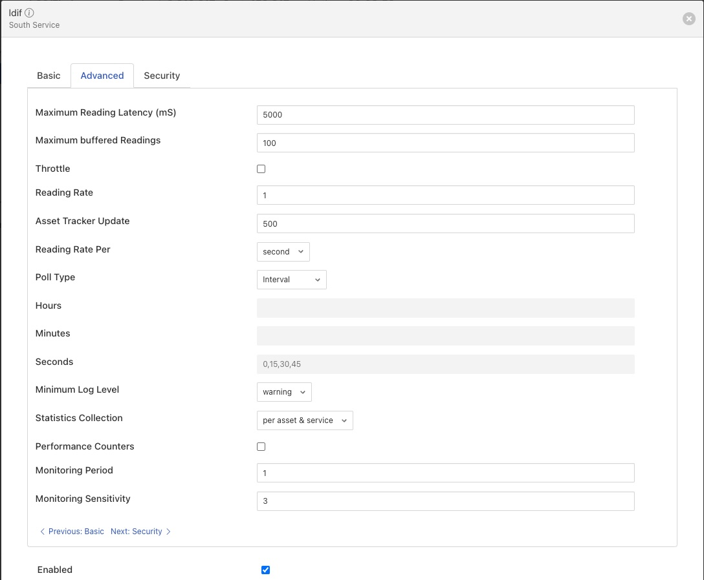

.. Images

***************
Tuning Fledge
***************

Many factors will impact the performance of a Fledge system

  - The CPU, memory and storage performance of the underlying hardware

  - The communication channel performance to the sensors

  - The communications to the north systems

  - The choice of storage system

  - The external demands via the public REST API

Many of these are outside of the control of Fledge itself, however it is possible to tune the way Fledge will use certain resources to achieve better performance within the constraints of a deployment environment.

South Service Advanced Configuration
====================================

The south services within Fledge each have a set of advanced configuration options defined for them. These are accessed by editing the configuration of the south service itself. A screen with a set of tabbed panes will appear, select the tab labeled *Advanced Configuration* to view and edit the advanced configuration options.

+------------------+
| |south_advanced| |
+------------------+

  - *Maximum Reading Latency (mS)* - This is the maximum period of time for which a south service will buffer a reading before sending it onward to the storage layer. The value is expressed in milliseconds and it effectively defines the maximum time you can expect to wait before being able to view the data ingested by this south service.

  - *Maximum buffered Readings* - This is the maximum number of readings the south service will buffer before attempting to send those readings onward to the storage service. This and the setting above work together to define the buffering strategy of the south service.

  - *Reading Rate* - The rate at which polling occurs for this south service. This parameter only has effect if your south plugin is polled, asynchronous south services do not use this parameter. The units are defined by the setting of the *Reading Rate Per* item.

  - *Throttle* - If enabled this allows the reading rate to be throttled by the south service. The service will attempt to poll at the rate defined by *Reading Rate*, however if this is not possible, because the readings are being forwarded out of the south service at a lower rate, the reading rate will be reduced to prevent the buffering in the south service from becoming overrun.

  - *Reading Rate Per* - This defines the units to be used in the *Reading Rate* value. It allows the selection of per *second*, *minute* or *hour*.

  - *Minimum Log Level* - This configuration option can be used to set the logs that will be seen for this service. It defines the level of logging that is send to the syslog and may be set to *error*, *warning*, *info* or *debug*. Logs of the level selected and higher will be sent to the syslog.

Tuning Buffer Usage
-------------------

The tuning of the south service allows the way the buffering is used within the south service to be controlled. Setting the latency value low results in frequent calls to send data to the storage service and therefore means data is more quickly available. However sending small quantities of data in each call the the storage system does not result in the most optimal use of the communications or of the storage engine itself. Setting a higher latency value results in more data being sent per transaction with the storage system and a more efficient system. The cost of this is the requirement for more in-memory storage within the south service.

Setting the *Maximum buffers Readings* value allows the user to place a cap on the amount of memory used to buffer within the south service, since when this value is reach, regardless of the age of the data and the setting of the latency parameter, the data will be sent to the storage service. Setting this to a smaller value allows tighter control on the memory footprint at the cost of less efficient use of the communication and storage service.

Tuning between performance, latency and memory usage is always a balancing act, there are situations where the performance requirements mean that a high latency will need to be incurred in order to make the most efficient use of the communications between the micro services and the transnational performance of the storage engine. Likewise the memory resources available for buffering may restrict the performance obtainable.
