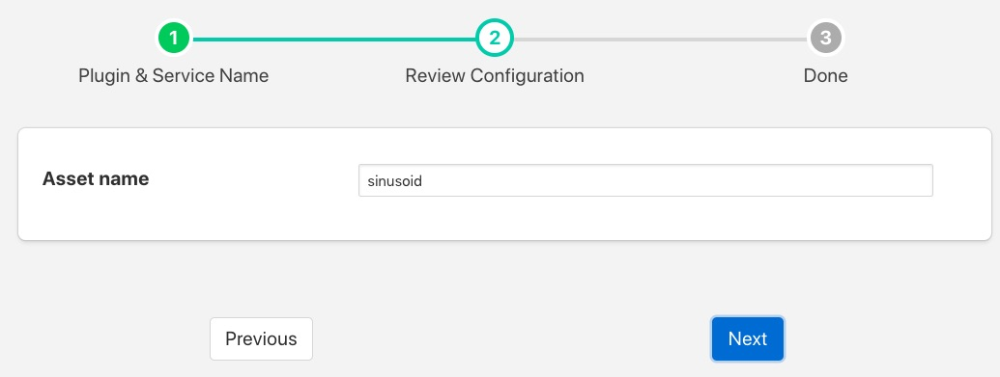
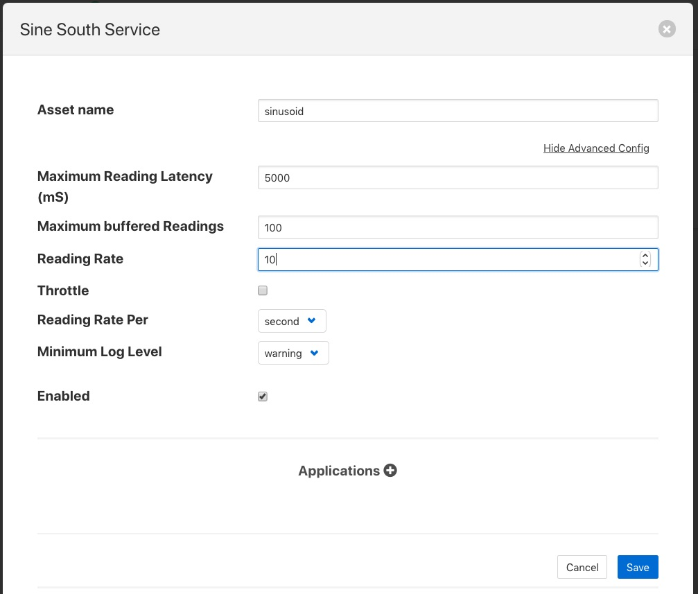
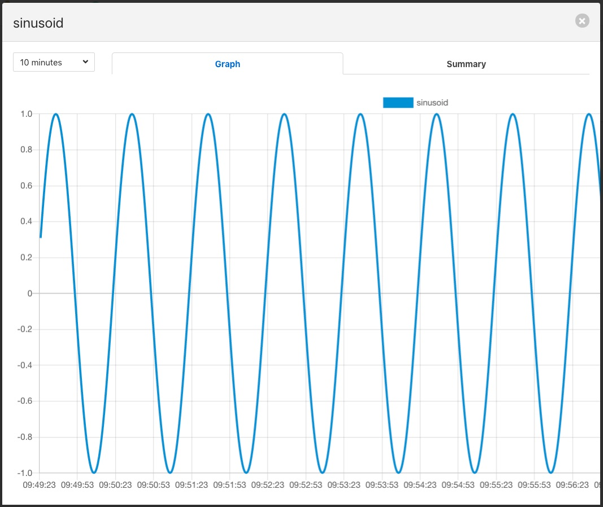

.. Images

                     

Sinusoid
========

The *fledge-south-sinusoid* plugin is a south plugin that is primarily designed for testing purposes. It produces as it's output a simple sine wave, the period of which can be adjusted by changing the poll rate in the advanced settings of the south service into which it is loaded.

+-------------------+
| |sinusoid_output| |
+-------------------+

There is very little configuration required for the *sinusoid* plugin, merely the name of the asset that should be written. This can be useful if you wish to have multiple sinusoid in your Fledge system.

+------------+
| |sinusoid| |
+------------+

The frequency of the sinusoid can be adjusted by changing the poll rate of the sinusoid plugin. To do this select the *South* item from the left-hand menu bar and then click on the name of your sinusoid service. You will see a link labeled *Show Advanced Config*, click on this to reveal the advanced configuration.

+---------------------+
| |sinusoid_advanced| |
+---------------------+

Amongst the advanced setting you will see one labeled *Reading Rate*. This defaults to 1 per second. The sinusoid takes 60 samples to complete one cycle of the sine wave, therefore it has a periodicity of 1 minute, or 0.0166Hz. If the *Reading Rate* is st to 60, then the frequency of the output becomes 1Hz.
